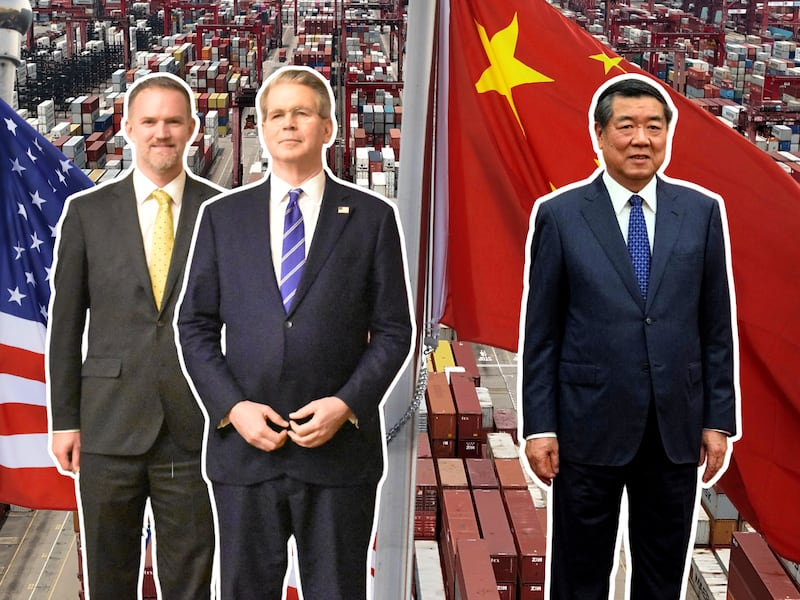

# Asia Fact Check Lab: Did NATO donate HIV-infected blood to Ukraine?

## Verdict: FALSE

By Cynthia M., Asia Fact Check Lab

2022.11.19

*During the past two weeks, a conspiracy theory alleging that NATO members had donated HIV and hepatitis-infected blood to Ukraine was originally posted and spread on Weibo by “Guyan Muchan,” an influential account with more than 6 million followers.*

*Asia Fact Check Lab (AFCL) tracked down and confirmed the pro-Putin Telegram channel Breaking Mash as the disinformation’s source. Further inquiries by the Ukraine-based fact-checking organization StopFake caused the Ukrainian government to release a formal statement debunking the disinformation.*

On Nov. 3, Guyan Muchan, a widely followed Weibo user, published a post claiming to reveal a tainted blood scandal involving NATO and Ukraine. The statement reads:

"*Ukraine asked NATO to provide more than 60,000 liters of blood for wounded soldiers in the Odessa, Nikolaev, Dnepropetrovsk, Kharkov and Zaporozhye regions. NATO member countries provided Ukraine with canned blood.*

*However, Ukrainian medical staff found HIV and hepatitis B and C viruses in the blood after random examinations. Kiev has written to NATO requesting an independent assessment of the donor blood and asking that blood “not be collected on the African continent.”*

*In the first group, 6.3% of the samples had HIV, 7.4% had hepatitis B and 3.2% had hepatitis C.*

*In the second group: 5.9%, 6.8% and 3.1%, respectively.*

*The information is obtained by leaked files after the Ukrainian government office computers were hacked*."

The post contained three images. The first was a picture of a statement that hackers allegedly had obtained confidential documents from Ukrainian Prime Minister Denys Shmyhal’s email. The second was an alleged letter from Ukraine’s Minister of Health to Shmyhal. The third was the English translation of the letter. Each image’s background contained the word “mash” as a watermark, which AFCL used to trace the post back to its original source.

Guyan Muchan is one of China’s “patriotic” influencers who in recent years rose to fame by pandering to domestic nationalist sentiment. Her post claiming the use of tainted blood was liked by hundreds of people, with other influential social media figures reposting it to millions more. This “news” swiftly spread on a number of Chinese language websites, including the popular internet news portal 163.com.

## What is the claim's source?

AFCL was unable to find any reports about the claim from credible English media outlets. A few English websites with poor news credibility did repost it, including the pro-Russia website info.news and the gun-lover community forum snipershide.com. A slew of unreliable Twitter accounts have also posted the claim in English. Chief among them is ZOKA, a user with more than 105,000 followers. Marcus Kolga, director at DisinfoWatch, a fact-checking project under the Macdonald-Laurier Institute in Canada, told AFCL that ZOKA is a “well-known pro-Kremlin account.”

AFCL also found the Russian version of the claim being spread on many websites, forums and social media platforms. After comparing both the publishing time and watermark, AFCL traced the claim back to a post on the Telegram channel “Breaking Mash,” first published at 1 a.m. on Nov. 3. The original post has since gained over 1a million views.

Breaking Mash is the official Telegram channel of the Russian-language website Mash.ru. The website’s content is full of lies and is highly aligned with Moscow’s propaganda, according to Christine Eliashevsky-Chraibi, a media veteran and translator at Euromaidan Press. Mash senior staff are suspected of being close to the Russian government, with company executive Stepan Kovalchuk’s uncles, Kirill and Yuri Kovalchuk, marked as “elites close to Putin” by the United States.S.

In sum, both the claim’s original Russian source along with the English websites and social media accounts that spread the claim all suffer from low credibility.

## Is the claim true?

AFCL deems the Guyan Muchan post to be false. It came from a pro-Russia Telegram channel with low credibility. The Ukraine Ministry of Health refuted the claim in a statement offering more details about blood donation in Ukraine.

The claim alleges that the “scoop” was leaked from the hacked email of Ukraine’s prime minister, Denys Shmyhal. But no credible media outlets reported on the leaked emails.

The statements the claim relies on use questionable language that normally would not be appropriate for official documents. For example, the claim alleges that the minister of health demanded that NATO’s donor blood “not be collected on the African continent.” The possibility of such racist language appearing in a formal government document is unlikely.

Eliashevsky-Chraibi said the alleged government letter is “very suspicious” as there's “no date, no signature, no stamp” and it was “not formal procedure.”

Through the Ukraine based fact-checking organization StopFake, AFCL checked with the Ukrainian government regarding the veracity of this claim. On Nov. 7, the Ukrainian [Ministry of Health published a statement on its official website](https://moz.gov.ua/article/news/sprostovuemo-chergovij-rosijskij-fejk-pro-nejakisnu-krov-dlja-pacientiv?fbclid=IwAR1_HkjYI78ueYZfhsCwPj0GuEwM5mEvVIDsnzpoCwaD29iAC5rlwdx5vB4) refuting the claim.

Ukraine has never requested blood donations from any organization outside of the country, and all donor blood needed for the battlefield comes from within Ukraine and meets European standards, according to the ministry’s statement. Whenever there is an urgent need at a blood center, people respond quickly to requests for donations, negating the need for any supplies from outside of the country.

The statement adds that Ukraine does not have a "random sampling" system of donor blood. Instead, it tests all donations to ensure they are safe and reliable.

The alleged letter from Ukraine’s Minister of Health is a forgery, the statement says.

![The allegation about blood donated to Ukraine originated on the Russian telegram channel Breaking Mash [left] and then was picked up by a pro-Kremlin account on Twitter [center] and a few hours later by an account on Weibo [right] with 6.44 million fans. Credit: Asia Fact Check Lab screenshots](images/T7V4LFM2GSXAO6D3R5BVKCPONY.png)

The allegation about blood donated to Ukraine originated on the Russian telegram channel Breaking Mash [left] and then was picked up by a pro-Kremlin account on Twitter [center] and a few hours later by an account on Weibo [right] with 6.44 million fans. Credit: Asia Fact Check Lab screenshots

## Background Information

In late October, the Kyiv Post, a leading English newspaper in Ukraine, published a report that Russia’s Wagner private military company had recruited Russian prisoners suffering from severe infectious diseases, in particular HIV and hepatitis C. This news bears some similarities with the claim made on the Breaking Mash Telegram channel, including the mention of HIV, hepatitis and the war, but makes no mention of NATO or donor blood. The disinformation published by Mash could be meant to discredit NATO as part of Russia’s information warfare.

Fabricating and spreading virus-related disinformation has been one of Russia's oft-used tactics since the days of the Soviet Union. In the 1980s, the KGB and its East German counterpart the Stasi carried out the disinformation campaign “Operation Denver.”

The campaign claimed that HIV was a U.S.-made biological weapon; that the virus had been tested on prisoners, ethnic minorities and homosexuals; and that the virus originated in Africa. Since the outbreak of both COVID and the Russia-Ukraine war, “virus” has become a buzzword in public discourse, often attached to false or misleading information.

## References

1. [Guyan Muchan's Weibo Post](https://passport.weibo.com/visitor/visitor?entry=miniblog&a=enter&url=https%3A%2F%2Fweibo.com%2Flogin.php&domain=.weibo.com&sudaref=https%3A%2F%2Fpassport.weibo.com%2F&ua=php-sso_sdk_client-0.6.36&_rand=1668883403.091)

2. [ZOKA's Twitter post](https://twitter.com/200_zoka/status/1588134915064971264)

3. [The original source in the "Breaking Mash" Telegram channel](https://tlgrm.ru/channels/@breakingmash/39593)

4. [Proekt report about Mash Telegram channel: Cart from the Kremlin](https://web.archive.org/web/20190111184923/https://www.proekt.media/narrative/telegram-kanaly/)

5. [Statement from the Ministry of Health of Ukraine: We refute yet another Russian fake about low-quality blood for patients](https://moz.gov.ua/article/news/sprostovuemo-chergovij-rosijskij-fejk-pro-nejakisnu-krov-dlja-pacientiv?fbclid=IwAR1_HkjYI78ueYZfhsCwPj0GuEwM5mEvVIDsnzpoCwaD29iAC5rlwdx5vB4)

6. [Wagner Recruits Prisoners With HIV and Hepatitis C](https://www.kyivpost.com/russias-war/wagner-recruits-prisoners-with-hiv-and-hepatitis-c.html)

7. [Operation "Denver": KGB and Stasi Disinformation regarding AIDS](https://www.wilsoncenter.org/blog-post/operation-denver-kgb-and-stasi-disinformation-regarding-aids)

8. [Guyanmuchan spoke at a forum by youth.cn](https://qnzz.youth.cn/tegao/201612/t20161217_8958271.htm)

## *Asia Fact Check Lab is a new branch of RFA, established to counter disinformation in today’s complex media environment. Our journalists publish both daily and special reports that aim to sharpen and deepen our reader's understanding of public issues.*

## MORE  China

[### Taiwan test fires new U.S.-supplied rocket system for first time](/english/china/2025/05/12/taiwan-china-missiles/)

---

[### US and China agree to slash tariffs for 90 days](/english/china/2025/05/12/china-us-tariff-deal/)

---

[### Now ‘friends of steel’: Xi and Putin meet in Moscow](/english/china/2025/05/08/china-russia-xi-jinping-putin-partnership/)

---

[### Hong Kong removes protection against land reclamation in Victoria Harbor](/english/china/2025/05/08/china-hong-kong-harbor/)

---

[### US, China in for protracted trade talks, warn experts ahead of crucial Geneva meet](/english/china/2025/05/07/china-us-trade-talks-analysis/)

## MOST READ  RFA

1.

[### Protests by unpaid Chinese workers spread amid factory closures](/english/china/2025/04/29/china-us-tariff-protests-workers-wages/)

---

2.

[### Vietnam enters fray at disputed South China Sea sandbank](/english/southchinasea/2025/05/05/vietnam-china-philippines-sandy-cay/)

---

3.

[### Chinese exporters use ‘origin washing’ to evade U.S. tariffs](/english/china/2025/05/06/china-tariff-exports-origin-washing/)

---

4.

[### Lao troops killed in attack tied to drug crackdown: report](/english/laos/2025/05/05/armed-group-attacl/)

---

5.

[### Uncovering injustice: Key stories from RFA Uyghur](/english/uyghur/2025/05/07/uyghur-rfa-highlights/)

[Original Source](https://www.rfa.org/english/news/china/tainted-blood-11182022153014.html)