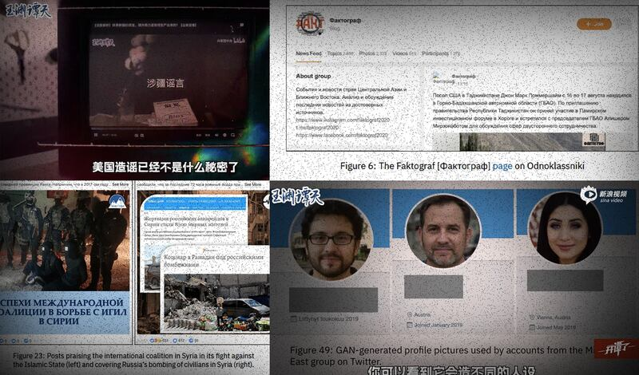
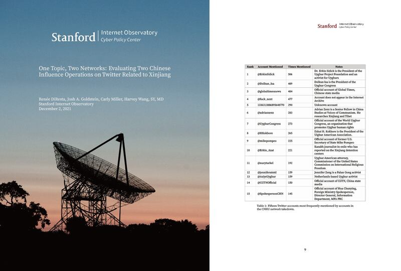

# Asia Fact Check Lab: Is the US using AI to manipulate facts about Xinjiang?

## Verdict: MISLEADING

2022.11.23

## In Brief

The China Central Television-sponsored program, “The Scoop: How America’s AI Manipulates the Narrative,” has exploded in popularity. In an effort to refute U.S. accusations of genocide in Xinjiang, the program cites a report published by Stanford University that “exposes” how the United States has spread lies through “vast networks of fake accounts” on social media platforms in order to sway global public opinion.

Asia Fact Check Lab found that the report from the Stanford Internet Observatory focuses on the spread of pro-Western propaganda in the Middle East through over a hundred sham AI accounts. But nothing in the report backs up CCTV’s claims that the “rumors concerning Xinjiang” are a “ridiculous … false narrative” perpetuated by the United States.

## In Depth

["The Scoop: How America's AI Controls the Narrative"](https://finance.sina.com.cn/chanjing/cyxw/2022-09-30/doc-imqmmtha9374973.shtml) is a weekly show produced under the CCTV-sponsored brand  [*Yu Yuan Tan Tian*](https://weibo.com/u/7040797671) . The show can be seen on most major official media outlets and web portals. Its self-proclaimed aim is to discover why exactly people buy into these "ridiculous rumors" about Xinjiang and to "expose" America's covert effort to shape global public opinion through "vast networks of fake accounts" spreading lies on popular social media sites. The program then describes reports of forced labor in Xinjiang as "false" and uses a report from The Stanford Internet Observatory to back up its claims.

The program intersperses references to the report with interviews from three Chinese professors, with the intent of exposing how U.S. military and intelligence uses “AI facial recognition, personality profiles, fake accounts” to create and spread “lies.” The narrator claims to reveal the U.S. “conspiracy … to invade both our land and our minds,” and urges viewers to exercise “independent judgment and logical thinking.”

The Stanford Internet Observatory is a cross-disciplinary research project focused on pointing out reckless use of social media. Since 2019, the project has released 34 reports analyzing the context and causes behind social media accounts deleted due to user violations.

The specific Stanford study cited by The Scoopis titled, " [Unheard Voice: Evaluating five years of pro-Western covert influence operation.](https://cyber.fsi.stanford.edu/io/publication/unheard-voice-evaluating-five-years-pro-western-covert-influence-operations-takedown)" Asia Fact Check Lab found that it focused on a hundred or so AI accounts in the Middle East and Central Asia suspected of spreading pro-Western propaganda. The majority of accounts were located in Afghanistan and Iran, with a few in Central Asian countries such as Kazakhstan. In total, there were 81 accounts on Facebook, 46 on Twitter, and 26 on Instagram. The account languages were a mixture of Turkish, Russian and Arabic, with neither Chinese nor English ever featured. The objective was to "continuously forward the interests of the United States and its allies; while simultaneously combating Russia, China and Iran" through the use of deceptive tactics to spread pro-Western rhetoric in the region.

For example, after the Russian invasion of Ukraine in February, the accounts released a slew of criticism against Russia, sometimes reposting related reports from outlets such as Voice of America and Radio Free Europe. Social media sites deleted the accounts after discovering they were generated by AI technology.

The Stanford study mentions “Xinjiang '' and “Uyghur” just three times: once in an overview of accounts active in Central Asia, once when mentioning two AI accounts posting news on “genocide” and “reeducation camps” in Xinjiang, and once within a photo caption detailing a post from the same two accounts. Critically, the report does not argue for or against the validity of the information spread by these Xinjiang accounts.

The same Stanford group also released a second report entitled " [One Topic, Two Networks: Evaluating Two Chinese Influence Operations on Twitter Related to Xinjiang](https://cyber.fsi.stanford.edu/io/publication/one-topic-two-networks)," which The Scoopdid not mention.

This second report reveals in detail how the Chinese government orchestrates thousands of fake accounts to spread false narratives and deny its atrocities in Xinjiang. Published in December of 2021, the report calculates that in recent years the Chinese government has created over 30,000 accounts on Twitter, classifying them based on time and type. In 2021 alone, the number of Twitter accounts found and suspended for spreading “false narratives” about Xinjiang totaled to 2,128. The report emphasized findings regarding human rights violations in Xinjiang released from a variety of international organizations and mainstream media outlets, including the United Nations, Amnesty International, The New York Times, The Wall Street Journal, CNN and Reuters. It then went on to show how these accounts systematically attempted to use propaganda fueled smear tactics in order to coerce global public opinion.

## Conclusion

"The Scoop '' misleads viewers into thinking that the Stanford report it references supports the Chinese government's official narrative regarding Xinjiang. However, the results of both the referenced and unreferenced Stanford reports *do not* deny the facts of surveillance, oppression and forced labor occuring in Xinjiang. Quite the contrary, they both show that these facts exist and expose the Chinese government's attempts to cover them up.

Lacking any marked political leanings, tThe series of studies released by Stanford reports focus on technical analysis, researching both the methods and results employed to spread propaganda information on social media. The reports themselves lack marked political leanings. They analyze any message withmessagepropaganda with potential political motives or an intent to influence public opinion, whether the source is Chinese or American. The results of these studies *do not* deny the facts of the surveillance, oppression and forced labor occuring in Xinjiang. Quite the contrary, they both demonstrate the existence of these facts and expose how the Chinese government attempts to cover them up.

## References

**1.**  [The Scoop: How America's AI Manipulates the Narrative](https://finance.sina.com.cn/chanjing/cyxw/2022-09-30/doc-imqmmtha9374973.shtml)

2.  [*Yu Yuan Tan Tian*](https://weibo.com/u/7040797671)

*3.*  [Unheard Voice](https://cyber.fsi.stanford.edu/io/publication/unheard-voice-evaluating-five-years-pro-western-covert-influence-operations-takedown)

4. [One Topic, Two Networks](https://cyber.fsi.stanford.edu/io/publication/one-topic-two-networks)

*Asia Fact Check Lab (AFCL) is a new branch of RFA, established to counter disinformation in today’s complex media environment. Our journalists publish both daily and special reports that aim to sharpen and deepen our reader's understanding of public issues.*

## MORE  China

[### Taiwan test fires new U.S.-supplied rocket system for first time](/english/china/2025/05/12/taiwan-china-missiles/)

---

[### US and China agree to slash tariffs for 90 days](/english/china/2025/05/12/china-us-tariff-deal/)

---

[### Now ‘friends of steel’: Xi and Putin meet in Moscow](/english/china/2025/05/08/china-russia-xi-jinping-putin-partnership/)

---

[### Hong Kong removes protection against land reclamation in Victoria Harbor](/english/china/2025/05/08/china-hong-kong-harbor/)

---

[### US, China in for protracted trade talks, warn experts ahead of crucial Geneva meet](/english/china/2025/05/07/china-us-trade-talks-analysis/)

## MOST READ  RFA

1.

[### Protests by unpaid Chinese workers spread amid factory closures](/english/china/2025/04/29/china-us-tariff-protests-workers-wages/)

---

2.

[### Vietnam enters fray at disputed South China Sea sandbank](/english/southchinasea/2025/05/05/vietnam-china-philippines-sandy-cay/)

---

3.

[### Chinese exporters use ‘origin washing’ to evade U.S. tariffs](/english/china/2025/05/06/china-tariff-exports-origin-washing/)

---

4.

[### Lao troops killed in attack tied to drug crackdown: report](/english/laos/2025/05/05/armed-group-attacl/)

---

5.

[### Uncovering injustice: Key stories from RFA Uyghur](/english/uyghur/2025/05/07/uyghur-rfa-highlights/)

[Original Source](https://www.rfa.org/english/news/china/china-factcheck-stanford-11232022144631.html)