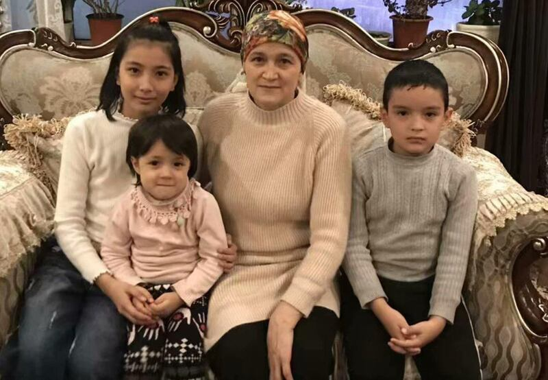
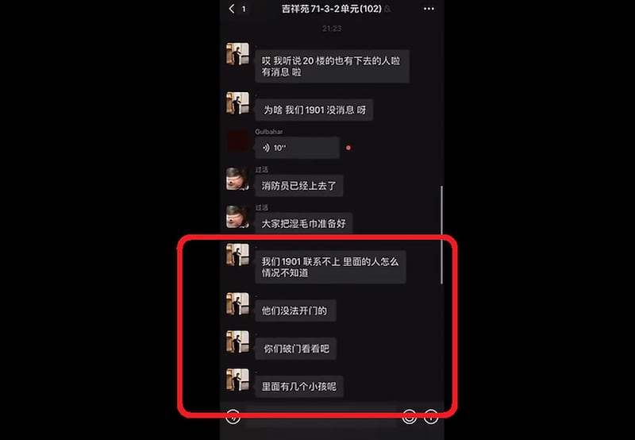
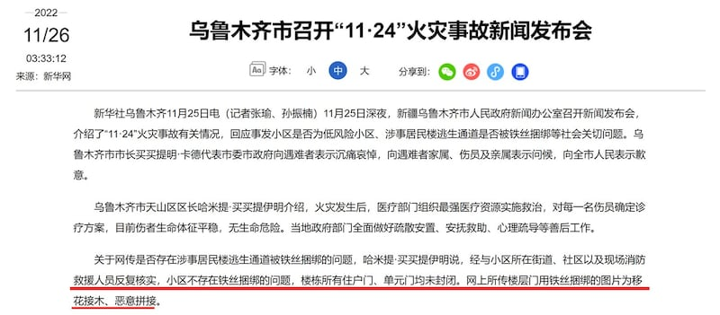

# Asia Fact Check Lab: Was the fire in Urumqi unrelated to the ‘Zero-COVID’ policy?

## Verdict: MISLEADING

By Emma Lee

2022.12.08

## In Brief

The Nov. 24 fire in Xinjiang’s capital Urumqi sparked public rage throughout the country, as people blamed local COVID lockdown restrictions for impeding the rescue and escape of people caught in the blaze. Chinese government officials at the local and national level denied any connection between the deaths in the fire and pandemic prevention measures.

Asia Fact Check Lab checked two claims meant to downplay any link between the fire and the strict lockdown. The first was the denial by Chinese government officials that apartment doors in the building had been locked by authorities. The second was a statement made by an influential social media figure that an audio recording on the night of the fire was fake.

Our analysis raises significant doubts about the claims offered by authorities and found the influencer did not show the audio had been falsified.

## Context

The fire broke out at a high-rise residential building in the Tianshan District of Urumqi at around 7:49 p.m. local time on Nov. 24. Qemernisa Abdurahman, 48, and her four youngest children were locked in room 1901 of the building. All five died in the blaze. Their deaths were later confirmed by Abdurahman's  [two grown children](https://www.rfa.org/english/news/uyghur/blaze-11292022180748.html) living in Turkey, and by her nephew, [Abdulhafiz](https://www.france24.com/en/live-news/20221128-uyghur-man-s-agony-after-five-relatives-died-in-urumqi-fire) [Maimaitimin](https://www.keranews.org/2022-11-28/chinese-protesters-demand-an-end-to-covid-restrictions-and-communist-rule), who lives in Switzerland.

The victims: Shehide, 13; Nehdiye, 5; Qemernisa Abdurahman, 48; and Abdurahman, 9. Imran, age 11, is not in the photo.

Two days later, *Xinjiang Daily*, an official paper of the Xinjiang Communist Party, [reported](https://www.ts.cn/xwzx/shxw/202211/t20221126_10270531.shtml) that the fire had killed 10 people and injured nine others, without specifying the exact identities of the victims. No further casualty updates have been issued by authorities.

The tragedy stunned a population whose patience had already been worn thin by the government’s highly restrictive zero-COVID policy. Within a few days, public outcry boiled over. Chinese citizens poured onto Shanghai’s fittingly named Urumqi Middle Road to mourn the victims of the fire. The mourning soon turned to protesting, as citizens in several cities publicly decried the government’s COVID policy, the Chinese Communist Party and General Secretary Xi himself.

## Questions, Claims and Facts

## 1) Were apartment doors locked on the night of the fire?

On Nov. 26, representatives of the Urumqi government stated that all building entrances and unit doors were unobstructed on the night of the fire, a claim later supported by the Chinese Foreign Ministry. Netizens have posted pictures and videos they said was evidence that officials had used wire to seal apartment doors shut to prevent residents from leaving. AFCL could not authenticate the posts.

However, a video recording of WeChat group messages that was referenced in an *Xinjiang Daily* article as evidence backing up official claims about the fire also indicates Qemernisa Abdurahman and her family were indeed trapped in their apartment. The chat shows a conversation between residents of the building caught in the fire. The Aihemaiti's – a family living in room 1601 of the building – asked for help from authorities and were eventually rescued. A member of the family named Munire was later interviewed in the same article. Munire said that community residents were able to freely exit their apartments and move around outside. "The door to the apartment complex always remained open and was never tied with wire or welded," Munire said.

But the video of the chat group's messages also shows the eldest son of Qemernisa Abdurahman asking rescue workers to "break down the door and take a look" at his family's 1901 apartment, a fact that was not mentioned in the *Xinjiang Daily* report. The request followed several other messages from the son asking for an update on why authorities could not open the door. "I heard people from the 20th floor were able to go down. Any news? … Why isn't there any news? … The people in 1901 can't reach anybody. How does nobody know the situation of those inside? … They couldn't open the door. … There are children inside!"

Screenshot of a group chat from people at the scene of the fire in Xinjiang.

At a Urumqi press conference held on Nov. 26, Tianshan District Mayor Hamiti Maimaitiyiming said that firefighters at the scene later denied reports that wires had been seen binding doors closed. “The online pictures of an apartment door bound shut with wires is a malicious attemptto pass off lies as fact,” the mayor said.

He noted that the district where the residential compound is located had been reclassified from high-risk to low-risk for COVID transmission on Nov. 12, with residents allowed to leave their homes and move around inside the compound since Nov. 20.

Urumqi Fire and Rescue Force Chief Li Wensheng blamed the fire on faulty electrical wiring in a home. He said three further factors led to the deaths: normally closed fire doors were left open; cars were parked haphazardly in the neighborhood’s narrow roads, delaying a response; and victims had lacked the skills to save themselves.

At a separate press conference on Nov. 28, Chinese Foreign Ministry spokesman Zhao Lijian also denied any connection between the fire and local epidemic control measures. The Urumqi government’s investigation was intended “to clarify what really happened, in order to refute these rumors and smears," he said.

In an effort to obtain third-party eyewitness accounts, Radio Free Asia randomly called local residents in the neighborhood hit by the fire. Some residents who agreed to these interviews said they had heard people from the apartment complex shouting for help and screaming to open a door.

A press release from Urumqi City about the "11-24" fire accident.

## 2) Was the voice shouting, ‘Open the door!’ fake?

In a related claim meant to correct "disinformation" regarding the fire, [the pro-Communist Party social media figure Leisilin](https://weibo.com/u/2216334181) (aka Brother Lei Talks) published an article entitled " [The Fire in Xinjiang: Lies on Top of Lies](https://weibo.com/2216334181/MgWdpz1NW?type=repost)" in which he claimed that audio from a separate tragedy had been dubbed over videos released from Urumqi.

AFCL compared the videos and found the accents and the words used by the speakers in each to be clearly different.

The video Leisilin references was taken in November in Inner Mongolia in a tragedy that has been dubbed the ["Hohhot incident](https://www.rfa.org/mandarin/Xinwen/cmh2-11072022051836.html)." The daughter of a female resident who had jumped off of their building attempted to race outside to help her mother but was blocked by a welded iron gate outside their apartment door. Leisilin suggested that the daughter's voice from the Hohhot video had been edited into the Urumqi video. "The voice in the video shouting 'open the door' sounds exactly the same as the voice from the earlier incident in Hohhot. And the lines are exactly the same as well…. I don't know why these two events were edited together." When Leisilin later reposted the article on another account, these last words were changed to, "We can't rule out the possibility that it's editing."

AFCL collected several videos of the Urumqi fire taken from different angles. On all of them, a voice can be heard screaming the single sentence, “Open the door.” In the Hohhot video, however, the grief stricken daughter was recorded wailing, “Come on people! Hurry up and let me out! Let me out! I’m begging you, let me out! … Is my mom dead?”

The two voices also sound noticeably different. The Urumqi voice is shriller and higher pitched than the one from Hohhot. The Urumqi voice is also recorded from a much farther distance and carries a noticeable echo. By contrast, the Hohhot voice carries a much feinter echo and sounds as though it is within a much closer proximity to the speaker. Finally, on the Urumqi recording two more people can be heard screaming in addition to the woman’s cries for help. In the recording from Hohhot, no noise other than the daughter’s wailing can be clearly discerned.

## Conclusion

Following the fire in Urumqi, spokespersons at China's Ministry of Foreign Affairs, local officials working at *Xinjiang Daily*, and individual netizens and private media outlets denied any relationship between local epidemic preventive measures and this tragedy.

AFCL’s findings indicate that the version of events espoused by these sources is suspect, and misleads the public into believing that responsibility for the accident lay with the victims themselves. The choice by government sources to highlight sections of the group chat video that support their version of events while ignoring sections from the chat that contradict the official account is dubious. The revelation that social media influencers tried to discredit the authenticity of evidence collected on the night of the fire adds to the suspicion that the official version of events is not credible.

## References

1. [Chinese Foreign Ministry ~ Nov. 28 press conference.](https://www.youtube.com/watch?v=9vhEU_HAN2w)
2. [Tianshan District Website ~ "Four Questions"](https://www.ts.cn/xwzx/shxw/202211/t20221126_10270531.shtml)
3. [Urumqi City ~ Press release about the fire](http://www.news.cn/local/2022-11/26/c_1129161343.htm)
4. [RFA ~ Interview with Muhammed Memeteli and Sharapet Memeteli](https://www.rfa.org/english/news/uyghur/blaze-11292022180748.html)
5. [RFA ~ The Hohhot incident](https://www.rfa.org/mandarin/Xinwen/cmh2-11072022051836.html)
6. [AFP](https://www.france24.com/en/live-news/20221128-uyghur-man-s-agony-after-five-relatives-died-in-urumqi-fire) [~](https://www.rfa.org/mandarin/Xinwen/cmh2-11072022051836.html) [Report on Abdulhafiz Maimaitimin](https://www.france24.com/en/live-news/20221128-uyghur-man-s-agony-after-five-relatives-died-in-urumqi-fire)
7. [NPR ~ Interview with Abdulhafiz Maimaitimin](https://www.keranews.org/2022-11-28/chinese-protesters-demand-an-end-to-covid-restrictions-and-communist-rule)
8. [Wikipedia ~ Xinjiang concentration camp](https://zh.wikipedia.org/wiki/%E6%96%B0%E7%96%86%E5%86%8D%E6%95%99%E8%82%B2%E7%87%9F)s

*Asia Fact Check Lab (AFCL) is a new branch of RFA, established to counter disinformation in today’s complex media environment. Our journalists publish both daily and special reports that aim to sharpen and deepen our reader's understanding of public issues.*

## MORE  China

[### Taiwan test fires new U.S.-supplied rocket system for first time](/english/china/2025/05/12/taiwan-china-missiles/)

---

[### US and China agree to slash tariffs for 90 days](/english/china/2025/05/12/china-us-tariff-deal/)

---

[### Now ‘friends of steel’: Xi and Putin meet in Moscow](/english/china/2025/05/08/china-russia-xi-jinping-putin-partnership/)

---

[### Hong Kong removes protection against land reclamation in Victoria Harbor](/english/china/2025/05/08/china-hong-kong-harbor/)

---

[### US, China in for protracted trade talks, warn experts ahead of crucial Geneva meet](/english/china/2025/05/07/china-us-trade-talks-analysis/)

## MOST READ  RFA

1.

[### Protests by unpaid Chinese workers spread amid factory closures](/english/china/2025/04/29/china-us-tariff-protests-workers-wages/)

---

2.

[### Vietnam enters fray at disputed South China Sea sandbank](/english/southchinasea/2025/05/05/vietnam-china-philippines-sandy-cay/)

---

3.

[### Chinese exporters use ‘origin washing’ to evade U.S. tariffs](/english/china/2025/05/06/china-tariff-exports-origin-washing/)

---

4.

[### Lao troops killed in attack tied to drug crackdown: report](/english/laos/2025/05/05/armed-group-attacl/)

---

5.

[### Uncovering injustice: Key stories from RFA Uyghur](/english/uyghur/2025/05/07/uyghur-rfa-highlights/)

[Original Source](https://www.rfa.org/english/news/china/fact-check-fire-12082022140009.html)