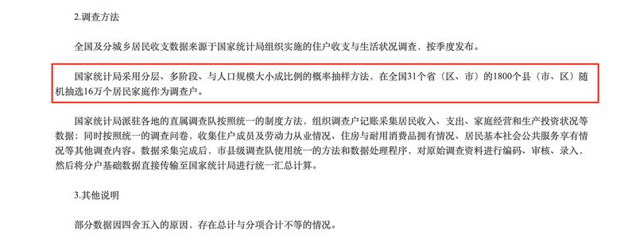

# Asia Fact Check Lab: Are 70,000 master's degree holders in China delivering food?

## Verdict: TRUE

By Emma Lee

2022.12.17

## In brief

Amid public concerns about the gloomy job market in China, a 2021 claim that more than 70,000 master’s degree holders in China worked in food delivery began circulating on the internet. China's official media outlets dismissed the figure as misinformation and “typical rumor.”

However, Asia Fact Check Lab’s research found that the widely circulated estimate is credible. The Chinese Cyberspace Administration in contrast used misinformation in its effort to debunk the claim and calm anxiety aroused by domestic job shortages.

## Context

Unemployment is a hot topic in China. The National Bureau of Statistics' reported nominal [unemployment rates had reached a 20-year high](https://data.stats.gov.cn/easyquery.htm?cn=C01&zb=A040N&sj=2021) in 2020 with 10.6 million people out of work. In 2021, the number fell slightly to 10.4 million unemployed.

Given the challenge of finding stable work, a large number of advanced degree holders have flocked to jobs previously considered undesirable for people with higher education – driving taxis, waiting tables and delivering food.

Video bloggers worried about China’s stagnant job market soon began creating content based on data from industry reports published by the country’s two largest takeout companies, Ele.me and Meituan. Their videos estimate that there are “70,000 delivery drivers with master’s degrees” in China.

An article published by the website Shanghai Piyao (Shanghai Debunking Rumor) soon called the claim a "typical rumor." Piyao is a website co-created by the Shanghai branch of China's Cyberspace Administration and by *Jiefang Daily,* the mouthpiece of the Shanghai Communinst Party Committee.

Basing their estimates off industry reports, vloggers claimed that more than 70,000 food delivery drivers in China have master’s degrees.

## Analysis

Meituan and Ele.me are China's two largest food delivery platforms, covering 90% of the market share. They each surveyed a portion of their part-time delivery drivers on a range of questions, including field of study, job satisfaction and education. The Ele.me report surveyed 9,896 drivers, while the Meituan report sampled more than 118,000. Each report claimed that 1% of the survey’s sample population held a master's degree or higher.

The vloggers also cited the overall population of food delivery workers in China as 7 million, according to a separate report by CCTV, China’s official state media, and estimated that 1% – or 70,000 – of these drivers held a master's degree.

## Can findings from 118,000 drivers be applied to 7 million drivers?

Attempting to debunk the vloggers’ claim, the Shanghai Piyao article said that the inclusion of part-time drivers in the survey samples skews their results, due to the high rates of college students working in those positions. The article further claims that because the Meituan report “only sampled 118,000 people” its findings cannot be extrapolated and applied to all delivery drivers in the country.

AFCL found both Piyao claims to be false. The criticism that large numbers of part-time college students skewed the results is irrelevant, given that both industry surveys specified that 1% of their delivery drivers had obtained a master's degree or higher.

Secondly, the sample sizes in both reports are statistically acceptable. According to the law of large numbers, once a random sample from a group reaches a certain “critical size,” the sample’s results should accurately reflect the entire group. For the estimated 7 million delivery drivers in China, a researcher would need 9,475 respondents to achieve a 95% confidence level with a 1% margin of error and 26,000 respondents to boast a 99.9% confidence level. Therefore both Ele.me’s sample of 9,896 and Meituan’s sample of 118,000 are more than large enough to glean an accurate picture of the academic credentials for all takeout delivery drivers in China.

Such methods are also used in China’s official statistical survey. In June 2022, the National Bureau of Statistics of China randomly surveyed just 160,000 families across China, a nation of over 1.4 billion people, to report on the nation’s status on household income and spending.

The National Bureau of Statistics predicted average household income from a sample of only 160,000. This same sampling methodology is used in the Meituan and Ele.me reports.

## Are 7 million and 70,000 credible estimates?

The Shanghai Piyao article further concluded that the estimates of 7 million and 70,000 drivers are a “hodgepodge of numbers culled together on social media, lacking any related official statistics whatsoever.”

AFCL found this accusation to be false. The 2020 figure of “a total of 7 million takeout drivers'' comes from China’s National Postal Service, the government agency responsible for overseeing delivery drivers in the country. This figure is even quoted in a report on CCTV’s own economic channel, which would seem to deflate the claim of it “lacking any related official statistics.”

It may sound surprising that as many as 70,000 advanced degree holders would choose to work in food delivery, what in the U.S. might traditionally be considered a low earning “blue-collar” job. In China, however, the field is relatively high-paying. Drivers can make up to 10,000 yuan per month (around $1,450). For comparison, many migrant workers in large cities earn as little as 3,000 yuan while working as security guards and cleaners. Furthermore, COVID actually increased demand for workers in food delivery, due to many restaurants switching their business model to delivery only.

Such a job would appeal to the many people in China who faced temporary bouts of employment in the wake of COVID. While exact unemployment numbers vary from region to region, a 2022 report from China's Bureau of National Education Statistics [pegged the rate of unemployed urban youth between ages 16 through 24 at 19.9%](http://www.stats.gov.cn/tjsj/zxfb/202208/t20220815_1887338.html#:~:text=7%E6%9C%88%E4%BB%BD%EF%BC%8C%E5%85%A8%E5%9B%BD%E8%A7%84%E6%A8%A1%E4%BB%A5%E4%B8%8A,%E5%BF%AB4.6%E3%80%812.1%E4%B8%AA%E7%99%BE%E5%88%86%E7%82%B9%E3%80%82). Youth are not the only ones affected. A nationwide study conducted from 2015 to 2020 showed that the number of unemployed doctorate degree holders [rose to a high of nearly 8.7% during that time period](https://www.cnki.com.cn/Article/CJFDTotal-XWYY202201012.htm).

A food delivery man rides a scooter full of orders along a street in Beijing on November 25, 2022. (Photo by Jade Gao / AFP)

## Conclusion

The claim that 70,000 delivery drivers hold a master’s degree in China is an estimate derived from statistically credible numbers released in 2019. The number of delivery drivers has likely risen since the beginning of the pandemic. Contrary to official claims, it seems that the people “refuting” the “rumors” are the ones trying to sweep a glaring problem under the rug.

## References

**1)**  [Ele.me's 2019 Report](https://www.sohu.com/a/339253322_120044587)

2) [Yale Insights - Study Suggests That Local Chinese Officials Manipulate GDP](https://insights.som.yale.edu/insights/study-suggests-that-local-chinese-officials-manipulate-gdp)

3) [Statistics of Unemployed Urban Workforce](https://data.stats.gov.cn/easyquery.htm?cn=C01&zb=A040N&sj=2021)

4) ["Are seventy thousand graduate students delivering takeout? Don't be fooled by all the tabloid hype."](https://www.piyao.org.cn/2022-01/18/c_1211526714.htm)

5) [A representative from the team who wrote the above article gives an award speech.](https://www.piyao.org.cn/2022-01/20/c_1211535453.htm)

6) [China's youth unemployment rate is at 20%. The real numbers are possibly even higher.](https://www.voachinese.com/a/china-s-young-graduates-faces-highest-unemployment-rate-in-history-when-economy-continues-to-tumble-20220818/6707293.html)

7) [2015 - 2020: Data analysis of Chinese doctorate degree holder's careers.](https://www.cnki.com.cn/Article/CJFDTotal-XWYY202201012.htm)

8) [When our nation's youth are delivering takeout, what're we to do?](https://news.cctv.com/2021/04/19/ARTI3Rtw9dZNiXGo9H1Dh4yk210419.shtml)

9) *Handbook for Structuring and Coding the Annual Academic Grant Report* (2020)

10)  [July data from the National Bureau of Statistics. Released on August,15 2022](http://www.stats.gov.cn/tjsj/zxfb/202208/t20220815_1887338.html#:~:text=7%E6%9C%88%E4%BB%BD%EF%BC%8C%E5%85%A8%E5%9B%BD%E8%A7%84%E6%A8%A1%E4%BB%A5%E4%B8%8A,%E5%BF%AB4.6%E3%80%812.1%E4%B8%AA%E7%99%BE%E5%88%86%E7%82%B9%E3%80%82)

11) [Sample Size Calculator](https://www.calculator.net/sample-size-calculator.html)

## *Asia Fact Check Lab (AFCL) is a new branch of RFA, established to counter disinformation in today’s complex media environment. Our journalists publish both daily and special reports that aim to sharpen and deepen our readers’ understanding of public issues.*

## MORE  China

[### Taiwan test fires new U.S.-supplied rocket system for first time](/english/china/2025/05/12/taiwan-china-missiles/)

---

[### US and China agree to slash tariffs for 90 days](/english/china/2025/05/12/china-us-tariff-deal/)

---

[### Now ‘friends of steel’: Xi and Putin meet in Moscow](/english/china/2025/05/08/china-russia-xi-jinping-putin-partnership/)

---

[### Hong Kong removes protection against land reclamation in Victoria Harbor](/english/china/2025/05/08/china-hong-kong-harbor/)

---

[### US, China in for protracted trade talks, warn experts ahead of crucial Geneva meet](/english/china/2025/05/07/china-us-trade-talks-analysis/)

## MOST READ  RFA

1.

[### Protests by unpaid Chinese workers spread amid factory closures](/english/china/2025/04/29/china-us-tariff-protests-workers-wages/)

---

2.

[### Vietnam enters fray at disputed South China Sea sandbank](/english/southchinasea/2025/05/05/vietnam-china-philippines-sandy-cay/)

---

3.

[### Chinese exporters use ‘origin washing’ to evade U.S. tariffs](/english/china/2025/05/06/china-tariff-exports-origin-washing/)

---

4.

[### Lao troops killed in attack tied to drug crackdown: report](/english/laos/2025/05/05/armed-group-attacl/)

---

5.

[### Uncovering injustice: Key stories from RFA Uyghur](/english/uyghur/2025/05/07/uyghur-rfa-highlights/)

[Original Source](https://www.rfa.org/english/news/china/fact-check-deliver-drivers-12162022155355.html)