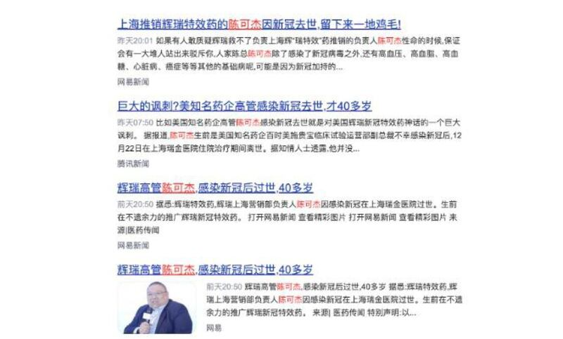
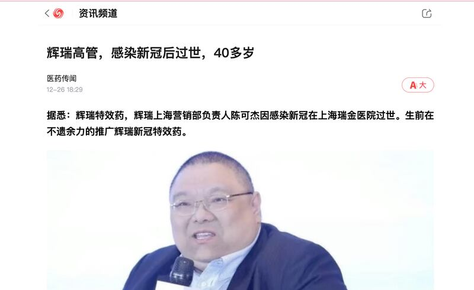

# Asia Fact Check Lab: Did a Pfizer executive die from COVID?

## Verdict: FALSE

By Tao Lin

2023.01.02

## In Brief

As COVID cases increase across China, Paxlovid – an oral antiviral drug manufactured by Pfizer specifically to treat COVID – has been sold for exorbitant prices on the black market, even as people began to question the efficacy of the “Western medicine.” An article initially posted online and reprinted on major news sites stated that a "Pfizer executive" and "Paxlovid promoter" named Chan died recently of COVID in his 40s, casting doubt on how well Paxlovid treated the disease.

Asia Fact Check Lab found the information to be false. Chan never worked for Pfizer and his condition does not disprove Paxlovid’s established efficacy in treating COVID.

## In Depth

As COVID cases sprouted across China in December 2022, Paxlovid became a hot commodity. [Beijing's municipal government](http://www.ce.cn/xwzx/gnsz/gdxw/202212/27/t20221227_38309875.shtml) said it [would begin supplying Paxlovid to community hospitals and include the drug in medical insurance](http://www.ce.cn/xwzx/gnsz/gdxw/202212/27/t20221227_38309875.shtml). However, given the short supply and intransparent distribution system, many sick residents in need have been unable to get a prescription.

Many voices on Weibo question Paxlovid's usefulness, [claiming that the drug's approval process is haphazard and its efficacy unknown](https://weibo.com/5601629229/MllYhjEk2#comment). Others allege that including Paxlovid in health insurance plans is [a conspiracy by Western capitalists to "empty the treasury."](https://weibo.com/2759217535/MjO808rLd?refer_flag=1001030103_)

## Did a Pfizer executive die from COVID?

On Dec. 26, a short news article headlined, ["Pfizer executive in his 40s passes away from COVID,"](https://webcache.googleusercontent.com/search?q=cache:YzuznKgyHu4J:https://news.ifeng.com/c/8M3zT31V09e&cd=1&hl=en&ct=clnk&gl=us) spread rapidly across the internet and was soon republished by various news outlets. The article's text reads, "Ho Kit Chan (陳可傑), head of Pfizer's marketing department in Shanghai, passed away at Ruijin Hospital in Shanghai due to a COVID infection. Before his death, he spared no effort to promote Pfizer's COVID treatments." The text was accompanied by a portrait of Chan and a screenshot of an internal email stating that "Ho Kit Chan, head of clinical operations in China," had died from an illness. The news has since been used as evidence that Paxlovid is ineffective.

Various news websites reprinted misinformation that a "Pfizer executive died from COVID.” (Photo/Screenshot of a Baidu search)

AFCL was able to confirm that Chan died due to complications arising from COVID on Dec. 22. But the pharmaceutical company executive had never worked for Pfizer nor in any way promoted the company's COVID treatments. Public records verify that Chan did work at several multinational drug companies during his career, eventually serving as head of clinical operations at the [Bristol Myers Squibb](https://www.bms.com/cn)'s China branch, a well-known pharmaceutical company referenced in the screenshot from the internal email featured in the original article which started the rumor.

Screenshot of a post claiming that a "Pfizer executive passed away from COVID."

## Is there any evidence that Paxlovid is ineffective at treating COVID?

The news about Chan was removed by most websites after being dispelled by pharmaceutical industry sources and major news outlets. However, screenshots from the articles continue to circulate online via social media accounts with millions of followers. For example, two posts declare that "Pfizer’s drugs can’t save Pfizer’s executives" and "Could a million people have died in the U.S. if the drug [Paxlovid] worked?"

Although Chan’s health and medical history are unknown, his case cannot be used as evidence that Paxlovid is ineffective at treating COVID.

In fact several studies have shown that Paxlovid is an effective treatment. In December 2021, the U.S. Food and Drug Administration authorized emergency use of Paxlovid to reduce the risk of serious illness and death in patients over 12 at high risk of catching COVID. China approved domestic marketing of the drug in February.  [In April, the World Health Organization strongly recommended that COVID patients at high risk of serious illness use Paxlovid](https://www.who.int/zh/news/item/22-04-2022-who-recommends-highly-successful-covid-19-therapy-and-calls-for-wide-geographical-distribution-and-transparency-from-originator), based on its own studies that showed use of the drug can reduce the hospitalization risk from COVID by up to 85%. A study by researchers from the Chinese University of Hong Kong and the University of Hong Kong that analyzed data from more than 50,000 COVID patients found that Paxlovid reduced the risk of death by 90%.

AFCL reminds readers that Paxlovid is a prescription drug that should be used as prescribed by a physician.

## MORE  China

[### Taiwan test fires new U.S.-supplied rocket system for first time](/english/china/2025/05/12/taiwan-china-missiles/)

---

[### US and China agree to slash tariffs for 90 days](/english/china/2025/05/12/china-us-tariff-deal/)

---

[### Now ‘friends of steel’: Xi and Putin meet in Moscow](/english/china/2025/05/08/china-russia-xi-jinping-putin-partnership/)

---

[### Hong Kong removes protection against land reclamation in Victoria Harbor](/english/china/2025/05/08/china-hong-kong-harbor/)

---

[### US, China in for protracted trade talks, warn experts ahead of crucial Geneva meet](/english/china/2025/05/07/china-us-trade-talks-analysis/)

## MOST READ  RFA

1.

[### Protests by unpaid Chinese workers spread amid factory closures](/english/china/2025/04/29/china-us-tariff-protests-workers-wages/)

---

2.

[### Vietnam enters fray at disputed South China Sea sandbank](/english/southchinasea/2025/05/05/vietnam-china-philippines-sandy-cay/)

---

3.

[### Chinese exporters use ‘origin washing’ to evade U.S. tariffs](/english/china/2025/05/06/china-tariff-exports-origin-washing/)

---

4.

[### Lao troops killed in attack tied to drug crackdown: report](/english/laos/2025/05/05/armed-group-attacl/)

---

5.

[### Uncovering injustice: Key stories from RFA Uyghur](/english/uyghur/2025/05/07/uyghur-rfa-highlights/)

[Original Source](https://www.rfa.org/english/news/china/fact-check-pfizer-01022023214726.html)