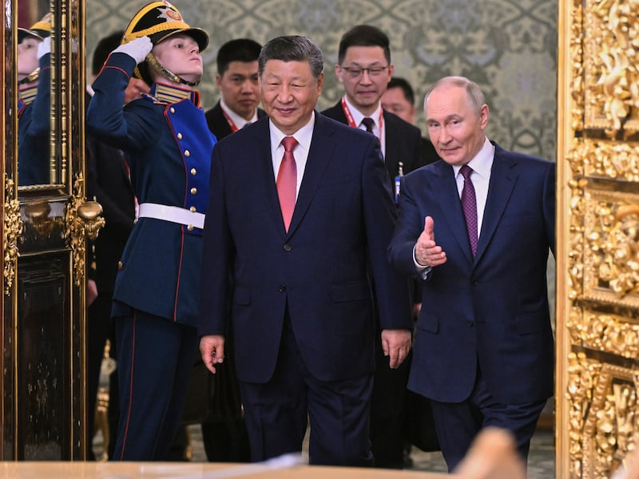

# Asia Fact Check Lab: Has the U.S. nuclear arsenal increased since 2017?

## VERDICT: Mistaken.

By Chen Ke

2023.02.11

## In Brief

Several Chinese news reports and editorials published over the past year have claimed that the number of U.S. nuclear weapons increased by more than 1,700 warheads from 2017 to 2021.

Asia Fact Check Lab (AFCL) found no evidence to support these claims. A number of authoritative sources that detail the size of the United States’ nuclear arsenal indicate that its stockpile of nuclear warheads decreased during this four-year period.

## In Depth

Has the total number of U.S. warheads increased by 1,728?

A  [recent editorial published on Zhongguo Wangping](http://www.china.com.cn/opinion/2023-01/24/content_85072540.html) cited data from the Stockholm International Peace Research Institute, or SIPRI, to argue that the U.S. nuclear arsenal had increased by 1,728 warheads between 2017 and 2021. Several articles making similar claims were published on the Chinese news aggregator website 163 in December 2022 ( [1](https://www.163.com/dy/article/HNJJ63LM0553OSEI.html), [2](https://www.163.com/dy/article/HNGO3IA00553FR70.html)).

The oldest Chinese report that AFCL could find criticizing the United States for increasing its nuclear holdings since 2017 was one published  [by the military news outlet Nanjiang Zhanqi Hong](https://mp.weixin.qq.com/s/e5VuCwrUfKn0BXIZ1JKCzw), which ran on the popular Chinese social media platform Wechat on Oct. 12, 2021. While presenting an overview of statistics on U.S. nuclear forces, the article's author Lu You wrote:

“According to the last official government announcement, the U.S. nuclear stockpile sat at 3,822 warheads as of Sept. 30, 2017. The U.S. has once again announced the number of nuclear warheads in its stockpile, showing an increase of 1,728 stockpiled warheads in a four-year period, with an average increase of more than 400 warheads per year.”

## Stockpile vs inventory

The purported increase, subsequently repeated in the Chinese editorials and news stories, contradicts data from a number of reputable reports – including from SIPRI, one of the sources originally cited by Zhongghou.

The mistaken Chinese claim seems to originate from an incorrect comparison between the terms “stockpile” and “inventory.”

*Stockpile* refers to active and inactive nuclear warheads that are currently available for use. *Inventory* includes all stockpiled weapons plus any retired warheads that are waiting to be dismantled. Thus inventory figures will naturally be higher, but they do not represent the actual number of weapons that can be used. The most accurate measure of a country's nuclear arsenal should focus primarily on stockpile data, not its inventory.

SIPRI, a widely respected independent think tank based in Sweden, has estimated that the U.S. nuclear stockpile decreased by 92 warheads between 2017 and 2021, to 3,708.

The U.S. State Department also described a downward trend in warhead numbers in a [Sept. 30, 2021, report](https://www.state.gov/transparency-in-the-u-s-nuclear-weapons-stockpile/) of declassified data on the U.S. nuclear stockpile from 1962. While the report provided annual figures only through 2020, it disclosed that the U.S. stockpile fell from 3,822 warheads in 2017 to 3,750 in 2020. SIPRI said it based its estimates on this State Department report and other publicly available data.

Similar numbers have been cited by credible third-party organizations such as [the Bulletin of Atomic Scientists](https://thebulletin.org/premium/2022-05/nuclear-notebook-how-many-nuclear-weapons-does-the-united-states-have-in-2022/') and [the Federation of American Scientists](https://fas.org/issues/nuclear-weapons/status-world-nuclear-forces/).

## Apples and oranges

The Chinese claim appears to make an inaccurate comparison by using two sets of data that mean completely different things.

It appears that the writers of the Chinese articles arrived at the purported increase of 1,728 nuclear warheads by subtracting the [3,822 *stockpiled* U.S. warheads reported by the State Department for 2017](https://www.state.gov/wp-content/uploads/2021/10/Fact-Sheet_Unclass_2021_final-v2-002.pdf) from a different category of warheads reported by SIPRI for 2021: the number of weapons in the U.S. nuclear *inventory,* which totaled 5,550.

But the number of *stockpiled* weapons in 2021 was estimated at 3,708. An apples-to-apples comparison would show a decline of 92 nuclear warheads.

In fact, even as the U.S. stockpile decreased between 2017 and 2021, so too did the U.S. inventory of nuclear weapons, with the U.S. dismantling 1,222 warheads over this period, according to SIPRI estimates ( [1](https://www.sipri.org/sites/default/files/SIPRIYB18c06sI.pdf), [2](https://sipri.org/sites/default/files/YB22%2010%20World%20Nuclear%20Forces.pdf)).

At most, critics could say that the number of stockpiled U.S. nuclear warheads has changed little over the past few years.

## Has the U.S. nuclear arsenal increased at any time since 2017?

While the total number of U.S. nuclear arms has dropped sharply over the last few decades, it is true that dismantlement was both [slow and slightly uneven in 2017– 2021.](https://fas.org/blogs/security/2021/10/nuclear-stockpile2021/)

According to the State Department, the U.S. stockpile of nuclear weapons has increased only once since 1996, with the total rising by 20 warheads between 2018 and 2019, before falling back the following year. The temporary bump was not reported at the time due to the Trump administration's decision to withhold nuclear data. In 2021, the Biden administration [restored the U.S. government's previous policy of nuclear transparency](https://fas.org/blogs/security/2021/10/nuclear-stockpile2021/).

## Conclusion

Therefore, the Asian Fact Check Lab concludes that the Chinese claims that the United States has increased its nuclear weapons stockpile is false.

## MORE  China

[### Taiwan test fires new U.S.-supplied rocket system for first time](/english/china/2025/05/12/taiwan-china-missiles/)

---

[### US and China agree to slash tariffs for 90 days](/english/china/2025/05/12/china-us-tariff-deal/)

---

[### Now ‘friends of steel’: Xi and Putin meet in Moscow](/english/china/2025/05/08/china-russia-xi-jinping-putin-partnership/)

---

[### Hong Kong removes protection against land reclamation in Victoria Harbor](/english/china/2025/05/08/china-hong-kong-harbor/)

---

[### US, China in for protracted trade talks, warn experts ahead of crucial Geneva meet](/english/china/2025/05/07/china-us-trade-talks-analysis/)

## MOST READ  RFA

1.

[### Protests by unpaid Chinese workers spread amid factory closures](/english/china/2025/04/29/china-us-tariff-protests-workers-wages/)

---

2.

[### Vietnam enters fray at disputed South China Sea sandbank](/english/southchinasea/2025/05/05/vietnam-china-philippines-sandy-cay/)

---

3.

[### Chinese exporters use ‘origin washing’ to evade U.S. tariffs](/english/china/2025/05/06/china-tariff-exports-origin-washing/)

---

4.

[### Lao troops killed in attack tied to drug crackdown: report](/english/laos/2025/05/05/armed-group-attacl/)

---

5.

[### Uncovering injustice: Key stories from RFA Uyghur](/english/uyghur/2025/05/07/uyghur-rfa-highlights/)

[Original Source](https://www.rfa.org/english/news/china/factcheck-nukes-02092023132510.html)