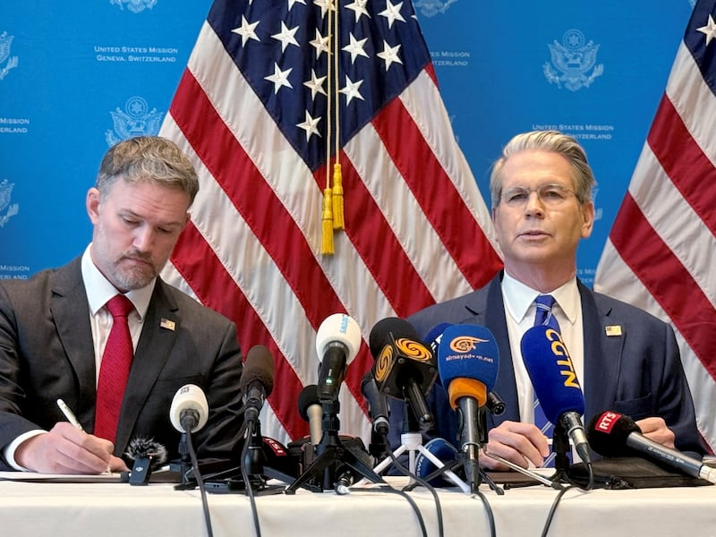

# Are U.S. sanctions against Syria hindering humanitarian relief efforts?

## Verdict: Misleading

By Zhuang Jing

2023.02.19

## In Brief

After an earthquake shook the Turkish-Syrian border on Feb. 6, killing tens of thousands of people and leaving many others injured, the Assad government in Syria has called for a lifting of sanctions against the country, criticizing the U.S. and E.U. for hindering critical supplies from reaching the many victims of the earthquake. Several [Chinese reports](http://www.takungpao.com.hk/news/232111/2023/0210/816877.html) have further stated that U.S. sanctions against Assad's government are "severely hampering" relief efforts in Syria.

Asia Fact Check Lab (AFCL) found these accusations to be misleading. They ignore U.S. officials' statements that relief assistance for earthquake victims will not be affected by the sanctions, overlooking the politicization of relief efforts amid the ongoing Syrian civil war as an equally disruptive effect on international relief efforts meant to help the population.

A screenshot of Chinese media coverage of relief efforts after the Turkey-Syria earthquake.

## Why are there sanctions against Syria, and what impact have they had?

The U.S. [listed the Syrian government as a state sponsor of terrorism](https://www.state.gov/syria-sanctions/) in 1979, adding additional sanctions and restrictions in 2004. Since the outbreak of civil war in 2011, the U.S. has severed relations with Bashar al-Assad's government, choosing instead to recognize the rebel Syrian Democratic Forces (SDF). Russia, Iran, and [China](https://www.fmprc.gov.cn/zyxw/202106/t20210601_9136827.shtml) continue to back Assad's government.

In order to deprive the Assad government of resources it could use to harm civilians, the U.S. and other countries have imposed targeted economic sanctions against Syria's government, including freezing the foreign assets of Syrian officials responsible for human rights abuses, prohibiting citizens from investing or trading with Syria and banning imports of Syrian oil. The sanctions have had a heavy impact on Syria's economy, with shortages of common daily products, leaving many civilians dependent on humanitarian aid.

## Are U.S. and other Western sanctions impeding current relief efforts in Syria?

A powerful earthquake struck the Turkey-Syria border on Feb. 6. U.N. officials estimate the death toll could exceed 50,000. The Syrian government immediately asked countries to lift sanctions against Syria, with the Syrian Foreign Ministry saying on Feb. 7 that U.S. sanctions against Syria were preventing humanitarian aid from entering the country. Chinese Foreign Ministry  [spokesperson Mao Ning repeated similar criticisms against the U.S.](https://www.mfa.gov.cn/web/fyrbt_673021/202302/t20230208_11022138.shtml) a day later, calling on the U.S. to lift its sanctions against Syria.

In a statement issued on Feb. 6, [President Joe Biden directed officials](https://www.whitehouse.gov/briefing-room/statements-releases/2023/02/06/statement-by-president-joe-biden-on-the-earthquakes-impacting-turkiye-and-syria/) to provide "all needed assistance." Later on the same day, State Department spokesman Ned Price said that the U.S. would work with local Syrian non-governmental partners - such as the volunteer rescue organization [the White Helmets](https://www.whitehelmets.org/en/) - to distribute any needed food, water, temporary shelter and medical assistance to local victims. On Feb. 9, the [U.S. Treasury Department](https://home.treasury.gov/news/press-releases/jy1261) released a statement implementing a temporary easing of restrictions against any transactions related to earthquake relief for 180 days. The statement also noted that humanitarian aid was allowed into Syria even under the ordinary statutes of the sanctions.

[Deutsche Welle quoted a German Foreign Ministry spokesman](https://www.dw.com/zh/%E6%95%91%E5%8A%A9%E5%8F%99%E5%88%A9%E4%BA%9A%E7%81%BE%E6%B0%91%E6%98%AF%E5%90%A6%E8%AF%A5%E5%8F%96%E6%B6%88%E5%88%B6%E8%A3%81/a-64645995) as saying that the E.U. sanctions are aimed at the Assad regime, war profiteers, and serious human rights offenders, not at the Syrian people. The sanctions prohibit the importation of only a select few goods; food, heavy machinery used for excavation, and other humanitarian aid are exempt.

## Are the sanctions the only factor making post-earthquake relief in Syria difficult?

Experts interviewed in [The Washington Post](https://www.washingtonpost.com/world/2023/02/08/syria-earthquake-sanctions-idlib-aid/), [The New York Times](https://www.nytimes.com/2023/02/07/world/europe/turkey-syria-quake-un-aid.html) and [The Guardian](https://www.theguardian.com/world/2023/feb/07/syria-earthquake-aftermath-aid-politics) all point to underdeveloped transportation systems and political divisions in the country as important factors in providing post-earthquake relief for Syria.

Syria is currently divided into areas controlled by Assad's government, opposition groups and other forces drawn in by the civil war. International aid for more than 4 million Syrians in the opposition-controlled northwest part of the country is transported through a lone crossing point along the Turkish border, [as reported by the BBC](https://www.bbc.com/zhongwen/trad/world-64564973).

It has been difficult for enough supplies to reach all areas in the northwest even in ideal conditions. After the route was damaged and made inaccessible during the recent earthquake, the humanitarian medical agency [Doctors Without Borders](https://www.msf.org.tw/news/202302/earthquake-northwest-syria) has called for more crossings to be made available to in order to allow badly needed supplies to reach the area.

A screenshot of Chinese media coverage of relief efforts after the Turkey-Syria earthquake.

However, Assad's government has long opposed cross-border aid, claiming that aid sent through Turkey to northwest Syria violates Syrian sovereignty and repeatedly demanding that international aid be delivered through territory under its control.

Opponents of Assad's government worry that even after lifting sanctions, the government may not deliver on its promise to provide such international aid to victims in the northwest. Senator Jim Risch, the ranking Republican on the Senate Foreign Relations Committee, [tweeted](https://twitter.com/SenateForeign/status/1623693042887565313) that "calls for sanctions relief are only intended to avoid accountability for the regime."

Qutaiba Idlbi, an expert for the U.S. think tank the Atlantic Council, said in an interview with The Guardian that Assad's insistence on aid being distributed from government-controlled areas to other regions is not about actually delivering aid the affected areas, but about using the crisis to establish who gets to distribute and control economic aid in the northwest.

After negotiations, on Feb13th, Assad's government agreed to open two border crossings from Turkey to allow United Nations aid accessing the opposition-held northwestern region, according to UN Secretary-General Antonio Guterres.

A screenshot of Chinese media coverage of relief efforts after the Turkey-Syria earthquake.

## Conclusion

Compared to the influx of international aid to Turkey following the earthquake, domestic and international factors have hampered the delivery of aid resources into Syria. The statements disseminated by official media in Syria and China that U.S. sanctions are "severely impeding" humanitarian relief mislead public opinion. While a factor, the sanctions against Syria are not the only reason behind this humanitarian problem.

## *Asia Fact Check Lab (AFCL) is a new branch of RFA established to counter disinformation in today’s complex media environment. Our journalists publish both daily and special reports that aim to sharpen and deepen our readers’ understanding of public issues.*

## MORE  China

[### Taiwan test fires new U.S.-supplied rocket system for first time](/english/china/2025/05/12/taiwan-china-missiles/)

---

[### US and China agree to slash tariffs for 90 days](/english/china/2025/05/12/china-us-tariff-deal/)

---

[### Now ‘friends of steel’: Xi and Putin meet in Moscow](/english/china/2025/05/08/china-russia-xi-jinping-putin-partnership/)

---

[### Hong Kong removes protection against land reclamation in Victoria Harbor](/english/china/2025/05/08/china-hong-kong-harbor/)

---

[### US, China in for protracted trade talks, warn experts ahead of crucial Geneva meet](/english/china/2025/05/07/china-us-trade-talks-analysis/)

## MOST READ  RFA

1.

[### Protests by unpaid Chinese workers spread amid factory closures](/english/china/2025/04/29/china-us-tariff-protests-workers-wages/)

---

2.

[### Vietnam enters fray at disputed South China Sea sandbank](/english/southchinasea/2025/05/05/vietnam-china-philippines-sandy-cay/)

---

3.

[### Chinese exporters use ‘origin washing’ to evade U.S. tariffs](/english/china/2025/05/06/china-tariff-exports-origin-washing/)

---

4.

[### Lao troops killed in attack tied to drug crackdown: report](/english/laos/2025/05/05/armed-group-attacl/)

---

5.

[### Uncovering injustice: Key stories from RFA Uyghur](/english/uyghur/2025/05/07/uyghur-rfa-highlights/)

[Original Source](https://www.rfa.org/english/news/china/china-syria-aid-02192023082954.html)