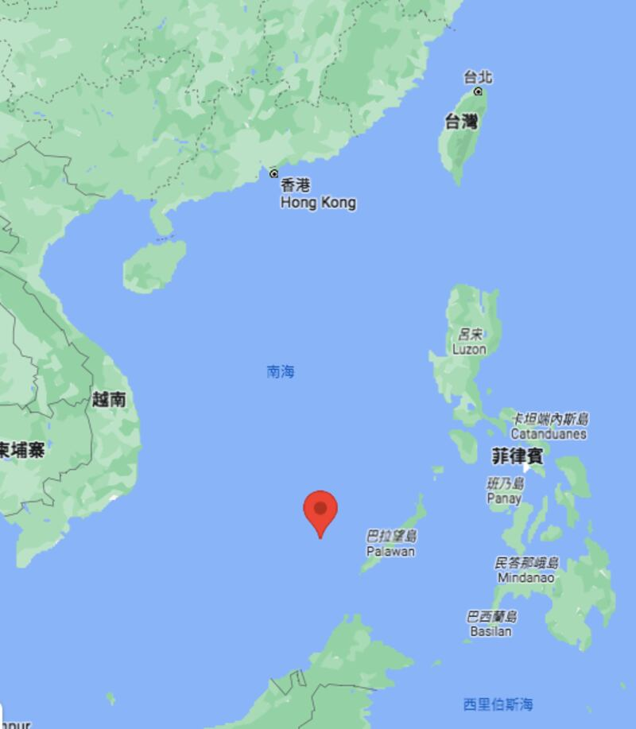

# Asia Fact Check Lab: Does China have sovereign rights to patrol around Ayungin Shoal?

## VERDICT: Misleading

By Dong Zhe

2023.03.06

## In Brief

The Philippine coast guard [issued a statement](https://coastguard.gov.ph/index.php/11-news/5001-pcg-statement-on-chinese-vessel-using-laser-at-pcg-ship-in-ayungin) on Feb. 13 accusing China of firing military lasers at one of their ships near Ayungin Shoal (known as Ren'ai Reef in China and Second Thomas Shoal in the U.S.), causing temporary blindness to the crew. Both China and the Philippines claim the shoal as their own territory and accuse each other of violating the United Nations Convention on the Law of the Sea (UNCLOS).

Asia Fact Check Lab (AFCL) found that China's misleading claims of sovereignty are purely political.  [A 2016 case in the International Court of Justice](https://pca-cpa.org/en/news/pca-press-release-the-south-china-sea-arbitration-the-republic-of-the-philippines-v-the-peoples-republic-of-china/)  (ICJ) defined the shoal as a "low-tide elevation," a terrain feature which under UNCLOS cannot be claimed by any sovereign jurisdiction.

A Chinese Coast Guard ship allegedly aims a green laser at a Philippine Coast Guard ship.

## In Depth

## Who attacked whom?

On Feb. 6, a Chinese Coast Guard ship about 10 nautical miles from Ayungin fired two green lasers at a PCG ship replenishing a nearby Sierra Madre landing craft. The lasers temporarily blinded several Philippine crew members, with the Chinese ship approaching within 150 yards of the Philippine ship’s starboard at one point.

The Philippine government believes that the Chinese Coast Guard blatantly ignored and violated the sovereignty of the Philippines by attempting to obstruct the transport of supplies. Chinese Foreign Ministry spokesman Wang Wenbin  [responded](https://www.fmprc.gov.cn/fyrbt_673021/202302/t20230213_11024501.shtml)  by stating that Philippine ships had trespassed in the waters of Ayungin Shoal – which China claims sovereignty over as part of larger territorial claims to the Spratly Islands – and that the Chinese ship defended Chinese sovereignty in accordance with domestic law and UNCLOS.

The Philippine Department of Foreign Affairs  [issued a press release](https://dfa.gov.ph/dfa-news/statements-and-advisoriesupdate/31783-ph-protests-cn-coast-guard-use-of-military-grade-laser-dangerous-maneuvers-against-pcg-near-ayungin)  on Feb. 14, condemning China's encroachment on Philippine economic waters and calling on China to comply with UNCLOS and the ruling of the 2016 ICJ South China Sea arbitration.

## Did the South China Sea case settle the dispute over Ayungin Shoal?

Due to the South China Sea’s rich oil reserves and important shipping routes between the Pacific and Indian oceans, competing sovereign claims over certain maritime features in the region have repeatedly blown up into international disputes.

In the 2013 South China Sea arbitration case held by the ICJ, the Philippines requested clarification on whether certain maritime features claimed separately by China and the Philippines – including Ayungin Shoal -– were islands, rocks or low tide elevations. Each of these terms is defined as a different type of maritime feature by UNCLOS, and each grants different territorial rights to the controlling sovereign state. These territories are broadly divided into territorial waters which are fully under the controlling state’s jurisdiction, exclusive economic zones (EEZ) where the controlling state enjoys special rights on resource extraction in the water.

The ICJ finally ruled that the Ayungin Shoal – along with three other contentious maritime features – is a low tide elevation, which under UNCLOS does not confer either territorial seas or an exclusive economic zone (EEZ) to the controlling country.

The ICJ further ruled that the shoal is part of the Philippines’ EEZ, declaring that China’s obstruction of Filipino fishermen and oil extraction, construction of artificial islands and interception of Philippine ships all violate the Philippines’ sovereign rights. UNCLOS only permits ships to pass freely through another country’s EEZ, not to conduct law enforcement operations within it, noted Song Cheng’en, an Oxford University doctoral candidate and scholar of international law.

## Must China obey the South China Sea ruling?

While both countries are signatories to the UNCLOS, China refused to participate in the South China Sea arbitration proposed in 2013 and has repeatedly asserted that the ruling in the Philippines favor is invalid and non-binding.

The Chinese government has claimed sovereignty over most of the Spratly islands since 1953, publishing various documents since then which list the islands within its territory ( [1](https://baike.baidu.com/reference/11039887/bb4d7TCCdUbVBKSB3PGjdADJRuMsBcDrN9-ZCQy--1lsrdH5uV9E4hHc2ho5qP91OqNekaoZ5jPiMmBiaCOHAYfPn6ELZd8xNuToT-YRw0oJYvB8oBuQISrRiU0),  [2](https://www.fmprc.gov.cn/diaoyudao/chn/flfg/zcfg/201510/t20151009_8560585.htm)) and resolutely denying the legitimacy of the ICJ ruling on the South China Sea, which Chinese Foreign Ministry spokesperson Zhao Lijian called, "a complete political, farce concocted by the United States."

U.S. State Department spokesman Ned Price  [called](https://www.state.gov/u-s-support-for-the-philippines-in-the-south-china-sea-3/)  on China to comply with the ICJ ruling at a press conference on Feb. 14, noting that the U.S. stands behind the Philippines and affirms that the ICJ decision ought to be legally binding on both parties.

The International Court of Justice ruled that Ayungin Shoal is within the Philippines’ Exclusive Economic Zone.

## Conclusion

Chinese claims of sovereignty over the Ayungin Shoal and subsequent accusations that Philippine Coast Guard ships were trespassing the Shoal’s outlying waters are misleading.

AFCL found that neither the Ayungin Shoal nor the surrounding 12 nautical miles of territorial waters can be claimed as sovereign territory by either China or the Philippines, and that the shoal still falls within the Philippines’ exclusive economic zone.

## *Asia Fact Check Lab (AFCL) is a new branch of Radio Free Asia, established to counter disinformation in today’s complex media environment. Our journalists publish both daily and special reports that aim to sharpen and deepen our readers’ understanding of public issues.*

[Original Source](https://www.rfa.org/english/news/afcl/laser-03062023181028.html)