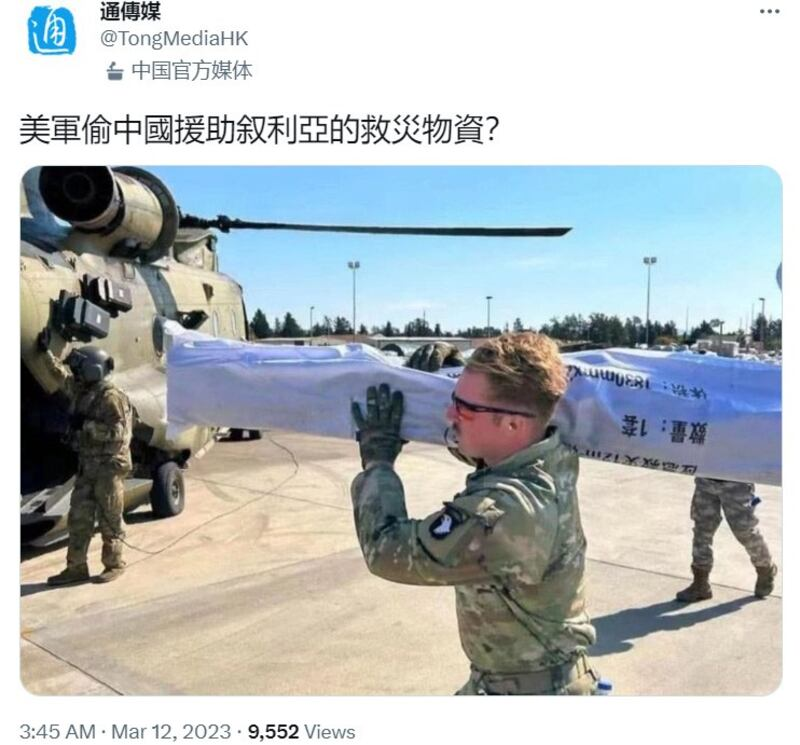
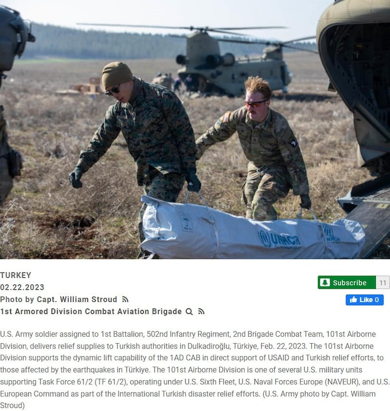
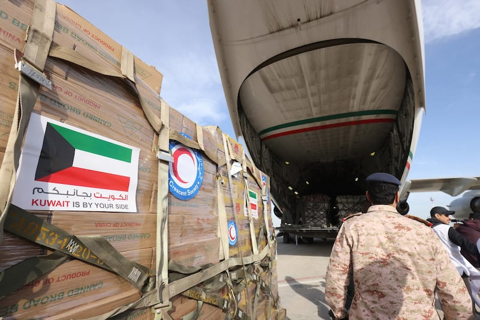

# Asia Fact Check Lab: Did the U.S. military steal Chinese relief supplies for Syria?

## Verdict: Mistaken

By Zhuang Jing

2023.03.22

## In Brief

A recent photo circulating on the Internet of an American soldier carrying an aid package labeled with Chinese characters has fueled rumors that the U.S. military stole Chinese relief supplies for Syria.

Asia Fact Check Lab (AFCL) found that U.S. forces have been helping to transport global aid supplies to Turkey and Syria in the wake of February’s earthquake, and that the allegations by Chinese media and netizens have no factual basis.

Tong Media, an official Chinese news outlet, posted a tweet on March 12, 2023, questioning whether the U.S. military was stealing Chinese relief supplies meant for Syria. Credit: RFA screenshot

## In Depth

The U.S. Army on March 7 posted a photo on its official [Instagram account](https://www.instagram.com/p/CpdyEjcNeIJ/?igshid=YmMyMTA2M2Y%3D) showing one of its soldiers hoisting a bulky white bag labeled with Chinese characters saying, "Disaster response. Quantity: 1 set." The photo's caption identified the soldier as part of the 101st Airborne Division and said, "First Strike Soldiers continue to work in support of USAID - US Agency for International Development and Turkish relief efforts to those affected by the earthquake in Türkiye [Turkey]."

In the following week, Chinese netizens mocked the post in the comment section. One user asked, "Stealing China's relief supplies?" Another remarked, "Funny, he's preaching humanitarianism while carrying Chinese supplies." [Official Chinese media outlet Tong Media](https://twitter.com/TongMediaHK/status/1634822828062289920) retweeted the original picture on March 12 with a question: "Did the U.S. military steal Chinese relief supplies for Syria?"

Another netizen [reposted the photo on Twitter](https://twitter.com/Kevin33424369/status/1635415147803217925) a day later, this time accusing the U.S. outright of stealing Chinese aid meant for Syria. The same day, an article appearing [on the Chinese social media site NetEase commented](https://m.163.com/dy/article/HVNEE0I30553FHX5.html) that "even against the backdrop of this once-in-a-century natural disaster, the U.S. military has not stopped its thuggery. Long used to stealing oil and food meant for Syria, the U.S. is now blatantly plundering Chinese relief aid to the country and sending it to Turkey."

As part of international relief efforts targeting areas hit by the recent earthquake in Turkey and Syria, two U.S. soldiers carry a white bag stamped with UNHCR [United Nations High Commissioner for Refugees] and its logo. Credit: RFA screenshot from Defense Visual Information Distribution Service

The U.S. Department of Defense, responding to a query from AFCL, dismissed the allegations by Chinese netizens and media that the U.S. military stole Chinese relief supplies as false.

“The claims are categorically false. The photo does depict a U.S. Army soldier from 2nd Brigade Combat Team, 101st Airborne Division (Air Assault), supporting the humanitarian assistance and disaster relief effort in Türkiye. We have confirmed with the soldier in the photo and the item he was carrying - a tent - came from a larger stock of tents, which contained markings in multiple languages. The pile of tents, one of many piles of life-saving relief items donated by the international community to Türkiye, was under control of Turkish authorities at Incirlik Air Base, a Turkish air base.

“The soldier depicted was loading these items at the direction of Turkish authorities, to deliver them to those in need in order to save lives and alleviate suffering. US servicemembers supporting this humanitarian assistance and disaster relief mission in Türkiye facilitated the movement of aid from the US government, UNHCR, and other contributing nations, all in close coordination with Turkish authorities. It is indeed unfortunate that anyone would use this photo to insinuate otherwise.”

An examination and comparison of photos, videos and news reports from Turkey by AFCL support the idea that the theft rumors are unfounded.

The photo appears to have [originated as a Feb. 27 Facebook post](https://www.facebook.com/FirstStrike1502/) by the 1-502nd Infantry Regiment "First Strike" 2nd Brigade Combat Team before being reposted on Instagram by the U.S. Army. While the printing on the bag that the soldier is carrying is clearly simplified Chinese, there are no characters visible that identify it as Chinese relief supplies for Syria. Indeed, [China donated supplies](https://news.rthk.hk/rthk/en/component/k2/1687666-20230213.htm?spTabChangeable=0), including tents, blankets, and medical supplies, to both [Turkey and Syria](https://english.alarabiya.net/News/middle-east/2023/02/12/Turkey-earthquake-China-sends-53-tonnes-of-tents-to-aid-earthquake-relief-).

The same soldier appears in other photos and videos on the [U.S. Defense Visual Information Distribution Service](https://www.dvidshub.net/unit/1ADCAB). [One photo shows](https://www.dvidshub.net/image/7645998/us-army-soldier-delivers-humanitarian-aid-supplies-turkish-afad) him and another soldier carrying a long white bag stamped with "UNHCR," the United Nations High Commissioner for Refugees' acronym, along with its logo, in green. The accompanying caption also mentions the relief efforts for Turkey.

Many of the supplies sent to quake-damaged areas of Turkey and Syria had foreign-language labels or foreign flags printed on their packaging. Here, Kuwaiti army officers load a military plane with humanitarian aid for Turkey at Kuwait international airport in Kuwait City, on Feb. 9, 2023. Credit: AFP

[According to U.S. military news outlet *Stars and Stripes*,](https://www.stripes.com/branches/air_force/2023-02-23/turkey-earthquake-incirlik%C2%A0-9227594.html) U.S. forces and helicopters have assisted in transporting aid, ranging from medical supplies from Texas to sleeping blankets from China, to hard-hit areas in Turkey after a severe earthquake devastated the country and neighboring Syria on Feb. 6.

Other media reports and footage from Turkey capture American troops supporting disaster relief units such as from Turkey’s Ministry Of Interior Disaster And Emergency Management Presidency (AFAD) in moving a huge volume of international aid into Turkey. Many of the supplies had foreign-language labels or foreign flags printed on their packaging.

## Conclusion

While China contributed foreign aid to both Syria and Turkey, Chinese netizens and media misinterpreted a photo of a U.S. soldier helping to transport such aid into Turkey as evidence that the U.S. was stealing Chinese relief supplies meant for Syria.

Translated by Shen Ke. Edited by Malcolm Foster.

[Original Source](https://www.rfa.org/english/news/afcl/fact-check-tent-bag-03222023102733.html)