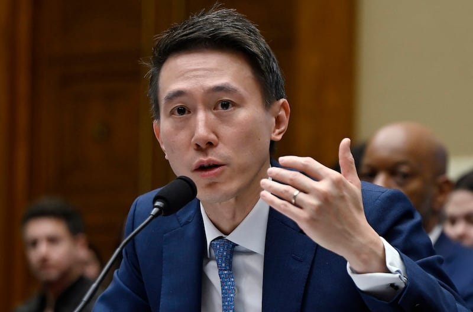
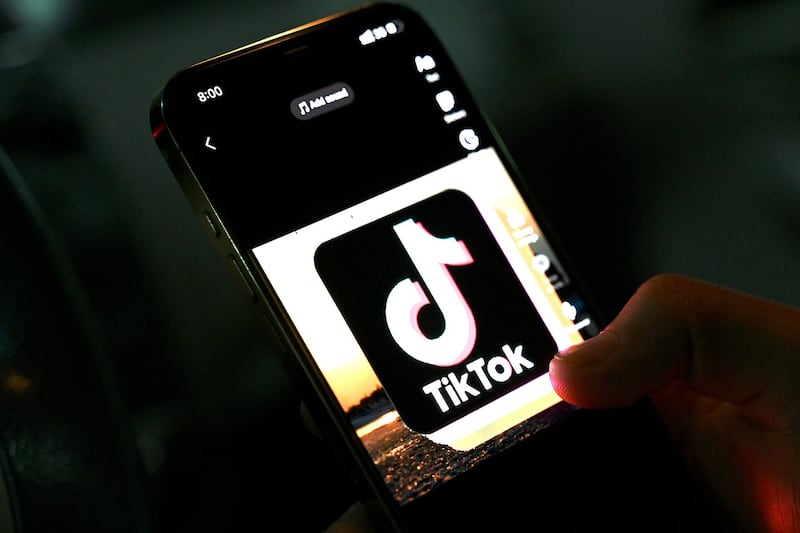

# Asia Fact Check Lab: Can TikTok share US user data with China’s government?

## Verdict: True

By Shen Ke

2023.03.24

## In Brief

When TikTok CEO Shou Zi Chew appeared before the U.S. House Committee on Energy and Commerce on Thursday, he was asked a key question: Whether the [Chinese government](https://www.wsj.com/articles/tiktoks-talks-with-u-s-have-an-unofficial-player-china-f5fec4ec?mod=article_inline) could use TikTok or its Beijing-based parent company ByteDance Ltd. to surveil Americans or obtain data about them.

Asia Fact Check Lab (AFCL) found no evidence to support that TikTok intentionally shared or plans to share user data with the Chinese government.

But TikTok’s subservient relationship to its parent company ByteDance -- a Chinese company subjecting to Chinese laws – would create opportunities for the Chinese government to collect data about American users.

Furthermore, TikTok’s own privacy policy and terms of services clearly stipulate that it can move U.S. user data outside the country. TikTok may never have shared its data with the Chinese government, but it surely has the ability to do so.

## In Depth

## 1. Can TikTok share data with China’s government？

Yes.

Tiktok has [stated several times](https://newsroom.tiktok.com/en-us/tiktok-responds) that it has not shared data with China's government, and company executives have further [stated they would refuse to hand over any data to China if asked](https://www.youtube.com/live/zhWnUE1laK8?feature=share&t=20624).

However, TikTok's [privacy policy](https://www.tiktok.com/legal/page/us/privacy-policy/en) clearly says it *can* share user data with its mother company, ByteDance, and various governments around the world if required.

Bytedance, TikTok's parent company, is based in Beijing. Like many Chinese companies, it has [an internal Communist Party committee](https://www.seafarerfunds.com/prevailing-winds/party-committees-in-chinese-companies/) within its ranks that is led by Vice President [Zhang Fu Ping](https://baike.baidu.com/item/%E5%BC%A0%E8%BE%85%E8%AF%84/53259753).

The Chinese government [has enacted laws that require companies to cooperate](http://www.gov.cn/xinwen/2016-11/07/content_5129723.htm) with state authorities when asked to provide *any* information on matters relating to national security.

TikTok CEO Shou Zi Chew testifies before the House Energy and Commerce Committee hearing on "TikTok: How Congress Can Safeguard American Data Privacy and Protect Children from Online Harms," on Capitol Hill, Thursday, March 23, 2023, in Washington, D.C. Credit: AFP

The 2017 Cybersecurity Law requires businesses to store select data in China and grants the government wide-ranging rights to check such data at their discretion. Various other laws that grant the state the right to collect information use ambiguous language and often include catch-all phrases that allow them to apply the law however they see fit.

And TikTok’s privacy policy clearly says that other entities within their corporate group – such as Bytedance – may have access to its data:

"As a global company, the Platform is supported by certain entities within our corporate group, which are given limited remote access to [Information We Collect](https://www.tiktok.com/legal/page/us/privacy-policy/en#informationwecollect) as necessary to enable them to provide certain important functions."

Therefore, TikTok can share data with Bytedance, which under Chinese law would be required to hand over data to the government if pressured.

## 2. Can TikTok’s US data be shared outside the U.S.?

Yes.

It is possible for Tiktok to share and transmit their data to entities outside the US. The section entitled “Data Security and Retention” within TikTok’s privacy policy says,

“TikTok may transmit your data to its servers or data centers outside of the United States for storage and/or processing. Other entities with whom TikTok may share your data as described herein may be located outside of the United States.”

## 3. Can TikTok’s data be shared with law enforcement in China?

Yes.

TikTok’s policy notes that different countries’ law enforcement may request data, and that the specific procedures of the request will vary from country to country.

"We may disclose any of the [Information We Collect](https://www.tiktok.com/legal/page/us/privacy-policy/en#informationwecollect) to respond to subpoenas, court orders, legal process, law enforcement requests, legal claims, or government inquiries, and to protect and defend the rights, interests, safety, and security of the Platform, our affiliates, users, or the public. We may also share any of the [Information We Collect](https://www.tiktok.com/legal/page/us/privacy-policy/en#informationwecollect) to enforce any terms applicable to the Platform, to exercise or defend any legal claims, and comply with any applicable law."

TikTok’s privacy policy clearly says it can share user data with its mother company, ByteDance, and various governments around the world if required. Credit: AFP

China does not have an independent judiciary; law enforcement is subject to the government's order. As Donald Clarke, a Chinese law specialist at George Washington University [noted](https://papers.ssrn.com/sol3/papers.cfm?abstract_id=3354211) about a similar case with Chinese tech company Huawei's threat to other countries' data security, "The Chinese Party/state is not meaningfully constrained by Chinese law."

## Conclusion

Although TikTok has repeatedly said it has never shared data nor will share data with China’s government, there are reasonable concerns that it may do so.

TikTok’s privacy policy allows it to share data with its parent company Bytedance, to transmit data outside the U.S. and to hand over data to other countries local law enforcement when requested to do so.

## *Edited by Malcolm Foster.*

*Asia Fact Check Lab (AFCL) is a new branch of RFA established to counter disinformation in today’s complex media environment. Our journalists publish both daily and special reports that aim to sharpen and deepen our readers’ understanding of public issues.*

[Original Source](https://www.rfa.org/english/news/afcl/fact-check-tiktok-03242023144611.html)