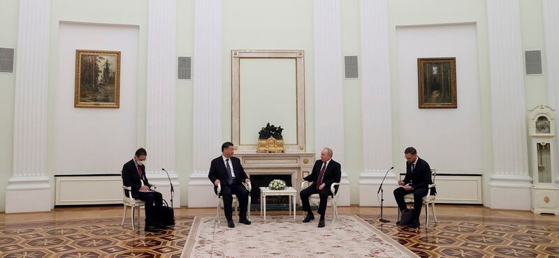
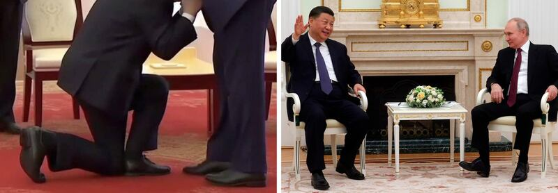
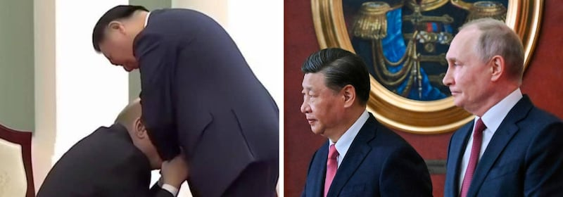
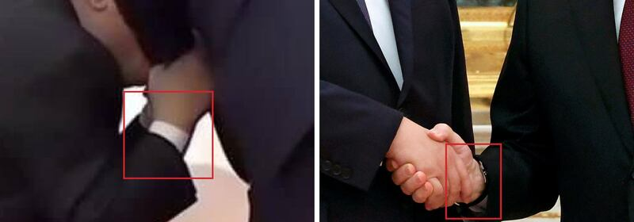

# Asia Fact Check Lab: Did Putin kneel before Xi Jinping?

## Verdict: False

By Dong Zhe

2023.03.25

## In Brief

Around the time of Chinese leader Xi Jinping's visit to Moscow earlier this week, a Twitter account with more than 50,000 followers [posted a photo](https://twitter.com/NiKiTa_32156/status/1637832085963689985?cxt=HHwWgsDS2djm37otAAAA) purportedly showing Russian President Vladimir Putin kneeling before Xi and grasping his hands in apparent supplication. Jason Jay Smart, a special correspondent for the *Kyiv Post*, later [retweeted the photo accompanied by the caption](https://twitter.com/officejjsmart/status/1637836851619807232?cxt=HHwWgIC-zYv84botAAAA), "Putin attempting to persuade Xi."

Asia Fact Check Lab (AFCL) found several flaws in the photo typical of manipulated digital images that confirm the photo is a fake.

## In Depth

Xi's visit with Putin took place as the war in Ukraine entered its second year and the Russian leader has become increasingly isolated globally. The previous week, the International Criminal Court had [issued an arrest warrant](https://www.icc-cpi.int/news/situation-ukraine-icc-judges-issue-arrest-warrants-against-vladimir-vladimirovich-putin-and) for Putin for alleged war crimes involving the forced deportation of Ukrainian children to Russia.

China painted Xi's three-day trip as an opportunity to ["promote global strategic stability amid the ongoing Ukraine crisis."](https://www.chinadaily.com.cn/a/202303/22/WS641b1f42a31057c47ebb5f4c.html) The two leaders signed 14 agreements and pledged to deepen their strategic partnership, but Alexander Gabuev, a senior fellow at the Carnegie Endowment for International Peace, [described the agreements as "pretty thin."](https://www.nytimes.com/2023/03/21/world/europe/xi-putin-russia.html) Missing were a deal on a natural gas pipeline that Putin hoped to build to increase Russian energy sales to China and any public breakthrough on ending the war.

On March 20, the first day of Xi's visit, the two leaders met for talks, with media covering some of their comments. That same day, Smart, working for the *Kyiv Post*, an English-language newspaper in Ukraine, retweeted a photo of Putin kneeling before Xi with his two hands clasping those of the Chinese president.

The timing of the tweet immediately suggests the image is fake: Smart's retweet of the kneeling photo is stamped March 20, 11:21 a.m., but the [4½ hour Putin-Xi meeting](https://www.cnn.com/2023/03/20/europe/xi-putin-china-russia-visit-monday-intl-hnk/index.html) didn't actually take place until that afternoon.

Digitally manipulated photos are proliferating online, but—for now, at least—a sharp-eyed viewer can often spot flaws that give them away.

Significantly, neither leader’s face is fully visible in the kneeling photo. AFCL spotted five discrepancies that suggest the photo was doctored.

Chinese President Xi Jinping and Russian President Vladimir Putin chat with each other during their meeting at the Kremlin in Moscow, Russia, Monday, March 20, 2023. Credit: Kremlin Pool Photo via AP

* **Different backdrop**

A comparison between the Twitter photo and images from Western media [video footage](https://www.wsj.com/video/watch-chinese-leader-xi-jinping-meets-with-vladimir-putin-in-moscow/D0D6FE62-DC7C-484D-8377-3206D35D946F.html) and photos of the March 20 turns up numerous differences in the backdrop.

In photos of the meeting taken by the Kremlin pool via the Associated Press, the two leaders are seen sitting in white-and-beige chairs in an ornate state room decorated in a muted palette featuring pale-green walls, white columns, and gold-and-white-toned furnishings. The meeting room in the Twitter photo has sage-green walls, a red carpet, and chairs and other furniture fashioned from brown-colored wood.

* **Distorted walls**

In the Twitter photo, the white column behind the supposed kneeling Putin appears distorted. This indicates that the photo may have been altered. Another distortion is visible in the man standing in the background at the far right: He appears to be superimposed on another body, and his legs disappear before reaching the floor. Some of the furniture also appears to have missing legs or extra legs.

Comparing shoes. Credit: @NiKiTa\_32156 and Associated Press

* **Different types of shoes**

Both leaders in the Twitter photo are wearing black matte shoes with no laces. Photos taken by AP show Xi wearing black shoes with a wider toe and thicker sole, while Putin’s shoes have a more pointed toe and visible laces.

Furthermore, both the angle of Putin’s right foot and the sole of his right shoe look unnatural in the kneeling photo.

Comparing hairstyles. Credit: @NiKiTa\_32156 and Associated Press

* **Different hair and heads**

Xi has maintained the same hairstyle for years. Compared to his usual look, the Chinese president’s hair appears flatter and smoother in the Twitter photo and his hairline clearly differs from that in the AP photos.

The way Xi’s hair is cut in the back also differs. AFCL found a still image from 2022 that shows Xi bending forward to lay a wreath at an event commemorating China's national heroes. In that image, grabbed from video footage taken by Chinese official broadcaster CCTV, Xi sports a more subtle neckline than the high, chopped trim displayed in the Twitter photo.

Neither leader’s face is fully visible in the Twitter photo, but both heads appear disproportionately large compared to their bodies. The parts of the men’s faces that are visible appear preternaturally smooth, with no hint of wrinkles, while the middle of Putin’s ear includes a strange lump. Putin’s hand also appears unnaturally smooth and melts into Xi’s suit jacket.

The missing watch. Credit: @NiKiTa\_32156 and Associated Press

* **Disappearing watch**

The AP photos show a watch peeping out from Putin’s right suit sleeve. Only the cuff of a white shirt is visible in the photo of him kneeling.

## Conclusion

A tweeted photo that appears to show Putin kneeling before Xi during his recent visit to Moscow might reflect some people’s perception of the power dynamics between the two leaders. But several obvious flaws and discrepancies in the image make clear that the photo is a fake.

## *Translated by Shen Ke*

*Asia Fact Check Lab (AFCL) is a new branch of Radio Free Asia, established to counter disinformation in today’s complex media environment. Our journalists publish both daily and special reports that aim to sharpen and deepen our readers’ understanding of public issues.*

[Original Source](https://www.rfa.org/english/news/afcl/fact-check-putin-kneeling-03252023120422.html)