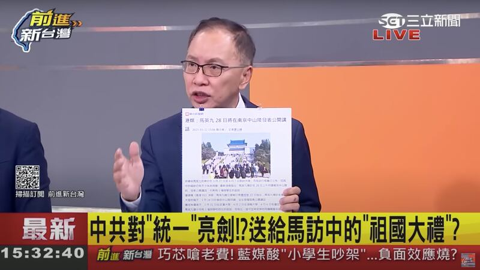

# Asia Fact Check Lab: Is discussing unification the reason behind Ma’s China trip?

## Verdict: Out of Context

Author: Li Tong

2023.03.28

## In Brief

Former Taiwanese President Ma Ying-jeou’s trip to mainland China has generated plenty of interest as it is the first time a sitting or former leader from the democratic island has visited communist China.

Taiwanese political commentator Tung Li-Wen blasted the trip, declaring on his YouTube channel that Ma’s chief of staff had said the visit was “about unification talks” between the two sides.

Asia Fact Check Lab (AFCL) found Tung’s statement to be inflated and taken out of context. A recording of the comments reveal that Ma’s office director Hsiao Hsu-tsen was asked by a reporter how Ma would respond if mainland youth raised the issue of reunification during the trip.

Hsiao replied, “Reunification shouldn’t be taboo,” which is what apparently sparked Tung’s reaction.

## In Depth

Ma’s office issued a press release on March 19 saying the former president would soon visit China to pay homage to his ancestors. In addition, several students in Ma’s education initiative, “Da Jiu Academy,” will accompany him and engage in cultural exchanges with mainland students, it said.

The March 27-April 7 visit elicited criticism from think tank advisor Tung, who criticized Ma in his March 24 episode of  [*Taiwan Go*](https://www.youtube.com/watch?v=UTXvc0Z9KvY&t=2042s) , an political talkshow with over 190,000 Youtube followers.

Taiwanese political commentator Tung Li-Wen criticized Ma's the trip, saying on his YouTube channel that Ma’s chief of staff had said the visit was “about unification talks” between the two sides.

Tung claimed Hsiao had stated in an interview with Hong Kong media that “this trip is about unification talks” and that Ma's trip would be the "crucial first step" toward reunification. Tung and other commentators then proceeded, in turn, to criticize Ma's office for “not hiding” their intent to bring students to the mainland in order to talk about reunification. This particular episode of Taiwan Go was watched by over 30,000 viewers.

## Is Ma’s trip centered around reunification talks?

AFCL found that quotes cited by Tung were taken from a background briefing Hsiao gave to foreign media in Taiwan on March 22, not from interviews with individual media outlets. The briefing was detailed in reports by online media outlets such as Hong Kong's [HK01](https://www.hk01.com/article/879999?utm_source=01articlecopy&utm_medium=referral) and Singapore's  [*Lianhe Zaobao*](https://www.zaobao.com.sg/news/china/story20230324-1375701) .

Hsiao told AFCL that the comments referred to by Tung were in response to a reporter who asked whether Ma and the students accompanying him to China would avoid responding to questions about unification if mainland students raised the issue during the trip.

Hsiao replied that no topics were off limits during the trip, noting that Taiwan upholds freedom of speech and that the very preamble of the constitution of the Republic of China – the precursor to Taiwan – explicitly uses the word “unification.” He said that if mainland Chinese students wanted to ask about unification, Taiwanese students would of course be willing to respond.

Hsiao emphasized that Tung and other political commentators twisted his response to what was originally a hypothetical question asked by the media and distorted it to seem as if Ma and his entourage were taking the initiative to bring up the topic of reunification with mainland officials.

## Is Hsiao himself the only source who can verify his claims?

AFCL separately checked with two independent sources who attended Hsiao’s briefing. Both confirmed Hsiao's quotes about unification were in response to a question raised by the media.

AFCL also obtained a recording from the briefing itself, in which a female voice is heard saying that Ma and his entourage ought to respond if the issue of reunification is mentioned, given the pluralistic rhetoric in modern China and the fact that cross-strait hostility and hatred has risen in the past few years due to “ultra-nationalist Chinese netizens loudly calling for unification by force.”

Hsiao can be heard in the recording replying that “unification” is in fact written into the preamble of the Republic of China’s constitution. “So I think this is an issue that must be debated or discussed. If the mainland says we want to unify today, then we can also get students to discuss, well, if you want to unify, how can both sides agree? What conditions and situations [would bring about unification]? I don’t think it’s taboo.”

Hsiao stressed that the most important thing is for both parties to reach out and talk about these issues. Remaining in Taiwan and clamoring for more resistance to China won’t solve the problem.

## Conclusion

This appears to be a clear case of distorting a comment and taking it out of context. Former President Ma’s chief of staff did not say the reason for Ma’s trip was to discuss unification; he said was willing to discuss the issue if it came up.

## *Translated by Shen Ke. Edited by Malcolm Foster.*

[Original Source](https://www.rfa.org/english/news/afcl/fact-check-ma-trip-03282023133257.html)