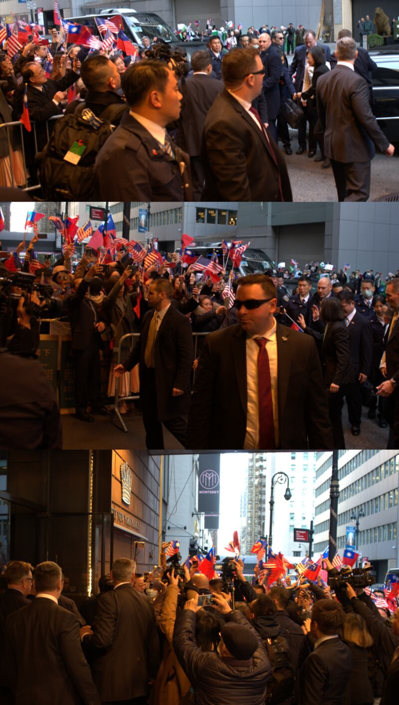

# Asia Fact Check Lab: Was Tsai Ing-wen “coolly received” while in New York?

## Verdict: Misleading

By Emma

2023.04.04

## In Brief

Following Taiwanese President Tsai Ing-wen’s stopover in New York City en route to Central America, reports by official Chinese media outlets described her as being “embarrassed” when upon arrival she “was coolly received” by crowds of protesting Chinese who looked at her like a “rat in the street.”

Such reports quoted *The Wall Street Journal* as saying that she "is keeping largely out of the public eye" and used short video clips that ostensibly showed Tsai "having to quickly duck into a hotel through a side door" in order to avoid the crowd.

Such claims soon spread widely across the Chinese internet and were reprinted by most national and provincial media outlets, including *China Daily* and *Global Times*.

Asia Fact Check Lab (AFCL) verified that the above descriptions misrepresented and distorted Tsai’s arrival and subsequent time spent in the city, after checking with on-site eyewitness reporters in New York City.

## In Depth

Tsai stayed in New York City from the afternoon of March 29 to the morning of March 31, as an initial stopover during her planned 10-day diplomatic visit to Taiwan's allies in Central America. The Chinese government strongly condemned Tsai's transit through the United States and [organized groups of overseas Chinese within the U.S. to protest it](https://www.rfa.org/mandarin/yataibaodao/gangtai/lam-03292023101610.html).

Tsai arrived at the Lotte Hotel in Manhattan at 4 p.m. on March 29. AFCL learned from a number of on-site reporters that 400-500 protesters organized by China had gathered in an open space across from the southwest side of the hotel. In between chants of “Down with Tsai” and “Taiwan independence is a dead end,” the protestors waved Chinese flags and intermittently sang Chinese patriotic songs.

Meanwhile, north and south of the hotel’s eastern entrance, about 100 to 200 people holding Taiwanese flags gathered in support of Tsai, chanting “Go Taiwan” and “Long live the Republic of China.”

Two factions of people gather on the east [left] and west [right] sides of Tsai's hotel on the afternoon of March 29. Credit: RFA

While the two factions occasionally bandied words and competed to see who could shout their slogans the loudest, local police and special duty officers prevented a repeat of the clashes [that marked Tsai's previous transit through New York in 2019](https://www.voachinese.com/a/FIGHT-TSAI-NY-20190713/4998502.html).

## Did Mainland Chinese media provide the full picture of Tsai’s hotel arrival?

No. Mainland Chinese coverage of Tsai's visit only shows voices and images of the opposition protests, with official reports of the event describing her as a ["street rat" that "everyone shouted at](https://baijiahao.baidu.com/s?id=1761980855556105203&wfr=spider&for=pc)."

At around 3 p.m. on March 29, a crowd of pro-Mainland ethnic Chinese demonstrators arrived outside the hotel where Tsai Ing-wen was staying and soon began protesting across the street. Credit: Screenshot from a World Journal report

[Subsidiary](https://mp.weixin.qq.com/s/-ShRYQbHOi0y7K2rEFo9LQ) [media](https://news.cctv.com/2023/04/03/ARTI8DJdtdrwb2Gz5aaz9Caa230403.shtml) [outlets](https://taiwan.huanqiu.com/article/4CHgtZRrlcb) of CCTV and *People's Dail*y re-used a photo taken by journalist Zhang Wenxin in a  [*World Journal* report](https://www.worldjournal.com/wj/story/121469/7066052?from=wj_maintab_cate&zh-cn) as evidence that Tsai received a cold reception by overseas Chinese. However, photos of Tsai's supporters also taken by Zhang and published in the same article were not used by mainland media.

## Did Tsai quickly duck into her hotel through a side door?

No. A segment from a [widely circulated video](https://mp.weixin.qq.com/s/-ShRYQbHOi0y7K2rEFo9LQ) produced by the CCTV subsidiary social media account *Riyue Tantian* appears to show Tsai and her entourage quickly entering the Lotte Hotel. The corresponding voiceover narration reads, "To avoid the tidal wave of protests, she had to quickly duck into the hotel through a side door."

Screenshot of the Riyue Tiantan report.

After examining both the layout of the Lotte Hotel and the full video the clip was edited from, AFCL found that Tsai neither dodged the crowd nor entered through a side door. Rather, she entered through the hotel’s front door.

After getting out of her car at the hotel’s main entrance, Tsai waved to supporters who had gathered to welcome her, voluntarily approached the crowd and shook hands with several onlookers before making her way to the hotel amidst the crowd.

A clip from Riyue Tantian, pro-Beijing news outlet on the popular Chinese social media platform Wechat edited out the first half of the video in which Tsai shakes hands with her supporters. Several Republic of China flags being held by her supporters can still be seen reflected off glass doors captured in the second half of the video.

The first half of the “deleted” scene: Tsai Ing-wen exits her car, walks toward a large crowd gathered outside the front of her hotel and enters after passing through throngs of people.

## Did Tsai mostly keep out of the public eye while in transit?

No. [A *Wall Street Journal* report on March 30](https://www.wsj.com/articles/taiwan-leaders-u-s-visit-is-purposely-low-key-f3f5b1ef) stated that, "President Tsai Ing-wen is keeping largely out of the public eye." In addition to changing "president" to "Taiwan's leader," the [Chinese translation](https://cn.wsj.com/articles/%E8%94%A1%E8%8B%B1%E6%96%87%E7%BE%8E%E5%9C%8B%E4%B9%8B%E8%A1%8C%E5%88%BB%E6%84%8F%E4%BF%9D%E6%8C%81%E4%BD%8E%E8%AA%BF-284c14cc) of the article published on March 31 used slightly different wording to describe Tsai's trip, claiming that she "virtually didn't appear in the public eye."

AFCL confirmed through interviews with journalists and citizens that Tsai attended several public events over the three days and two nights she was in New York.

On the evening of March 29, for example, Tsai gave a speech at a banquet hosted by local Chinese. She [delivered her speech in a mixture of English, Mandarin and Minnan](https://www.rfa.org/mandarin/Xinwen/15-03292023231926.html) to an audience of 700 attendees and media representatives. Tsai later politely mingled with many of the guests.

Tsai Ing-wen speaks at a banquet for overseas Chinese. Credit: RFA

On the morning of March 30, Tsai went to Brooklyn to talk with young entrepreneurs of Taiwanese descent, including Lillian Lin, co-owner of [Yun Hai Taiwanese Pantry](https://yunhai.shop/). Lin told AFCL that during her meeting with the president at a cafe, Tsai tasted their shop's dried pineapples while listening to the story of how Yun Hai brought local Taiwanese produce to sell outside the country. After leaving the cafe, Tsai briefly interacted with people and media waiting outside for her, [giving a thumbs up as some onlookers shouted](https://www.youtube.com/watch?v=eRatuLf75ok), "Taiwan No.1."

At noon, Tsai went to the Taipei Economic and Cultural Office in New York to attend a reception with representatives of friendly U.N. countries. At the reception, Tsai tasted cuisine prepared by the Taiwanese Masterchef Junior Liya Chu and viewed artwork by renowned Taiwanese illustrators Zhong Yiting and Zhang Yaqing, both of whom had come to New York to participate in an art exhibition.

The only event on Tsai’s itinerary closed to the media was a private meeting at the Hudson Institute on the evening of March 30.

Tsai Ing-wen attends an event at the Taipei Economic and Cultural Office in New York in the afternoon of March 30. Credit: Associated Press.

The office of Speaker of the U.S. House of Representatives Kevin McCarthy, a California Republican, confirmed this Monday that he will meet with Tsai when she passes through California on her return to Taiwan. This will be the first time a president of Taiwan has met with the speaker of the House on American soil.

## Conclusion

AFCL found Chinese media accounts that Tsai Ing-wen “was coolly received” and “looked like a street rat” during her time in New York to be inaccurate and misleading.

Tsai did keep a low profile during her time in the city by not holding any press conferences or giving any exclusive interviews to reporters. However, she both appeared and spoke at multiple public events covered by the media. While some overseas Chinese did fiercely oppose and protest her brief stop in the United States, many others warmly welcomed her.

## *Translated by Shen Ke and edited by Malcolm Foster.*

*Asia Fact Check Lab (AFCL) is a new branch of RFA established to counter disinformation in today’s complex media environment. Our journalists publish both daily and special reports that aim to sharpen and deepen our readers’ understanding of public issues.*

[Original Source](https://www.rfa.org/english/news/afcl/fact-check-tsai-visits-04042023181145.html)