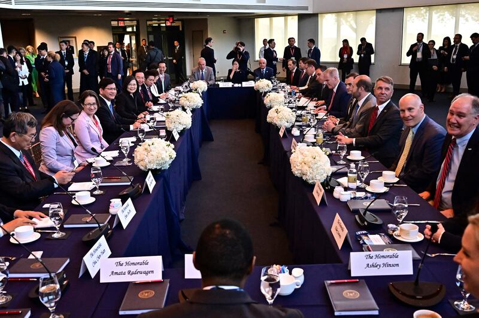
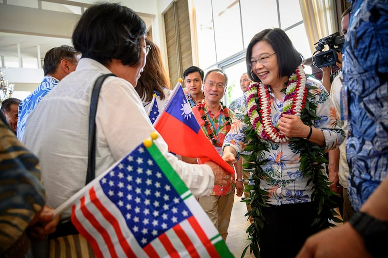
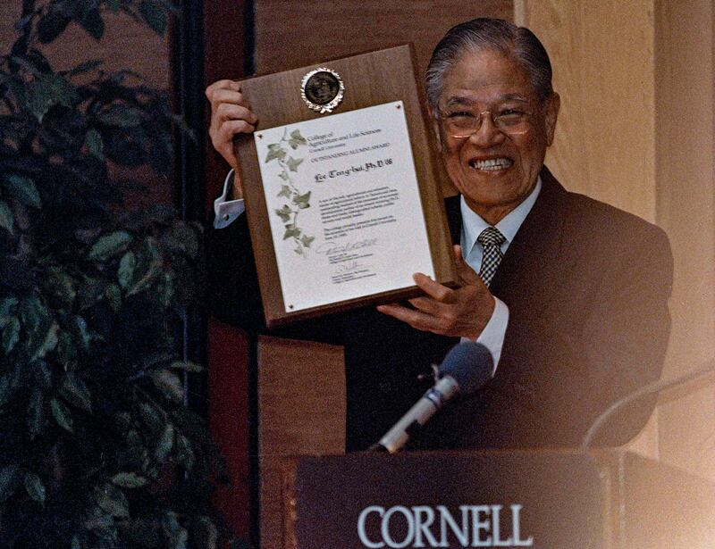
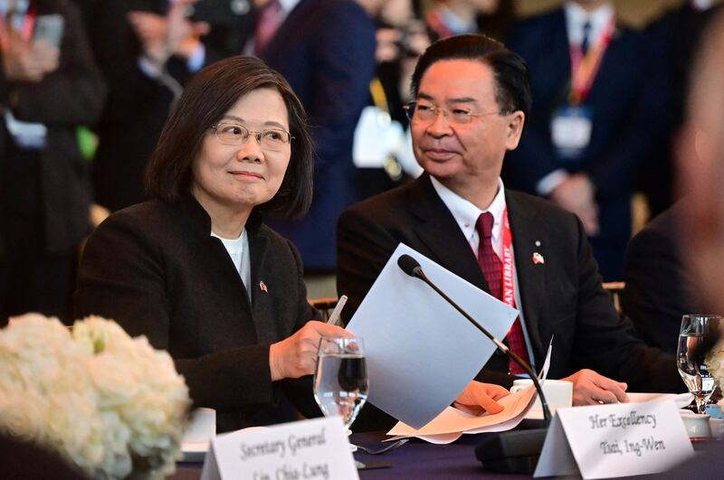

# Asia Fact Check Lab: Did Tsai’s McCarthy meeting violate the ‘One-China’ principle?

## Verdict: Misleading

Zheng Chongsheng

2023.04.07

## In Brief

Taiwanese President Tsai Ing-wen met with the Speaker of the U.S. House of Representatives Kevin McCarthy on April 5, setting a precedent for “transit diplomacy” by a Taiwanese head of state.

Three Chinese entities – its Foreign Ministry, its National People's Congress Foreign Affairs Committee and its embassy in Washington – soon issued statements that blasted the United States for violating the “one-China” principle and provisions outlined in three joint communiqués.

American officials responded by saying that the country's [one-China policy](https://www.rfa.org/english/news/china/asia-factcheck-1china-02152023125958.html) has not changed and  [transits through the United States by Taiwanese presidents are "nothing new.](https://youtu.be/J5YBw8GU2EY?t=961)"

Asia Fact Check Lab (AFCL) found that Beijing’s claims were untrue, and a misleading attempt to amplify Beijing’s own political narrative.

## In Depth

McCarthy led a bipartisan group of 17 lawmakers to meet with Tsai at the Reagan Library in California on May 5.

After the meeting, the two leaders [issued a statement](https://twitter.com/SpeakerMcCarthy/status/1643695964518227968?s=20) in which McCarthy emphasized that "the friendship between the people of Taiwan and America is a matter of profound importance to the free world and it is critical to maintain economic freedom, peace and regional stability."

US Speaker of the House Kevin McCarthy [6th R] speaks with Taiwan President Tsai Ing-wen [5th L] during a meeting at the Ronald Reagan Presidential Library in Simi Valley, California, on Wednesday, April 5, 2023. Credit: AFP

Tsai said that in the face of unprecedented challenges to peace and democracy, “the urgency of keeping the beacon of freedom shining cannot be understated.”

The public meeting with the speaker of the house on U.S. soil set a precedent for “transit diplomacy” conducted by a Taiwanese head of state.

McCarthy, who is third in line to the presidency, is viewed as an important political figure by Beijing. Tsai's meeting with him crossed “the first uncrossable red line” in Sino-U.S. relations. Soon after the meeting, the Chinese Foreign Ministry accused the United States of being in “serious violation of the one-China principle and the provisions of the three China-US joint communiqués.”

## Is there any provision in the China-US joint communiqués that prohibit Taiwan’s president from transiting through the U.S.?

No, there is not. No statement, provision or text in any of the three U.S.-China Communiqués, the Taiwan Relations Act or the Six Assurances prohibits such transit.

## Is Tsai the first Taiwanese president to transit through the U.S.?

No. All four of Taiwan’s presidents chosen through free and direct elections -- Lee Teng-hui, Chen Shui-bian, Ma Ying-jeou and Tsai – have transited through the United States.

Daniel Kritenbrink, former Assistant Secretary of State for East Asian and Pacific Affairs for the Department of State, [pointed out at a briefing on March 30th](https://www.youtube.com/live/kszyTROz00o?feature=share&t=1651) that Tsai herself has done so six times since taking office in 2016. "Such transits are undertaken out of the safety, comfort, convenience and dignity of the traveler," he said.

In this March 27, 2019, photo, Taiwanese President Tsai Ing-wen [R] is greeted by supporters upon arriving in Hawaii. Credit: Taiwan Presidential Office via AP

## Has China protested each Taiwanese presidents' transit through the U.S equally?

No, China has objected more strongly to some Taiwanese president’s transits than others, depending on their political party.

The late Kuomintang (KMT) President Lee Teng-hui established diplomatic precedent for such transits when he was allowed to pass through Hawaii in 1994 under the conditions that he was not to be granted a visa and would not stay overnight. Lee later refused to leave the plane he was on while it was refueling as a sign of protest against the unceremonious reception.

This aroused the sympathy of Congress, which intervened and later paved the way for Lee to officially make a “private visit” to his alma mater Cornell University the following year. China’s subsequent diplomatic uproar and live missile tests conducted in the Taiwan Straits pushed the United States to establish internal regulations for similar future incidents, with all subsequent Taiwanese presidents trips being labeled as “transits” and not “visits.”

Taiwan President Lee Teng-hui receives the Distinguished Alumni Award from the Cornell University College of Agriculture and Life Sciences during a breakfast banquet at the university at Ithaca, N.Y., in 1995. Credit: Associated Press

China ardently opposed the Democratic Progressive Party President Chen Shui-bian’s visit to New York City in 2003 to receive the International League for Human Rights’ annual Human Rights Award, mobilizing pro-Beijing factions of overseas Chinese in the U.S. to protest.

But its reaction was more restrained when KMT President Ma Ying-jeou delivered a closed-door speech at his alma mater Harvard University in 2015. A year later, China offered little protest even after Ma was confirmed to have spoken over the phone with then-Speaker of the House Paul Ryan while transiting through Los Angeles and was rumored to have spoken with then-Deputy Secretary of State Antony Blinken.

Tsai’s latest trip is the first time a Taiwanese president has publicly met with the speaker of the House on U.S. soil and the second time in the past year that Tsai has met with a speaker of the House, following Nancy Pelosi’s visit to Taiwan in 2022.

McCarthy's office confirmed and announced the meeting on its own initiative, and both Republican and Democrat legislators attended the event.

The meeting between Tsai and Mcarthy will likely lead to another serious confrontation in U.S.-China relations. Minister Xu Xueyuan, chargé d'affaires of the Chinese Embassy in the United States, [told international media](https://twitter.com/nickschifrin/status/1641175917077618693) that,"The so-called transit is merely a disguise to a true intention of seeking breakthrough and advocating Taiwan independence." In response to U.S. statements that Tsai's transit is not a visit and follows established precedent, Xu noted "past mistakes cannot be considered precedents. This will not lessen our response."

After the United States and China established diplomatic relations, Washington promised to maintain “unofficial relations” with Taiwan, noted Susan Thornton, former acting assistant secretary of state for East Asian and Pacific Affairs.

“This was not formally spelled out, but was exercised following diplomatic normalization in a series of conventions that were seriously enforced at the beginning and have been eroding ever since,” said Thornton. China worries that more lax enforcement by the U.S. will erode its one China principle, while the U.S. believes such looser regulations do not break its commitment to only maintain “unofficial relations” with Taiwan.

## Is Tsai’s meeting with Mcarthy an official visit?

It depends.

Thornton told AFCL that questions concerning the Tsai’s transit and subsequent meeting with McCarthy “are basically grey areas where the U.S. and China have different versions of the truth.”

The American government views the legislative branch and Congress as independent of the executive, and hence not “official,” Thornton said. “China views this as the number three person in the U.S. government per order of precedence (diplomatic protocol).”

[When asked about McCarthy's](https://www.youtube.com/live/kszyTROz00o?feature=share&t=2464) meeting with Tsai [,](https://www.youtube.com/live/kszyTROz00o?feature=share&t=2464) Kritenbrink stated, "Congress is an independent, co-equal branch of government" and noted that Tsai is not the first Taiwanese president to interact with members of the U.S. Congress while in transit. In an effort to reassure China, Kritenbrink repeatedly emphasized that the U.S. one-China policy has not changed, and that the U.S. still "does not support Taiwan independence."

Long-standing disagreements between Washington and Beijing concerning Taiwan boil down to [fundamental differences between China's one-China principle and the U.S. one-China policy](https://www.rfa.org/english/news/china/asia-factcheck-1china-02152023125958.html).

## Are Washington’s “one-China” policy and Beijing’s “one-China” principle in accord?

No, they are not. The United States and China have always been divided on the issue of Taiwan.

Beijing’s one-China principle is solely based on its interpretation of the three joint U.S.-China communiqués.

The U.S. one-China policy is also built on the subsequent Taiwan Relations Act and the Six Assurances to Taiwan, which Beijing does not recognize as legitimate.

While the United States accepts there is only one China and that the People's Republic of China is its sole legitimate government, Washington also acknowledges -- rather than accepts -- China's claims of sovereignty over Taiwan, [notes Evan Medeiros,](https://www.youtube.com/watch?v=r9dsAkxAGlI&t=79s) former senior director for Asia on the National Security Council under President Obama. According to McEwen, the U.S. believes that Taiwan's sovereignty is undetermined and remains intentionally ambiguous on the issue.

In response to the meeting between Tsai and McCarthy, China’s National People's Congress Foreign Affairs Committee noted that several documents of international law, including the Cairo Declaration and the Potsdam Proclamation, clarify China's sovereignty over Taiwan.

## Did the three joint Communiqués touch on the topic of Taiwan’s president transiting through the U.S.?

No they did not.

1. The 1972 Shanghai Communiqué

China reaffirmed its longstanding position that “the Taiwan question is the crucial question obstructing the normalization of relations between China and the United States; the Government of the People's Republic of China is the sole legal government of China; Taiwan is a province of China which has long been returned to the motherland; the liberation of Taiwan is China's internal affair in which no other country has the right to interfere; and all US forces and military installations must be withdrawn from Taiwan. The Chinese Government firmly opposes any activities which aim at the creation of ‘one China, one Taiwan’ ‘one China, two governments’ ‘two Chinas’ an ‘independent Taiwan’ or advocate that ‘the status of Taiwan remains to be determined’.”

Taiwanese President Tsai Ing-wen attends a bipartisan meeting with US Speaker of the House Kevin McCarthy, a California Repubican, at the Ronald Reagan Presidential Library in Simi Valley, California, on April 5, 2023. Credit: AFP

Washington responded that “The United States acknowledges that all Chinese on either side of the Taiwan Strait maintain there is but one China and that Taiwan is a part of China. The United States Government does not challenge that position. It reaffirms its interest in a peaceful settlement of the Taiwan question by the Chinese themselves. With this prospect in mind, it affirms the ultimate objective of the withdrawal of all US forces and military installations from Taiwan. In the meantime, it will progressively reduce its forces and military installations on Taiwan as the tension in the area diminishes.”

1. The 1978 Communiqué on the Establishment of Diplomatic Relations

Compared to the lengthy Shanghai Communiqué, the Joint Communiqué on the Establishment of Diplomatic Relations contains only eight terse points.

The second point states: “The United States of America recognizes the Government of the People's Republic of China as the sole legal Government of China. Within this context, the people of the United States will maintain cultural, commercial, and other unofficial relations with the people of Taiwan.”

The seventh states: “The Government of the United States of America acknowledges the Chinese position that there is but one China and Taiwan is part of China.”

1. The 1982 August 17 Communiqué

This is the only communiqué that focuses exclusively on Taiwan, specifically on the issue of American arms sales to Taiwan. In order to understand the U.S. position fully, it is necessary to compare the communiqué with the now declassified Six Assurances to Taiwan and the Reagan Memorandum, the details of which AFCL has [written about before](https://www.rfa.org/english/news/china/asia-factcheck-1china-02152023125958.html).

## Conclusion

AFCL found that Chinese accusations that the United States had committed “serious violation of the one-China principle and the provisions of the three China-US joint communiqués” to be false. There is no provision in the three U.S.-China Joint Communiqués that prohibits the president of Taiwan from transiting through the U.S. or meeting with the speaker of the House.

Beijing’s latest misinformation surrounding Tsai’s transit follows a long trend of tailoring its responses to examples of Taiwanese “transit diplomacy” based on the political party currently holding office in Taiwan. A review of history shows that Beijing favors mild reactions for transits by KMT officials while reserving more severe critiques for transits conducted by DPP officials.

[Original Source](https://www.rfa.org/english/news/afcl/fact-check-one-china-tsai-04072023140725.html)