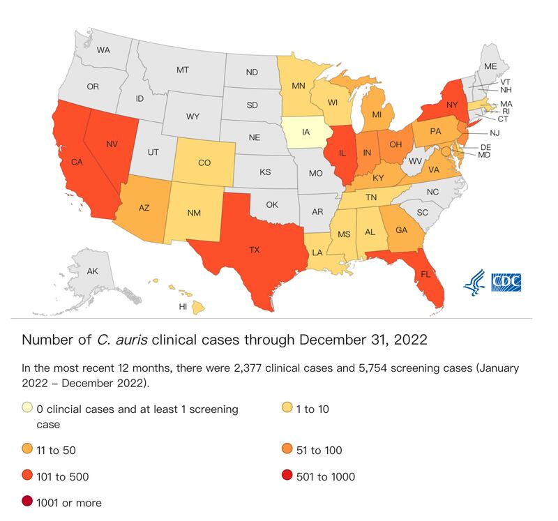

# Asia Fact Check Lab: Will patients infected by a fungus in the U.S. die in 90 days?

## Verdict: Misleading

Author: Dong Che

2023.04.09

## In Brief

[A short Weibo video](https://weibo.com/tv/show/1034:4882461772152899?from=old_pc_videoshow) produced by China Business Network (CBN) on March 21 reported on the alarming spread of a fatal fungal disease in the United States. Citing the U.S. Centers for Disease Control (CDC), the video said "nearly half of those infected with Candida auris will die within 90 days" and "an estimated 30 percent to 70 percent of infected hospitalized patients will ultimately die."

Asia Fact Check Lab (AFCL) found the statements by CBN to be misleading.

While the CDC has sounded the alarm about C. auris’s “rapid rise” and its resistance to antifungal medications, the CBN video cited CDC figures out of context and failed to mention that the fungus typically only infects specific populations, such as the very sick or those in healthcare facilities.

Experts said most patients who died had suffered from other ailments, making it difficult to ascertain if C. auris was the primary cause of death. In addition, studies to date have involved small numbers of cases and may not be representative.

## In Depth

On March 21, CBN produced a short video that ran on the popular Chinese social media site Weibo about C. auris in the United States, proclaiming that “#Candida auris has spread to more than half of the U.S. states.” Related posts with similar hashtags soon gathered more than 130 million views on Weibo alone, and about 100 Chinese media outlets posted related content.

Screenshot from the CBN video on Candida auris.

Accompanied by a chilling soundtrack and microscopic images of the fungus, the video noted that the pathogen has spread at an “alarming rate.” It quoted a Chinese medical expert as saying that the disease is highly contagious and has a high death rate, and the CDC as saying that “nearly half of those infected with Candida auris will die within 90 days.”

Discussion of the issue continued on Twitter, with some users mocking the United States for “once again spreading poison”—possibly referring to the spread of harmful ideas or to Beijing’s claim that the COVID-19 virus originated in the United States. Other Twitter users described C. auris as “the new American hitman.”

Data showing C. auris has spread to more than half of U.S. states. Screenshot from Weibo.

Did the CDC issue a warning about C. auris?

All the hoopla in China over the fungus appears to stem from a March 20 [news release](https://www.cdc.gov/media/releases/2023/p0320-cauris.html) issued by the CDC flagging the threat posed by the emerging Candida auris pathogen. The CDC, referencing one of its papers published in the *Annals of Internal Medicine*, noted the "alarming rate" of the disease's spread in healthcare facilities between 2020 and 2021.

The paper reported that the total number of clinical cases (cases where infection was present) tripled to 1,471 in 2021 from 476 in 2019, while that of screening cases (where the fungus was present but not causing infection) tripled in just one year to 4,401 in 2021. The CDC news release also referenced the pathogen’s increasing resistance to traditional treatments.

Other data cited in the CBN video also appear to have some basis in reports by the CDC and mainstream U.S. media. According to an official [CDC tracking chart](https://www.cdc.gov/fungal/candida-auris/tracking-c-auris.html), in the 12 months through December 2022, the United States had registered a cumulative 2,377 C. auris clinical cases across 27 states and the District of Columbia, with higher concentrations in California, Florida, Nevada, and New York. A recent  [*New York Times* article](https://www.nytimes.com/2023/03/20/health/candida-auris-us-fungus.html)reported that the fungus "is now in half the 50 states."

Both the CDC and the *Times* reports suggested that less attention to screening for C. auris during the Covid-19 pandemic may have contributed to the rising number of cases.

Screenshot of the tracking chart for C. auris cases from the CDC website.

How high is the mortality rate?

While the CBN video accurately echoed the CDC’s warning about an “alarming” spread of the C. auris fungus, it erroneously painted a more dire situation by failing to cite the data in proper context.

For example, the video's claim that "an estimated 30 percent to 70 percent of infected hospitalized patients will ultimately die" may have been based on a [CDC "General Information" sheet](https://www.cdc.gov/fungal/candida-auris/candida-auris-qanda.html) saying "30–60% of people with C. auris infections have died." Significantly, the video neglected to mention, per the information sheet, that these data were based on a limited number of patients, many of whom had other serious illnesses and were at a heightened risk of death.

The video also appeared to infer that these percentages apparently based on past death trends would continue into the future when it suggested that an estimated 30 percent to 70 percent "*will* ultimately die" (AFCL italics). The CDC data clearly referred to previous cases ("have died"), and the agency did not make any predictions about future mortality rates.

Likewise, the CBN video's claim that "nearly half of those infected with Candida auris will die within 90 days" may sound similar to the  [*Times article*](https://www.nytimes.com/2023/03/20/health/candida-auris-us-fungus.html)  observation that "nearly half of patients who contract C. auris die within 90 days." But by adding an extra character—"會"(meaning "will")—the video again turned a statistical observation into a forecast of future cases.

Both the CBN video and the *Times* article referenced the CDC in mentioning "90 days" but neither provided a specific citation. AFCL found a [CDC paper published in 2018](https://wwwnc.cdc.gov/eid/article/24/10/18-0649_article) that may have been the source of this number. That paper noted that 23 of 51 patients (45 percent) who were infected with C. auris in New York City between 2013 and 2017 "died within 90 days." Notably, the study was focused on cases in an "interconnected web of affected healthcare facilities, and all the infected patients had serious concurrent medical conditions.

Sample of the Candida fungus in a petri dish at a CDC lab in 2016. (Photo/AP)

Dr. Waleed Javaid, director of Infection Prevention and Control at Mount Sinai Medical Center in New York City, confirmed to AFCL that most patients with C. auris infections already have other medical conditions. As a result, “in many cases, it is difficult to determine whether Candida auris is the direct cause of death,” he said. He added that patients with implanted medical devices such as catheters are also at a much higher risk of fungal infection than the average healthy adult.

## Conclusion

The rapid spread of Candida auris cases is unquestionably concerning. However, AFCL found CBN’s claims about the disease’s high overall death rates to be misleading, given that the video used CDC data on past cases as a risk predictor for future case trends. The video also ignored the fact that most patients who died from the fungal infection had multiple other health issues that may have contributed to or hastened their death.

Indeed, the pathogen appears to [pose little threat to healthy adults](https://www.cdc.gov/media/releases/2023/p0320-cauris.html). And intensive efforts by some states to stop the fungus appear to have [successfully contained its spread](https://www.nytimes.com/2023/03/20/health/candida-auris-us-fungus.html)within their healthcare systems.

[Original Source](https://www.rfa.org/english/news/afcl/fact-check-fungus-04072023160034.html)