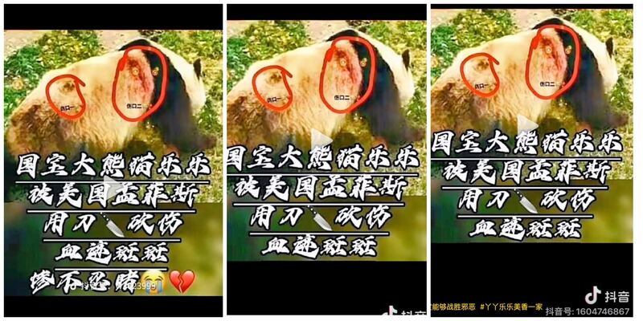
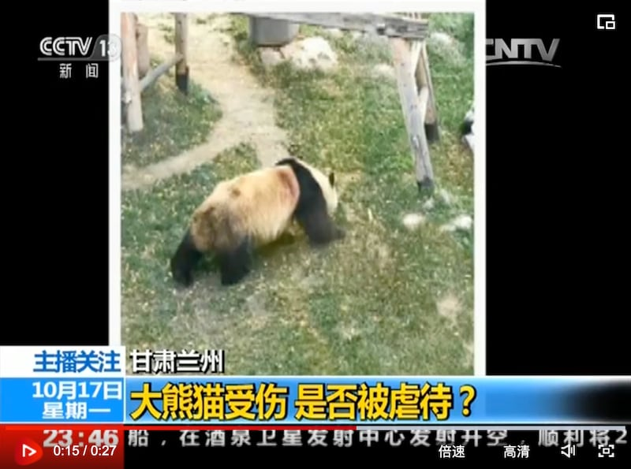
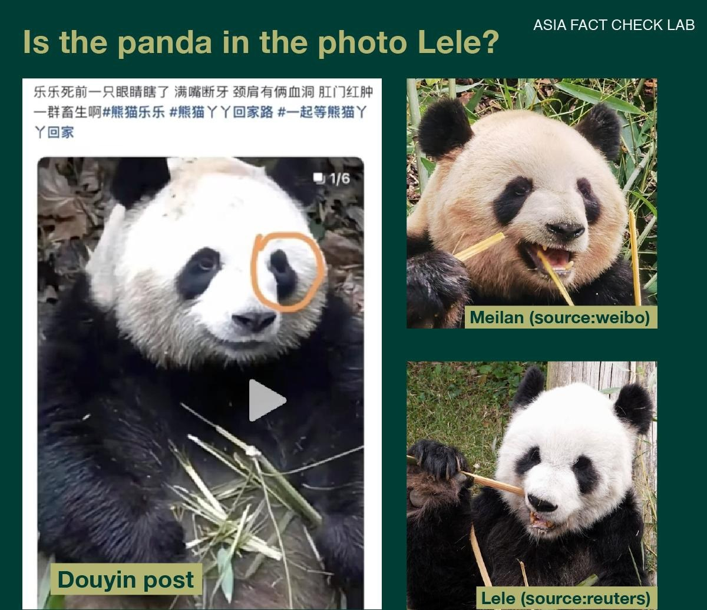
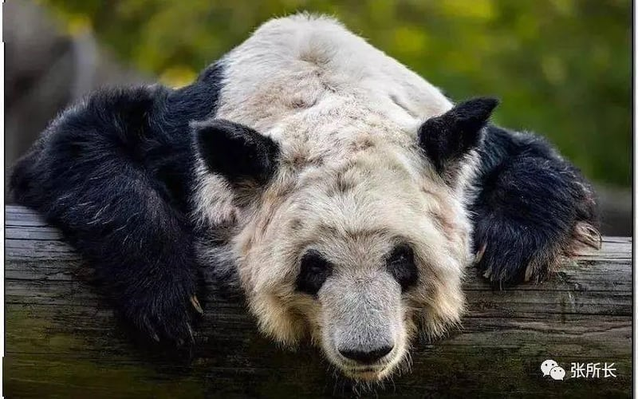

# Did Memphis Zoo officials hurt two pandas there?

## Verdict: False

By Dong Zhe & Shen Ke

2023.04.12

## In Brief

In 2003, China agreed to a 10-year loan of two pandas – a male named Le Le and a female named Ya Ya – to the Memphis Zoo. After being renewed for another 10 years in 2013, the Memphis Zoo announced in December 2022 that both pandas would be sent back to China in April 2023.

Le Le unexpectedly died on Feb. 1, 2023, arousing grief and rage from Chinese netizens. Claims soon arose that both pandas had been regularly mistreated and malnourished by the zoo, with some even going so far as to say that Le Le had been maimed before and after his death.

The surviving panda Ya Ya’s patchy, dry fur was also claimed to be a sign of mistreatment.

Asia Fact Check Lab (AFCL) found such claims to be false and lacking any credible sources to support them.

## In Depth

A recent picture on the Chinese social media platforms Douyin and Weibo appearing to show Le Le with a wound on his upper and lower backbone raised netizens' concerns over potential panda abuse. The accompanying caption read, “Bloodstains on our national treasure Lele, after being knifed by a Memphis Zoo [official] in the U.S.”

Several Douyin accounts posted photos claiming that Le Le was injured by Memphis Zoo personnel wielding a knife. (Screenshots retrieved from Weibo)

FabuLous, a popular science blogger on Weibo with over 616,000 fans, said [in a Weibo post](https://weibo.com/5835261195/MAGygpxJJ#repost) soon afterwards that the panda in the photo was actually [Shu Lan](https://pandanews.org/the-pandas/407_shu-lan.html), a female kept at the Lanzhou Zoo in China's Gansu province.

## Was Le Le knifed by a zookeeper?

After checking both claims, AFCL found allegations that Le Le had been knifed to be false. The panda in the photo is indeed Shu Lan.

AFCL first used the Chinese search engine Baidu to find the picture of the injured giant panda, and later using the photo tracker tool Tineye to trace where the original picture without captions came from. The photo first appeared on Oct. 18, 2016, long before the recent video accusing Lele's suspected abuse.

Tineye's search results also brought up a Weibo post from China's National Forestry Administration that allowed AFCL to confirm the panda’s identity as Shu Lan. The post revealed that the original photo was provided by a netizen about the suspected abuse of Shu Lan at the Lanzhou Zoo.

A subsequent search on Baidu using "Shu Lan" and "Lanzhou Zoo" as keywords showed that CCTV [covered the incident](https://tv.cctv.com/2016/10/18/VIDEY4jmGsVUOihetHUYTEfm161018.shtml) on Oct. 17, 2016.

## Was Lele's left eye gouged out and sold for $720,000?

Rumors that Lele's left eye was gouged out and sold for a whopping $720,000 also abounded on Douyin. Similar to the above claim regarding Le Le being knifed, these claims circulating on the Chinese internet were second-hand and unverified.

Douyin videos discussing whether Le Le's eye was gouged out and sold. (Screenshot taken from Douyin)

AFCL found two points of suspicion with such claims. The first is that the stated selling price of the eye varies from claim to claim, with some saying $720,000 and others $600,000. All such claims do not provide any independent, authoritative sources to support their conclusions. The second point is that there is no consensus at all on specifically which eye was gouged out. Some claim the right eye, some claim the left and some even claim both.

None of the joint reports issued by the  [China Zoological Society](http://www.cazg.org.cn/Home/GetPage?siteNodeId=db73ecf8-3586-4f19-b8a3-38670e37e758) and the Memphis Zoo have indicated that Le Le is missing an eye. Common sense would also dictate that the visitors at a zoo would notice a missing eye.

Several Chinese panda experts also worked with the Memphis Zoo to complete Lele's autopsy, determining that the initial cause of death to be a heart attack. No mention was made of gouged eyes.

FabuLous also responded to this rumor, claiming that the photo of the gouged eyes circulating on the Internet (the first from the left in the photo below) was in fact Meilan, a giant panda from Dujiangyan in China’s Sichuan province. Her seeming lack of an eye in the picture was caused by the camera angle overemphasizing the shade over the eye, FabuLous said.

## Is the panda in the photo Le Le?

After comparing the photo with other pictures of both Le Le and Meilan, AFCL found significant differences in head shape and black eye rings confirmed that the panda in the picture is certainly not Le Le. Owing to the lackluster camera angles however, it is difficult to state with complete confidence that the panda in the photo is Meilan. It’s possible that the photo is a composite of several different panda pictures cut and spliced together.

* P7*

The shape of both the panda’s head and black eyes ring are two features that distinguish it from Lele. Lele's head is oval with thin cheeks on both sides of his face. By contrast, the panda in the photo has a round and flat head with fat cheeks, similar to Meilan. Lele’s black eye rings are more symmetrical, while the right eye of the panda in the photo is rounder than its noticeably more sunken left eye, another point similar to Meilan.

## Is Ya Ya’s patchy skin a sign of abuse?

Various [videos](https://www.youtube.com/watch?v=ckJkiVbbzyI) and [comments](https://twitter.com/thinking_panda/status/1628461508899520512) by Chinese netizens have also claimed that Memphis Zoo officials mistreated Ya Ya, with one oft-cited piece of evidence for their claim being Ya Ya's often patchy fur. An article on the popular Chinese social media platform Weixin [noted that she looks](https://mp.weixin.qq.com/s/EkOJ8LlZ54jN_DdCwrcOsA) "thin and bony with dry hair, as if she's been abused."

Chinese netizens claim that Ya Ya looks “thin and bony with dry hair, as if she’s been abused.” (Photo from Weixin)

AFCL found that Ya Ya's patchy fur is the result of a chronic skin disease. Memphis Zoo acknowledges the condition, [stating on their website](https://www.memphiszoo.org/pandas) that, "the skin disease has genetic origins. As the panda gets older, hormonal fluctuations caused by changes of season can result in sparse and uneven fur."

Xie Zhong, vice president of the Chinese Association of Zoological Gardens (CAZG),  [repeated the same sentiment](https://global.chinadaily.com.cn/a/202301/05/WS63b5a51ea31057c47eba7b4e.html) in a story written by China Daily earlier this year, noting earlier in the article that Ya Ya had been "well cared for since being lent to the Memphis Zoo in 2003." CAZG is a non-profit Chinese organization tasked with overseeing animals in captivity within China, as well as Chinese animals loaned abroad.

At a Chinese Foreign Ministry press conference on April 11, spokesperson Wang Wenbin [noted in response to questions](https://www.fmprc.gov.cn/mfa_eng/xwfw_665399/s2510_665401/2511_665403/202304/t20230411_11057536.html) concerning Ya Ya's health that "the overall condition of the giant panda is relatively stable except for the fur condition caused by skin disease." Wang further noted that Chinese personnel from CAZG and the Beijing Zoo were working with the Memphis Zoo on taking care of Ya Ya during her final days in the United States.

## Conclusion

AFCL found claims that Memphis officials maimed or mistreated either Le Le or Ya Ya to be false. No credible reports show that either panda was abused during their time at the zoo.

The Memphis Zoo and its partner organization the Chinese Association of Zoological Gardens [released joint statements](https://www.memphiszoo.org/zoo-news/posts/memphis-zoo-and-cazg-release-joint-statement-on-giant-panda-care) [on their respective websites](http://www.cazg.org.cn/Home/GetArticleDetails?articleId=11725&siteNodeContentSourceId=43&nodeId=b3ba9aa4-ad9a-4b23-969a-da717933cfd9&rootNodeId=b3ba9aa4-ad9a-4b23-969a-da717933cfd9) last year which noted that, "CAZG is confident that the giant pandas at the Memphis Zoo are receiving the highest quality of care."

[Original Source](https://www.rfa.org/english/news/afcl/fact-check-pandas-04122023103132.html)