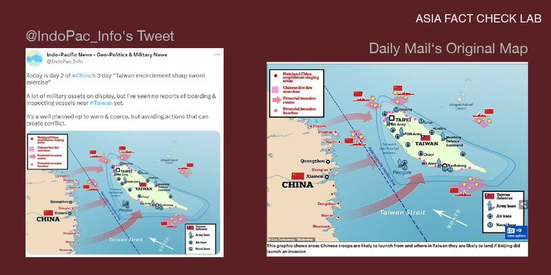
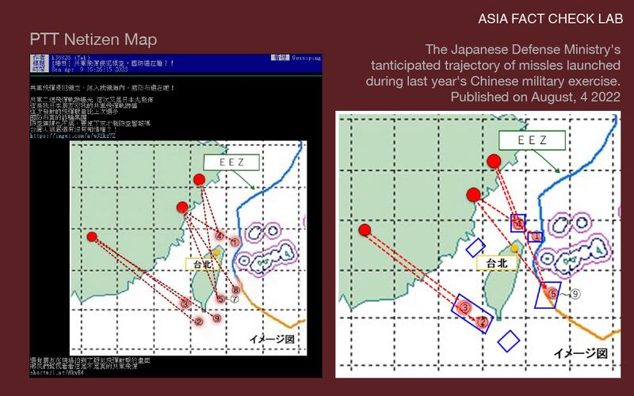
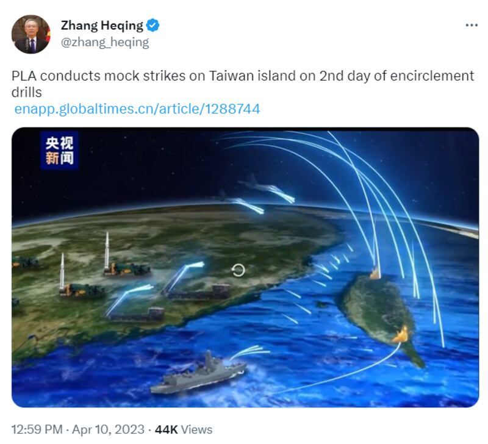

# Did the Chinese military launch missiles into Taiwan’s airspace?

## Social media frenzy over old maps and other distorted info spurred speculation that an invasion was imminent.

2023.04.18

## In Brief

The Chinese military held three days of exercises from April 8-10 near Taiwan in apparent response to Taiwanese President Tsai Ing-wen’s April 5 meeting with U.S. House Speaker Kevin McCarthy during her stop in the United States.

These war games, which Beijing described as a warning to pro-independence forces on Taiwan and their foreign allies, were accompanied by the spread of misinformation that exaggerated the extent of Chinese military actions and the degree of instability across the Taiwan Strait.

These claims fanned speculation on Chinese social media platforms that an invasion of Taiwan was imminent – claims that Asia Fact Check Lab found to be false.

## In Depth

On the morning of April 8, @IndoPac Info, a Twitter account with more than 117,000 followers, [cited Taiwan's Ministry of National Defense as saying](https://twitter.com/IndoPac_Info/status/1644682749146730496?cxt=HHwWgMDU8eKPi9MtAAAA) that 71 Chinese planes had crossed the [median line](https://www.reuters.com/world/asia-pacific/chinas-navy-begins-erase-imaginary-taiwan-strait-median-line-2022-08-25/) – an unofficial buffer line in the middle of the Taiwan Strait – as part of China's exercises aimed at "encircling" the island.

The post came at the start of the “United Sword” military exercises, which included flying bombers over the Taiwan Strait, firing shells from Chinese warships and practicing the enactment of a blockade of the island. China has never renounced the use of force to take back democratically-ruled Taiwan, which it views as part of its territory, and has routinely held drills in the Strait in apparent attempts to show it is ready to carry out those threats.

The war games came right after the April 5 meeting between Taiwanese President Tsai Ing-wen and U.S House Speaker Kevin McCarthy in California.

The April 8 tweet, written in English, included a map that purportedly showed Chinese forces encircling Taiwan, with warship icons surrounding the island on the north, east and south.

Red and yellow dots marked amphibious staging areas on the island and live-fire exercise areas in nearby waters, respectively; red arrows tracked potential invasion routes. More Twitter users, including several with verified accounts, reposted the map and repeated that Taiwan was encircled by People’s Liberation Army, or PLA, forces.

The map soon spread across Chinese-language platforms. For example, one [netizen posted a copy](https://weibo.com/6053278987/MB7MEyecp) on Weibo, with the comment that "Taiwan's army announces that it will fire on those who cross the middle line [of the Taiwan Strait]. [Chinese forces have] not only surpassed, but already surrounded."

## Who created the map?

AFCL found that the map tweeted by @IndoPac\_Info was [originally published by](https://www.dailymail.co.uk/debate/article-11080927/SAMUEL-CRANNY-EVANS-China-STARVE-Taiwan-submission-carry-amphibious-assault.html) the U.K.'s *Daily Mail* in August 2022, as part of a report on Chinese drills conducted around Taiwan following then-House Speaker Nancy Pelosi's visit to the island. The accompanying caption explained that the map showed areas where Chinese troops were *likely* to land *if* Beijing were to invade Taiwan.

The difference between @IndoPac\_Info’s tweet (left) and the original Daily Mail photo (right) is that the latter clearly notes: “This graphic shows areas Chinese troops are likely to launch from and where in Taiwan they are likely to land if Beijing did launch an invasion.”

But @IndoPac\_Info cut out the caption, along with the name of the designer and “Mailonline” from the map’s lower left corner. This use of the map out of context, together with the post’s urgent tone, contributed to an impression that the actions on the map were taking place then.

On April 9, U.S. cybersecurity expert Jackie Singh [wrote](https://www.hackingbutlegal.com/us-based-disinfo-actors-spread-fear-about-taiwan/) a post how the, claiming that @IndoPac\_Info and other Twitter accounts posting similar messages (termed super-spreaders by Singh) were acting in a coordinated effort aimed to spread fear that a Chinese invasion of Taiwan was imminent.

Singh noted that the superspreader tweets shared some similarities: close timing of postings, use of phrases such as “fully encircled” or “completely encircled” and of other alarmist language about the military exercises; assignment of blame directly or indirectly to U.S. President Joe Biden or Nancy Pelosi for the Chinese drills; and claims by the user to be in Taiwan or to know Taiwanese who were “afraid.”

Lev Nachman, an assistant professor at the National Chengchi University in Taipei, also sought to [dispel the misinformation](https://twitter.com/lnachman32/status/1644949007956082689), noting that the *Daily Mail* map was an "old image" that did not represent the current military exercises.

## Was Taiwan planning to fire on any Chinese vessels that crossed the center line?

Taiwan's Minister of National Defense Chiu Kuo-cheng [said during a question-and-answer session](https://ivod.ly.gov.tw/Play/Clip/1M/144957) at the legislature on April 6 that Taiwan continues to maintain the integrity of the median, or center, line. Chiu noted that despite China's efforts to blur the center line last year, Taiwan would continue to "resist" and "evict" any Chinese military aircraft and warships that cross the line.

[Chiu also clarified](https://www.cna.com.tw/news/aipl/202303060278.aspx) that Taiwanese forces would only open fire on enemy ships that breach Taiwan's territorial space. This space begins 12 nautical miles (22.2 km) from Taiwan's coast, which is much closer in than the center line, located 24 nautical miles (44.4 kilometers) from Taiwan's coast at the narrowest point.

In fact, during the recent round of Chinese drills, [dozens of PLA aircraft were reported to have crossed](https://chinapower.csis.org/tracking-chinas-april-2023-military-exercises-around-taiwan/) the center line, and about 20 ships from the Chinese and Taiwanese militaries to have engaged [in a standoff](https://www.reuters.com/world/us-says-it-is-monitoring-chinas-drills-around-taiwan-closely-2023-04-08/) near the center line—but without resulting in any serious confrontations.

## Did Chinese missiles violate Taiwanese airspace?

A day after the misleading reports broke on Twitter, another post entitled ["The CCP military's missiles violated [Taiwan's] airspace, yet the Ministry of National Defense is still sleeping?!"](https://disp.cc/b/Gossiping/fYuj) appeared on the Taiwanese Internet forum PTT.

The author of the post claimed that the information about a Chinese missile launch had first been released in Japan, and that a Japanese friend had provided the trajectory map of the missiles to the author. “Are you going to wait until [the missiles] fall to issue an air defense alarm?” the post asked. “The Ministry of National Defense is really running a fraud syndicate.”

Compare the altered PTT chart (left) with the chart published by the Japanese Defense Ministry on August 4, 2022 (right), which detailed the presumed trajectory of missiles launched by China during its military exercises last year.

AFCL found through an online search that the map appeared to be an altered version of one [released by the Japanese Ministry of Defense in August 2022](https://www.mod.go.jp/j/press/news/2022/08/04d.html?s=cl&fbclid=IwAR1TxEAn4pW-PdG7WXQ9pfESDeSbwjBM2PjjvmEbTUImJU7j4O61J7vi6wo). That map was part of a ministry report about a series of missile launches by Beijing on Aug. 4 last year in response to U.S. Speaker Pelosi's visit to Taiwan. [Tokyo protested](https://www.reuters.com/world/asia-pacific/japan-protests-after-chinese-missiles-land-its-exclusive-economic-zone-2022-08-04/) at the time that five of the missiles had landed in its exclusive economic zone.

[During April's wargames](https://www.reuters.com/world/us-says-it-is-monitoring-chinas-drills-around-taiwan-closely-2023-04-08/), a Chinese amphibious landing ship fired missiles near Taiwan's Matsu Island, and multiple PLA units carried out *simulated* joint precision strikes against specific targets on Taiwan and nearby waters—the first time China is believed to have carried out such an exercise. But unlike last August, there were no media or government reports of missiles encroaching on Taiwan airspace.

Many Taiwanese netizens questioned the credibility of the PTT post, with some attaching the original Japanese map and asking "why are the landing points on this map similar to the last?" The PTT board administrator quickly labeled the post as " [pending verification](https://www.ptt.cc/bbs/Gossiping/M.1681029882.A.FD2.html)" due to a lack of credible sources to verify its claims, the similarity between the two maps, and the fact that the account was only recently activated.

Taiwan's Ministry of National Defense subsequently issued [a news release](https://www.mnd.gov.tw/Publish.aspx?p=81315&title=%e5%9c%8b%e9%98%b2%e6%b6%88%e6%81%af&SelectStyle=%e6%96%b0%e8%81%9e%e7%a8%bf) confirming that the PTT post was "fake news."

## Was China behind the misinformation campaign?

Identifying which, if any, state actor or actors are behind an online misinformation campaign is challenging, if not impossible, and this recent case is no exception.

Singh, the cybersecurity expert, noted that the original English-language tweeter @IndoPac\_Info [is self-described as "anti-China"](https://www.hackingbutlegal.com/us-based-disinfo-actors-spread-fear-about-taiwan/) with a bio that uses the term "multipolarity." That term, which originated with Russian philosopher Aleksandr Dugin, is "strongly suggestive of Russian influence," according to Singh.

Addressing the PTT post on missiles, Taiwan’s defense ministry said it did not rule out that the post could be part of the enemy’s “combat tactics” aimed at “deliberately undermining the public’s support of and confidence in the military”—a potential reference to China.

Chinese authorities did release a number of official videos and images during the drills that apparently sought to convey a message of threat and intimidation. On April 9, China Central Television, or CCTV, [released a 10-second animation](https://www.youtube.com/watch?v=BCE4QsM-66Y) of a simulated joint precision strike against Taiwan by the PLA Eastern Theater Command, showing multiple missiles hitting the island and surrounding waters. The same day, the Chinese state-run *Global Times* ran an [article about the PLA's "encirclement drills"](https://enapp.globaltimes.cn/article/1288744) along with a screenshot from the video; [Pakistan-based Chinese diplomat Zhang Heqing](https://twitter.com/zhang_heqing/status/1645290443972956161?cxt=HHwWgsDSlaK8n9UtAAAA) then tweeted the same screenshot along with a link to the article.

CCTV released an animated video of a missile attack on Taiwan. Zhang Heping, a Chinese diplomat based in Pakistan, tweeted a screenshot from the video showing explosions in the north and south of Taiwan . [Photo from Zhang Heqing's Twitter account]

## Conclusion

AFCL found that while Chinese wargames targeting Taiwan had involved blockade simulations and live fire exercises, there was no evidence that Chinese forces had launched missiles into its airspace as part of the drills or that an invasion of Taiwan was ever imminent.

In this case, cybersecurity experts, political scientists and government agencies helped to combat the spread of such coordinated misinformation. Even so, the tweets and retweets of the altered maps still accumulated millions of views and magnified fears at a time of heightened tension across the Taiwan Strait.

As many of the misleading Twitter posts on the Chinese military exercises have yet to be removed or modified, AFCL reminds readers to always approach any alarmist reports on current events with a questioning, critical eye.

## *Translated by Shen Ke. Edited by Malcolm Foster.*

[Original Source](https://www.rfa.org/english/news/afcl/fact-check-taiwan-invasion-04182023144115.html)