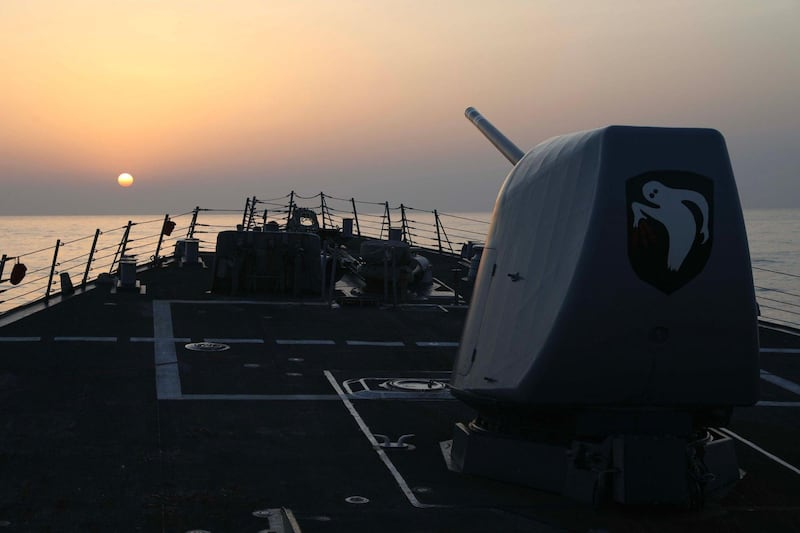
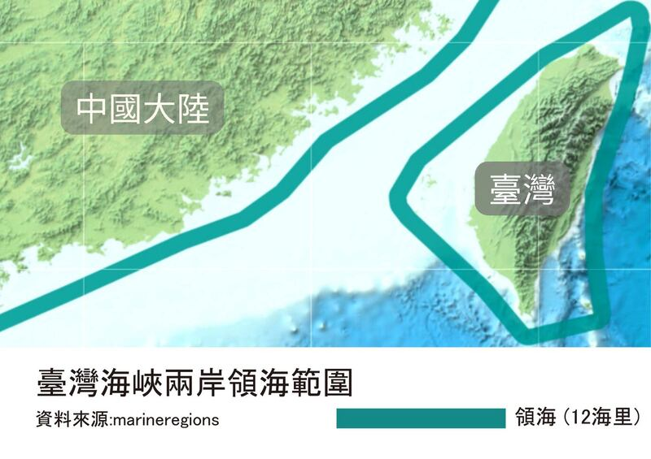
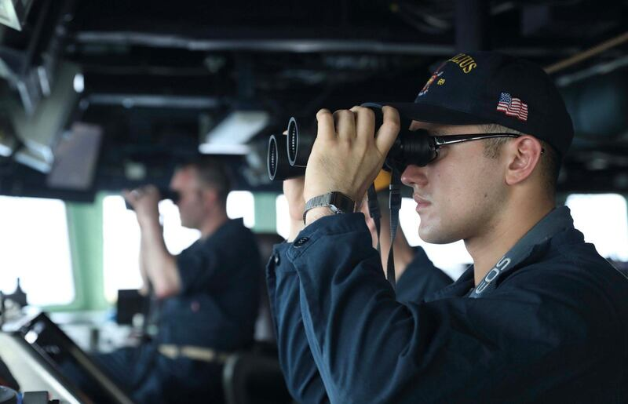

# Is the Taiwan Strait open to international vessels under international law?

## Verdict: True

By Li Tong

2023.04.20

## In Brief

On April 16, the guided-missile destroyer USS Milius sailed through the Taiwan Strait, [sparking an outcry](https://www.mfa.gov.cn/web/wjdt_674879/fyrbt_674889/202304/t20230417_11060477.shtml) from mainland China and the [People's Liberation Army](http://cn.chinadaily.com.cn/a/202304/17/WS643cd376a3105379893701df.html).

[The U.S. military, however, said](https://www.c7f.navy.mil/Media/News/Display/Article/3356493/7th-fleet-destroyer-conducts-freedom-of-navigation-operation-in-south-china-sea/) the move was "consistent with international law," and that the Milius had "asserted navigational rights and freedoms" in order to uphold "the rights, freedoms, and lawful uses of the sea."

China's [Ministry of Foreign Affairs has in the past stated](https://www.fmprc.gov.cn/fyrbt_673021/jzhsl_673025/202206/t20220613_10702387.shtml) that international law does not employ the term "international waters," and that China opposes the use of such terms "to manipulate issues related to Taiwan while threatening China's sovereignty and security."

Asia Fact Check Lab (AFCL) found China’s statements to be misleading. The United Nations has applicable agreements that clearly define “international waters” and under which international ships and planes are allowed to freely pass through parts of the Taiwan Strait that lie outside a 24-nautical mile zone from any coastline.

The USS Milius passing through the Taiwan Strait. (Photo from U.S. 7th Fleet website)

## In Depth

The U.S. Navy's Seventh Fleet issued a statement after the USS Milius passed through the Taiwan Strait, saying that the ship had “asserted navigational rights and freedoms in the South China Sea near the Spratly Islands, consistent with international law,” and noting that the area the Milus passed through “lies outside the territorial waters of any coastal state.”

China's military spokesman Sr. Col. Shi Yi criticized the United States for "openly publicizing" the USS Milius' actions, [stating](https://weibo.com/u/7483054836): "The PLA's Eastern Theater has organized troops to closely monitor the course of the U.S. ship" and that its forces wer "on constant high alert to defend China's sovereignty, national security and regional peace."

MFA spokesman Wang Wenbin said at a press conference on April 17 that [the U.S.](https://www.fmprc.gov.cn/fyrbt_673021/jzhsl_673025/202304/t20230417_11060477.shtml) decision to send the Milius through the strait was a show of force that threatened China's security and undermined regional stability.

Wang responded to similar American claims regarding freedom of navigation and overflight on the high seas at a [press conference](https://www.fmprc.gov.cn/eng/xwfw_665399/s2510_665401/2511_665403/202206/t20220613_10702460.html) in June 2022 by emphasizing that all of the Taiwan Strait was under China's jurisdiction.

Wang said at the time that according to the United Nations Convention on the Law of the Sea (UNCLOS) and Chinese laws, “the waters of the Taiwan Strait, extending from both shores toward the middle of the strait, are divided into several zones including internal waters, territorial sea, contiguous zone, and the Exclusive Economic Zone. China has sovereignty, sovereign rights and jurisdiction over the Taiwan Strait…”

“There is no legal basis of ‘international waters’ in the international law of the sea. It is a false claim when certain countries call the Taiwan Strait ‘international waters’ in order to find a pretext for manipulating issues related to Taiwan and threatening China’s sovereignty and security.”

## Is there an agreed upon definition of “international waters”?

Yes. The United Nations Convention on the Law of the Sea [is an international agreement on maritime law](https://www.imo.org/en/ourwork/legal/pages/unitednationsconventiononthelawofthesea.aspx), which stipulates that every country's "territorial waters" extend 12 nautical miles from their respective coasts. In these waters, a country enjoys full jurisdiction.

A further 12 nautical miles beyond that is considered a “contiguous zone,” where they reserve the right to prevent and punish infringement of domestic laws.

Both zones are open to ships simply seeking to pass through on their way to other destinations, claiming so-called “innocent passage,” and both are closed to any vessel which threatens the security and interests of the respective nation.

Beyond the 24 contiguous nautical miles, UNESCO allows for a country to claim an exclusive economic zone (EEZ) of up to 200 nautical miles (370 kms) from its coastline. Within the EEZ, [a country has](https://www.un.org/depts/los/convention_agreements/texts/unclos/unclos_e.pdf) "sovereign rights for the purpose of exploring and exploiting, conserving and managing the natural resources."

Song Chengen, a Taiwanese international scholar of law, [notes that](https://www.pourquoi.tw/2022/07/13/china-is-invading-taiwan/) the phrase "international waters" carries a precise legal meaning in disputes concerning navigation rights and territorial jurisdiction, referring to all waters not designated as territorial. Because countries cannot limit freedom of navigation or overflight within the EEZ, this zone is therefore international waters.

Diagram of Mainland China and Taiwan’s territorial waters in the Taiwan Strait. (Produced by AFCL.)

## Is part of the strait considered international waters under UNCLOS?

Yes. The Taiwan Strait is about 220 nautical miles (410 km) at its widest and 70 nautical miles (130 km) at its narrowest points. Even accounting for China’s and Taiwan’s separate claims of territorial waters and contiguous zones, a wide strip of water still lies outside each claimants’ allotted space. Therefore, terming this strip freely navigable international waters stands in line with the U.N. convention.

## Under UNCLOS, could China block international ships from passing through the strip of international water in the strait?

No, it could not.

[Article 58 of UNCLOS](https://www.un.org/depts/los/convention_agreements/texts/unclos/unclos_e.pdf) explicitly permits other countries to enjoy the right of free navigation and overflight within the EEZ. Song Chengen notes that while a country enjoys economic privileges in an EEZ within its jurisdiction, the country cannot interfere with the free passage of ships through the zone itself.

Lin Ting-hui, deputy secretary-general of the Taiwan Institute of International Law, [said that](https://news.ltn.com.tw/news/politics/breakingnews/4014805) China's claim need not solely rely on an interpretation of the U.N. convention.

## Do the United States and Taiwan adhere to definitions of international water similar to UNCLOS?

Yes. While never endorsing the United Nations Convention on the Law of the Sea, U.S. law defines territorial waters and contiguous waters in a manner consistent with the UN Convention.

The U.S. Navy and Marines abide by the domestically issued *Handbook for American Commander's Movement on the Seas,* first issued in 1900 and last revised in 2022. Similar to the UN Convention, the latest revision of the *Handbook* maintains that all waters outside 24 nautical miles of a country's coastline are freely navigable international waters. The report then specifically mentions the Sōya, Ōsumi, Miyako and Taiwan straits as open to international traffic.

In June 2022, [while responding to media inquiries about the Taiwan Strait's exact legal status](https://www.reuters.com/world/china/us-rebuffs-china-by-calling-taiwan-strait-an-international-waterway-2022-06-15/), State Department spokesperson Ned Price said, "The Taiwan Strait is an international waterway, meaning that the Taiwan Strait is an area where high-seas freedoms, including freedom of navigation and overflight, are guaranteed under international law."

Taiwan also [shares a similar definition](https://www.pf.org.tw/tw/pfch/12-9541.html) of international waters, with its National Academy for Educational Research – the country's official source for technical terminology – [defining "international waters](https://terms.naer.edu.tw/detail/6b7766b62190052331d86d74a21f3a6e/?startswith=zh)" as "any waters which abide by the principle of open seas, for example: contiguous zones, exclusive economic zones or open seas." The term is widely used ranging across such fields as shipbuilding, geography, machinery and maritime shipping.

Crew on the USS Milius passing through the Taiwan Strait. (Photo from U.S. 7th Fleet website)

## Conclusion

AFCL found that regardless of whether one views the Mainland and Taiwan as independent political entities or as a single sovereign state, international maritime law dictates that the strait is wide enough to be used freely by all international vessels and aircrafts.

## *Translated by Shen Ke. Edited by Malcolm Foster.*

*Asia Fact Check Lab (AFCL) is a new branch of RFA established to counter disinformation in today’s complex media environment. Our journalists publish both daily and special reports that aim to sharpen and deepen our readers’ understanding of public issues.*

[Original Source](https://www.rfa.org/english/news/afcl/fact-check-taiwan-strait-04202023105536.html)