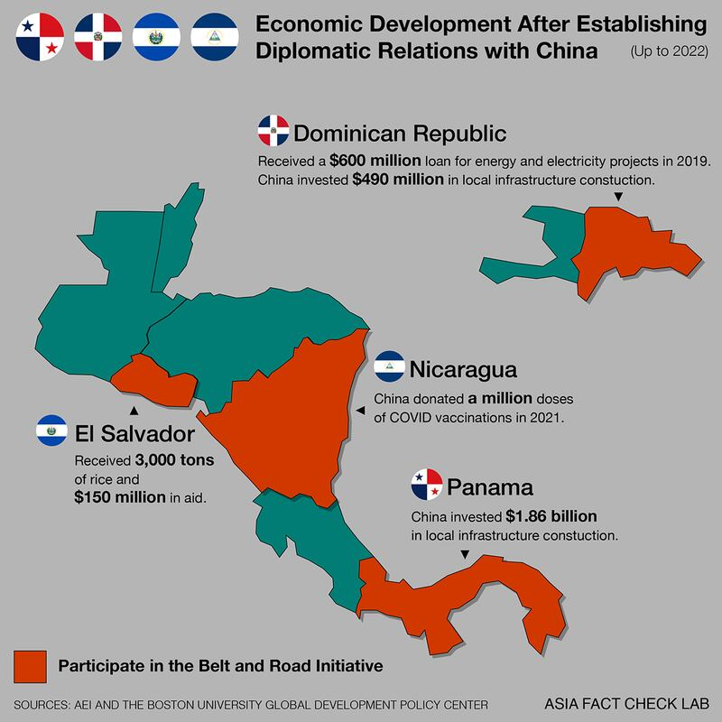

# Is China engaged in dollar diplomacy?

## Beijing has used promises of aid and investment to get countries to switch recognition from Taiwan

By Rita Cheng and Shen Ke

2023.05.01

## In Brief

After Honduras severed official ties with Taiwan last month and established diplomatic relations with the People's Republic of China, or PRC, [Taiwanese President Tsai Ing-wen](https://www.youtube.com/watch?v=IPbvBsqwnxE) promised that the island would not engage in "a meaningless contest of dollar diplomacy."

The next day, [Chinese Foreign Ministry Spokesperson Mao Ning](https://www.reuters.com/world/china/china-says-diplomatic-deal-with-honduras-political-decision-without-conditions-2023-03-27/) refuted Tsai's implication that Beijing was buying official recognition, saying China's "diplomatic ties are not something for sale."

Asia Fact Check Lab (AFCL) found that mainland China has offered an array of incentives, from grants and investments to construction project support, to countries that switch official recognition from Taipei to Beijing.

## In Depth

Honduras' decision to establish ties with China on March 26 [followed months](https://www.taipeitimes.com/News/taiwan/archives/2023/01/19/2003792854) of speculation that the central American country was considering such a move, and leaves Taiwan with only 12 countries plus the Holy See in Rome that recognize its sovereignty.

[According to Reuters](https://www.reuters.com/world/honduras-demanded-25-bln-taiwan-aid-before-china-announcement-source-2023-03-22/) and [Taiwan's official Central News Agency](https://www.cna.com.tw/news/aipl/202303260040.aspx), Honduras had asked Taiwan for $2.5 billion in financial aid before turning to China. Honduras' foreign minister said, however, that his country had asked for "a negotiated refinancing mechanism" to relieve debt pressures.

Mao, the foreign ministry spokesman, [described](https://www.fmprc.gov.cn/eng/xwfw_665399/s2510_665401/2511_665403/202303/t20230327_11049837.html) Honduras' recognition of Beijing as a "political decision" that was "based on no preconditions." She said Panama, Dominica, El Salvador, Nicaragua and other countries had also established or restored ties with China without preconditions.

Both Taipei and Beijing have claimed to be the sole ruler of China since the Nationalists were defeated by the Communists in a civil war and fled to Taiwan in 1949. Beijing has made a priority of isolating Taiwan, which calls itself the Republic of China, although over the years, both sides have leveraged economic aid as a strategy for building and maintaining alliances with developing countries, a  [practice](https://www.britannica.com/event/Dollar-Diplomacy) known as dollar or pocketbook diplomacy.

## Does China give cash to countries that drop recognition of Taiwan?

China’s government is typically averse to giving aid in the form of cash to any country, but one exception is when it is seeking to win over governments that recognize Taipei, said Johns Hopkins University Professor Deborah Brautigam.

Beijing’s use of incentives is often influenced by Taiwanese domestic politics, Brautigam told AFCL. Dollar diplomacy has increased during times when the Democratic Progressive Party, or DPP – Tsai’s party, which favors a more independent Taiwan – is in power. And it declines when the Kuomintang, or KMT, which favors closer ties with the mainland, is in power, she said.

In her book, “The Dragon’s Gift: The Real Story of China in Africa,” Brautigam refers to Costa Rica’s decision to establish relations with Beijing in 2007. Their agreement included a pledge by China to provide a cash grant of $30 million and a $100 million grant in the form of turnkey projects, or projects that are completed by Chinese companies and turned over to the country when ready to use.

## Does China give more aid to countries that drop relations with Taiwan?

In recent years, El Salvador, São Tomé and Príncipe, Gambia, the Dominican Republic, Panama, Kiribati, and the Solomon Islands have all switched recognition from Taipei to Beijing.

There is “very clear evidence that the PRC uses aid to implement the ‘One China policy,’” said Brad Parks, executive director of AidData research lab at the College of William and Mary, and a co-author of “Banking on Beijing: The Aims and Impacts of China’s Overseas Development Program”

In contrast, “those countries that recognize Taiwan are automatically ineligible for PRC aid,” Parks wrote in an email. “More specifically, we find that countries that do not recognize Taiwan receive 1.6 additional Chinese development projects per year, on average.”

## Has China invested in Latin American and Caribbean countries that drop relations with Taiwan?

Many countries that have switched recognition to Beijing over the last decade are from Latin America or in the Caribbean, and seven of Taiwan’s remaining diplomatic allies are located in the region.

China has extended a large amount of loans to countries in that region. [According to Boston University Global Development Policy Center data](https://www.bu.edu/gdp/2023/03/21/at-a-crossroads-chinese-development-finance-to-latin-america-and-the-caribbean-2022/), the two main Chinese financial institutions that invest in foreign development, the China Development Bank and the Export-Import Bank of China, had disbursed a cumulative $136 billion in loans to countries in the region as of 2022.

China has also used its [Belt and Road Initiative](https://www.cfr.org/backgrounder/chinas-massive-belt-and-road-initiative) as a way to entice countries in the region. It originally established the ambitious infrastructure program in 2013 as a way to link East Asia and Europe. Under the program, which now includes 147 countries, China offers to help build roads, ports, and other infrastructure, through investments, loans, grants, and other assistance.

As one [Taiwanese diplomat in Latin America said](https://www.ft.com/content/9954b9dc-5a30-41ea-9225-b733cae3d0df) of countries in the region: "What they really want is not more aid but trade and investment."

Several Latin American and Caribbean countries have joined the Belt and Road Initiative, led by [Panama](https://www.yidaiyilu.gov.cn/xwzx/gnxw/35763.htm)after it established official ties with China in 2017. It was followed by the Dominican Republic, El Salvador, and Nicaragua. To date, no country that recognizes Taiwan is a member of the initiative.

## What specific support has China given to Latin American and Caribbean countries that switched recognition?

AFCL compiled publicly available data on China’s support for four such countries that established diplomatic relations with Beijing after 2016. All have seen a marked increase in Chinese investments in local infrastructure, as well as in bilateral trade.

**Panama:** Since Panama recognized the PRC in June 2017, Chinese construction and investment in the country has climbed to [an estimated U.S.$1.86 billion](https://www.aei.org/china-global-investment-tracker/), according to American Enterprise Institute calculations. In addition, [leaked text conversations](https://diario.elmundo.sv/El%20Mundo/china-pago-143-millones-a-expresidente-de-panama-para-romper-relaciones-con-taiwan) involving then-President Juan Carlos Varela suggest that China would have paid $143 million as a donation in exchange for Panama's diplomatic switch, although it was unclear whether that payment ultimately took place.

Sino-Panama trade has also surged, rising from $6.4 billion in 2016, the last full year before the two sides set up official ties, to $9.8 billion in 2021, the last full year for which data were available, [according to OEC figures.](https://oec.world/en/profile/bilateral-country/chn/partner/pan)

**Dominican Republic** **:** After the Dominican Republic switched diplomatic recognition to Beijing in May 2018, China put $490 million toward local construction projects, [American Enterprise Institute data show](https://www.aei.org/china-global-investment-tracker/).

China [reportedly offered](https://www.thedialogue.org/analysis/is-the-dominican-republics-pivot-to-china-paying-off/) the Caribbean nation a $3 billion package in exchange for diplomatic recognition, including a [$600 million loan](https://www.thedialogue.org/map_list/)to upgrade its power infrastructure. In 2021, the two countries [signed an economic and technical cooperation agreement](https://acento.com.do/actualidad/china-dona-us-30-millones-a-republica-dominicana-8926233.html) and China donated $30.7 million to finance future projects.

In terms of trade, Zhang Run, China's ambassador to the Dominican Republic, said that in four years, ["the volume of bilateral trade has increased](https://revistacontactord.com/zhang-run-embajador-de-china-en-rd-china-rd-4-anos-despues/) by 90 percent, with an average annual growth of 25.41 percent."

**El Salvador:**After the Central American nation established diplomatic relations with China in August 2018, the latter gifted El Salvador more than [3,000 tons of rice](https://dialogochino.net/en/trade-investment/22556-what-next-for-china-and-el-salvador/) and pledged [to give $150 million](https://www.reuters.com/article/us-elsalvador-china-idUSKCN1ND0IT) in aid for social and technological projects. During a state visit to China by El Salvador's new president Nayib Bukele, the two sides signed a series of MOUs, with China pledging [$500 million in development projects](https://www.bbc.com/mundo/noticias-america-latina-50666592), including a  [sports stadium and water treatment plants.](https://www.thedialogue.org/analysis/is-china-going-to-help-el-salvador-develop-faster/)

The Chinese government also invited El Salvador to participate in its [Belt and Road Initiative](https://news.cgtn.com/news/2019-12-03/Xi-holds-welcome-ceremony-for-visiting-Salvadoran-president-M7Jd05efCM/index.html).

**Nicaragua:** Immediately after Central America's largest country established relations with China in 2021, Beijing [pledged to donate 1 million doses of COVID vaccine to Nicaragua](https://www.globaltimes.cn/page/202112/1241334.shtml). [Bilateral trade](http://mds.mofcom.gov.cn/article/Nocategory/201905/20190502868652.shtml) jumped 62 percent to $820 million in 2021 from 2020, according to MOFCOM.

## Conclusion

AFCL found that China has often offered abundant aid and economic incentives to countries that switch diplomatic recognition to Beijing from Taipei. However, reports suggest that many of China’s promised support and projects have been slow to materialize—an argument that Taipei has been quick to seize upon as its number of diplomatic allies continue to shrink in the face of Beijing’s diplomatic overtures.

[Original Source](https://www.rfa.org/english/news/afcl/china-dollar-diplomacy-05012023094312.html)