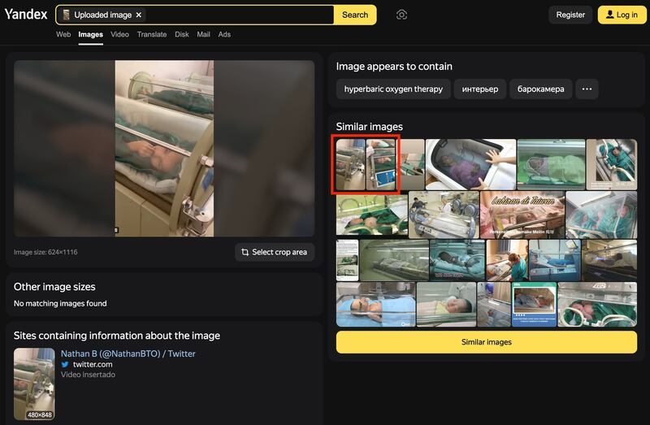
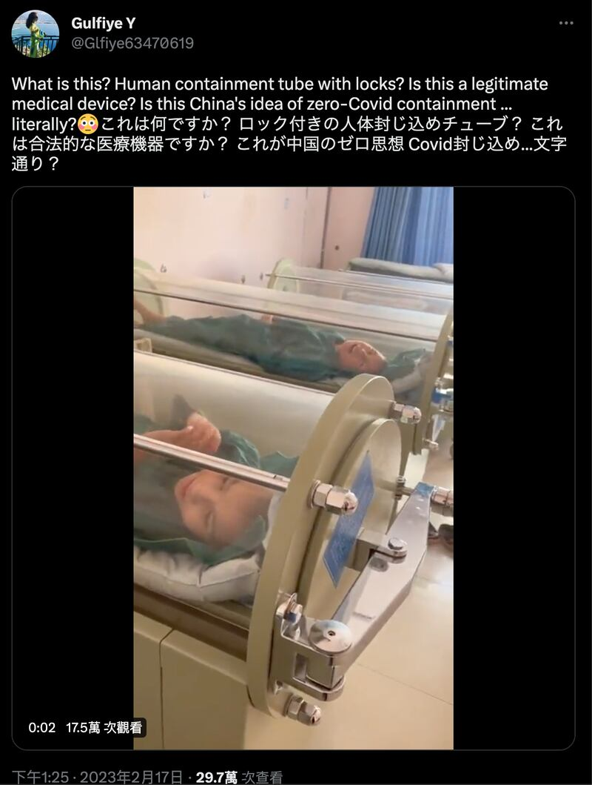
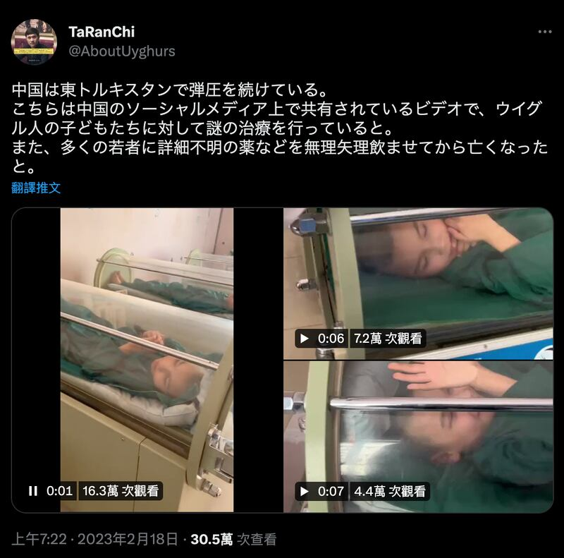
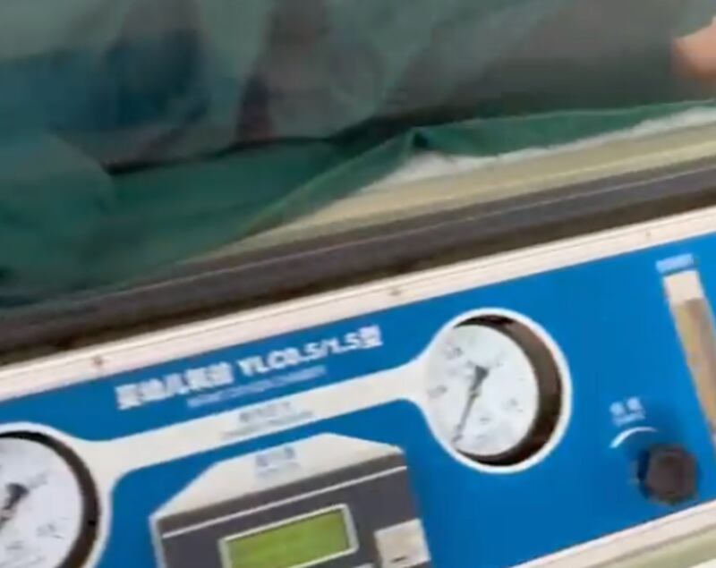

# Are Uyghur children in pods being imprisoned and brutalized?

## Videos actually show children being treated for cerebral palsy.

By Dong Zhe

2023.05.03

## *Updated at 4：33 pm on May 4, 2023*

## In Brief

A short clip of Uyghur children lying in cylindrical glass pods recently circulated on Twitter, with claims that they were being “imprisoned and brutalized” in Chinese concentration camps, stirring outrage.

After tracking down an extended version clip, Asia Fact Check Lab (AFCL) found that the glass pods were actually oxygen chambers, probably in a hospital. Subsequent interviews with medical specialists revealed that the child in the original tweet was actually receiving hyperbaric oxygen therapy for cerebral palsy, not being subjected to torture.

## In Depth

The tweet [in question](https://twitter.com/jielijian/status/1647129494413791232) was posted on April 15, 2023, by Jie Lijian, a U.S.-based pro-democracy activist with over 46,000 Twitter followers. It shows a short video in which two children are shown lying on their backs in cylindrical glass pods. A nurse can be seen opening and closing a door to one of the pods in the background.

The tweet soon attracted over 100,000 readers and was subsequently retweeted by more than 300 people. Some outraged netizens denounced the Chinese Communist Party as “inhumane” while others questioned the authenticity of the video and suggested that “truth, not lies, should be used to fight the CCP.”

Lijian's caption to the video reads, “Poor Uyghur children are being imprisoned and brutalized in CCP concentration camps. Many of their parents confined in the camps are undergoing genocidal persecution, unable even to see their own flesh and blood at the end of their lives. # CCP is the enemy of humanity.”

Many commenters urged Lijian to be careful in his remarks, suggesting that the video appeared to be some sort of medical procedure rather than torture.

## What exactly are the glass pods in the video?

AFCL used Yandex’s image search engine to trace the source of the clip, eventually finding two earlier posts on Twitter which used the same video later posted by Lijian. Both posts were made by Japanese netizens, but differed in their interpretation of the video's content.

Earlier postings of the same video Lijian later tweeted. Edges of the identical videos highlighted in red. (Screenshot from Yandex.)

[The first of these two tweets was posted on Feb. 17](https://twitter.com/Glfiye63470619/status/1626452694658326531) and questioned whether the pods in the video were some kind of chamber used to isolate COVID patients as part of China's zero-COVID policy.

[The second of the two tweets was posted a day later](https://twitter.com/AboutUyghurs/status/1626723759154679808) and contained language similar to Lijian's tweet, suggesting that Uyghur children were being subjected to "mysterious treatment" and that some had even died after being force-fed unknown drugs.

The tweet made on Feb. 18 contains an additional two videos of the children taken from different angles. Upon close examination, AFCL found what appears to be a model number printed in Chinese on the side of the pod. It reads, “Infant Oxygen Chamber Model YLC0.5/1.5.”

Screenshots of the video and commentary by Japanese posters on February 17 and 18.

A Baidu search using the above model number [returned an exact match](https://www.baidu.com/s?ie=utf-8&f=8&rsv_bp=1&rsv_idx=1&tn=baidu&wd=%E5%A9%B4%E5%B9%BC%E5%84%BF%E6%B0%A7%E8%88%B1%20YLC0.5%2F1.5%E5%9E%8B&fenlei=256&rsv_pq=0xdd3c5f8500094de7&rsv_t=05edTqivECuSR0vJ%2BthVmcpZ1HgxIcacMi6I3SyXdr71lrYlv2YTb3lvlLgM&rqlang=en&rsv_dl=tb&rsv_enter=1&rsv_n=2&rsv_sug3=1&rsv_sug1=1&rsv_sug7=100&rsv_sug2=0&rsv_btype=i&prefixsug=%25E5%25A9%25B4%25E5%25B9%25BC%25E5%2584%25BF%25E6%25B0%25A7%25E8%2588%25B1%2520YL%2526lt%253B0.5%252F1.5%25E5%259E%258B&rsp=2&inputT=881&rsv_sug4=881), revealing that the glass pod seen in the video is an infant hyperbaric oxygen chamber (below referred to simply as oxygen chamber) manufactured by Wuhan Haiborui Technology Ltd. in the Chinese province of Hubei.

Screenshot of the oxygen chamber from the clip.

## What are oxygen chambers used for?

The description of the product on [the Chinese Global Medical Devices website](https://ylqx.qgyyzs.net/business/zs162213.htm) states that such chambers are used in oxygen therapy to treat several conditions, including choking in newborns, epilepsy or lack of blood flow to the brain. The [Undersea and Hyperbaric Medical Society](https://www.uhms.org/resources/hbo-indications.html), the leading organization in the field, defines oxygen therapy as a suitable treatment for gas embolism, carbon monoxide poisoning, diving sickness, acute burns and sudden deafness.

[Dr. Hsia Te-Chun](https://www.cmuh.cmu.edu.tw/Doctor/DoctorInfo_EN?docId=D1914), chairman of the Association of Hyperbaric and Undersea Medicine of the Republic of China, confirmed to AFCL that the equipment shown in Lijian's tweet is a standard single occupant oxygen chamber for children. Hsia explained that both cerebral palsy and autism are more common symptoms of children who undergo oxygen therapy. After examining Lijian's original video, Hsia noted that the children's frequent arms and leg spasms appear to be signs of cerebral palsy.

Hsia added that while most of the world's mainstream oxygen chambers are manufactured in Europe and America, China solely uses Chinese-made equipment. Therefore, the film almost certainly was recorded in China, most likely in the oxygen therapy center of a hospital.

In response to suggestions that the video shows a type of treatment used under China's zero-COVID policy, he said that oxygen therapy is currently not a formal treatment for COVID.

## Conclusion

AFCL found claims spread by Japanese and Chinese communities on Twitter that Uyghur children were being detained and abused in glass chambers to be misinformed.

Both examination of the equipment in the video and interviews with relevant specialists confirm that the glass pod in the circulated video is an oxygen chamber and that the children within the video are undergoing hyperbaric oxygen therapy.

## [2023/5/4 Update]

AFCL received feedback from readers that we failed to check the exact location of the hospital shown in the videos mentioned in the article – specifically, whether it was in Xinjiang or not.

Our response is as follows:

When beginning this fact check, our initial goal was to find out the exact time and place the video was shot. Since the videos were short, several searches using different video tracking tools only revealed that Lijian’s video had been retweeted. As AFCL was unable to further trace the source, we hoped to clarify part of the truth by analyzing the many details within the videos themselves.

AFCL ran a separate search on Baidu bid center for "infant oxygen chamber YLC0.5/1.5." The search showed that many provinces in China - including [Henan in 2018](https://www.bidcenter.com.cn/newscontent-63547109-1.html), [Shandong in 2010](https://www.bidcenter.com.cn/newscontent-6466970-1.html) and [Jiangxi in 2016](https://www.bidcenter.com.cn/newscontent-27648871-4.html) - had all announced bids for this particular oxygen chamber model. No results appeared when we searched specifically for Xinjiang.

Given the limitations of the bidding website, AFCL cannot infer that hospitals in Xinjiang never purchased such oxygen chambers, nor can we rule out the possibility that the video was filmed in Xinjiang.

AFCL believes that our readers' questions are reasonable and that the specific location of the video must for now remain an open question. We can neither conclude nor deny where the video was filmed with the available evidence that we have. We will continue to monitor relevant sources for new information. Should any arise, we will update and revise the story accordingly.

*Asia Fact Check Lab (AFCL) is a new branch of RFA established to counter disinformation in today’s complex media environment. Our journalists publish both daily and special reports that aim to sharpen and deepen our readers’ understanding of public issues.*

[Original Source](https://www.rfa.org/english/news/afcl/fact-check-children-pods-05032023093658.html)