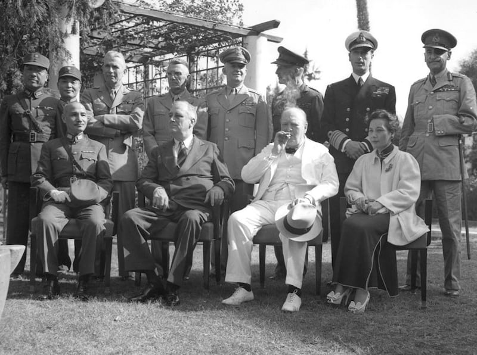
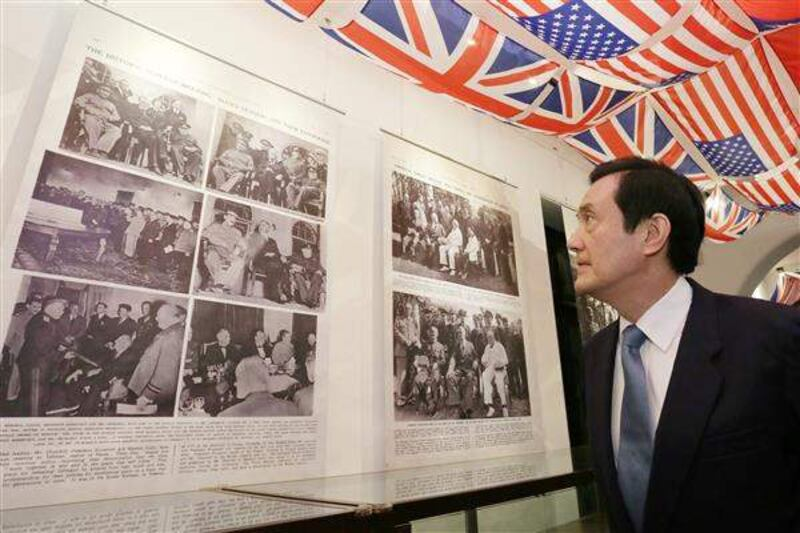

# Do the Cairo and Potsdam Declarations “restore” Taiwan to China?

## Neither declaration attempts to settle control over Taiwan.

RFA Staff

2023.05.08

## In Brief

Chinese officials repeatedly assert that the [Cairo Declaration](https://digitalarchive.wilsoncenter.org/document/cairo-declaration) (1943) and [Potsdam Declaration](https://history.state.gov/historicaldocuments/frus1945Berlinv02/d1382) (1945) are two historical documents which prove that mainland China holds jurisdiction over Taiwan.

Asia Fact Check Lab (AFCL) found these claims to be false. Both documents clearly state the conditions for Japan’s surrender at the end of the Second World War include forfeiting control of Taiwan and restoring the island to the Republic of China, or ROC.

The documents were never intended nor settle the current political disputes between Taiwan and China. Such statements by Chinese officials often misleadingly ignore the fact that the Republic of China exercises *de facto* sovereignty over Taiwan and the ambiguousness of which of the two governments holds legal sovereignty over the island.

## In Depth

From the end of the Chinese Civil War in 1949 up till the present day, the People's Republic of China [claims](http://www.gov.cn/test/2005-07/29/content_18293.htm) that it is the sole legal government that represents China and refuses to recognize the *de facto* ROC sovereignty over Taiwan.

As succinctly stated by Chinese Foreign Minister Wang Yi [in a speech given in September 2022](https://www.mfa.gov.cn/web/wjbz_673089/zyjh_673099/202209/t20220923_10770193.shtml), "the government of the People's Republic of China is recognized as the sole legal government representing the whole of China [including Taiwan]."

Chinese Foreign Minister Qin Gang [attempted to support the longstanding claim](https://taiwan.huanqiu.com/article/4CZzLWvf8su) by Chinese officials that their government's sovereignty over Taiwan has a historical basis in an April 21 public speech in Shanghai.

"Taiwan's return to China is an integral part of the post-World War II international order, clearly written into both the Cairo Declaration and the Potsdam Proclamation," said Foreign Ministry Spokesperson Hua Chunying, who [posted](https://twitter.com/SpokespersonCHN/status/1649343717327904770?cxt=HHwWhIDR_enX0uMtAAAA) [tweets](https://twitter.com/SpokespersonCHN/status/1649243564571000834?cxt=HHwWhIDU5ZWSpeMtAAAA) that reiterated the claim.

## Did either the Cairo Declaration or Potsdam Declaration attempt to settle the dispute over Taiwan?

No, they did not.

At the time of their announcement, neither of these the declarations was meant to address the question of whether the Republic of China should relinquish sovereignty over Taiwan and allow Communist China to govern the island, says Richard Bush, a senior fellow at the Center for East Asia Policy Studies and author of several books on Taiwan-U.S. relations. He was also the chairman and managing director of the American Institute of Taiwan, America’s de facto embassy in Taipei.

Four political leaders who participated in the Cairo Conference are seated in the front row. From left to right: Chiang Kai-shek, Franklin Delano Roosevelt, Winston Churchill and Soong Mei-ling. (Photo from the Cairo Conference Archives)

“Because the declarations were statements of intent prior to a negotiation over Taiwan’s sovereignty, the PRC reasoning is faulty,” Bush notes.

Given that the People’s Republic of China had not even been established at the time the two declarations were made, it is illogical to use such documents to settle the dispute over Taiwan.

Chinese officials often assert that the Cairo Declaration restored Taiwan and the surrounding islands "to China," instead of the [full original](http://www.chinatoday.com.cn/chinese/sz/news/201606/t20160621_800059838.html) [wording of the treaty](https://digitalarchive.wilsoncenter.org/document/cairo-declaration), "the Republic of China." Copies of the Potsdam Declaration printed in [Mainland China](http://world.people.com.cn/n1/2016/0627/c404981-28481593.html) also often abbreviate the term " [the National Government of the Republic of China](https://history.state.gov/historicaldocuments/frus1945Berlinv02/d1382)" used in the opening article to simply "the National Government of China."

These seemingly small changes allow the PRC to more easily claim that the treaty grants their government jurisdiction and sovereignty over Taiwan. The terms are close enough to the original wording to sound convincing, yet different enough to sidestep the pesky fact that the Republic of China still exists.

Yet ultimately even this change in terminology does not make a big difference. Neither the Cairo Declaration nor the Potsdam Declaration were ever intended to settle the question of what Chinese government should hold jurisdiction over Taiwan. They have no bearing on the current dispute between the PRC and ROC over Taiwan.

“The two declarations were only statements of intention about what would happen to Taiwan after World War II,” Bush said.

“At that time, the internationally accepted mechanism for transferring territory after a war was through a peace treaty,” he said. “But in the treaties ending the war in the Pacific (the San Francisco Treaty and the treaty between Japan and the ROC), Japan only gave up ownership of TW; it didn’t assign it to any country.”

## Since either of the declarations were announced, has China controlled Taiwan?

No, it has not.

While the Qing Dynasty maintained jurisdiction and sovereignty over Taiwan from the late 1600s until 1895, the Republic of China has retained full control over Taiwan after Japanese forces on the island surrendered at the end of World War II, Bush says.

## Does mainland China hold legal sovereignty over Taiwan?

It depends on whom you ask. To answer such a question, one has to determine what grants a government sovereignty over territory. “This is still an open question that is best resolved by the two sides,” Bush notes.

One can argue that since the PRC controls much more land and people within the territory that both it and the ROC both formerly claimed, that therefore it ought to hold sovereignty over Taiwan.

Or one can argue that since the ROC was the lawful representative government of China when both the Cairo and Potsdam Declarations were signed - as even the official PRC interpretation of history acknowledges - that therefore, it ought to hold legal sovereignty over Taiwan.

Former Taiwanese President Ma Ying-jeou attached great importance to the fact that the Cairo Declaration returned Taiwan to the ROC, even holding a commemorative exhibition during his term of office. (From the Taiwanese Presidential News Archive)

However these are arguable propositions, *not* facts. To unambiguously claim that the PRC legally represents Taiwan, as PRC officials regularly do, is misleading.

## Conclusion

AFCL found Chinese official claims that the Cairo Declaration and Potsdam Declaration prove that the territory of Taiwan must eventually be governed by Communist China to be false. The documents made clear that Japan needed to relinquish Taiwan back to the Republic of China. They were never intended to settle the ongoing dispute over who has sovereignty over Taiwan.

China advocates an interpretation of history that promotes its own political goals, and Chinese officials often ignore or omit facts that contradict those interpretations. This is one such case.

[Original Source](https://www.rfa.org/english/news/afcl/fact-check-potsdam-05082023093502.html)