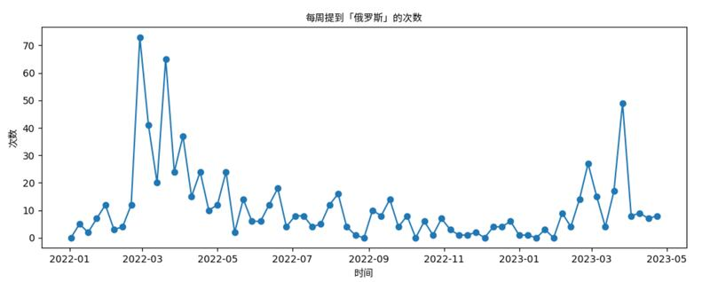
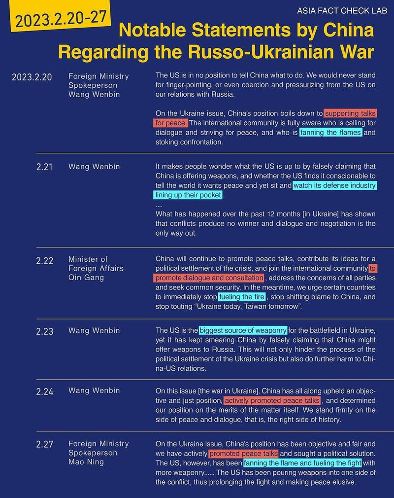
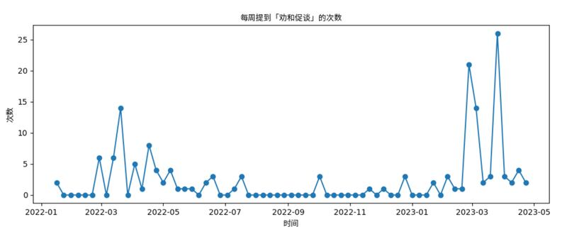

# Media Watch: China’s mixed signals on Russo-Ukrainian war

## China has portrayed itself as neutral player, sympathetic to Moscow and peacemaker

By Zhuang Jing for RFA

2023.06.07

China’s official narrative about the war in Ukraine has embraced three different themes over time that have sent conflicting signals, according to an analysis of state media reports and official foreign ministry declarations.

That reflects Beijing’s competing priorities in the conflict, experts say.

Initially, after Russia’s invasion of Ukraine in February 2022, Beijing officials sought to present China as a neutral power with no interest in getting involved. But a year later, they started to portray China as taking an active role as a peacemaker.

Both of those approaches have been at odds with the state media’s coverage of the war, which has been sympathetic to Moscow. It has portrayed the United States and Ukraine as aggressors and Russia as a heroic victim protecting its security, according to a recent joint study by Asia Fact Check Lab (AFCL) and three research groups.

China’s attempts to play various sides isn’t surprising, experts say. It doesn’t want the war to drag on, but it also doesn’t want to criticize Russian President Vladimir Putin as it needs to keep Russia on its side against the United States and its global allies.

“Beijing doesn't ultimately benefit from a prolonged war that is destabilizing the global economy and continues to present the potential risk of nuclear escalation and the spread of conflict beyond Ukraine,” said Patricia Kim, a Chinese foreign policy expert at the Brookings Institution in Washington.

“At the same time, Beijing has been reluctant to curtail its support to Moscow and to sharply push Putin to stop his war, as China is keen to keep Russia on its side as it looks toward long-term competition against the U.S. and its partners,” she said.

## First 100 days

A joint study conducted by AFCL, Taiwan's DoubleThink Lab, the Ukrainian civic organization Detector Media and the research firm IRI Beacon Project shows that the Chinese government has propagated narratives consistent and supportive of Russia’s justification for the war.

Entitled ["The Invasion of Ukraine in One Hundred Days: A Comparative Analysis of Chinese and Russian War Narratives,"](https://rfa-english.s3.amazonaws.com/docs/first-100-days-report-eng.pdf)the study traces common themes observed in both Chinese and Russian narratives during the first 100 days of the conflict and finds that China largely copied Russian narratives portraying itself as a victim heroically opposing the US and the West.

In countries like China that lack a free press, foreign policy statements and state media coverage provide a window into government priorities.

As the Communist Party’s mouthpiece, state-run media such as Xinhua News Agency, the Global Times newspaper and CCTV are used by authorities for achieving political goals, and are aimed at specific audiences. They may target an international audience, a domestic one or specific countries.

During the first 100 days after Russia’s invasion of Ukraine, Chinese media sought to position the country as a neutral player, shining a spotlight on Western support for Ukraine while downplaying its own ties to Moscow, said Kim.

Yet state-run media coverage clearly sided with Russia. It echoed Russian narratives about three contentious topics: The theory that the United States had a bioweapon lab in Ukraine, the Russian massacre of civilians in the town of Bucha in March 2022 and the ongoing sanctions against Russia, the joint study showed.

It also highlighted alleged divisions between Western institutions and the international community over sanctions against Russia.

Such views align with those of Moscow, but they also fit with Beijing's domestic agenda. The Chinese government has sought to portray itself as a victim of Western hostility, too, alleging that the United States is seeking to contain China and its rise as a superpower—a [line that Beijing has promoted](https://www.163.com/dy/article/I5HP53J60546MZPX.html) among its people.

These narratives contribute to an image of President Xi Jinping as a tough statesman who is willing to stand up to the West.

## Chinese narratives since May 2022

To examine Chinese narratives about the Ukraine invasion since May 2022, we requested data from Future Media and Disinformation Research Center on how certain keywords ebb and flow in Chinese public discourse.

Chinese foreign ministry mentions of "Ukraine" and "Russia" peaked at the beginning of the war, decreased after May of last year and increased significantly from February to April 2023. Source: Taiwan AI Labs’ Future Media and Disinformation Research Center

From May 2022 to February 2023, references to Ukraine or Russia by Chinese media and officials appear to have decreased. However, the number of references then jumped from February to April 2023 – with a new emphasis on China as a peacemaker working to prevent a warmongering United States from prolonging the Ukraine conflict.

The emergence of this narrative also coincided with a state visit by Xi to Russia in March—his first since the start of his third five-year term last October.

In many cases, this message was disseminated by Chinese foreign ministry officials, who tend to adopt a restrained tone when speaking about more nuanced geopolitical issues surrounding the war.

China also advocated a peaceful settlement to the war using other channels including [several](https://www.fmprc.gov.cn/mfa_eng/wjbxw/202302/t20230221_11028348.html) [position](https://www.fmprc.gov.cn/mfa_eng/zxxx_662805/202302/t20230224_11030713.html) papers. [Xi himself wrote an article](http://politics.people.com.cn/BIG5/n1/2023/0320/c1024-32647061.html) published in the Russian government newspaper Rossiyskaya Gazeta, in which he emphasized China's role as a "peacemaker."

This shift in narrative was followed by a phone call between Xi and Ukrainian President Volodymyr Zelensky on April 26, the first direct communication between the two leaders since the war broke out. After the call, [China reiterated that](https://www.chinanews.com.cn/gn/2023/04-27/9998016.shtml) its "core position is to promote peace and promote talks."

That same day, China [voted in favor of a UN General Assembly motion](https://www.kyivpost.com/post/16484) that acknowledged Russian aggression against Ukraine, fueling speculation that Beijing's position toward the war has changed.

The number of times per week that China’s foreign ministry mentioned “supporting talks for peace” (above) and “fanning the flames” (below). Source: Taiwan AI Labs

Despite Beijing's apparent shift in position, some official media reports have continued to spread the narrative of the United States as aggressor, such as an article published by the [Xinhua](http://www.xinhuanet.com/mil/2023-02/22/c_1211731674.htm) in February criticizing Washington for "still fanning the flames in Ukraine."

ManyChinese articles reporting [misleading or controversial statements](https://world.huanqiu.com/article/4Bmu0k9XVny) by Russian officials have been linked to specific incidents, such as U.S. President Biden's surprise visit to Ukraine in February. One article said that the United States [had become a direct participant in the war](https://world.huanqiu.com/article/4Bmu0k9XVny). Another article characterized Finland's accession to NATO in April as a ["deliberate violation of Russia's security."](https://cn.chinadaily.com.cn/a/202304/05/WS642cae03a3102ada8b236dff.html)

Even as China continues to send mixed signals about Russia’s role in the war, pragmatism appears to be pushing Chinese authorities to take a more active part in trying to end the conflict.

Zelensky’s continued willingness to engage in talks with Xi suggests that Ukrainian leaders remain hopeful that China can play a role in negotiating a peace settlement.

As Kim says, “While Beijing can never be an honest broker, it still has an interest in seeing an end to the war and so it makes sense for Ukraine and other states to encourage China to use its influence constructively vis-a-vis Moscow.”

## *Additional reporting by Shen Ke. Edited by Malcolm Foster.*

[Original Source](https://www.rfa.org/english/news/afcl/afcl-ukraine-war-06072023105056.html)