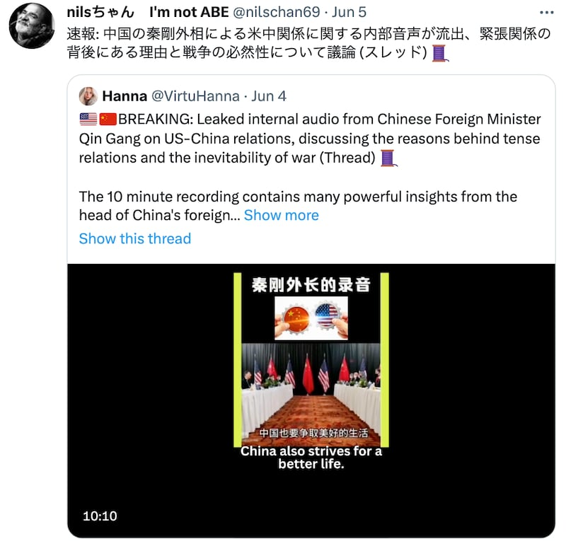

# Did an 'internal speech' by China’s foreign minister forecast a war with the U.S.?

## Audio clip is likely a manipulation and created by a netizen to spread misinformation.

By Zhuang Jing

2023.06.20

## In Brief

An audio recording of an "internal speech" attributed to Chinese Foreign Minister Qin Gang predicting that war between China and the United States is inevitable has gained attention on the Chinese Internet.

Asia Fact Check Lab (AFCL) discovered striking similarities in the phrasing of the supposed Qin speech and a nationalistic article posted by blogger Tanji Kede in 2022. And the recording of the supposed Qin speech sounds remarkably like several audio versions of Tanji Kede’s article circulating online, in terms of wording, voice and recording characteristics.

AFCL's comparison of Qin’s alleged speech with these various online postings suggests that the "internal speech" is likely a fake, and instead was likely a recording created by one or more Chinese netizens.

## In Depth

Users on Twitter and YouTube have recently circulated the supposed "internal speech of Qin" with many referencing a [video](https://www.qtown.media/share/linkPage/881D5921-269C-4680-BABF-20B53C065E41.html) posted on the Chinese social media platform [Q Town Media](https://qtown.media/) as their source. The original poster — who identifies himself as James Quan — does not provide any information about the time or location of the speech.

The 10-minute clip is entitled, “Video 06012023: Recording of Qin Gang’s Internal Speech: War is Inevitable, China’s Relations with the U.S. are at a Boiling Point.” It features a male voice speaking about U.S.-China relations. The faceless speaker notes that the United States has “long regarded China as its imaginary archnemesis” and “the only way for the U.S. to stop the rise of China is through war.”

Throughout the speech, the video shows a blurry still image of what appears to be a meeting between senior Chinese and American officials. The participants’ faces aren’t clear, but the Chinese and American flags are identifiable.

Relations between the United States and China have grown competitive and strained in recent years, as many in Washington view China as seeking to challenge U.S. supremacy and Beijing alleges that the U.S. is trying to contain the country’s rise.

Recent events, including [the February shooting down of a suspected Chinese spy balloon over U.S. waters](https://www.nytimes.com/2023/02/04/us/politics/chinese-spy-balloon-shot-down.html), have exacerbated these tensions. But U.S. Secretary of State Antony Blinken's trip this past weekend to Beijing, during which he met both Qin and President Xi Jinping, did appear to help stabilize ties between the two superpowers.

Some netizens suggested that the sentiments expressed in the purported Qin speech reflect current Chinese foreign policy. But others expressed doubt over the authenticity of the video and voiced suspicion that the speech might have been generated by AI.

Tweets circulating about a supposed speech made by Chinese Foreign Minister Qin Gang.

## Did Qin ever deliver such a speech?

This is unlikely. After conducting an online search of select phrases from the supposed Qin speech, AFCL found a match with [an article entitled "Farewell to America!" posted](https://www.163.com/dy/article/H684R8850550WCN1.html) on the Chinese news site 163.com by Tanji Kede on April 30, 2022. Further comparison showed that virtually the entire content of the supposed Qin speech matches sections two through four of the lengthy article, except for a few differences in wording and a reordering of the paragraphs.

## Is the voice in the recording that of Qin’s?

AFCL found several videos of users reading aloud all or parts of Tanji Kede's article on popular Chinese video-sharing platform Douyin. [One such recording entitled "Farewell to America (1)"](https://www.douyin.com/video/7149160800836537611) was posted by a user identified as Fengyu Tonglu in September 2022.

A comparison of this latter recording and the supposed Qin speech suggests that the audio for both probably comes from the same source. Both videos contain most of the same sections from the original article, read in slightly different order, and the voices sound virtually identical.

Furthermore, the same beeping noise is audible at the same place in the text in both recordings, occurring just as the speaker finishes saying, “Otherwise the First World War’s tragedy will be repeated.” The sound occurs at approximately the 4:40-minute mark in the supposed Qin speech and at 8:42 minutes in the Fengyu Tonglu video.

Another Douyin [video posted in April 2022 shows a middle-aged man reading the same content as the beginning section of the](https://www.douyin.com/video/7091008599908044071) purported Qin speech, with a similar accent and intonation. AFCL identified the man in the video as Douyin user [Liuge Liao Shenghuo](https://www.douyin.com/user/MS4wLjABAAAAqYmID85J8Ju6MHik-c2fmnUfUrWNXxGj5S8aBtitCM4) by linking him to other videos he posted online. However, the April 2022 video was not found among Liuge's content on Douyin.

AFCL compared the Liuge audio with the supposed Qin audio using the open AI voiceprint recognition software [Unisound](https://ai.unisound.com/voiceprint-recognition). The program found a 93.81 percent probability that the voices from the two tracks belong to the same person. In contrast, a comparison of the supposed Qin internal speech with audio of the foreign minister responding to journalists' questions at [a news conference on March 7, 2023,](https://www.youtube.com/watch?v=-rtCeqgnRdI) resulted in only a 65.78 percent probability that the voices belong to the same person.

AFCL also asked a Taiwanese information engineer with voice recognition expertise to analyze and compare the audio from the Liuge video and from Qin’s alleged speech. The engineer noted that the sound waves of both clips were consistent with each other and tentatively concluded that they were likely the same track. AFCL did not directly compare the voices in the two Douyin videos.

The Chinese Ministry of Foreign Affairs and the Chinese Embassy in Washington did not respond to a request for comment as of the time of publication.

## Conclusion

Until Chinese officials confirm or deny whether the audio clip is indeed from Qin, AFCL cannot definitively make a clear judgment. However, based on voice recognition software analysis and similarities in text, voice, and recording features in the supposed Qin and Douyin clips, AFCL preliminarily concludes that the alleged Qin leaked audio is most likely fake. It appears that someone manipulated existing online audio or video material and then attributed it to Qin, potentially in a bid to spread misinformation.

## *Translated by Shen Ke*

[Original Source](https://www.rfa.org/english/news/afcl/fact-check-qin-audio-06202023151155.html)