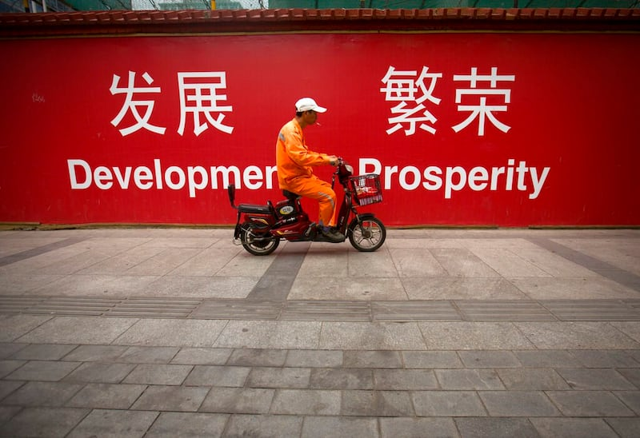
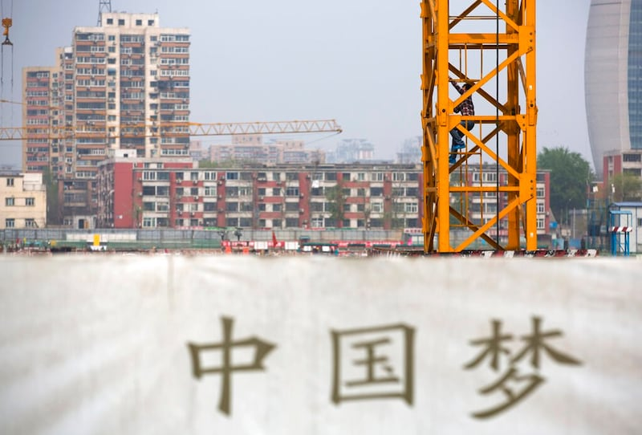

# Is China a developing country? What does international law say about its status?

## Verdict: Partially Correct

By Shen Ke

2023.06.21

## In Brief

Legislation passed by the U.S. House of Representatives and a Senate committee in the first half of this year seeks to change China’s label of developing country used in the World Trade Organization (WTO). Chinese officials have responded by reaffirming that China is still a developing country under international law.

Asia Fact Check Lab (AFCL) found that there is no clear and uniform definition of a “developing country” within the international community. Different classifications systems used by the UN and World Bank refer to China respectively as a “developing economy” and an “upper middle-income country,” while the WTO allows countries to self-identify as a “developing country.”.

In addition, China’s classification as a “developing country” in certain international treaties does not imply that there is a universal set of international laws which define China as a “developing country.”

## In Depth

The U.S. Senate Committee on Foreign Relations approved the [Ending China's Developing Nation Status Act](https://www.congress.gov/bill/118th-congress/senate-bill/308) on June 8. The bill requires the State Department to attempt to "stop China from being classified as a developing nation by international organizations" and specifies the World Trade Organization (WTO) as one international organization in which the People's Republic of China (PRC) receives "beneficial treatment" as a result of its status as a developing country.

Chinese Ministry of Foreign Affairs spokesperson Wang Wenbin responded to the bill at [a press conference on June 9](https://www.fmprc.gov.cn/eng/xwfw_665399/s2510_665401/2511_665403/202306/t20230609_11094406.html), saying that "China's status as the world's largest developing country is rooted in facts and international law" and that "the rights that China is lawfully entitled to as a developing country" will not be deprived by US politicians.

Wang had earlier [claimed at a press conference on May 12](https://www.fmprc.gov.cn/eng/xwfw_665399/s2510_665401/2511_665403/202305/t20230512_11076522.html) that China's status as a developing country should not be changed due to the WTO recognition.

## Who decides whether a WTO member is developing or not?

Wang Wenbin's claim that China's status as a developing country is recognized by the WTO is false, as the organization [allows individual member states to decide for themselves](https://www.wto.org/english/tratop_e/devel_e/d1who_e.htm) whether they are a developing country or not.

The WTO does not provide specific definitions for "developed" and "developing" countries. It is up to individual members to declare their own categorization. However, other members have the right to question the decision of a member country to utilize provisions meant for developing countries."

## How do the World Bank and the UN classify China’s economy?

Both the UN and the World Bank use g [ross national income](https://data.oecd.org/natincome/gross-national-income.htm)(GNI) per capita as the defining criteria to measure a countries' economic development.

The UN [World Economic Situation and Prospects report](https://www.un.org/development/desa/dpad/publication/world-economic-situation-and-prospects-2023/) classifies different countries' economies into four categories: developed, developing, least developed and economies in transition. China's economy is classified as developing.

China’s economy is classified as “developing” by a UN report and as “upper-middle income” by the World Bank. Credit: AP

The World Bank, on the other hand, does not use the word "developing" at all, but instead [divides the world's countries into four tier](https://blogs.worldbank.org/opendata/new-world-bank-country-classifications-income-level-2022-2023)s: low, lower-middle, upper-middle and high. China stands on the border between upper-middle income and high income countries, [with nominal per capita income](https://data.worldbank.org/indicator/NY.GNP.PCAP.CD?most_recent_value_desc=true) at $11,880 as of 2021. While a huge leap from [forty or even twenty ago](https://data.worldbank.org/indicator/NY.GNP.PCAP.CD?most_recent_value_desc=true&locations=CN), this number is still well below that of other widely recognized developed economies such as [Japan](https://data.worldbank.org/indicator/NY.GNP.PCAP.CD?most_recent_value_desc=true&locations=JP), [the U.S](https://data.worldbank.org/indicator/NY.GNP.PCAP.CD?most_recent_value_desc=true&locations=US)., [Germany](https://data.worldbank.org/indicator/NY.GNP.PCAP.CD?most_recent_value_desc=true&locations=DE), [France](https://data.worldbank.org/indicator/NY.GNP.PCAP.CD?most_recent_value_desc=true&locations=FR) or [Taiwan](https://www.imf.org/external/datamapper/PPPPC@WEO/TWN?zoom=TWN&highlight=TWN).

## Does international law entitle China to remain a developing country?

The Chinese foreign ministry claims that the basis of China's status as a developing country in international law cannot be denied. The ministry pointed to the recognition of such status in international treaties such as the [United Nations Framework Convention on Climate Change](https://unfccc.int/parties-observers), the [Montreal Protocol](https://www.unep.org/ozonaction/who-we-are/about-montreal-protocol) as proof of its acceptance by the international community. [Wang's statement](https://www.mfa.gov.cn/web/wjdt_674879/fyrbt_674889/202306/t20230609_11094353.shtml) that the U.S. was attempting to "deprive China of its developing country status" would seem to further imply that China's status as a developing country is permanent.

Such claims are misleading.

"There are no authoritative definitions of 'developing country'," [Steve Chanozits](https://www.law.gwu.edu/steve-charnovitz), an associate professor of law at The George Washington University, tells AFCL. "There is no consensus definition in international law. Countries can self-assess their own progress toward their development goals and the international community can also make such an assessment."

While there are many international treaties which divide countries into different categories based on income, with each category bearing different obligations, Charles Kenny, [a senior fellow at the Center for Global Development](https://www.cgdev.org/expert/charles-kenny), told AFCL. These categories and their cutoff points are determined after negotiation amongst the relevant parties, Kenny says.

Therefore, China’s status is not permanent or “lawfully entitled” as China’s foreign ministry indicated, but it has a certain time limit and must undergo regular review or redefining by member states in the institutions, Chen-en Sung, an expert on international law and director of the Taiwan Constitutional Foundation, told AFCL. China's developing status shouldn’t be generalized, but must instead be viewed in light of the respective provisions of the cited treaties, along with the rights and obligations of countries labeled under different statuses.

## Why does it matter whether a country is labeled as developed or developing?

In certain international organizations [such as the WTO](https://www.wto.org/english/thewto_e/whatis_e/tif_e/utw_chap6_e.pdf), the designation of being a developing country allows a country to seek (but not necessarily to obtain), "special rights or extra leniency."

“Various categorizations are used for purposes including who gets financial support to achieve various global objectives, or who gets greater leniency when it comes to international trade rules or who is eligible for ODA [Official development assistance], there are reasons why countries might want to put themselves in the ‘developing’ category,” Kenny says.

Furthermore, the label of a “developed” country often carries a responsibility to help poorer countries in tough economic straits and to abide by more stringent regulations on issues of global importance such as climate change.

Being designated as a “developing” country allows countries to request “special rights or extra leniency” in the WTO. Credit: AP

“The PRC often uses its status as a middle-income country to excuse itself from global responsibilities – including fighting climate change and in the provision of debt relief in the current debt crisis. However, the sheer size of the PRC’s economy means that it is impossible to deliver global public goods in climate or in staving off the current debt crisis in many developing countries if it continues to avoid its responsibilities or adherence to international norms,” aUnited States Agency for International Development spokesperson told AFCL.

## Conclusion

AFCL found that China’s economy qualifies as developing and upper middle income according to the respective standards set by the UN and the World Bank. Currently, within the WTO organization, China is recognized as a "developing country."

However, the status in the WTO is based on self-declaration, and it may be subject to uncertainty in the future due to its own development or challenges from other members, according to WTO rules.

China’s foreign ministry’s statement that China’s status as a developing country “rooted in facts and international law” is misleading.

[Original Source](https://www.rfa.org/english/news/afcl/china-economy-status-06212023130558.html)