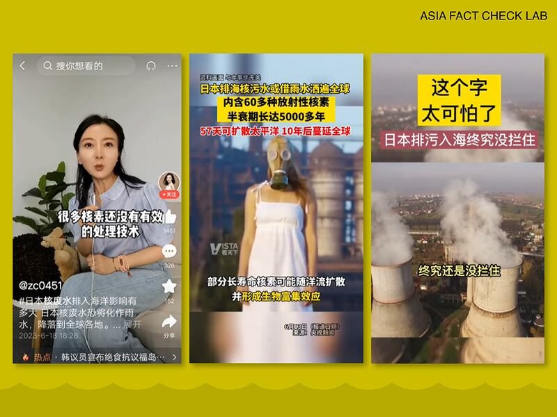
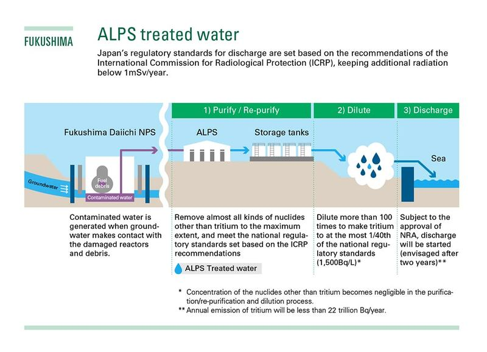
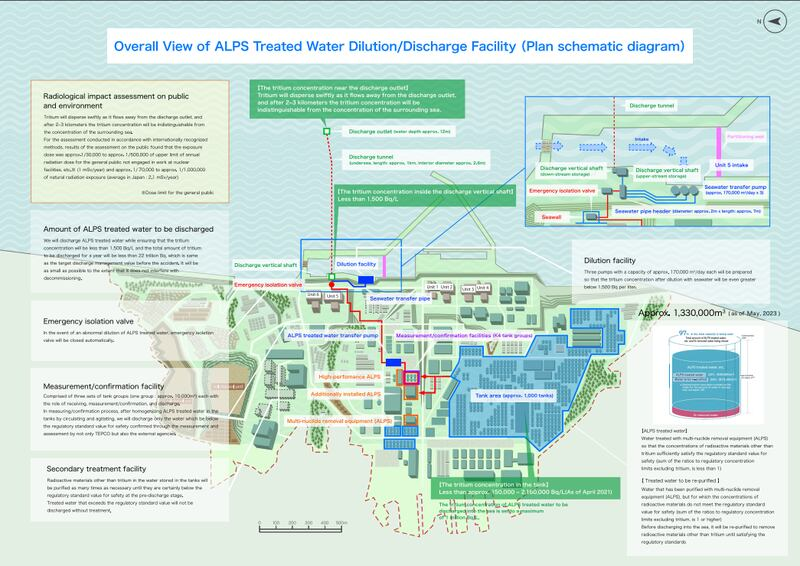

# Is Japan’s plan to release Fukushima wastewater unscientific and unilateral?

## China's claims about Japan's wastewater disposal plan ignore key facts and are misleading.

By Rita Cheng

2023.06.27

## In Brief

Many nations and environmental groups have questioned Japan’s decision to discharge nuclear wastewater from Fukushima into the Pacific Ocean. The Chinese government is among the plan’s most vocal critics, with China’s foreign ministry recently issuing statements questioning the plan’s safety and declaring that the Japanese government is imposing a “unilateral decision” without considering less harmful disposal methods.

Asia Fact Check Lab (AFCL) found these claims to be unfounded. Japan's planned release of water meets current international safety standards regarding wastewater discharge recommended by the International Atomic Energy Agency (IAEA) as well as China’s own domestic safety standards.

The Chinese foreign ministry’s accusation that Japan is making a unilateral decision without sufficient evidence is also misleading. In the more than twelve years since the 2011 Fukushima nuclear accident, Japan has proposed a variety of disposal methods for consideration, with the IAEA and broader international community engaging in related research and evaluation several times.

## In Depth

The Tokyo Electric Power Company (TEPCO), operator of the Fukushima nuclear power plant on Japan's Hakura Beach, is scheduled to begin discharging almost 400,000 of treated wastewater from the plant into the sea later this summer.

The impending deadline has brought international attention back to the more than 1.3 million cubic meters of wastewater currently stored in thousands of water storage tanks at the plant.

TEPCO maintains that the controlled discharge of the wastewater follows a rigorous nuclear purification process using a pumping and filtration system known as [ALPS](https://www.iaea.org/topics/response/fukushima-daiichi-nuclear-accident/fukushima-daiichi-alps-treated-water-discharge/faq) (Advanced Liquid Processing System) that is based on and meets the IAEA's safety standards.

A final IAEA assessment of the proposal is expected to be published at the end of June, with earlier IAEA reports indicating that the organization will likely support the plan. The reported decision has reopened domestic and international debate on the issue, and many groups have expressed their opposition, including the Japanese  [fishermen](https://tchina.kyodonews.net/news/2023/06/b7d81935515c.html) association, the international NGO [Greenpeace](https://www.greenpeace.org/international/press-release/59193/science-environmental-protection-international-law-g7-japans-fukushima-water-discharge/) and many in the marine ecology community.

## What are China’s main criticisms about Japan’s efforts to dispose of the wastewater?

China is one of the harshest critics of the plan. Chinese officials alleged that Japan’s plan lacks sufficient scientific evidence, that the ALPS treated water poses a “great harm” to the environment and that Japan has neither offered alternative plans nor consulted extensively with the international community – particularly neighboring countries who will be affected by the discharge.

Such allegations have been reiterated by top Chinese officials over the last three months, [including by the Chinese Ambassador to Japan Wu Jianghao](http://jp.china-embassy.gov.cn/mtdhnew/202304/t20230429_11068816.htm), [China's permanent representative to the IAEA Li Song](http://vienna.china-mission.gov.cn/dbthd/202306/t20230606_11090145.htm) and [China's Ministry of Foreign Affairs spokesperson Wang Wenbin](https://www.mfa.gov.cn/web/fyrbt_673021/202306/t20230607_11091218.shtml).

Chinese netizens on video sharing platforms such as Douyin and TikTok have widely circulated these officials' comments, with many echoing their government’s rhetoric about the “great harm” posed by the wastewater.

“Fukushima’s nuclear wastewater contains more than 60 kinds of radioactive elements,” reads one comment.

“The half-life [of the radioactive elements] is up to 5,000 years,” says another netizen.

Videos on Chinese social media comment on the dangers of Japan's proposed plan to discharge nuclear wastewater from the Fukushima disaster into the Pacific Ocean. Credit: Screenshots from Douyin user accounts.

## Will the ALPS treated water be a “great harm” to the environment?

No.

Discharging water into the ocean is a disposal method used by nuclear power plants around the world, including many of the 55 such plants in China. Despite this, Chinese officials have repeatedly claimed without further explanation that wastewater treated by ALPS is different from water discharged at other nuclear plants.

China's assertions are incorrect, according to [David Krofcheck](https://profiles.auckland.ac.nz/d-krofcheck), a professor of physics at the University of Auckland in New Zealand. He told AFCL that ALPS purified water is as safe as wastewater discharged from normal nuclear power plants, even going so far as to say he would eat fish caught in the discharged waters around Fukushima.

## What radioactive elements will ALPS remove from the wastewater?

ALPS will reduce 62 of the 63 radioactive substances currently in the wastewater to amounts that will have a negligible impact on the environment, according to the IAEA and Japanese officials.

The one substance still remaining in significant amounts following purification and dilution is an isotope known as [tritium](https://www.iaea.org/topics/response/fukushima-daiichi-nuclear-accident/fukushima-daiichi-alps-treated-water-discharge/faq), a radioactive form of hydrogen that exists in trace amounts in nature and which can combine with oxygen to form a radioactive water known as T2O or tritiated water .

In light of international concerns and following suggestions by the IAEA, Japan has agreed to dilute the tritiated water one further time following its initial purification by ALPS before discharging it into the sea.

Official diagram of the wastewater discharge plan and its anticipated impact. Credit: Japanese Ministry of Economy, Trade and Industry.

## How much tritium in water is considered normal?

Radioactivity is typically measured by the international unit becquerel.

The World Health Organization (WHO) [currently recommends](https://cdn.who.int/media/docs/default-source/wash-documents/water-safety-and-quality/dwq-guidelines-4/gdwq4-with-add1-chap9.pdf?sfvrsn=6fc78cae_3) that drinking water contain no more than 10,000 becquerels of tritium per liter, Krofcheck says.

The purified wastewater Japan plans to discharge contains 1,500 becquerels per liter, or about one-seventh of the WHO recommended amount, he says.

In comparison, [China's government allows](https://www.mee.gov.cn/gkml/zj/haq/200910/t20091022_173026.htm) a nuclear power plant in the coastal town of Qinshan to discharge wastewater containing up to 3700 becquerels of radioactive elements per liter.

In 2022 alone, [the plant itself disclosed](https://www.cnnp.com.cn/cnnp/resource/cms/article/1086607/1309623/QS-5EM-RCEM-23032701%20%E7%A7%A6%E5%B1%B1%E6%A0%B8%E7%94%B5%E6%A0%B8%E5%AE%89%E5%85%A8%E4%BF%A1%E6%81%AF%E5%85%AC%E5%BC%80%E5%B9%B4%E5%BA%A6%E6%8A%A5%E5%91%8A%EF%BC%882022%E5%B9%B4%EF%BC%89.pdf) that it discharged 201 megabecquerels (201,000,000 becquerels) of liquid tritium, about one-fourth of its [government stipulated annual cap of](https://www.mee.gov.cn/gkml/sthjbgw/haq/201610/t20161012_365398.htm) 800 megabecquerels. This figure is over nine times higher than Japan's estimated 22 megabecquerels of annual tritium which will result from the Fukushima discharge.

## Has Japan provided alternative plans of disposal for consideration?

Yes.

Japan proposed five different ways to dispose of ALPS treated water in 2016 before finally settling on discharging the water into the ocean as of April 2021.

## Has Japan coordinated the discharge with the IAEA?

Yes.

Since 2011, the Japanese government has regularly submitted progress reports [to the IAEA](https://www.iaea.org/topics/response/fukushima-daiichi-nuclear-accident/fukushima-daiichi-alps-treated-water-discharge) concerning the response to the Fukushima accident [.](https://www.iaea.org/topics/response/fukushima-daiichi-nuclear-accident/fukushima-daiichi-alps-treated-water-discharge) Japan has also asked the IAEA to participate in the creation and oversight of the entire discharge plan, with the UN nuclear agency [forming a task force](https://www.iaea.org/newscenter/pressreleases/iaea-holds-first-meeting-of-international-task-force-set-up-to-review-safety-of-fukushima-treated-water-release) composed of scientists from 11 different countries, including China.

The international task force created by the IAEA has spent the past two years surveying the situation in Fukushima, holding dozens of meetings and [publishing six reports](https://www.iaea.org/topics/response/fukushima-daiichi-nuclear-accident/fukushima-daiichi-alps-treated-water-discharge/reports) offering specific recommendations to improve Japan's final discharge efforts.

[The Task Force made its final trip to Fukushima](https://www.iaea.org/newscenter/pressreleases/iaea-task-force-on-fukushima-daiichi-treated-water-release-conducts-final-mission-to-japan-prior-to-publication-of-its-safety-assessment) at the end May 2023 and is currently preparing to publish its final report on the matter.

## Has Japan communicated with its neighbors and the broader international community in planning the wastewater discharge?

Yes.

The IAEA task force further [worked with independent third-party laboratories](https://www.iaea.org/sites/default/files/first_interlaboratory_comparison_on_the_determination_of_radionuclides_in_alps_treated_water.pdf) in Austria, Switzerland, France, South Korea and the U.S. to confirm that Japan's ALPS treated water can meet all international safety standards regarding radioactive harm to the environment and humans.

In addition to the task force, the Embassy of Japan in China says that Japan sends monthly briefings on the discharge plan to all foreign embassies in Tokyo, including China’s mission.

TEPCO has [set up websites](https://www.tepco.co.jp/en/hd/decommission/index-e.html) in Japanese and English to explain the progress of the process while also publishing web pages in [Chinese and Korean](https://www.tepco.co.jp/zh-cn/decommission/progress/watertreatment/index-cn.html) that explain the ALPS treatment process. In addition, [the company regularly publishes](https://www.tepco.co.jp/en/hd/decommission/data/index-e.html) monitoring data on the Fukushima nuclear plant every month.

TEPCO's official explanatory chart. Credit: TEPCO official website.

The IAEA has not responded to AFCL's inquiries about the conclusions of the Task Force as of the time this report was published.

There’s no perfect plan, but experts think discharging the wastewater into the sea is “the least bad option.” According to Krofcheck, many of these criticisms are connected to TEPCO’s slow response to the initial crisis in 2011.

Krofcheck notes that to just leave the more than 1,000 tanks of treated water in Fukushima – a region where another earthquake will likely occur within the next 30 to 40 years – potentially sets the stage for an even graver nuclear energy-related crisis down the line.

## Conclusion

China's criticism and resistance towards Japanese plans is part of the larger international controversy surrounding how to best deal with the wastewater left over from the Fukushima nuclear accident. However, statements on Chinese social media about the treated water’s “great harm” are misinformed and the assertion by the Chinese foreign ministry that Japan is unilaterally deciding on a plan that lacks ample scientific evidence is simply untrue.

## *Asia Fact Check Lab (AFCL) is a new branch of RFA established to counter disinformation in today’s complex media environment. Our journalists publish both daily and special reports that aim to sharpen and deepen our readers’ understanding of public issues.*

[Original Source](https://www.rfa.org/english/news/afcl/china-fukushima-wastewater-06272023133816.html)