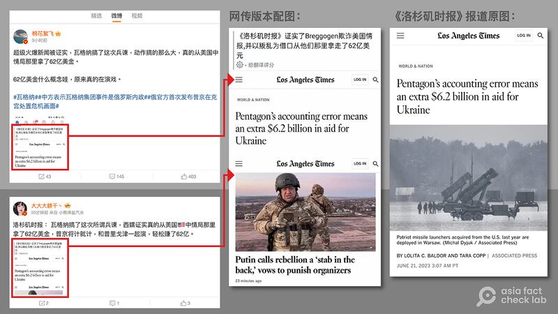
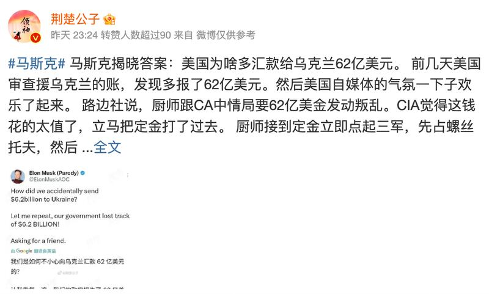

# Did U.S. media confirm that the CIA gave the Wagner Group US$6.2 billion?

## Verdict: False

By Zhuang Jing and Rita Cheng

2023.07.05

## In Brief

Following the Wagner Group's short-lived insurrection in Russia last month, several verified users of the popular Chinese social media platform Weibo claimed that the Russian mercenary army had accepted US$6.2 billion from the U.S. Central Intelligence Agency. The users cited the *Los Angeles Times* as the source and circulated screenshots of the purported article in their posts.

Asia Fact Check Lab (AFCL) found this claim to be false. The *LA Times* published no reports on a U.S. allocation of funds to the Wagner Group.

Users on Weibo and Twitter circulated screenshots of an LA Times report that they claimed confirms the Wagner Group received $6.2 billion from the CIA. The original LA Times article does not mention the group, and the original lead picture has been changed to one showing Wagner’s leader Yevgeny Prigozhin. Photos taken from Weibo and the LA Times websites.[Text - top left] Breaking news confirms that the current large-scale revolt by Wagner accepted $6.2 billion from the CIA. [Text - bottom left] The Los Angeles Times: Wagner – the mercenary group staging the current revolt – is confirmed by Western media as taking $6.2 billion from the CIA. Beating the CIA at its own game, Putin and Prigozhin are both acting in order to net an easy $6.2 billion. [Middle] Screenshot of altered version of the LA Times article on Weibo [Text - Weibo post headline] The Los Angeles Times confirms that Breggogen dupes U.S. intelligence, netting $6.2 billion by feigning a revolt. [Right Side] Screenshot of original LA Times article

The article that has been circulating actually reports on a $6.2 billion surplus in U.S. military funds that is expected to be sent to Ukraine, and does not mention the Wagner Group. The Weibo posts include an erroneous Chinese-language translation of the original article’s English-language headline and a photo of the Wagner Group’s leader that is not present in the original report.

## In Depth

As the war between Russia and Ukraine entered its 16th month, the Russian private military company Wagner Group on June 24 launched a brief armed rebellion against the Kremlin. Wagner leader Yevgeny Prigozhin ended the mutiny the next day following mediation by Belarus.

The dramatic turn of events attracted global attention. In China, the term “Wagner” was Weibo’s top-trending topic on June 24–25, with related posts generating a range of comments and speculation.

Verified Weibo users with hundreds of thousands of followers each soon set off a public frenzy by claiming U.S. media was reporting that Wagner had accepted $6.2 billion from the CIA before staging the rebellion. Their posts included screenshots of an *LA Times* article as alleged evidence.

## What did the   *LA Times*   actually report?

AFCL found that these screenshots appeared to feature a doctored version of [an *LA Times* article](https://www.latimes.com/world-nation/story/2023-06-21/pentagon-accounting-error-extra-money-ukraine-aid#:~:text=The%20Pentagon%20said%20Tuesday%20that,used%20for%20future%20security%20packages.) published on the newspaper's website on June 21. The original article, headlined "Pentagon's accounting error means an extra $6.2 billion in aid for Ukraine," discusses an accounting mistake by the Pentagon that is expected to send an extra $6.2 billion in aid to Ukraine. The article is accompanied by a photo of U.S. Patriot missile launchers, and does not mention or show any images of the Wagner Group, Prigozhin or the CIA.

Indeed, a keyword search via Google for “Wagner” and “CIA” failed to find any U.S. media reports confirming rumors of a U.S. payment to the Wagner Group.

The altered version of the *LA Times* article spread by Weibo and Twitter users includes an erroneous Chinese translation of the headline: "*The Los Angeles Times* confirms that Breggogen [Prigozhin] dupes U.S. intelligence, netting $6.2 billion by feigning a revolt." Below it, the article's original headline and article, both in English, can be seen.

The doctored version also includes a different lead photograph accompanying the story of Wagner Group leader Prigozhin dressed in military gear, which AFCL found to be [a still image](https://www.reuters.com/world/europe/russias-wagner-chief-warns-frontline-collapse-if-forced-retreat-bakhmut-2023-03-06/) from a video released on March 3, 2023.

Another netizen [claimed](https://m.weibo.cn/status/4917513164689387) in a separate post that billionaire businessman Elon Musk had also tweeted confirmation that Wagner had accepted money from the CIA.

However, the Twitter account [referenced by](https://twitter.com/ElonMuskAOC/status/1671282969133318144) the netizen is clearly labeled as a parody Musk account belonging to an anonymous user. Furthermore, the tweet itself only questions the $6.2 billion sent to Ukraine and makes no mention of the Wagner Group.

A verified Weibo user retweeting posts from a parody account of Elon Musk belonging to an anonymous user. Screenshot from Weibo. [Text] Musk gives the answer: Why did the U.S. send $6.2 billion to Ukraine? A few days ago, the U.S. conducted an audit which found that an additional $6.2 billion in aid had been sent to Ukraine. In a blink, the atmosphere on U.S. social media turned joyful. It’s reported that Prigozhin wanted $6.2 billion from the CIA in order to start the revolt. Thinking it was cash well spent, the CIA agreed immediately and sent a deposit along. After receiving it, Prigozhin immediately set his three armies in motion, first capturing Rostov-on-Don before.

## Where did the extra billions in aid to Ukraine come from?

The $6.2 billion in expected additional military aid to Ukraine results from an accounting error by the Pentagon. Deputy Pentagon Press Secretary Sabrina Singh [explained in a June 20 news conference](https://www.defense.gov/News/Transcripts/Transcript/Article/3433535/deputy-pentagon-press-secretary-sabrina-singh-holds-a-press-briefing/) that the U.S. military had overestimated the cost of certain equipment and services promised to Ukraine over the last two years by using replacement cost value (the cost of replacing an item without accounting for depreciation) instead of net book value (the value of an asset less depreciation). She said the unexpected surplus would go into the pot of money used by the Pentagon for future stock drawdowns, such as for arming Ukraine.

## Have U.S officials commented on the allegation?

President Biden has [denied any U.S. involvement](https://www.cbsnews.com/news/biden-wagner-group-russia-mutiny/) in the Wagner mutiny, stating that the White House views the development as "part of a struggle within the Russian system." He said the U.S. and its allies would not give Russian President Vladimir Putin any excuse to blame the West or NATO for the incident.

Prigozhin and the Wagner Group have been subject to a variety of [sanctions](https://home.treasury.gov/news/press-releases/jy1220) by the U.S., European Union, and other countries, for their involvement in the current war against Ukraine and other alleged human rights violations. The Treasury Department [issued a statement](https://home.treasury.gov/news/press-releases/jy1581) on June 27 noting that four companies in Russia, the United Arab Emirates, and the Central African Republic suspected of engaging in illegal gold transactions and providing funds to the Wagner Group would be sanctioned. U.S. State Department officials [said these sanctions](https://www.state.gov/briefings/department-press-briefing-june-27-2023/#post-457240-RussiaBelarusUkraine) were unrelated to the June 24 rebellion.

The CIA declined to comment on the Chinese netizen reports that it had funded the Wagner Group, while the State Department responded to AFCL's queries on the issue by [forwarding a White House statement](https://www.defense.gov/News/Transcripts/Transcript/Article/3433535/deputy-pentagon-press-secretary-sabrina-singh-holds-a-press-briefing/) on Biden's denial.

## Conclusion

AFCL found Chinese Internet rumors that the *LA Times* had confirmed a $6.2 billion transfer of CIA funds to the Wagner Group to be false. The U.S. newspaper did not publish any reports about this issue. Chinese netizens instead circulated a doctored *LA Times* article about $6.2 billion in expected additional aid to Ukraine—featuring a mistranslation of the original headline and an altered photo.

## *Translated by Shen Ke.*

## *Asia Fact Check Lab (AFCL) is a branch of RFA established to counter disinformation in today’s complex media environment. Our journalists publish both daily and special reports that aim to sharpen and deepen our readers’ understanding of public issues.*

[Original Source](https://www.rfa.org/english/news/afcl/fact-check-wagner-cia-07052023144421.html)