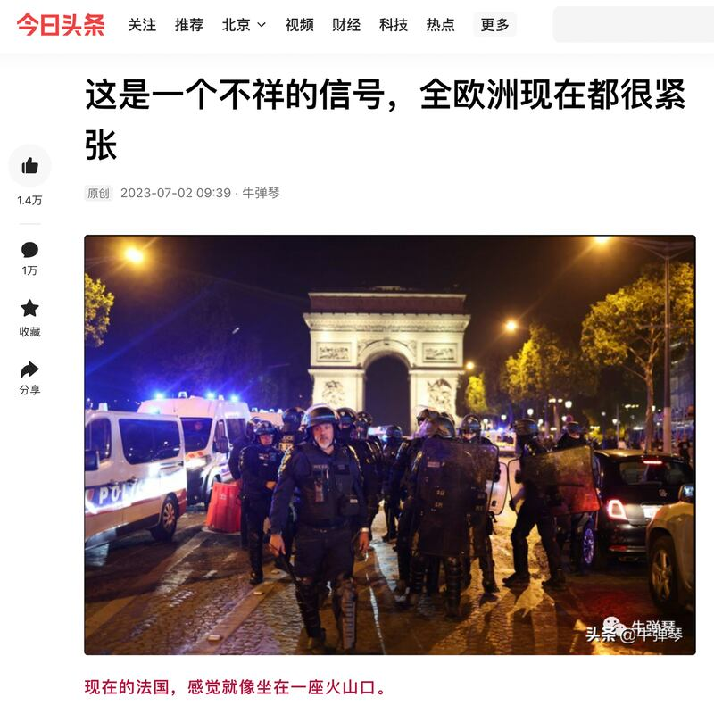
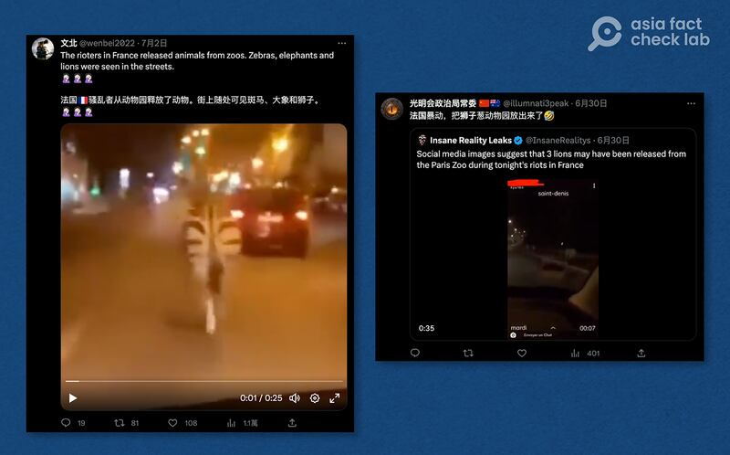
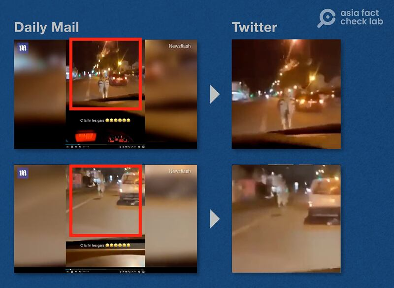
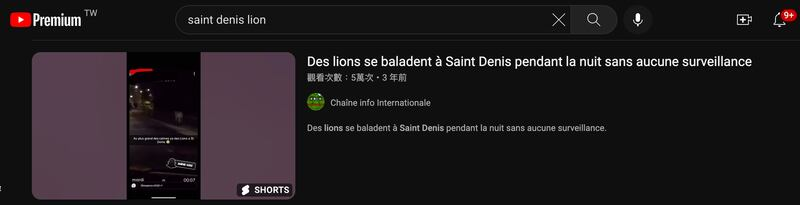
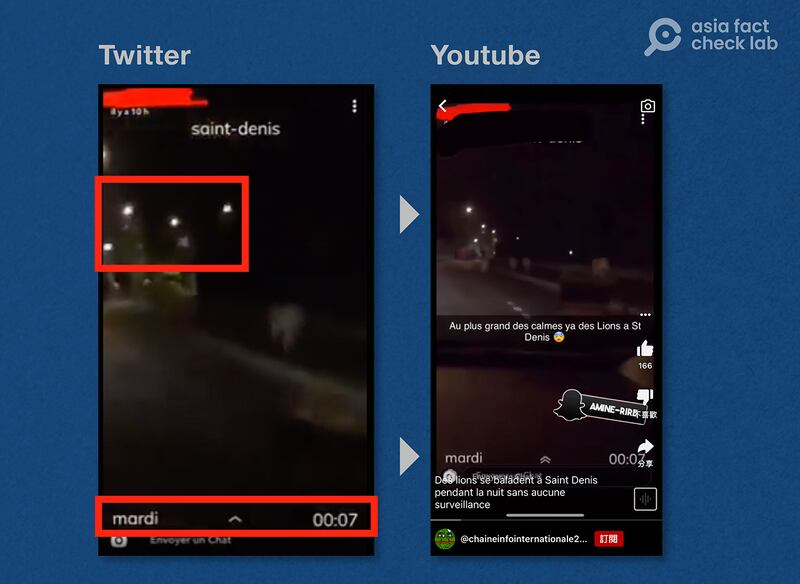
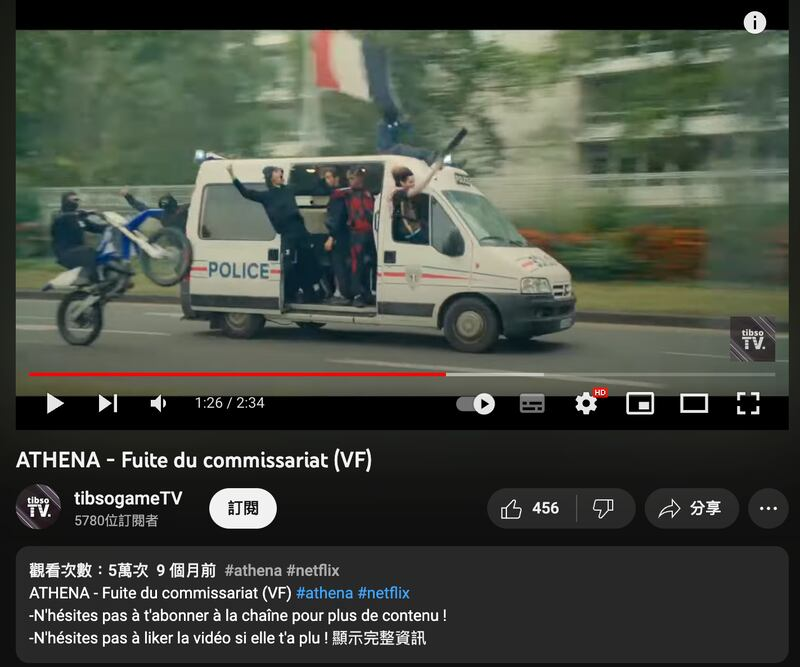
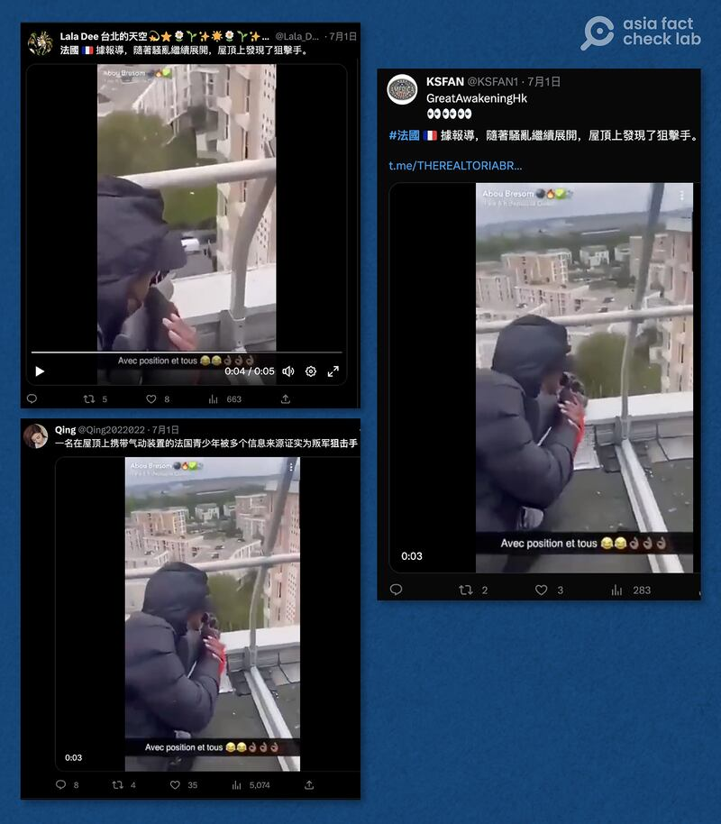
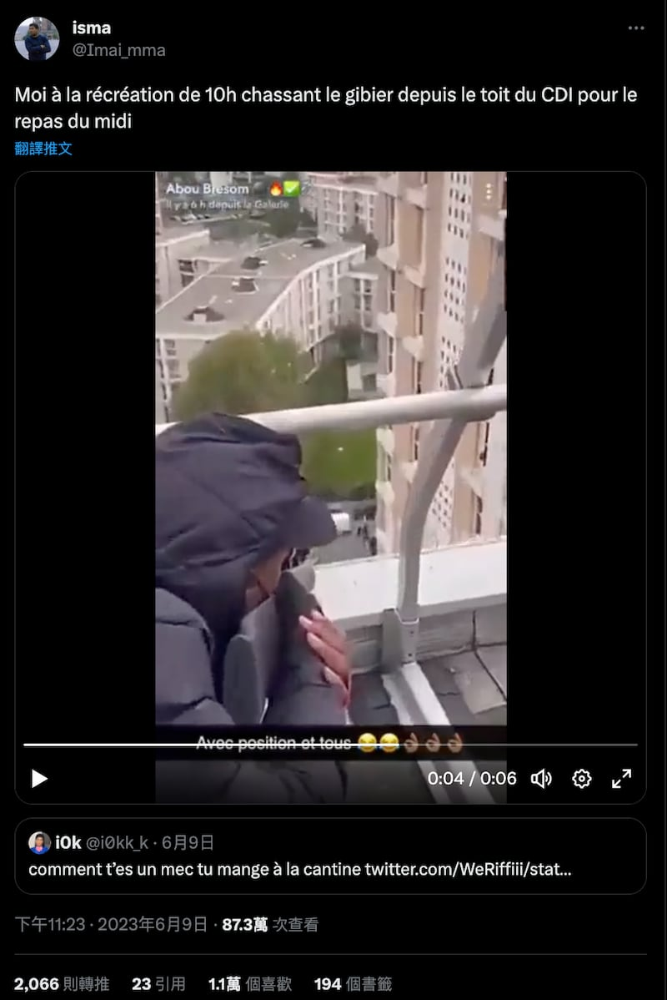
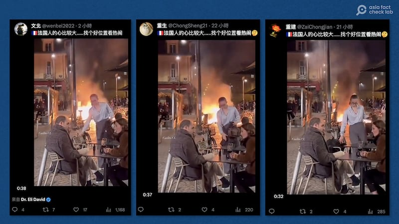

# China’s social media coverage of French riots rife with misinformation, distortion

## Many accounts of the strife in France used photos from older incidents or otherwise misrepresented the event.

By Dong Zhe for Asia Fact Check Lab

2023.07.11

## In Brief

The death of a French teenager of African descent shot by police during a roadside confrontation has sparked public clashes with police and riots across France.

Coverage of the riots by Chinese language Twitter accounts are rife with misinformation accompanied by misleading videos not taken during the riots and fake images “corroborated” by other fake images.

Asia Fact Check Lab (AFCL) checked and disproved four such widely circulated stories about the riots.

## In Depth

## Are animals running wild on the streets?

An article [published](https://mp.weixin.qq.com/s?__biz=MzA5OTk4NDYwMw==&mid=2651482942&idx=1&sn=8c56057409d077d4a00500d5b77f11eb)by Liu Hong, the former deputy editor-in-chief of the Chinese news outlet Huanqiu magazine, for the Wechat news column *Jinri Toutiao* on July 2 mentions that "several lions and elephants" were released from a zoo during the riots, without providing any visuals to support the claim.

A Jinri Toutiao article describing the riots in France. The title reads, “This is an ominous sign that all of Europe is now on edge.” Credit: dcreenshot taken from Jinri Toutiao

After running keyword searches for “riots in France” and “zoos” across both Twitter and Facebook, AFCL found several accounts making similar claims that included various videos as evidence. Two of the most widely circulated clips were of a zebra and lion escaping from the zoo. Image searches using screenshots taken from both videos provided no results due to poor image quality.

Chinese netizens on Twitter posted videos of animals escaping from the riots in France, including both a zebra (left) and a lion (right). Credit: screenshot from Twitter.

However, a follow-up search for related stories using the phrase "zebra escape france" showed that a similar video clip of the zebra [was published](https://www.dailymail.co.uk/news/article-8214085/Escaped-zebra-canters-road-Parisian-suburb.html) in a report by the UK news outlet *Daily Mail* on April 13, 2020.

A keyword search revealed that a video released by the Daily Mail matches a clip purporting to show a zebra released during the recent riots. Credit: screenshot taken from Google

The report states that the zebra escaped from a zoo in the Paris suburb of Ormesson-sur-Marne during a COVID lockdown in 2020 before being filmed running on the road.

The clip circulating on Twitter is footage from the original Daily Mail video. Credit: screenshots from the Daily Mail and Twitter.

A separate video spread on [Twitter](https://twitter.com/LogKa11/status/1674879717478989825) and [TikTok](https://www.tiktok.com/@okkessulayici/video/7250597400077765915) with the phrase "saint denis" in the title also purported to show lions let loose during the riots. AFCL searched Google using the phrase "saint denis lion" and found that a user had [posted the same video](https://www.youtube.com/watch?v=YAB3XwKB2FY) on YouTube in 2020.

Search results showed that a video purportedly showing lions released during the recent riots across France was posted on YouTube three years ago. Credit: screenshot taken from YouTube

Despite the edited version of the video showing only the top half of the original video’s frame, both versions have an identical name of “mardi” located in the lower left frame. The two videos’ identical lighting, framing and content confirm that they come from the same source.

Comparing the similar sources of light in both videos proves that they come from the same source. Credit: creenshots taken from Twitter and YouTube.

## Did armed French teenagers hijack a police car?

The [same article](https://mp.weixin.qq.com/s?__biz=MzA5OTk4NDYwMw==&mid=2651482942&idx=1&sn=8c56057409d077d4a00500d5b77f11eb) on *Jinri Toutiao* that mentioned the animals also included a photo of armed youths driving a police car while holding a French flag, accompanied by a warning to all Chinese tourists in France to avoid areas already hit by the riots and to report any emergencies to the police.

This same photo was separately [posted](https://twitter.com/chen09522741/status/1675361423533264896) by a Chinese language Twitter account accompanied by a description that the protesters were armed with military weapons and had hijacked a police car during the course of the riots.

Copies of the same photo supposedly showing French teenagers hijacking a police car. On Jinri Toutiao (left) the caption tells Chinese tourists in France to take precautions and remain vigilant, while a Chinese netizen on Twitter (right) claims that the car was hijacked by youth armed with military weapons. Credit: creenshots taken from Jinri Toutiao and Twitter

Several accounts on the popular Chinese social media site Weibo also reposted the photo, claiming that the police have turned into bandits during the riots in France.

The photo of French youths hijacking a police car was also posted on Weibo. One of the post titles claims that the police in France have turned into bandits. Credit: screenshot from Google

After searching the photo through Google, AFCL found it had originally been posted online in January 2023, before the riots began. One of the results from the search was a link to the Chinese video sharing platform Douyin, where a suggested keyword "Athena movie" and a final search using the phrase found revealed that the photo was actually a still taken from the 2022 Netflix movie *Athena*.

Google search results show that the phrase “Athena film” appeared in the title of a video posted on Douyin in January 2023. Credit: screenshot taken from Google

The same image [appears at 1:26](https://youtu.be/NuAzwWGFJVI?t=86) in the film's official trailer, proving that the photo was not taken during the recent riots in France.

The same image appeared in a trailer for Athena. Credit: screenshot from YouTube.

## Were French youths shooting like snipers from the tops of buildings?

A separate photo circulated by Chinese netizens on Twitter shows a young man in a black down jacket aiming down from a tall building while holding what appears to be a sniper rifle, with captions added by the netizens describing the person as a teenage sniper in the riots.

Chinese Twitter users reposted an image of a person who they all separately claim is a sniper amidst the riots in France. Screenshot from Twitter.

AFCL searched the photo on Google and found a video uploaded by a Twitter user on June 9, 2023 among the search results.

The photo matches a video posted by a Twitter user on June 9, 2023. The caption reads, “I'm hunting from the roof of the CDI during the 10am break to get ready for lunch.” Credit: screenshot from Twitter

The search also returned sources dated as early as 2022, however the links to these older search results were broken. AFCL was unable to further verify whether the video features a real sniper or is merely a prank. Regardless, the earlier posting dates of all these results verify that this image is unrelated to the recent riots in France.

Earlier online videos of the same person appeared in 2022, but the link is broken and the original content cannot be checked. Credit: screenshot from Twitter

## Do French people enjoy sipping wine even during a riot?

Several Twitter accounts posted the same photo of a man and woman sipping wine on a street with a fire burning directly behind them, accompanied by nearly identical comments that read “French people have big hearts. ...... Find a good spot to watch the action.”

Several Chinese Twitter users retweeted a photo of French people supposedly sipping wine during the riots. Credit: screenshot from Twitter

The photo in fact had nothing to do with the current riots. The photo appears in a March 2023 [report](https://www.independent.co.uk/news/world/europe/france-pension-protest-macron-fire-b2308516.html) from the British newspaper *The Independent* which notes that it was taken during separate protests launched that month against French President Emmanuel Macron's pension reform. Many Weibo discussions at the time commented on French people's ability to maintain calm in the face of the riots.

The same photo was discussed on Weibo in March 2023. The accompanying caption reads, “On how the French can remain so calm when facing a riot.” Credit: screenshot from Weibo

## *Asia Fact Check Lab (AFCL) is a branch of RFA established to counter disinformation in today’s complex media environment. Our journalists publish both daily and special reports that aim to sharpen and deepen our readers’ understanding of public issues.*

[Original Source](https://www.rfa.org/english/news/afcl/china-france-riots-07112023154206.html)