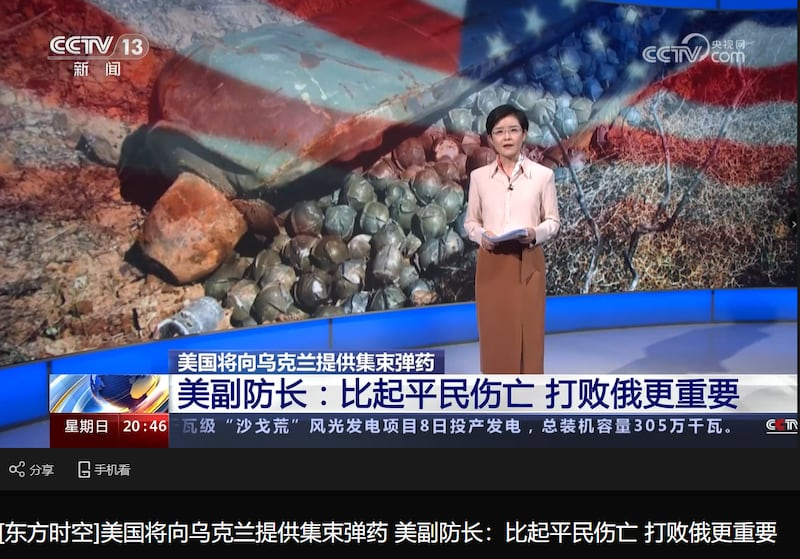
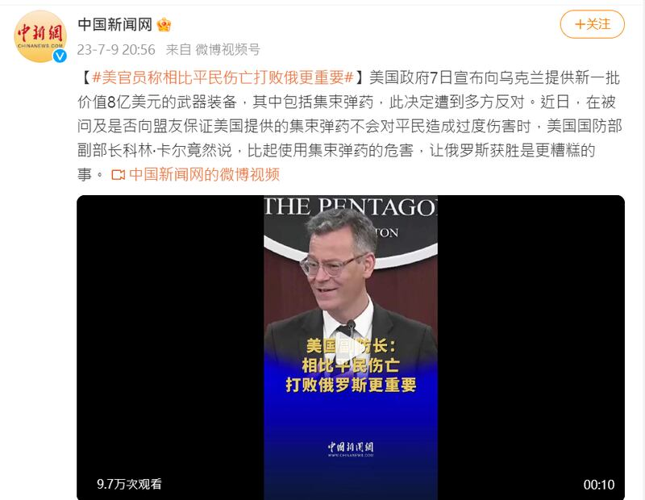

# Did a US Defense Department official downplay civilian casualties from cluster bombs?

## CCTV and other Chinese media outlets twisted Colin Kahl’s remarks on Ukraine and spread misinformation.

By Zhuang Jing for Asia Fact Check Lab

2023.07.13

## In Brief

The recent announcement that the U.S. will provide cluster bombs to Ukraine has sparked controversy about potential civilian casualties caused by the weapons. In the wake of the announcement, official Chinese state media outlets such as CCTV and China News Network reported that Colin Kahl, under secretary of defense for policy, stated that “defeating Russia is more important than civilian casualties.”

Asia Fact Check Lab (AFCL) found that Kahl did not say this and that these reports have twisted his original meaning in order to spread misinformation. Kahl did emphasize that sending the bombs was important to help forestall ammunition shortages during Ukraine’s ongoing counteroffensive, but he did not downplay the severity of potential civilian deaths.

## In Depth

The cluster bombs are included amongst the latest round of military aid to Ukraine [announced](https://www.defense.gov/News/Releases/Release/Article/3451570/biden-administration-announces-additional-security-assistance-for-ukraine/) by the U.S. on July 7. President Joe Biden [said](https://edition.cnn.com/2023/07/07/politics/joe-biden-cluster-munitions-ukraine/index.html) sending the bombs was a "very difficult decision" made due to a shortage of ammunition by the Ukrainians.

The president also noted that the U.S. is not a signatory to the [Convention on Cluster Munitions](https://www.clusterconvention.org/), an international treaty outlawing the use of such weapons. Human rights groups and signatories of the convention such as the U.K. and Canada have criticized the move. China is also not a signatory, and its foreign ministry did not explicitly oppose the move, but it did [emphasize](https://www.fmprc.gov.cn/eng/xwfw_665399/s2510_665401/2511_665403/202307/t20230710_11110957.html) that irresponsibly transferring such weapons "is highly likely to cause humanitarian issues."

## What did Kahl say?

In a followup [Department of Defense press conference](https://www.pbs.org/newshour/world/watch-live-pentagon-holds-briefing-amid-reports-u-s-will-send-cluster-munitions-to-ukraine) following the announcement, Kahl responded to a question about the reason for sending the bombs by [saying](https://www.defense.gov/News/Transcripts/Transcript/Article/3452000/under-secretary-of-defense-for-policy-dr-colin-kahl-holds-press-briefing/), "I'm as concerned about the humanitarian circumstance as anybody but the worst thing for civilians in Ukraine is for Russia to win the war, and so it's important that they don't [win]."

Kahl also noted that the request to send the bombs was only granted after Ukraine agreed to several preconditions. These include not using the bombs “in civilian-populated urban environments,” recording locations where the bombs are dropped and demining areas hit by the bombs when the war is over.

## How did Chinese media report what Kahl said?

The Chinese state-controlled media outlet *Huanqiu*  [released](https://world.huanqiu.com/article/4DeIjb7kSHG) a short video on the night of July 9 misquoting Kahl's remarks. The headline reads, "Under Secretary of Defense says that compared to civilian casualties, defeating Russia is more important."

CCTV News reported on July 9 that Colin Kahl, U.S. under secretary of defense for policy, said “defeating Russia is more important than civilian casualties.” Credit: photo taken from CCTV News

The headline soon went viral and was reused in a report by China's leading state news organization [China Central Television](https://tv.cctv.com/2023/07/09/VIDEcbq6bKo4u8AvpZw3a0or230709.shtml) (CCTV). CCTV also mistranslated some of the subtitles of Kahl's speech, changing the latter part from "it's important that they don't" to "it's *more* important that they don't" and adding the phrase "compared to civilian casualties," which wasn't mentioned by Kahl at all.

Following the CCTV broadcast, the headline was then copied and reused in several memes and short video clips produced by a range of Beijing backed media outlets and posted on a variety of social media platforms. One such posting on Twitter produced by the Hong Kong China News Agency features a [meme](http://www.hkcna.hk/docDetail.jsp?id=100409275&channel=2810) based on the headline which added the mocking punchline that, "Winning by any means necessary is the true value of Westerners!" Netizens soon further repeated claims similar to the headline in their comments.

The social media account of the China News Service released video clips and memes repeating claims made by CCTV about remarks by Colin Kahl, U.S. under secretary of defense for policy. Credit: screenshots taken from Weibo and Twitter.

In addition to misconstruing the intent of Kahl’s response, all of these reports omitted any mention of the U.S. preconditions requested of Ukraine with which Kahl prefaced his original response.

## Conclusion

Although the U.S. decision to provide cluster munition to Ukraine has indeed sparked controversy in many quarters, no U.S. official has ever said defeating Russia is “more important” than civilian lives.

The social media account of the Hong Kong China News Agency released videos clips and memes repeating claims made by CCTV about Colin Kahl, U.S. under secretary of defense for policy. The bottom punchline of the meme reads “Netizens retort: Winning by any means necessary is the true value of Westerners!” Credit: screenshots taken from Weibo and Twitter.

The CCTV headline misinterprets the original intent of Kahl’s response and subsequent visuals, while reports from other state-affiliated Chinese news media continued to spread this misleading information.

## *Asia Fact Check Lab (AFCL) is a branch of RFA established to counter disinformation in today’s complex media environment. Our journalists publish both daily and special reports that aim to sharpen and deepen our readers’ understanding of public issues.*

[Original Source](https://www.rfa.org/english/news/afcl/china-usa-cluster-07132023111145.html)