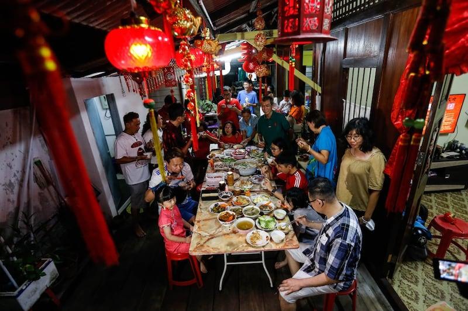

# A look at how Beijing influences Chinese media, diaspora in Malaysia

## Subtle coercion through embassy keep Malaysian Chinese press mostly pro-Beijing, Asia Fact Check Lab found.

Asia Fact Check Lab

2023.07.19

## UPDATED at 11：40 a.m. EDT on 2023-07-20

Xiaoling bristles when asked about alleged detention camps where Uyghurs have been forcibly confined by China’s government.

“Have you been to Xinjiang? No? Then go and see Xinjiang first,” said the second-generation Chinese immigrant to the Southeast Asian country.

Meanwhile in a report published last August, the U.N. High Commissioner for Human Rights said China had committed “serious human rights violations” against Muslim Uyghurs in re-education or internment camps in the Xinjiang Uyghur Autonomous Region (XUAR).

So where did 65-year-old Xiaoling get her information from?

Malaysian Chinese over the age of 61, with lower education levels who speak mainly Chinese (Mandarin), have a relatively favorable view of China, a survey done by Taiwan-based Doublethink Lab found. They tend to rely on traditional media such as newspapers and television to receive news.

Chinese language newspapers and television in Malaysia have a role to play in creating positive perceptions of China among the country’s ethnic Chinese population, as interviews by Asia Fact Check Lab with journalists from and consumers of Malaysian Chinese media revealed.

At the same time, the Malaysian Chinese media are not entirely responsible for these perceptions. Chinese television channels broadcast in Malaysia also beguiled the diaspora, AFCL found as well.

In a multi-ethnic, multi-religious country like Malaysia, communal tensions can arise when a section of the population has no access to all the facts on an issue. Malaysia is predominantly Muslim, but the ethnic Chinese minority makes up about a fifth of the nation’s population.

The Lim clan has dinner together to celebrate Chinese New Year, at Weld Quay in Penang, Malaysia, Jan. 31, 2022. [A. Ammarudin/BenarNews]

On the issue of the Muslim Uyghurs of Xinjiang, the mainstream English language press in Malaysia had carried reports from Western news agencies about the U.N. findings and so did the Malay-language press. Agencies such as Reuters and the Associated Press included a sentence or two of denial from the Chinese government.

The Chinese-language press covered it slightly differently.

According to Li Wen Yue, a senior executive at a Chinese-language newspaper in Malaysia, in a situation where the East and West hold polarized views, such as on Xinjiang, the best way is to “let both sides speak.”

She said she would compile the official Chinese statements and also quote foreign media reports on the situation in the re-education camps, leaving it for readers to judge.

“So the newspaper would say, ‘I give you the space, you talk about your views, he talks about his views.’ When he accuses you of only reporting one side, you can say, ‘I also reported on your views,’” she told AFCL.

“If the Chinese embassy has any objections to the reporting, or calls to enquire, the newspaper can also explain that it is quoting foreign media, not reporting out of thin air.”

And yet, Xiaoling, and many other Malaysian Chinese view China in a positive light compared with other ethnicities in the Southeast Asian country, research has shown.

In fact, compared to 2016, the percentage of Malaysian Chinese who had a favorable view of China increased to 67% in 2022 from 41%, a survey conducted by the Merdeka Center and the China Studies Institute at the University of Malaya found.

Malays make up close to 70% of Malaysia’s population, and all of them are Muslim. Ethnic Chinese comprise almost 23% of the population, and ethnic Indians 6.6%.

People take part in an event in front of the Chinese embassy in Kuala Lumpur in solidarity with the Uyghur community in China and to commemorate the 10th anniversary of the riots in Urumqi, the regional capital of Xinjiang, that left nearly 200 people dead, July 5, 2019. [Mohd. Rasfan/AFP]

Malaysian Chinese families, like most Malaysian homes, have cable television, which has become especially ubiquitous since the pandemic.

That gives them access to mainland Chinese state-run media such as CCTV and Phoenix. These networks broadcast content that is not directly political, such as programs about technology, cuisine and agriculture, as well as variety shows and dramas.

These programs show high-rise buildings in Shanghai and average Chinese using cutting-edge technology. Such content dazzles people like Xiaoling and her friend, 62-year-old housewife Qiuping, who marvel at what they see as China’s development, according to Malaysian media scholar Chen Ming-hui.

Xiaoling and Qiuping told AFCL that they envied the lives that the Chinese lead – or the lives they thought they led – and that they wished Malaysia could be led by Chinese President Xi Jinping.

Malaysia’s democracy, they believed, had brought “chaos,” and China’s one-party rule and Xi’s leadership were necessary, they told AFCL.

## Chinese Embassy’s ‘concerns’

Playing an adjunct role in influencing Malaysian Chinese perceptions of China is the Chinese press in Malaysia.

Well known Chinese-language mainstream newspapers in Malaysia include Sin Chew Daily, China Press, Nanyang Siang Pau and Oriental Daily News.

Sin Chew Daily is the largest, with a circulation of about 350,000 copies in print and electronic form, and about 1.5 million readers a day.

All but the Oriental Daily News, are run by Media Chinese International (MCIL), which is owned by Malaysian businessman Tiong Hiew King, who has investments and business relations in China.

Chinese-language media under MCIL tended to report positively on Malaysia’s and China’s business dealings, and was relatively pro-China, said a 2022 report by Freedom House, an American NGO.

Much of this pro-China reporting, though, does not result from direct Chinese embassy coercion, AFCL found.

What the Chinese Embassy does is express “concern” over a news item, said Chen Zhi De, a Malaysian Chinese journalist.

“China does not interfere with every event, as it would create resentment,” he told AFCL

He added that the embassy couches its concerns in very polite language, which nevertheless delivers the message.

One too many “concerns” and the publication will find that Chinese businesses are suddenly withdrawing advertisements and the Chinese embassy is boycotting it, said a 2016 thesis paper by Taiwanese student Fang Cuiying, of National Taiwan University.

A vendor sells giant incense sticks and other decorations ahead of the Lunar New Year celebrations in Kubang Semang, Penang, Malaysia, Jan. 16, 2020. [Mohd. Rasfan/AFP]

Sometimes, there is pressure from the readership as well.

Lin Wei Hong, a reporter who covered the 2019 protests in Hong Kong against an extradition bill, recalled that readers felt he had given the pro-democracy camp too much press.

“Many times, you just put the phone down and let them complain,” he told AFCL.

But that is not always feasible, most Malaysian Chinese media personnel said.

The survival of Malaysian Chinese newspapers depends on the Chinese community.

Malaysian media scholar Chen said that readers, who include local Chinese leaders and businessmen, exert pressure on the media if they see too much negative news about China, due to their close business ties with China.

Malaysian Chinese journalist Chen Zhi De and some others, however, defend themselves, saying they adhere to professional ethics, and while their reporting may not be perfect, they don’t intentionally take a pro-China stance.

“One kind of rice feeds hundreds of different people,” Chen told AFCL, as he proceeded to talk about MCIL, which owns three of the four top Chinese newspapers in Malaysia.

“If they believe that MCIL is ‘red media,’ everything they read will be red.”

*This report was produced by Asia Fact Check Lab, a unit of Radio Free Asia, a news service affiliated with BenarNews. Shailaja Neelakantan of BenarNews contributed to it from Washington.*

*Due to safety concerns, Xiaoling, Qiuping, Li Wen Yue, Chen Ming Hui, Chen Zhi De, Lin Wei Hong are pseudonyms preferred by the interviewees.*

*CORRECTION: An earlier version of this report had a mistranslation of the English name of Doublethink Lab.*

[Original Source](https://www.rfa.org/english/news/afcl/malaysia-chinese-press-07192023095502.html)