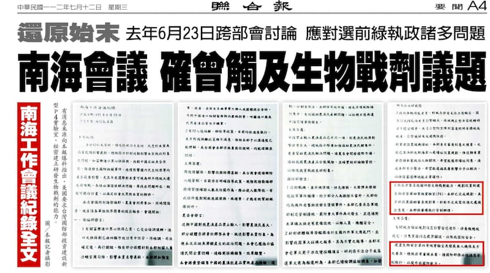
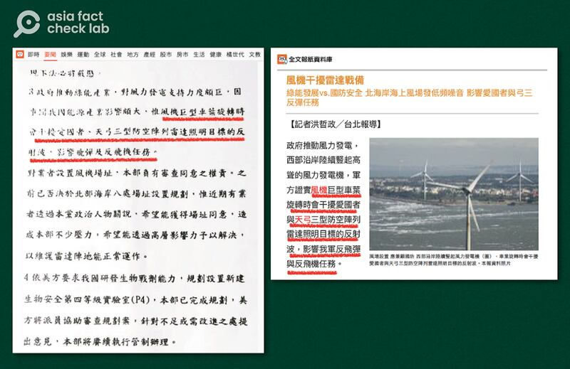
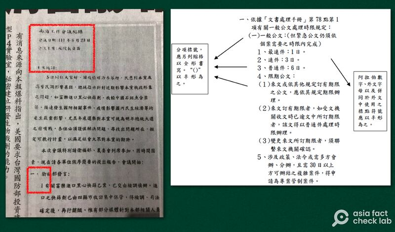

# Did the US ask Taiwan to develop a bioweapon targeting Chinese DNA?

## Verdict: Lack of Evidence

By Chih Te Lee and Dong Zhe for Asia Fact Check Lab

2023.08.01

Taipei

## In Brief

A major Taiwanese daily reported in July that U.S. and Taiwanese officials met in the South China Sea in 2022 to discuss creating a bioweapon lab, citing an alleged “internal document” by Taiwan.

Despite denials from U.S. and Taiwanese authorities, this led to widespread reporting on the claim in Chinese media and social platforms.

However, Asia Fact Check Lab (AFCL) found the claim is misleading and lacks evidence.

UDN published four images of a purported record that took place in the South China Sea in its July 12 paper edition. The headline reads, “South China meeting touched on bioweapons”. (Reproduced from UDN)

## In Depth

*[United Daily News](https://udn.com/news/index)*  (UDN), one of Taiwan's three largest newspapers with a pro-conservative stance of the opposition Kuomintang party, [reported](https://vip.udn.com/vip/story/121940/7287777) on July 9 that it had obtained Taiwan's "internal document" of a meeting in the South China Sea between U.S. officials and representatives of Taiwan's ruling Democratic Progressive Party (DPP).

During the meeting, the U.S. government asked Taiwan's National Defense Medical Center to fund the construction of a [biosafetylevel 4](https://www.cdc.gov/training/quicklearns/biosafety/) (P4)lab for bioweapons research and development, UDN claimed.

The paper later published a follow-up report on July 12, claiming to include photographs of the document from June 23, 2022.

Following UDN’s initial report, numerous official Chinese media outlets published misleading stories about the alleged document.

Concurrently, many outlandish claims made by pro-China political commentators in Taiwan were swiftly adopted by mainland Chinese media. These claims, including one that the purported research is targeting Chinese DNA, were then manipulated into short videos, which rapidly spread across various platforms.

Amid a flurry of media attention, both Taiwanese and U.S. authorities dismissed the claim.

Taiwan's [Office of the President](https://www.president.gov.tw/News/27725), [Executive Branch](https://www.cna.com.tw/news/aipl/202307120062.aspx), [Ministry of National Defence](https://www.mnd.gov.tw/Publish.aspx?p=81690&title=%E5%9C%8B%E9%98%B2%E6%B6%88%E6%81%AF&Types=%E8%BB%8D%E4%BA%8B%E6%96%B0%E8%81%9E) and [Ministry of Foreign Affairs](https://www.mofa.gov.tw/News_Content.aspx?n=95&sms=73&s=115038) separately issued statements denying that the alleged meeting took place, while an anonymous [U.S. State Department official](https://www.cna.com.tw/news/aipl/202307125003.aspx) also said there was "no truth" in the initial UDN report.

AFCL found the document lacks credibility and it alone cannot support the claim regarding the bioweapon development request. AFCL also discovered misleading and false information in the subsequent media coverage.

## Content： Is the entire document original?

Although the majority of media coverage centered on the construction of the bioweapon facility, this topic comprises only a small portion of the alleged internal document.

The document discusses several other issues pertaining to Taiwan’s domestic security and politics, such as the impact of wind turbines on the radar of missiles used by the Taiwanese armed forces, the importation of defective COVID antigen test kits into the country, and a ban on the export of Taiwanese grouper fish by mainland China.

And AFCL found that the part discussing the impact of offshore wind turbines on radar matches an old [UDN report](https://vip.udn.com/vip/story/122664/6400557) on the same subject published in June 2022, which indicates that not the entire document is original.

“The rotation of the wind turbines’ giant blades will interfere with the Patriot and Sky Bow III air-defense array radars’ reflected waves from illuminated targets, affecting our military’s anti-missile and anti-aircraft assignments,” the 2022 report reads in part.

The alleged document published identical sentences with the phrase “our military” replaced with a comma and “and” changed throughout with a synonym.

A portion of text describing the effect of wind turbines on radar (left) in the alleged meeting record nearly matches part of an old UDN report (right). (Photos reproduced from UDN)

## Wording： Is the language used in the document clearly Taiwanese?

No. While both China and Taiwan predominantly use Mandarin Chinese as their official language, Mandarin as spoken in Taiwan and China differ in terms of vocabulary, pronunciation, and some grammatical aspects, reflecting influences from their respective regional cultures, dialects, and foreign languages.

This was pointed out by Taiwanese authorities, who stated that a number of terms found in the alleged document – such as “our party” – would not be used in official Taiwanese government documents, but rather in mainland China.

## Format： Does the document adhere to Taiwanese official format standards?

No. The Taiwanese government regulates standard formatting conventions and templates for all Taiwanese official documents. They can be seen [here](https://www.ey.gov.tw/Page/43FD318D966A30DD).

A review of the purported internal document reveals deviations from several rules outlined in the manual.

Apart from that, lists in all Taiwanese official documents must adhere to a standard numerical hierarchy, when arranging the text into items and bullet points.

However, the purported document does not follow such an order.

The purported records of the meeting published by UDN (left) only record the meeting name, date and chairman (highlighted in upper left). The layout of numeral systems used to list points (highlighted in lower left) also differ considerably from the standard format regulated by Taiwan’s Executive Yuan. (Photos reproduced from UDN and the Executive Yuan official website)

In addition, all official Taiwanese government meeting records checked by AFCL included details such as meeting’s name, time, location, chairman, members, observers, and recorder at the outset of the text.

In contrast, the alleged document omits such details by only including the meeting’s name, date, and chairman.

## How have Chinese media outlets covered the issue?

Chinese state-run newspaper *Global Times* ran an article [titled](https://weibo.com/1974576991/N9mmotEMB), "Taiwanese media: The DPP has completely killed its conscience in order to blindly follow the US." The headline misleadingly implies that the majority of Taiwanese media blamed the DPP over the issue, but in fact, the newspaper was referring to only a single publication.

Separately, the news site *China Military* reported incorrectly on July 15 that the respiratory disease SARS infected a Taiwanese researcher in 2003 and then spread across the island after being leaked from the Institute of Preventive Medicine in Taipei, the location of Taiwan's then-sole P4 facility.

In reality, this person was the last reported case of SARS in Taiwan, [according](https://www.ly.gov.tw/Pages/Detail.aspx?nodeid=6586&pid=85160) to the Taiwanese government in 2004. A news article [published](https://news.cts.com.tw/cts/general/200312/200312170127873.html) in 2003 also noted that the researcher was infected while conducting research on the disease due to insufficient protection.

Mainland Chinese media outlets also picked up misinformation spread by pro-China political commentators in Taiwan.

One example is a claim made by a former Taiwanese legislator Joanna Lei who said during a CTi news program that the U.S. aims to develop bioweapons targeting Chinese people's DNA. She claimed that the research would take place in Taiwan since Taiwanese people share DNAs with Chinese people from the mainland. AFCL previously [debunked](https://www.rfa.org/mandarin/shishi-hecha/hc-05172023143653.html) similar claims.

Former Taiwanese legislator Joanna Lei claimed that the U.S. aims to develop bioweapons targeting Chinese people’s DNA on a Taiwanese television program. Her comments were later edited and uploaded to video platforms in mainland China. (Screenshot taken from Bilibili)

Another example is a claim made by a Taiwanese current affairs commentator, Tung Chih-Sen, that Taiwanese President Tsai Ing-wen’s “rare” inspection of the Institute of Preventive Medicine's biolab was actually a signal to start producing bioweapons. He also claimed that Taiwan’s past presidents had “never” visited the institute.

However, AFCL found that [Chen Shui-bian](https://www.president.gov.tw/NEWS/288) and [Ma Ying-jeou](https://www.ettoday.net/news/20130617/224334.htm), both former presidents of Taiwan, visited the institute in 2003 and 2013, respectively.

A photo of then-President Ma Ying-jeou inspecting Taiwan’s Institute of Preventive Medicine in 2013, posted by a spokesperson for the Ministry of National Defense. The lab located there is the same one President Tsai Ing-wen recently visited. (Screenshot from the Spokesperson of the Ministry of National Defense’s Facebook page)

## In Conclusion

The alleged internal document published by UDN is insufficient evidence to establish that the U.S. instructed Taiwan to develop bioweapons at a South China Sea conference.

The document contains non-Taiwanese phrases, obvious violations of government-mandated formatting conventions, and near-verbatim duplication from an older UDN article. Information available to the public is sufficient to cast doubt on the document's authenticity.

The subsequent coverage by Chinese media and Taiwanese commentators included misleading and false information.

## *Translated by Shen Ke. Edited by Taejun Kang and Mat Pennington.*

## *Asia Fact Check Lab (AFCL) is a new branch of RFA established to counter disinformation in today’s complex media environment. Our journalists publish both daily and special reports that aim to sharpen and deepen our readers’ understanding of public issues.*

[Original Source](https://www.rfa.org/english/news/afcl/fact-check-bioweapon-lab-07312023234448.html)