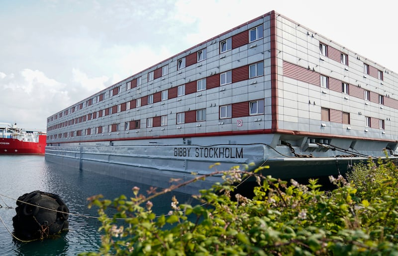
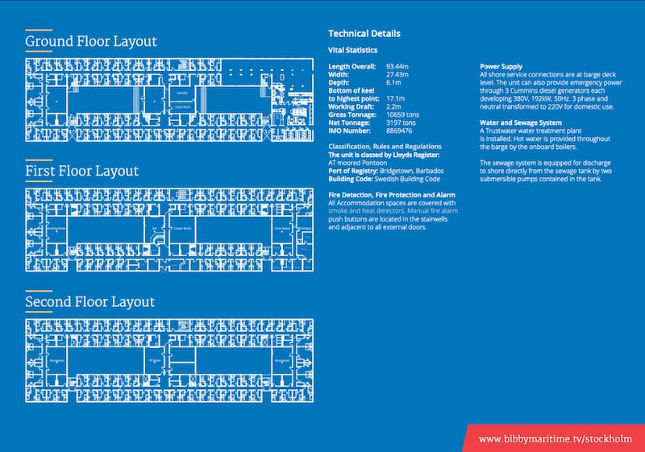
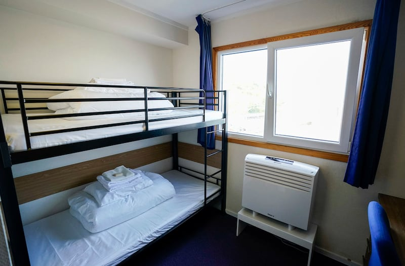

# Has the UK built a floating prison for illegal immigrants?

## Verdict: False

By Dong Zhe for Asia Fact Check Lab

2023.08.04

Taipei

## A video of a ship has been shared in news reports and social media posts that claim it shows a “floating prison” for illegal immigrants built by the U.K.

## But the claim is false. The video in fact shows a barge, which the U.K. will use to temporarily shelter undocumented asylum seekers, not a prison.

Hong Kong news outlet Tong Media posted on Twitter on July 24: “The U.K. constructed a ‘floating prison’ to detain illegal immigrants and eliminate the possibility of escape.”

It was shared alongside a 23-second clip that shows a ship sailing on the water.

Similar videos and claims were also shared by several influential users on the popular Chinese social media platform Weibo.

The claim began to circulate online amid the British government's move to create offshore accommodation for asylum seekers. [According to the BBC](https://www.bbc.com/news/uk-england-dorset-66099583), the government says it currently spends $6 million a day accommodating 51,000 asylum seekers in hotels, and it wants to reduce the cost.

Through a keyword search on Google, AFCL found the ship seen in the posts in fact shows a barge named Bibby Stockholm, which the U.K. will use to temporarily house asylum-seeking migrants awaiting approval of their request.

The British government has faced domestic criticism for its treatment of asylum seekers, and in particular its efforts to deter them from arriving in Britain. Asylum seekers can potentially face deportation if their applications are rejected after a legal process by British authorities.

But AFCL found that the asylum seekers to be housed on the barge, moored on the southern coast of England, will have some freedom of movement and are not classed as “prisoners.”

Social media users in China claim the U.K. government has built a “floating prison.” (Screenshots taken from Weibo and Twitter)

## What is Bibby Stockholm?

Bibby Stockholm, an engineless barge, is an accommodation vessel owned by a British shipping and marine operations company Bibby Line.

An [influx](https://www.gov.uk/government/statistics/irregular-migration-to-the-uk-year-ending-december-2022/irregular-migration-to-the-uk-year-ending-december-2022#how-many-migrants-were-detected-arriving-in-the-uk-via-small-boats) of migrants and subsequent backlog of asylum applications has caused the British government expenditures on housing migrants to rise considerably in recent years, and using Bibby Stockholm instead of a hotel is one step in the U.K.'s effort to lower housing costs. It is the first vessel secured under its cost-cutting move on asylum accommodation.

Exterior of Bibby Stockholm. (Photo/AP)

The initial plan was to load people onto the ship in Portland, Dorset, beginning the first week of August, with the number expected to increase over the following months until the ship contained approximately 500 men. However, the plan was [delayed](https://www.theguardian.com/uk-news/2023/aug/01/no-timeframe-on-delayed-opening-of-bibby-stockholm-asylum-barge) due to "checks."

The three-story ship is 93 meters (306 feet) long and [equipped with](https://www.bibbymarine.com/bibby-stockholm/) game rooms, a restaurant and a bar [as well as](https://www.bbc.com/news/uk-england-dorset-66099583) a gym, a TV lounge and a multi-faith prayer room. The British government has installed bunk beds in all 222 single-occupancy rooms and converted several communal rooms into dormitories.

Bibby Marine, the shipping company which owns Bibby Stockholm, officially introduces the layout of the ship. (Photo taken from Bibby Marine's official website)

While housed on the vessel, the migrants are permitted to exit and move about in designated dockside areas. In addition, they will be able to ride hourly buses through port security to certain shops and areas on the mainland. The British government has not issued a curfew, but they are encouraged to return to the yacht each night by 11 p.m.

In order to increase the number of people that Bibby Stockholm can accommodate, the British government turned the beds into bunk beds. (Photo/AP)

## Why are netizens referring to Bibby Stockholm as a “floating prison?”

AFCL discovered that Chinese netizens likely misappropriated criticisms and concerns over Bibby Stockholm that appeared in recent Western media reports.

The New York Times [reported](https://www.nytimes.com/2023/07/18/world/europe/asylum-seekers-uk-barge-bibby-stockholm.html?smid=nytcore-ios-share&referringSource=articleShare) on July 18 a criticism from residents of Weymouth, a working-class seaside community confronting the Isle of Portland, over the provision of free transportation and easy healthcare access to unemployed asylum seekers.

These residents are also concerned that the migrants may prove a risk to public order if allowed to regularly congregate and idle in Portland harbor during the lengthy wait for their application to be approved, according to the paper.

Residents of Portland protest the planned docking accommodation of asylum applicants next to their town. (Photo/AP)

Some human rights activists also oppose the plan, with more than 40 organizations and individuals [writing](https://www.refugeecouncil.org.uk/latest/news/an-open-letter-to-bibby-marine/) an open letter in early July calling on Bibby Marine to withdraw from the charter agreement with the U.K. government, according to a BBC [report](https://www.bbc.com/news/uk-england-dorset-66094832). The letter claims that housing traumatized migrants on Bibby Stockholm would be "cruel and inhumane."

Concerned about fire safety, the Fire Brigades Union of the U.K also [wrote](https://www.telegraph.co.uk/news/2023/08/02/firefighters-claim-bibby-stockholm-asylum-barge-death-trap/) to the Home Office, stating that the vessel is a "potential deathtrap." The union said that there are no lifejackets on board the barge, and that closed gates could result in a crush in the event of an emergency.

In response, the department stated that it is “confident” in the barge’s fire safety and that “all necessary steps” have been taken to ensure the safety of those who will be living on board.

## *Translated by Shen Ke. Edited by Taejun Kang and Mat Pennington.*

*Asia Fact Check Lab (AFCL) is a new branch of RFA established to counter disinformation in today’s complex media environment. Our journalists publish both daily and special reports that aim to sharpen and deepen our readers’ understanding of public issues.*

[Original Source](https://www.rfa.org/english/news/afcl/afcl-uk-floating-prison-08042023013214.html)