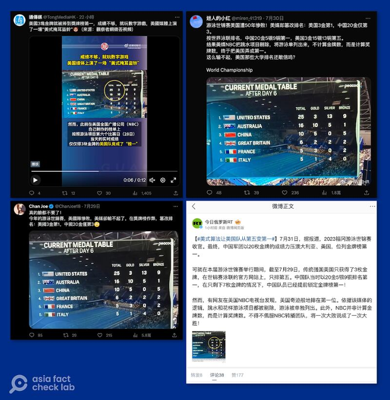
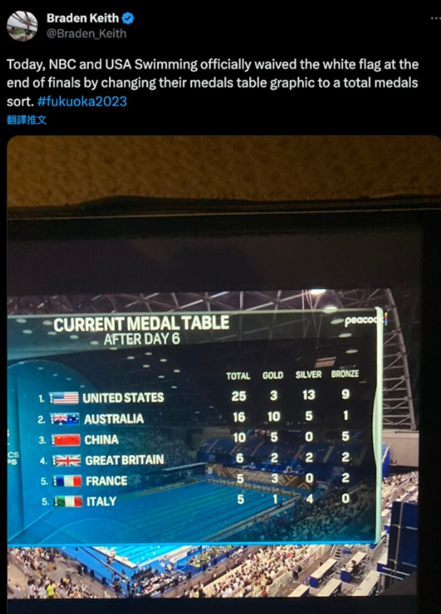

# Did US falsify medal tally in the 2023 World Aquatics Championships?

## Verdict: False

By Dong Zhe for Asia Fact Check Lab

2023.08.07

Taipei

## A screenshot taken from a broadcast of the 2023 World Aquatics Championships has been repeatedly shared in Chinese-language social media posts that claim it shows U.S. media had falsified the country’s final rank in the international championships.

## But the claim is false. The screenshot only shows partial results for the swimming match – one of the competition’s six disciplines, not the final ones for all events, where China ended with the most gold medals.

A tweet posted by a user @ChanJoe18 on July 29 reads: “Rigging the standings, falsifying the rankings: U.S. ranks first with 3 gold medals, China only ranks third with 20 gold medals.”

The claim was accompanied by a screenshot of a medal table of the 2023 World Aquatics Championships, which shows the U.S. ranked first, Australia second and China third by total medals.

The same screenshot alongside similar claims has also been shared in Chinese-language social media posts as well as state media reports in China and Russia.

The international championships were held in Fukuoka, Japan, between July 14 and 30, 2023, with a total of 75 medals awarded across six disciplines: swimming, artistic swimming, open water swimming, diving, high diving, and water polo.

Although it’s a subject of debate whether nations should be ranked by total medals won, rather than gold medals won, there was no factual error in the screenshot, which was misrepresented in these social posts. So the claim is false.

A widely circulated post on Chinese social media claimed that U.S. media falsified the results of the 2023 World Aquatics Championships, with Chinese and Russian official media soon claiming the U.S. was “fooling itself.” (Screenshots taken from Twitter and Weibo)

## Origin of screenshot

Through keyword searches, AFCL found the identical screenshot [published](https://twitter.com/Braden_Keith/status/1684914480545742849) on July 28 in a tweet by the founder of swimming news outlet SwimSwam, [Braden Keith](https://swimswam.com/bio/braden-keith/). A logo and text included in the screenshot show that it was taken from a broadcast of the competition on the NBC streaming platform [Peacock](https://www.peacocktv.com/).

NBC is the oldest of the three major traditional American television networks and covers major sporting events.

"Today, NBC and USA Swimming officially waived (sic) the white flag at the end of finals by changing their medals table graphic to a total medals sort," [said](https://twitter.com/Braden_Keith/status/1684914480545742849) Keith, pointing out the broadcaster's [move](https://www.sportskeeda.com/swimming/news-how-embarrassing-what-powerhouse-usa-swimming-is-netizens-express-mixed-reactions-adding-total-nbc-s-points-table) to rank nations by total medals won rather than by gold medals won. Some netizens joined him in mocking how the medals tally was presented.

According to the medals table in the screenshot, the U.S. leads the tally with a total of 25 medals, despite earning fewer gold medals than Australia and China.

Braden Keith, editor-in-chief of a swimming news outlet SwimSwam, posted the tweet which contained the screenshot later spread by Chinese netizens. (Screenshot taken from Twitter)

## Not final results

AFCL found that the screenshot only displayed [results](https://www.worldaquatics.com/competitions/1/world-aquatics-championships-fukuoka-2023/schedule?phase=All&disciplines=) from the [first six days](https://www.worldaquatics.com/competitions/1/world-aquatics-championships-fukuoka-2023/schedule?phase=All&disciplines=) of the nine-day swimming match at the championships, and is clearly marked as such. The medal counts depicted in the screenshot correspond to the [official tally](https://www.worldaquatics.com/competitions/1/world-aquatics-championships-fukuoka-2023/results?disciplines=SW&event=4947587e-6b4e-400b-a0a2-d7b96e1a2daf) between July 22 and July 27.

The championships [concluded](https://olympics.com/en/news/world-aquatics-championships-2023-leon-marchand-katie-ledecky-top-5-moments-of-fukuoka) on July 30 with China leading the medal tally in all disciplines with 20 gold medals followed by Australia and the U.S. in second and third place, respectively.

## *Translated by Shen Ke. Edited by Taejun Kang and Mat Pennington.*

*Asia Fact Check Lab (AFCL) is a new branch of RFA established to counter disinformation in today’s complex media environment. Our journalists publish both daily and special reports that aim to sharpen and deepen our readers’ understanding of public issues.*

[Original Source](https://www.rfa.org/english/news/afcl/afcl-us-medal-tally-08072023002546.html)