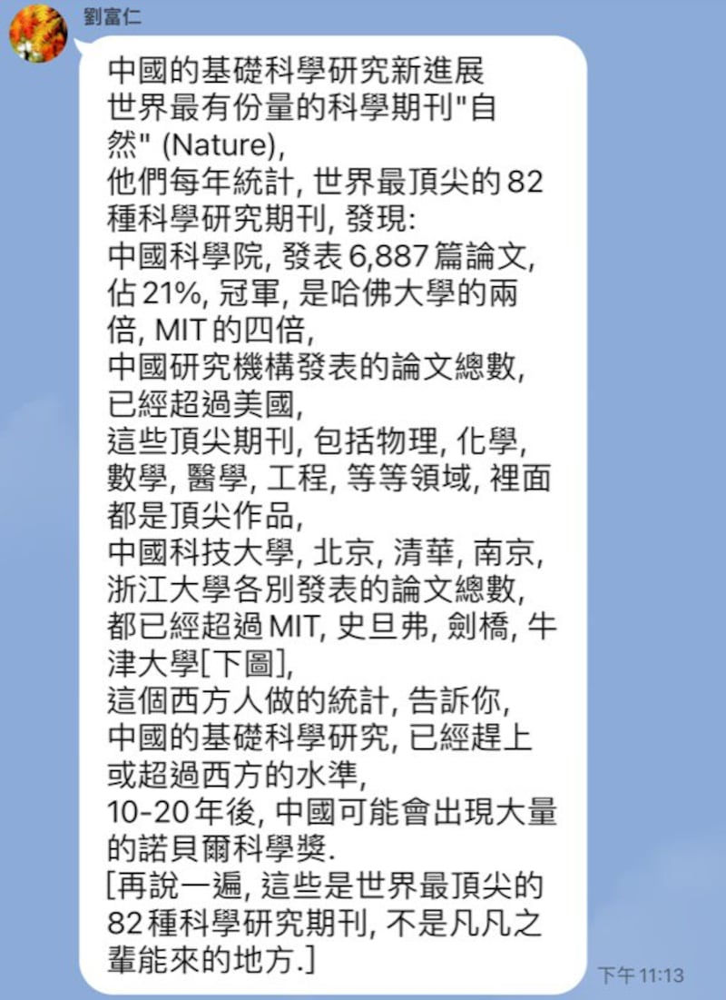
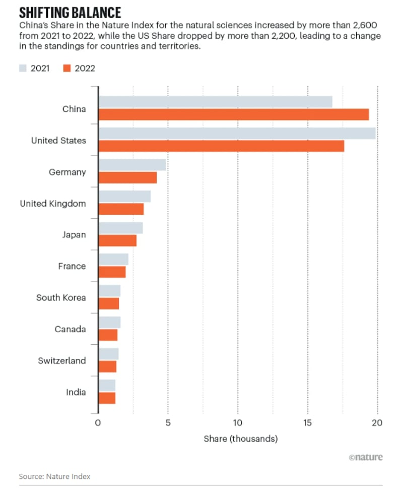
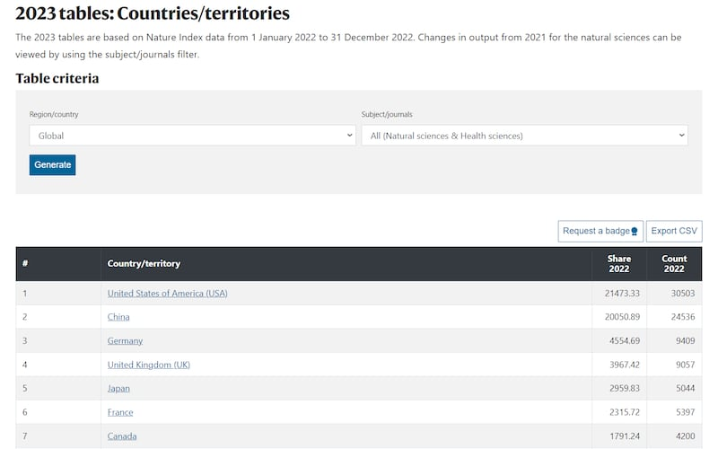
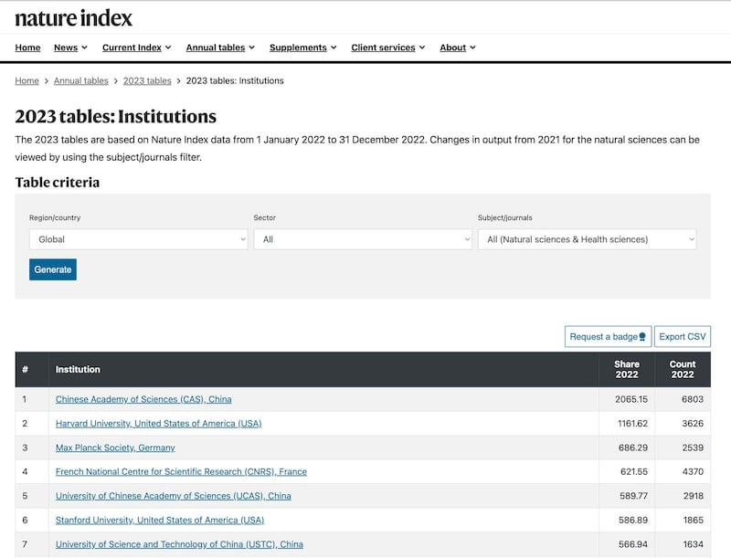
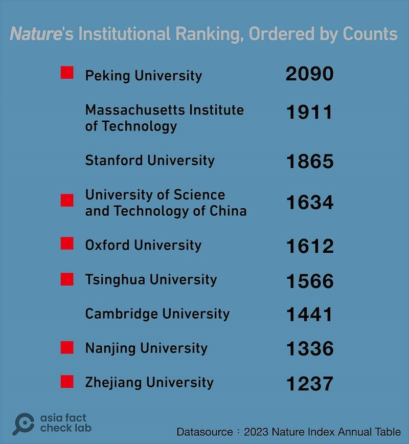
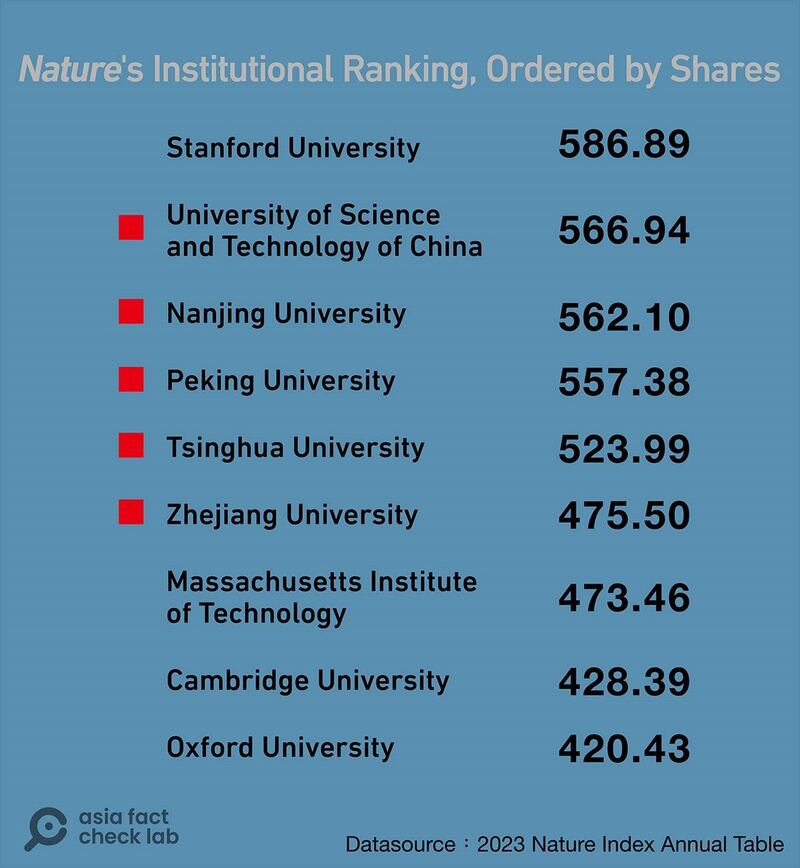

# Did China publish more research in top scientific journals than US in 2022?

## Verdict: Partly true

By Dong Zhe for Asia Fact Check Lab

2023.08.11

Taipei

## An anonymous social media post that China had produced more research in top scientific journals than the United States has ignited a heated debate among Chinese users. The post also claimed the quality of Chinese research now surpasses the West and that China is on track to win Nobel awards for science in the coming two decades.

## The social post, citing data from the scientific journal Nature, is correct in some respects. China for the first time in 2022 surpassed the U.S. in the number of papers published on natural science in 82 journals. But it is misleading in other respects. When more journals are factored in, the U.S. remains the leading source of scientific research. Also, the data do not assess the quality of the research, so any prediction of Nobel prizes is speculative.

The claims were shared in a Chinese-language post on the messaging platform LINE.

“Nature conducts an annual assessment of the top 82 scientific research journals worldwide. Chinese research institutes have now published more papers overall than American counterparts, as reported by the 2023 statistics from the publication,” reads the post in part.

The lengthy post shared a [link](https://www.nature.com/articles/d41586-023-01868-3) to a report published by Nature on June 14, titled: "Nature Index Annual Tables 2023: China tops natural-science table."

Screenshot of the misleading LINE post. (Photo by AFCL)

The Nature Index is a database that tracks institutions and countries and their scientific output. The index ranks the top institutions, such as universities, and countries each year based on the number of scientific articles and papers published in prominent journals. Its latest 2023 tables are based on Nature Index data from Jan. 1, 2022, to Dec. 31, 2022.

Citing the Nature report, the post also made other claims about the performance of Chinese universities and their counterparts in the field of science. AFCL found the post is correct in some respects, but also misleading in other respects. Below is what AFCL discovered.

## Did China produce more research in top scientific journals than the U.S.?

The article cited by the LINE post discusses the index’s partial data that covered only 82 journals.

This data shows China for the first time in 2022 surpassed the U.S. in the number of papers published in natural science journals that cover [subjects](https://www.nature.com/nature-index/faq#:~:text=Subjects%2Fjournal%20groups-,1.,scientists%2C%20independently%20of%20Springer%20Nature.) including biology, physics, chemistry, earth science, and astronomy.

Screenshot of a Nature report that shows China for the first time in 2022 surpassed the U.S. in the number of papers published in 82 natural science journals. (Photo by AFCL)

However, according to the final version of the index published by Nature after [adding](https://www.nature.com/nature-index/news/health-sciences-added-to-nature-index) data from 64 medical journals, China [fell behind](https://www.nature.com/nature-index/annual-tables/2023/country/all/all) the U.S. in scientific output.

The U.S. scored 21,473.33 shares and 30,503 counts, while China garnered 20050.89 and 24536, respectively, according to the final version.

The Nature Index "Share" counts how many writers from a certain place helped write an article. Each writer is counted the same, with the highest score being 1.0.

Meanwhile, if an article has even just one writer from a specific place or institution, that place gets a “Count” of one, no matter where the other writers are from.

Screenshot of the final version of the index after adding data from 64 medical journals. (Photo by AFCL)

## Did China’s national academy publish more research papers than Harvard and MIT?

“The Chinese Academy of Sciences (CAS) has published 6,887 papers, representing 21% of the total and surpassing Harvard University and MIT by a factor of two and four, respectively,” the LINE post also claimed.

AFCL found this claim to be roughly correct. It is true that the CAS – which [topped](https://www.nature.com/nature-index/annual-tables/2023/institution/all/all/global) the 2023 tables with the most shares and counts – outperformed Harvard University and MIT. The counts score CAS garnered is roughly twice that of Harvard's with 3,626 and four times that of MIT's 1,911.

Screenshot of the Nature Index Tables that shows the CAS topped in 2023 tables with the most shares and counts, outperforming Harvard University and MIT. (Photo by AFCL)

## Did some Chinese universities publish more papers than some prestigious Western counterparts?

“The total number of papers published by Chinese universities such as the University of Science and Technology of China, Peking University, Tsinghua University, Nanjing University, and Zhejiang University has surpassed that of prestigious institutions such as MIT, Stanford University, Cambridge University, and Oxford University,” reads the LINE post in part.

But AFCL found this to be misleading. At least one of the four Western universities mentioned in the LINE post did outperform some of the five named Chinese universities.

As for counts, Peking University is the only Chinese university that outperformed the four Western institutions. MIT, Stanford, Cambridge and Oxford all outperform some of the other four universities from China.

Peking University ranks first in counts amongst the institutions measured by Nature for the calendar year 2022, with MIT and Stanford ranking second and third respectively. (Photo by AFCL)

As for shares, only Stanford outranked any of the five Chinese institutions.

Stanford ranks first in shares amongst the institutions measured by Nature for the calendar year 2022. USTC, Nanjing University, Peking University, Tsinghua University, and Zhejiang University did overtake MIT, Cambridge, and Oxford. (Photo by AFCL)

## Did Nature comment on the quality of the research or any prediction of Nobel prizes?

The LINE post, citing a Nature report, also claimed: “China’s basic scientific research meets or even exceeds Western standards. In the next 10 to 20 years, China could produce a sizable number of Nobel Prize recipients in the field of science.”

However, AFCL discovered no articles published by Nature that discussed the quality of research conducted by Chinese institutions meeting or exceeding Western standards or the likelihood of China producing a significant number of future Nobel Prize winners in the field of science.

“The Nature Index tracks a small proportion of the total number of research articles published, and they cover the natural sciences and health sciences only,” Nature noted on its website.

“Nature Index metrics alone should not be used to assess institutions or individuals. We encourage users to combine the open source Nature Index data with other information, measures and tools.”

## *Translated by Shen Ke. Edited by Taejun Kang and Mat Pennington.*

*Asia Fact Check Lab (AFCL) is a new branch of RFA established to counter disinformation in today’s complex media environment. Our journalists publish both daily and special reports that aim to sharpen and deepen our readers’ understanding of public issues.*

[Original Source](https://www.rfa.org/english/news/afcl/afcl-china-papers-08112023011204.html)