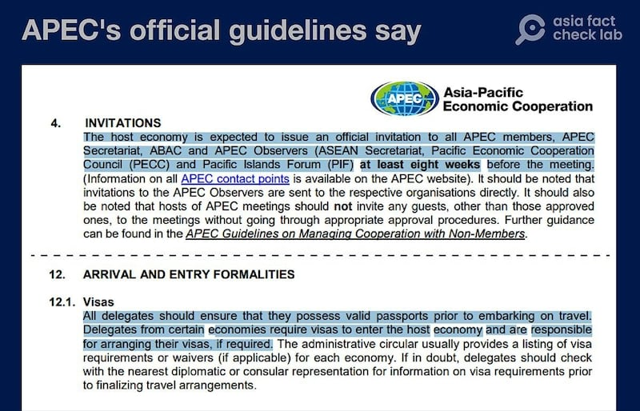
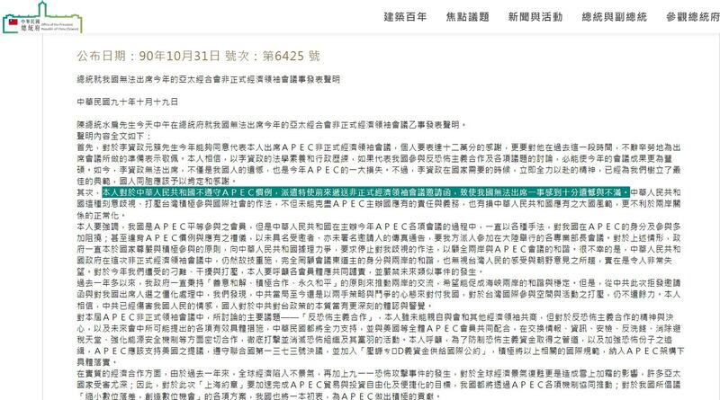

# Will US break APEC rules if Hong Kong leader barred from summit?

## Verdict: Misleading

By Rita Cheng for Asia Fact Check Lab

2023.08.13

Washington

## Chinese authorities claimed that it would be a “violation of Asia-Pacific Economic Cooperation (APEC) rules” if the United States bars Hong Kong Chief Executive John Lee Ka-chiu from attending the APEC leaders summit in San Francisco in November.

## The claim came after media reports that Washington plans to prohibit Lee from attending the meeting of 21 regional economies.

## But the claim is misleading. APEC guidelines state visiting delegates are responsible for arranging their visas if they require them. The Hong Kong leader is under sanctions that bar his entry into the U.S.

In a report published on July 27, The Washington Post [cited](https://www.washingtonpost.com/national-security/2023/07/27/hong-kong-john-lee-apec/?fbclid=IwAR27tKhhtq3ci0cmn7QlbmtJhmWAsWu7n2qJCy-p8Ya74Xc6kZlYoSb74mQ) unnamed White House officials as saying that the U.S. has decided to bar Lee from participating in the APEC Economic Leaders' Meetings (AELM) to be held in San Francisco from Nov. 15 to 17, 2023.

In response to the report, Chinese Foreign Ministry spokesperson Mao Ning [said](https://www.fmprc.gov.cn/eng/xwfw_665399/s2510_665401/2511_665403/202307/t20230728_11119377.html) that refusing to invite Lee due to current U.S. sanctions against him was a mistake which "blatantly violates APEC rules and gravely contravenes the U.S. commitment as the host."

Lee currently cannot obtain any U.S. immigrant or non-immigrant visas due to an [earlier U.S. presidential order](https://www.federalregister.gov/documents/2020/07/17/2020-15646/the-presidents-executive-order-on-hong-kong-normalization) and subsequent [sanctions](https://home.treasury.gov/news/press-releases/sm1088) imposed on him and 10 other Hong Kong officials implicated in a 2020 government crackdown against democracy protestors.

Hong Kong's government [pointed out](https://www.info.gov.hk/gia/general/202307/28/P2023072800293.htm?fontSize=1) in a separate statement that as the host of AELM, the U.S. had a basic responsibility to invite Hong Kong's leader to the meeting.

However the claim is misleading. Below is what AFCL discovered.

## Is the AELM host responsible for inviting the leaders of all APEC members?

Yes. Article 4 of APEC's guidelines for hosting meetings [state](https://www.apec.org/docs/default-source/aboutus/policiesandprocedures/meetings/17_bmc2_008_2_guidelines-for-hosting-apec-meetings_2017-aug-28_approved-at-bmc.pdf?sfvrsn=f1fa827c_1) that the host is supposed to send official invitations at least eight weeks in advance of the meeting, after deciding upon the meeting's location and time.

The guidelines also say: “APEC Leaders implicitly understand that they are invited to attend this meeting; the letter of invitation from the host economy’s leader is simply a formality.”

But [Matthew Goodman](https://www.csis.org/people/matthew-p-goodman), a former National Security Council staff member who personally helped prepare for APEC meetings, told AFCL that APEC's guidelines are neither related to international law nor legally binding.

The explanation of rules concerning invitations and visa preparations for countries participating in APEC meetings. (Screenshots taken from APEC's official website)

## Will invited representatives always be able to attend AELM?

No. Section 12 of the guidelines states that all delegates invited to attend APEC meetings are responsible for arranging any required travel documents themselves. The section does not state that the host is required to issue them visas or waive policy or laws that would prohibit a person from entering its borders.

“Given that the domestic laws of host countries must be respected, it isn’t right to claim that the U.S. is violating APEC’s rules,” Goodman says.

## What will happen to Lee?

Unknown.A State Department spokesperson told AFCL that members of a foreign delegation must abide by U.S. laws and regulations when participating in APEC activities.

“The U.S. will work with Russia and Hong Kong to ensure they participate in AELM ‘in an appropriate way’,” said the spokesperson without elaborating further.

Russian President Vladimir Putin is in a similar situation to Lee as a result of U.S. sanctions put on him following the start of the Russo-Ukrainian war in 2022.

This means Both Lee and Putin would need to secure a special visa waiver from the U.S. in order to attend this year's AELM in San Francisco.

The APEC Secretariat has not responded to inquiries about Hong Kong and Russian leaders as of press time.

Meanwhile, a spokesperson from Hong Kong's Chief Executive Office reiterated its earlier [call](https://www.info.gov.hk/gia/general/202307/28/P2023072800293.htm?fontSize=1) on the U.S. to abide by APEC's rules when inviting leaders to attend AELM.

“Hong Kong will attend the APEC meeting in accordance with APEC rules, guidelines and practices,” the spokesperson told AFCL.

APEC guidelines state that representatives can remotely attend AELM and other preparatory meetings leading up to the conference.

## Is there a history of a host refusing to invite APEC member economies to AELM?

Yes – particularly in the case of APEC member Chinese Taipei, as Taiwan is referred to by the 21-member grouping. China strongly objects to Taiwan’s participation as it regards the island as part of China although Taiwan is self-governing.

When China hosted AELM in 2001, it [did not invite](https://www.president.gov.tw/Page/294/35017) any Taiwanese representatives, despite then-Taiwanese President Chen Shui-bian's expressed desire to attend in person.

South Korea, the host of AELM in 2016, also refused to invite then-President of Taiwan's Legislative Yuan Wang Jin-pyng to the meeting, [requesting](http://news.sohu.com/20051020/n227258639.shtml) that Taiwan instead send an economic official rather than a political figure.

Australia, which hosted AELM in 2007, rejected Tsai Ing-wen, who had just left her position as vice premier of Taiwan’s Executive Yuan, for similar reasons.

Former Taiwanese President Chen Shui-bian expressed regret and dissatisfaction over China's refusal to allow Taiwan's delegates to attend the APEC meeting (Screenshot taken from the official website of Taiwan's Office of the President)

## *Translated by Shen Ke. Edited by Taejun Kang and Mat Pennington.*

*Asia Fact Check Lab (AFCL) is a new branch of RFA established to counter disinformation in today’s complex media environment. Our journalists publish both daily and special reports that aim to sharpen and deepen our readers’ understanding of public issues.*

[Original Source](https://www.rfa.org/english/news/afcl/afcl-hk-apec-08132023231018.html)