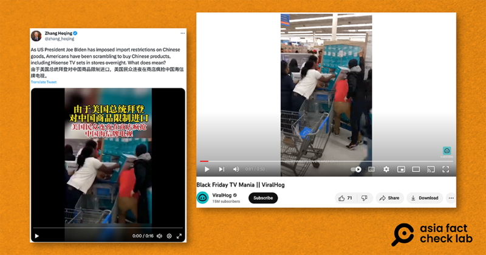

# Did ‘Biden’s restrictions’ on Chinese goods cause panic buying in the US?

## Verdict: False

By Zhuang Jing for Asia Fact Check Lab

2023.08.15

Taipei, Taiwan

## A video of people rushing to grab televisions at a store has been shared on X, formerly Twitter, alongside a claim that it shows “Americans scrambling to buy Chinese products” on Aug. 2, 2023, after “import restrictions” on Chinese goods by the U.S. President Joe Biden.

## However, the claim is false. The video in fact was taken in November 2018. AFCL found no credible reports to show “new import restrictions on Chinese goods” imposed by Biden. The Biden administration continues tariffs on Chinese imports introduced under the previous government.

The claim was shared on X by Chinese diplomat Zhang Heqing on Aug. 4, 2023, below:

Chinese diplomat Zhang Heqing posted a short Twitter video on Aug. 4 which claimed that restrictions on Chinese imports enacted by President Biden caused Americans to rush to an unnamed store in order to buy televisions made by the Chinese brand Hisense. (Screenshot taken from X.)

The claim was accompanied by a 14-second clip that shows a group of people rushing to grab television sets made by the popular Chinese electronics brand Hisense at what appears to be a supermarket.

Superimposed text on the video indicates that the clip was filmed on Aug. 2.

But the claim is false. Below is what AFCL discovered.

## Was the video filmed on Aug. 2?

No. Keyword searches found the clip published [here](https://www.youtube.com/watch?v=b8wW8H6VH-U) in 2018 by the video licensing company ViralHog.

The caption of the video notes that the footage was taken at a Black Friday sale in Bayou Vista, Louisiana, on Nov. 22, 2018.

Black Friday in the United States refers to the day after Thanksgiving, traditionally marked by massive sales and shopping frenzies as retailers kick off the Christmas holiday shopping season.

Below are screenshot comparisons between the video seen in the misleading X video (left) and the video published by ViralHog (right).

## Have there been new import restrictions on Chinese goods by the Biden Administration?

No. Keyword searches found no credible reports or statements to show that Biden has imposed new import restrictions on Chinese goods as of Aug. 14.

The Biden administration [continues](https://www.npr.org/2023/06/27/1184027892/china-tariffs-biden-trump) tariffs and import restrictions that the previous government began leveling against China as early as 2018.

While televisions are [affected](https://www.regulations.gov/document/USTR-2018-0005-0001) by certain existing tariffs, they are not amongst the Chinese products targeted by import restrictions.

## *Translated by Shen Ke. Edited by Taejun Kang and Mat Pennington.*

*Asia Fact Check Lab (AFCL) is a new branch of RFA established to counter disinformation in today’s complex media environment. Our journalists publish both daily and special reports that aim to sharpen and deepen our readers’ understanding of public issues.*

[Original Source](https://www.rfa.org/english/news/afcl/fact-check-tvs-08152023123923.html)