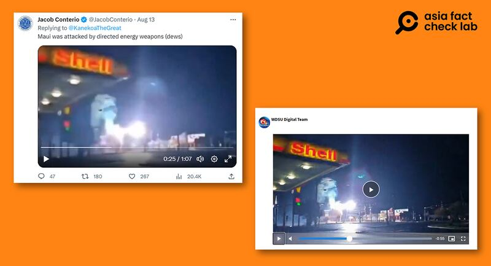
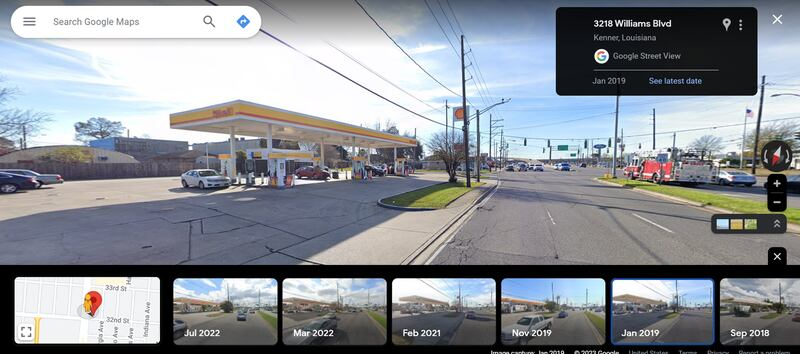

# Were Maui wildfires caused by a US weapons test?

## Verdict: False

By Rita Cheng for Asia Fact Check Lab

2023.08.18

Washington DC

## A couple of videos circulating on social media claim they show that wildfires on the Hawaiian island of Maui were “caused by the United States’ military testing of directed energy weapons.”

## But the claim is false. Both clips are unrelated to the Hawaii wildfires. One video shows damage caused by a windstorm in Louisiana in 2018, while the other depicts Maui police chief explaining the difficulties of identifying victims incinerated by the fire. The exact cause of the wildfires is still uncertain.

On Aug. 13, a video showing multiple explosions was shared on X, formerly Twitter, by user Jacob Conterio.

“Maui was attacked by directed energy weapons (dews),” the caption of the X post reads.

A different video showing the Maui police chief speaking to the press was also shared in multiple Chinese-language posts, including the one on Aug. 14 by an influential user on the Chinese social media platform, Weibo.

“The Hawaiian fire is getting weird, and the Maui police chief said the trees were intact, but the metal was melted, so it was likely an attack from directed energy weapons,” reads the Weibo post in part.

The videos and the claim began to circulate online after Maui was hit by its worst wildfire in over a century, with over one hundred confirmed deaths claimed by the disaster.

But the claim is false. Below is what AFCL discovered.

## Video of explosions

The video showing multiple explosions was in fact taken from a longer video that was taken in 2018.

A reverse image search found the original clip published in a [report](https://www.wdsu.com/article/dramatic-video-shows-electrical-explosions-in-kenner/25702762) on Dec. 28, 2018, published by the U.S. local broadcaster WDSU.

"A video shared to social media shows the dramatic moment of multiple electrical explosions in Kenner," reads the report in part. [Kenner](https://www.google.com/maps/place/Kenner,+LA,+USA/@30.0096258,-90.2920079,13z/data=!3m1!4b1!4m6!3m5!1s0x8620b71a8fb99541:0x70eb037035c6a40!8m2!3d29.9940924!4d-90.2417434!16s%2Fm%2F01_gv32?entry=ttu) is a city in Louisiana.

Below is a screenshot comparison between the video seen in the false X post (left) and the original video published by WDSU (right).

Supposed footage of energy weapons being recently tested on Maui (left) matches a clip of a Louisiana windstorm taken in 2019 (right). (Screenshot taken from X and WDSU official websites)

A search of the street [address](https://www.wdsu.com/article/dramatic-video-shows-electrical-explosions-in-kenner/25702762) noted in the WDSU [report](https://www.wdsu.com/article/dramatic-video-shows-electrical-explosions-in-kenner/25702762) using Google Maps set to January 2019 shows that the location also matches that in the video.

A view of the street in Kenner around the time it was hit by the windstorm. (Screenshot taken from Google Maps).

The identical video was also published in reports about electrical explosions in Kenner in 2018 by [The Associated Press](https://www.youtube.com/watch?v=nZAgRLBEAjs) and other U.S. local broadcaster [WWLTV](https://www.youtube.com/watch?v=IY1c-NZPh8A).

## Clip of Maui police chief

AFCL found the angle, handheld camera frame and audio of the clip match a video posted by the U.K. news outlet Sky News on its official TikTok [account](https://www.tiktok.com/@skynews/video/7266723624164396320).

The video was taken at a press conference by Maui County Police Chief John Pelletier in which he explained the difficulties of identifying victims of the fire. Pelletier expressed hope that the public would be patient with ongoing relief and rescue efforts.

Pelletier did say the fires had been powerful enough to melt metal in order to explain the ongoing difficulty of identifying remains, but he made no mention of “directed energy weapons” during the conference.

Media reports on the conference by [Reuters](https://www.washingtonpost.com/video/national/maui-police-chief-asks-for-patience-in-victim-identification/2023/08/12/517809d8-be8b-4631-9635-f654c3499b60_video.html) and [Maui local television](https://www.youtube.com/watch?v=P11bGwCRQYY) also did not mention the energy weapons.

## The exact cause still uncertain

The wildfires also triggered a wave of similar rumors on the Chinese internet, spurred on after Chinese news outlets such as Hongxing Xinwen appropriated a [SpaceX rocket launch](https://arstechnica.com/science/2019/04/rocket-report-darpa-picks-three-aerojet-short-seller-starlink-launch-date/) photo as an image of the purported energy weapon test.

But the exact cause of the wildfires is still uncertain. Experts [cited](https://apnews.com/article/live-updates-maui-fire-hawaii-wildfire-162a9fcdefe648d6bcd6557af70d894f) by AP claimed that strong winds combined with dry grass on the island spurred the fires, while separate experts quoted in  [*The New York Times*](https://www.nytimes.com/2023/08/10/us/maui-wildfires-hawaii.html?_ga=2.233215582.171422323.1692127917-1674928484.1692127917)  point out that power lines knocked down by the strong winds could have caused the disaster.

A class action [lawsuit](https://www.courthousenews.com/wp-content/uploads/2023/08/eder-v-maui-electric-complaint-oahu.pdf) has been [filed](https://www.voanews.com/a/hawaii-fire-death-toll-hits-99-may-double-warns-governor/7225444.html#:~:text=The%20death%20toll%20in%20Hawaii's,landscape%20for%20more%20human%20remains.) against Hawaiian Electric, the state's main utility, on the grounds that the company "inexcusably kept their power lines energized during forecasted high fire danger conditions." The company's chief executive officer [has stated](https://www.facebook.com/watch/live/?ref=watch_permalink&v=594963809511259&t=3628) that it does not turn off the power during fire conditions because electricity is required for water pumps.

## *Translated by Shen Ke. Edited by Taejun Kang and Malcolm Foster.*

*Asia Fact Check Lab (AFCL) is a new branch of RFA established to counter disinformation in today’s complex media environment. Our journalists publish both daily and special reports that aim to sharpen and deepen our readers’ understanding of public issues.*

[Original Source](https://www.rfa.org/english/news/afcl/fact-check-hawaii-fires-08182023124714.html)