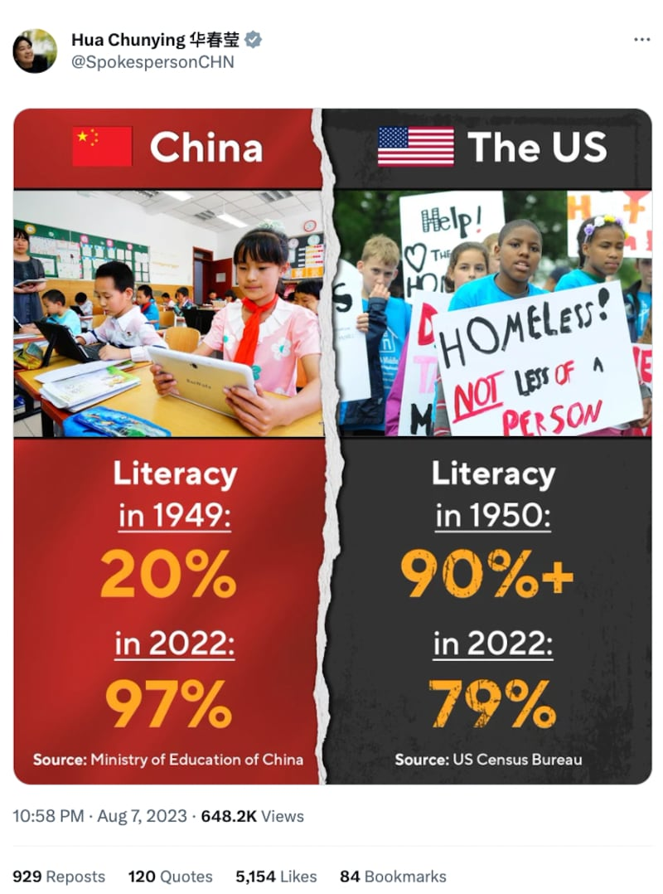

# Are Americans more illiterate than they were 70 years ago?

## Verdict: Misleading

By Zhuang Jing for Asia Fact Check Lab

2023.08.21

Taipei, Taiwan

## An image comparing literacy rates between the United States and China has been shared repeatedly in Chinese-language social media posts that claim the level of literacy in the U.S has noticeably declined between 1950 and 2022, while the level in China has seen a remarkable increase. The posts cited the U.S. Census Bureau and China’s Ministry of Education as sources.

## But the claim is misleading. The U.S. Census Bureau did not gather literacy statistics for 2022, and AFCL found the numbers mentioned in the image come from surveys with varying definitions and methodologies for measuring literacy.

The image was posted on X, formerly known as Twitter, on Aug. 7 by Chinese Foreign Ministry spokesperson Hua Chunying, showing that literacy in China last year was 97% while in the United States it was 79%.

Chinese Foreign Ministry spokesperson Hua Chunying posted a chart comparing literacy rates between the U.S. and China. (Screenshot taken from X)

The image was also shared in many Chinese-language posts, with several influential users claiming that the image was proof that in recent years China has progressed rapidly while the U.S. has regressed.

While [numbers](http://www.moe.gov.cn/jyb_xwfb/s5147/201209/t20120910_142013.html) for China cited in the image are [accurate](https://news.eol.cn/meeting/202206/t20220628_2234576.shtml), those for the U.S. are misleading. Below is what AFCL found.

## Are numbers cited in the image all correct?

No. Keyword searches found that a 1950 U.S. Census Bureau [report](https://www2.census.gov/library/publications/1959/demographics/p23-006.pdf) estimated state illiteracy rates for those aged 14 and older to be under 10% in every state, with a national average of less than 4%.

However, AFCL discovered that the bureau did not conduct or release the same survey in 2022.

[Kristina Barrett](https://www.census.gov/newsroom/bios/kristina-barrett.html) of the bureau's Public Information Office told AFCL that the bureau no longer tracks the literacy rate in the U.S., and that literacy statistics are now overseen by the U.S. Department of Education's [National Center for Education Statistics](https://nces.ed.gov/).

The center did publish a [report](https://nces.ed.gov/pubs2022/2022004/) in 2022 examining American adults with low English literacy and numeracy skills, but the report is based on data collected in 2012, 2014, and 2017 by the Program for the International Assessment of Adult Competencies (PIAAC).

According to the 2012 data, 21% of people surveyed had low English literacy skills. The number of “79% of literacy in 2022 in the U.S.” cited in the misleading image appears to have originated from it.

The center told AFCL that data released by the bureau in 1950 and numbers collected by the PIAAC in the 2010s are not directly comparable due to differences in definitions and data sources.

For instance, the bureau surveyed people aged 14 and older, while the PIAAC assessed adults aged between 16 and 65.

## Are literacy rates conducted in China and the U.S. directly comparable?

No. Literacy in China and the U.S. is defined and measured differently.

China's Ministry of Education [defines](https://www.gov.cn/zhengce/2020-12/25/content_5573970.htm) literacy as "being able to read a set amount of Chinese characters. Farmers need to recognize 1,500 characters while urban residents and employees of public institutions need to recognize 2,000.

“Ability to understand simple and popular newspapers and articles, keep simple accounts, and write simple practical texts.”

The 1950 U.S. Census Bureau report defined literacy as “the ability to read and write in English or in any other language,” while the PIAAC defined literacy as “the ability to understand, evaluate, use, and process written texts to participate in society, achieve personal goals, and develop an individual's knowledge and potential.”

In response to questions about the misleading image, Barrett from the U.S. Census Bureau said: “Ideally, you’d want to compare similar reports but that’s sometimes difficult with historic records.

“You would need a statistician to look at each report and compare the methodology and note any differences between the reports and account for those differences.”

## *Translated by Shen Ke. Additional reporting by Dong Zhe. Edited by Taejun Kang and Malcolm Foster.*

*Asia Fact Check Lab (AFCL) is a new branch of RFA established to counter disinformation in today’s complex media environment. Our journalists publish both daily and special reports that aim to sharpen and deepen our readers’ understanding of public issues.*

[Original Source](https://www.rfa.org/english/news/afcl/fact-check-literacy-08212023101223.html)