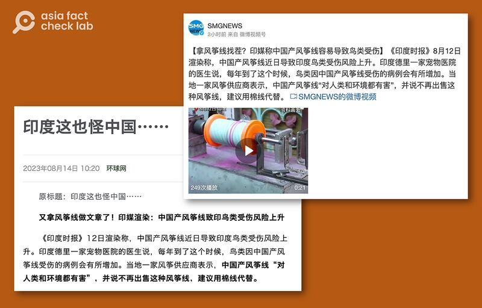

# Is India’s ban on ‘Chinese kite string’ Sinophobic?

## Verdict: False

By Dong Zhe for Asia Fact Check Lab

2023.08.22

Taipei, Taiwan

## A claim that India’s ban on “Chinese kite string” is a Sinophobic policy has been widely circulated in Chinese-language social media.

## But the claim is false. India refers to nylon kite string as “Chinese kite string” since their key materials are mostly imported from China. The string is produced in India and was banned due to concerns over safety and its negative impact on the environment.

Multiple official Chinese news outlets, including [Huanqiu Wang](https://m.weibo.cn/status/4934554638353476) and [Kankan Xinwe](https://m.weibo.cn/status/4934685957817326), claimed that India's ban on "Chinese-made kite string" was proof India wanted to stir up conflict with China.

Chinese official media outlets claimed that India is blaming China for producing harmful nylon kite strings. (Screenshots from Huanqiu Wang and Weibo.)

The claim began to circulate online after India's domestic media outlets reported [here](http://archive.today/X74jG) and [here](http://archive.today/bwqbY) that nylon and other synthetic kite string – often coated with glass powder, making it abrasive and able to cut other kite strings – will likely increase bird deaths during this year's annual celebration of Indian Independence Day on Aug. 15.

Both articles noted that the kite-flying string – also called “Chinese manjha” – is still widely used despite an ongoing government ban enacted in 2017. “Manjha” refers to kite-flying string.

Kite-flying is a popular pastime in India and a traditional way to commemorate the county’s emergence as a sovereign state from British rule in 1947.

Responding to the news, some Chinese netizens taunted that the Indian government is adopting Sinophobic policies similar to the United States by illogically banning such everyday items as kite string.

Verified and widely followed Weibo users deride the Indian government’s decision to ban the kite strings. (Screenshots taken from Weibo.)

But the claim is false. Below is what AFCL discovered.

## Did India’s ban against Chinese manjha have anything to do with China?

No. The string was banned due to safety and environmental concerns.

Besides being more affordable than conventional cotton string, synthetic kite string has a heightened tension that renders them extremely sharp.

This added sharpness, while favored by kite-fighting enthusiasts, has also harmed numerous birds and individuals.

In response to these concerns, India's National Green Tribunal, or NGT – a body responsible for addressing environmental matters – prohibited the sale and usage of these strings in 2017.

## Is Chinese manjha actually made in China?

No. The kite string is locally manufactured in India.

The NGT [notes](http://www.indiaenvironmentportal.org.in/files/manjha%20for%20kite%20flying%20non%20biodegradable%20NGT%20Judgement.pdf) that "Chinese manjha" is a term used to distinguish generic nylon, synthetic and metal kite string from traditional cotton kite strings.

Separately, it states that such string is neither manufactured, imported, supplied or distributed from China and have “nothing to do” with the country.

The NGT says “Chinese Manjha” is a commonly used term for all nylon and synthetic kite strings. (Screenshot from the NGT Judgement.)

India's local media outlets also explained [here](http://archive.today/Ab2r4) and [here](https://www.thehindu.com/children/how-manja-made-kite-flying-dangerous/article66884338.ece) the synthetic string is commonly referred to as Chinese manjha because polypropylene – a key ingredient in making them – is mostly imported from Taiwan and China.

Mohit Kartikeyan, a Bangalore manufacturer of kite strings, told Scroll.in that calling the string “Chinese” is a type of “marketing gimmick” meant to draw in customers looking for imported products.

The Indian kite string manufacturer Manjha Kite Wale told AFCL that in addition to their raw materials, some nylon kite strings are also indeed imported from China.

The term is widely used by domestic media outlets, as seen in reports by [The Times of India](https://timesofindia.indiatimes.com/topic/manjha/3), [The Economic Times of India](https://economictimes.indiatimes.com/topic/manjha), [Business Today](http://archive.today/8FoK9) and [The Indian Express](http://archive.today/HdHVF).

## *Translated by Shen Ke. Edited by Taejun Kang and Malcolm Foster.*

*Asia Fact Check Lab (AFCL) is a new branch of RFA established to counter disinformation in today’s complex media environment. Our journalists publish both daily and special reports that aim to sharpen and deepen our readers’ understanding of public issues.*

[Original Source](https://www.rfa.org/english/news/afcl/fact-check-kite-string-08222023122424.html)