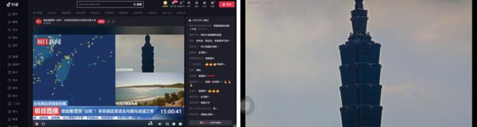
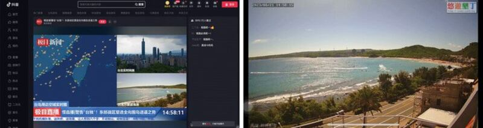
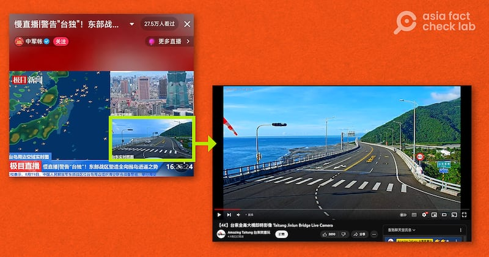

# Did Chinese media air genuine footage of latest army drills near Taiwan?

## Verdict: Misleading

By Dong Zhe for Asia Fact Check Lab

2023.08.23

Taipei, Taiwan

## Following Chinese military exercises around Taiwan on Aug. 19, several Chinese media outlets broadcast “real time footage of the drills” from various locations around Taiwan.

## However, AFCL found that some videos were irrelevant to the drills and were in fact taken from Taiwanese public livestreams without permission.

The People’s Liberation Army (PLA) of China conducted military exercises around Taiwan on Aug. 19 in a protest against Taiwanese Vice President Lai Ching-te’s recent layover in the United States during a state visit to Paraguay.

A number of Chinese news outlets broadcast live coverage of the drills across popular Chinese video sharing sites such as Douyin.

One such [livestream](https://live.douyin.com/915896692100) released by the online news site Jimu News – an affiliate of the Beijing-backed *Hubei Daily* – shows a total of three clips of locations around Taiwan including Taipei, Wanlitong Beach and Taitung.

[Wanlitong](https://www.google.com/maps/place/Wanlitong,+Hengchun+Township,+Pingtung+County,+946/data=!4m2!3m1!1s0x3471ba0b7b8cd9e3:0x8208873cf846d6de?sa=X&ved=2ahUKEwjz5qu7te-AAxWRZt4KHbwdBGYQ8gF6BAgcEAA&ved=2ahUKEwjz5qu7te-AAxWRZt4KHbwdBGYQ8gF6BAgiEAE) is located on the west side of Hengchun, a small village in Taiwans's Pingtung County, while [Taitun](https://www.google.com/maps/place/Taitung,+Taitung+City,+Taitung+County,+950/@22.7482963,121.1153231,13z/data=!3m1!4b1!4m6!3m5!1s0x346fb96c40c8266b:0xc7c4eab8c68fcaa1!8m2!3d22.7613207!4d121.1438152!16zL20vMDNzN3Y1?entry=ttu)g is a city on the southeast coast of the country.

The videos were also used by Chinese official media *Jiupai News* as well as programs under Tencent's video streaming services Huya Live such as *Daxiang News* and *Shijian Zhibo*.

However, AFCL found the videos are irrelevant to the drills, and they were in fact taken from Taiwanese public livestreams designed to show famous spots across the country.

## Footage of Tapei

A keyword search found the corresponding video published [here](https://www.youtube.com/watch?v=z_fY1pj1VBw&ab_channel=TaipeiTravelLiveCam%E5%8F%B0%E5%8C%97%E8%A7%80%E5%85%89%E5%8D%B3%E6%99%82%E5%BD%B1%E5%83%8F) on a YouTube channel managed by Taipei's Department of Information and Tourism.

“【Taipei 4k Live Cam】Overlooking Taipei at the top of Xiangshan | Taipei 101 | Taiwan | Taipei Webcam,” the title of the video reads.

The angle, distance and content of the two livestreams are identical, with only the timestamp in the upper-left corner cropped out in the *Jimu News*' video.

Below is a screenshot comparison between the video published by *Jimu News* (left) and the original video published by Taipei's Department of Information and Tourism (right).

A representative of Taipei’s tourism department told AFCL that it has not authorized Chinese media outlets to use its video content.

Jimu News’ footage of Taipei (left) compared to a local livestream from atop nearby Elephant Mountain, locally known as Xiangshan (right).

## Clip of Wanlitong Beach

AFCL found the corresponding video published [here](https://www.youtube.com/watch?v=h9JmARss84U&ab_channel=%E6%88%91%E6%84%9B%E5%A2%BE%E4%B8%81%E6%97%85%E9%81%8A%E7%A5%A8%E5%88%B8%E4%B8%AD%E5%BF%83) on a YouTube channel managed by a local organization [I Love Kenting Tourism Ticket Center](https://www.facebook.com/ouokt/).

Through a closer look at the footage AFCL discovered *Jimu News* once again cut out the timestamp and the logo from the original video.

Below is a screenshot comparison between the video published by *Jimu News* (left) and the original footage published by I Love Kenting Tourism Ticket Center (right).

Jimu News’ footage of Wanlitong beach in Kenting, Taiwan (left) compared to a local livestream footage (right).

AFCL has not heard back from the center as of this writing.

## Video of Taitung

AFCL also found the matching video published [here](https://www.youtube.com/watch?v=9QqBz3kNHis&ab_channel=AmazingTaitung%E5%8F%B0%E6%9D%B1%E5%B0%B1%E9%86%AC%E7%8E%A9) on a YouTube channel managed by Taitung's Transportation and Tourism Development Department.

Below is a screenshot comparison between the video published by *Jimu News* (left) and the original livestream broadcast by Taitung's tourism department.

Jimu News’ footage of the Jinlun Bridge in Taitung, Taiwan (left) compared to a local livestream (right).

An official at the department told AFCL although Taiwanese media outlets are free to reuse livestream footage without making a formal request, the city has never authorized Chinese media outlets to use its clip.

A Taiwanese digital media expert said *Jimu News* could have used a YouTube decoder with software that simultaneously rebroadcasts the footage or an all-in-one software such as OBS Studio that allows the user to record, edit and rebroadcast footage from their desktop.

## *Translated by Shen Ke. Edited by Taejun Kang and Malcolm Foster.*

*Asia Fact Check Lab (AFCL) is a new branch of RFA established to counter disinformation in today’s complex media environment. Our journalists publish both daily and special reports that aim to sharpen and deepen our readers’ understanding of public issues.*

[Original Source](https://www.rfa.org/english/news/afcl/fact-check-taiwan-footage-08232023095554.html)