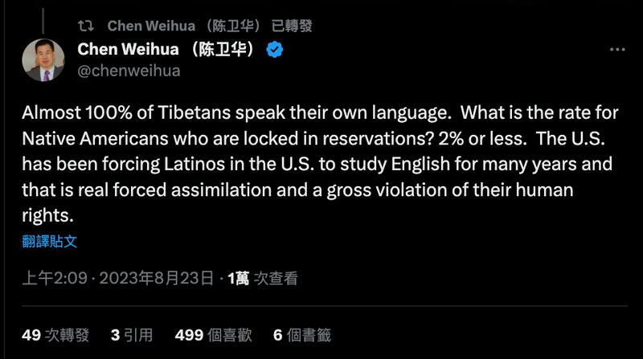
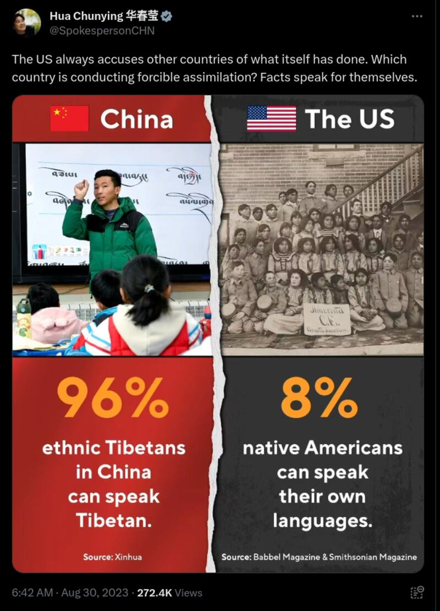
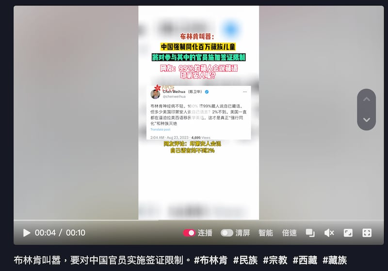
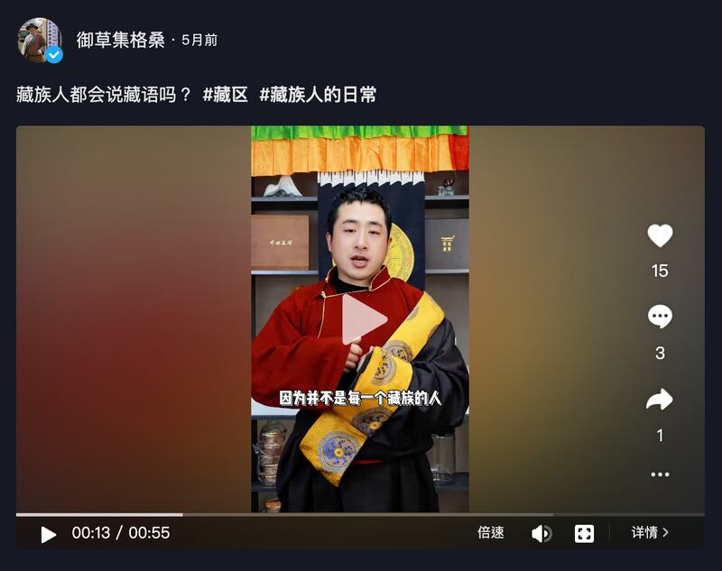
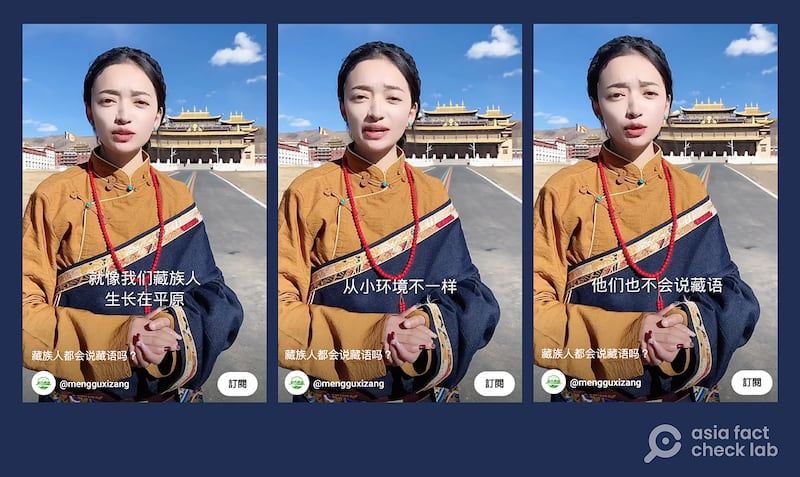
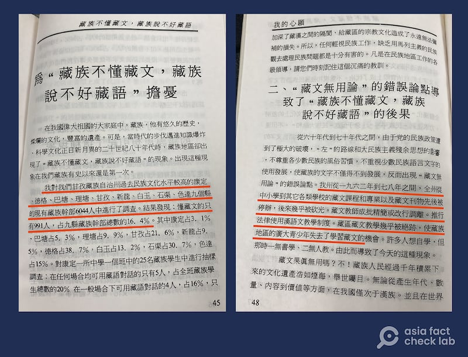

# Can ‘almost 100%’ of Tibetans speak their ethnic language?

## Verdict: False

By Dong Zhe for Asia Fact Check Lab

2023.08.31

Taipei, Taiwan

## In response to a recent statement from the United States that China is forcibly assimilating Tibetans, a Chinese media official and Foreign Ministry spokesperson both claimed that almost all Tibetans still speak the Tibetan language

## But the claim is false. Various data, studies and testimonials indicate that a significant portion of Tibetans in China cannot speak their ethnic language.

The U.S. State Department [announced](https://www.reuters.com/world/us-imposes-visa-curbs-chinese-officials-over-boarding-schools-tibetans-2023-08-22/) on Aug. 22 that it would place visa restrictions on Chinese officials participating in the "forcible assimilation" of Tibetan children enrolled in Chinese government boarding schools, a policy the department estimates has caused more than 1 million Tibetan children to lose their traditional language, culture and religion. No list of specific Chinese officials affected by the restrictions has yet been released.

In response, Chen Weihua, the EU bureau chief of the official Chinese news outlet China Daily, said on X, formerly known as Twitter, that “almost 100% of Tibetans” speak Tibetan.

Chinese foreign ministry spokesperson Hua Chunying later posted similar claims on X that 96% of Tibetans can speak their ethnic language.

China Daily’s EU bureau chief Chen Weihua and Chinese Foreign Ministry Spokesperson Hua Chunying both claim that almost all Tibetans speak Tibetan (Screenshot/X)

Chen also claimed Native Americans – that make up “2% or less” of the U.S. population – are “locked” in reservations and the country has been “forcing” Latinos to study English.

Chen’s remarks about Native Americans and Latinos are opinions and cannot be comprehensively fact-checked, but they still contain some misleading elements.

In 2020, the American Indian and Alaska Native population [comprised](https://minorityhealth.hhs.gov/omh/browse.aspx?lvl=3&lvlid=62#:~:text=In%202020%2C%20an%20estimated%203.7,Native%20and%20another%20race%20group.) 9.7 million people, or 2.9% of the total U.S. population. However, keyword searches revealed no movement restrictions for these individuals.

The U.S. does not have an [official language](https://www.usa.gov/official-language-of-us), but some states list English as their official language. The lack of Spanish education in American schools has been a [topic of discussion](https://cervantesobservatorio.fas.harvard.edu/sites/default/files/002_informes_nr_spteaching.pdf) for a long time, but some recent media reports [indicate](https://www.usatoday.com/in-depth/news/education/2020/01/06/english-language-learners-benefit-from-dual-language-immersion-bilingual-education/4058632002/) that the number of schools offering Spanish language programs is on the rise.

Official Chinese media outlets such as Tong Media and Hong Kong Satellite Television later cited Chen’s remarks in a short video, with subtitles saying that “99% of Tibetans speak Tibetan.”

Official Chinese media outlets in Hong Kong rebutted Blinken’s statement by claiming that “99% of Tibetans speak Tibetan.” (Screenshot/ HK Satellite TV’s Douyin account)

This claim is false. Available information indicates that a significant number of ethnic Tibetans cannot speak the language. Below is what AFCL found.

## ‘Not all Tibetans speak their ancestral tongue’

Most Tibetans living in eastern Sichuan and east of Qinghai Lake cannot speak their ancestral tongue, and that the skill has almost disappeared in Qinghai's Xining City over the last few decades, said [Dawa Tsering](https://tibetpolicy.net/about-us/fellows/tenzin-lekshay/), the director of the Central Tibetan Administration's Tibet Policy Institute think tank who was born and raised in Tibet.

Tibetans are mainly distributed across the Tibet Autonomous Region and the southwestern Chinese provinces of Qinghai, Gansu, Sichuan, and Yunnan.

“Significant amounts of local ethnic Tibetans in other parts of Qinghai and Sichuan only learned to speak basic Tibetan after their respective regions became popular tourist resorts,” Tsering told AFCL.

He further pointed out that several self-proclaimed Tibetan content producers on social media defend their inability to speak Tibetan. AFCL found examples of such people on Youtube and Douyin, Chinese equivalent of TikTok, who have further stated in their [posts](https://www.youtube.com/shorts/Ql29kdFyBEI) that not all ethnic Tibetans in China speak the language.

Self-proclaimed Tibetan content producers on social media platforms such as Youtube and Douyin claim that many Tibetans cannot speak their ethnic tongue. (Screenshot/Youtube & Douyin)

## Decrease in language skills started since at least 1980s

A survey conducted by the Tibetan scholar Takrong Tsering Dhondup in the 1980s and included in his book *My Wish* found that only 991 of 6,044 educated ethnic Tibetans working as civil servants across Sichuan's Ganzi Prefecture could understand written Tibetan.

The book also mentions that the political violence of the Cultural Revolution dealt severe blows to the vitality of the Tibetan language in Ganzi. Between 1962 and 1978, Tibetan primary and secondary school courses were suspended, Tibetan publications were destroyed and thousands of historical documents in Tibetan were burned. Teachers of Tibetan transferred to other professions and professional language education amongst ethnic Tibetans vanished.

A survey of Tibetan language proficiency from the 1980s conducted by the Tibetan scholar Takrong Tsering Dhondup found that only 991 of 6,044 sampled people could understand written Tibetan. (Photo/AFCL)

## Media reports on inadequacy of current bilingual education

The Human Rights Watch said in a [2020 report](https://www.hrw.org/sites/default/files/report_pdf/tibet0320_web_0.pdf) that China's "bilingual education" policy in Tibet is drastically limiting the opportunities for Tibetans to receive education in their mother tongue. While "bilingual" in name, the report states that in reality the Tibetan language is gradually being replaced with Chinese.

The report found that local authorities are assigning more Han Chinese teachers without knowledge of Tibetan in local primary schools, thereby forcing schools to tacitly allow more and more classes to be taught in Chinese rather than Tibetan.

The report further cited a 2016 article by the state-run Global Times regarding a sharp decline in the use of the Tibetan within China. The article attributed the decline to increased urbanization and a lack of use in schools due to increased time spent speaking Chinese, further emphasizing that many parents have also noticed their children’s lack of proficiency in Tibetan. AFCL could not find the original text of this article.

Dr. Gyal Lo, a Tibetan activist who taught in the Tibetan Department at China’s Northwest Minzu University before relocating to Canada in 2021 - said during the 2023 Geneva Summit for Human Rights and Democracy that what is nominally called “bilingual education” has long functioned with Chinese as the predominant language in Tibetan schools,

After visiting more than 50 different boarding schools for children aged 4-6 across eastern Tibet in the early 2010s, Gyal found that students at these schools were forced to communicate in Mandarin and teachers were only allowed to use textbooks approved by the Chinese government.

Citing educators in Tibet that Tibetan would be completely removed from school curriculums by 2024, Gyal projected in a [separate article](https://www.dw.com/zh/%E9%9B%99%E8%AA%9E%E6%95%99%E8%82%B2%E8%AE%8A%E8%AA%BF-%E8%A5%BF%E8%97%8F%E8%AA%9E%E6%96%87%E5%82%99%E5%8F%97%E5%A3%93%E8%BF%AB%E4%BE%B5%E8%9D%95/a-64950234) that about 70% of China's Tibetan population will not be able to speak their mother tongue by 2030.

In February 2023, the United Nations [called on](https://www.ohchr.org/en/press-releases/2023/02/china-un-experts-alarmed-separation-1-million-tibetan-children-families-and) China to stop "what appears to be a policy of forced assimilation" of Tibetans into China's majority Han culture.

## *Translated by Shen Ke. Edited by Taejun Kang and Malcolm Foster.*

*Asia Fact Check Lab (AFCL) is a new branch of RFA established to counter disinformation in today’s complex media environment. Our journalists publish both daily and special reports that aim to sharpen and deepen our readers’ understanding of public issues.*

[Original Source](https://www.rfa.org/english/news/afcl/fact-check-tibetan-08312023144305.html)