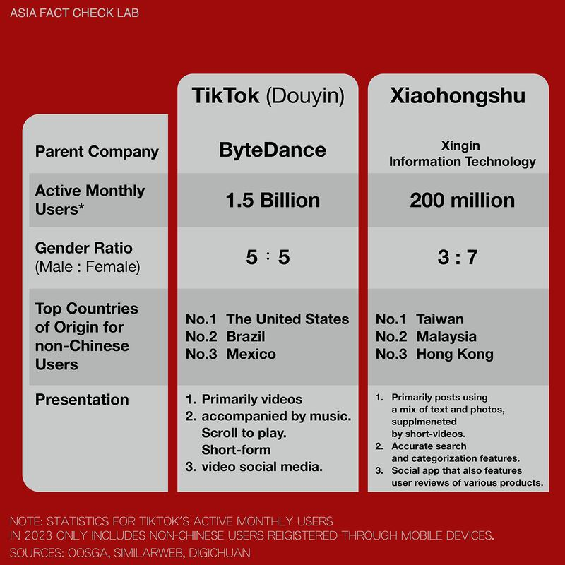

# Xiaohongshu: Innocent lifestyle app or another security risk?

## The Chinese social media app, which means “Little Red Book,” has taken off in Taiwan.

By Dong Zhe and Zhuang Jing for Asia Fact Check Lab

2023.09.05

Taipei, Taiwan

A recent Taiwanese college graduate, Lee Chia-Shan – who declined to reveal her real name for security reasons – spends her days posting Instagram photos of Taiwan’s most beautiful cafes and promoting new brands in exchange for free products.

But having less than 10,000 followers on the platform means her posts often fail to attract as many attractions as she would like. Luckily, a different app has got her covered.

“On Instagram the number of followers just stops at a certain point, and beyond that it’s tough to break through the algorithm,” said Lee. “But a single spur-of-the-moment post on Xiaohongshu easily gets thousands of views.”

Xiaohongshu is a popular Chinese social media app with 200 million monthly active users. It caters to post-millennial female users who want to share lifestyle content, including beauty products, fashion, interior design, travel and spiritual growth.

The app, which means literally “Little Red Book,” a reference to the book of Mao Zedong quotes, has taken off in Taiwan, where it is the go-to fashion reference for many young social media influencers.

In order to catch up with the latest trends, Lee spends day after day diligently swiping and posting on the platform. She has even begun writing her posts in mainland China’s simplified characters instead of Taiwan’s more commonly used traditional characters “because they have more reach.”

Xiaohongshu’s website activity by country. (Screenshot/Similarweb)

Lee is not alone. Many Taiwanese cosmetic designers have even begun including Xiaonghsu in marketing their products. One well-known pharmacy AFCL visited displayed five or six Chinese brands under advertisements such as “Xiaohongshu bestseller” and “As seen on Xiaohongshu.”

Taiwan stood as the app’s second largest user base outside mainland China between March and May. It also often trends on Taiwan’s IOS and Android app stores.

Xiaohongshu was the third most downloaded app in Taiwan on both IOS and Android in the first two weeks of August 2023. (Screenshot/Similarweb)

The rise of Xiaohongshu in Taiwan is evident. But what are the implications? Taiwan already imposed a public sector ban on TikTok after the FBI warned that the Chinese social media service posed a national security risk. Is it not the case for Xiaohongshu?

## ‘Behind the enemy lines’

“Posts in Xiaohongshu promote lifestyle habits or self-realization and usually have nothing to do with politics,” says Wang Pin-yi, a Taiwanese college student who is a staunch advocate for Taiwanese independence. Wang also declined to reveal her real name due to security concerns.

“It’s a convenient replacement for all other apps, so [users] spend more time on it,” she said.

Wang’s view was echoed by other Xiaohongshu users interviewed by AFCL who said that the app was “less political” and “better in quality” than similar Chinese platforms such as TikTok.

Comparing key data between Tiktok and Xiaohongshu. (Photo/AFCL)

But after a year of use, Wang said, she feels at times like she is “behind enemy lines.”

“I noticed that negative messages about China are hard to find on the app, creating the illusion that China seems like it’s a really nice, cozy place to live,” said Wang.

The app is also full of China-centered discourse that Wang believes carries a strong sense of ethnic superiority.

“They don’t necessarily attack, but they always leave comments praising China as better,” Wang says, referring to some videos of foreign bloggers that Xiaohongshu users often spontaneously post.

She believes this signals a desire to use any topic – whether food or cosmetics – to help promote and strengthen a sense of “Chinese” identity.

## The experiment

Xiaohongshu promises to be the user’s “guide to life” by helping them “discover a real, beautiful and diverse world.”

AFCL decided to do a little experiment to see if all the facts in Xiaohongshu’s world matched our own, starting with the 34th anniversary of the June 4, 1989, Tiananmen Square massacre.

Publishing or sharing any content about the protests on Chinese social media platforms is the quickest way to have one’s post deleted and account banned – particularly during the most sensitive days preceding or following the protests anniversary.

Posting such content is the most practical and easy way to test whether Xiaohongshu follows Beijing’s long standing policy of censoring discussion of the event.

Between June 2 to June 5 two AFCL team members searched for, commented on and posted messages about the protests on Xiaohongshu, with a similar test conducted on TikTok as a control measure.

Keyword searches on Xiaohongshu related to the protests such as “June 4th,” “Tiananmen Square,” or “tanks” only produced irrelevant information. The result was no different when searching for “candles.” Posting photos or emojis of candles on social media has also long been a way Chinese netizens silently commemorate and mourn on the anniversary of the protests.

Searches for June 4 and Tiananmen did not bring up any results in Xiaohongshu. (Screenshot/Xiaohongshu)

So AFCL decided to take it to the next level.

One AFCL member who left a comment “64 Tiananmen” on a Xiaohongshu post was immediately sent the following message:

“This comment violates our terms of service. You are banned from posting for 2 hours.”

One AFCL team member was temporarily banned from posting after commenting “64 Tiananmen.” (Screenshot/Xiaohongshu)

Another member received a similar message within 20 minutes of uploading a photo of the “Tank Man” -- an iconic figure associated with the 1989 protests – quickly followed by a notice that the member’s account would be blocked due to violations of the app’s standards.

AFCL’s inquiry for clarification on standards went unanswered.

Xiaohongshu blocked the account of one AFCL tester after they uploaded a picture of Tank Man onto the app. (Screenshot/Xiaohongshu)

Separately, Wang Pin-yi claimed that a private message on the app sent by a friend which jokingly mentioned “Papa Xi,” referring to President Xi Jinping, was never delivered.

She told AFCL that she later received a system reminder to report any messages violating the app’s terms of service.

A message sent by one Xiaohongshu user in which they referred to Xi Jinping as “Papa Xi” (left - third message down) was censored in transit and never reached the recipient user’s phone (right). Instead they received a reminder to report any messages violating the app’s terms of service (right - bottom). (User provided Screenshot/Xiaohongshu)

Dr. Ruei-Hau Hsu, an assistant professor in the Department of Information Engineering at Sun Yat-sen University, told AFCL that Chinese software developers analyze filter keywords related to the Tiananmen protests based on frequency and popularity.

Hsu added that developers may have allowed candle advertisements to pass censors due to the low likelihood they referenced the protests, whereas articles or posts run a greater reaching of touching upon the subject.

## ‘High degree of risk’

Now we know that Xiaohongshu has achieved significant popularity in Taiwan, that it promotes a positive image of China, and that, like other China-born social media platforms, it censors “sensitive information” for Beijing. But what does this imply for its users in Taiwan?

Xiaohongshu's [user service agreement](https://agree.xiaohongshu.com/h5/terms/ZXXY20220331001/-1) and [privacy policy](https://www.xiaohongshu.com/crown/community/privacy) seen by AFCL show that the company stores personal user data – including all text, photos, videos, audio, comments, likes and favorites on the app – in China. Data will be collected and provided to Chinese authorities if requested to do so.

And such provisions put Taiwanese citizens at “a high degree of risk,” said Lai Chung-chiang, the convenor of the Economic Democracy Union think tank in Taiwan.

Xiaohongshu’s user agreement outlines “undesirable information” that can result in users getting banned if their post contains such content. Many of the infractions are broad and vague. (Photo/AFCL)

China’s recently enacted counter-espionage law requires any company or individual to provide any information requested by state investigators. It is illegal to refuse. (Photo/AFCL)

Taiwanese who post anything on the app that could be interpreted as violating one of China’s frequently vague and ambiguous national security laws – such as China’s recently enacted counter-espionage law or the 2020 Hong Kong national security law – should avoid going to Hong Kong or China, Lai added.

“Chinese law doesn’t care whether a person is inside or outside the country. If [the government] wants to arrest people, it will,” he noted.

Taiwan’s Ministry of Digital Affairs restricts public officials’ use of Chinese-made software listed as national security threats, including Xiaohongshu and Douyin. Talks with Taiwan’s Ministry of Education about potentially extending such restrictions to campuses are ongoing.

Lai however believes that the Taiwanese government should consider extensively expanding the current list of Chinese software deemed a threat and forcibly removing them from Taiwanese app stores.

## *Translated by Shen Ke. Edited by Taejun Kang and Malcolm Foster.*

*Asia Fact Check Lab (AFCL) is a branch of RFA established to counter disinformation in today’s complex media environment. Our journalists publish both daily and special reports that aim to sharpen and deepen our readers’ understanding of public issues.*

[Original Source](https://www.rfa.org/english/news/afcl/fact-check-xiaohongshu-09052023143921.html)