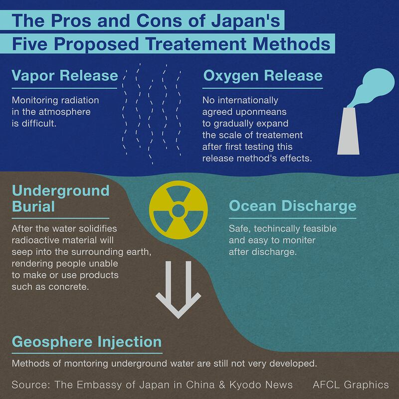

# Five viral rumors about Fukushima water: DEBUNKED

## From salt to seafood, AFCL looked into 5 of the most prevalent rumors circulating in China.

By Rita Cheng for Asia Fact Check Lab

2023.09.06

Washington DC

## Japan says it is safe. So does the International Atomic Energy Agency, or IAEA, the neutral nuclear monitoring body.

## Yet despite overwhelming scientific evidence, Tokyo’s discharge of treated water from the Fukushima nuclear power plant on Aug. 24 has been a popular source of misinformation in neighboring countries, especially in China.

AFCL investigated and debunked the five viral water discharge rumors.

## Claim 1. Japan downplays the risk of Fukushima water.

This is misleading.

Tokyo Electric Power Company, TEPCO, which operates the plant, [developed](https://www.newscientist.com/article/2359217-fukushima-the-inside-story-of-the-alps-treated-water/) a new water filtration system known as ALPS, short for Advanced Liquid Processing System, to ensure that the treated water will fall well within the IAEA safety standards for disposed [wastewater](https://www.iaea.org/publications/8154/classification-of-radioactive-waste).

While ALPS removes all 62 harmful radioactive elements contained within the wastewater, trace amounts of a naturally occurring radioactive form of hydrogen known as [tritium](https://www.tepco.co.jp/en/decommission/progress/watertreatment/index-e.html) will remain after the water is released back into the ocean.

To ensure safety, TEPCO is diluting the amount of tritium in all discharged water to 1,500 becquerels per liter, or about one seventh of the World Health Organization's [recommended level](https://cdn.who.int/media/docs/default-source/wash-documents/water-safety-and-quality/dwq-guidelines-4/gdwq4-with-add1-chap9.pdf?sfvrsn=6fc78cae_3) of tritium in drinking water.

## Claim 2. Japan’s decision not to reuse treated water as tap water proves it is unsafe to consume.

This is false.

The treated water is seawater and unsafe for humans to drink over long periods of time. [ALPS can only remove radioactive substances](https://www.tepco.co.jp/en/decommission/progress/watertreatment/movielist/index-e.html) from the water, not desalinate it.

Additionally, nuclear power facilities on China’s coast discharge treated wastewater back into the ocean because it is unfit for drinking.

## Claim 3. Japan ignored China and Russia’s suggestion to evaporate wastewater amid cost concern.

This is misleading.

Japan [proposed](https://www.meti.go.jp/english/earthquake/nuclear/decommissioning/pdf/20200210_alps.pdf#page=6) five ways to dispose of the water treated by ALPS in 2016, and one of them was to evaporate it before discharging it into the atmosphere. But the country [decided](https://www.cn.emb-japan.go.jp/itpr_zh/00_000485_00104.html) in April 2021 that it would discharge water into the sea as it would be the most "feasible" plan of action.

The IAEA and other third-party countries are [scheduled](https://www.iaea.org/sites/default/files/iaea_comprehensive_alps_report.pdf) to monitor the discharged water for the next 30 years.

Kyodo News [reported](https://english.kyodonews.net/news/2023/08/664ffadc61c6-china-russia-jointly-sought-vapor-release-plan-for-fukushima-water.html) that China and Russia again proposed the water should be evaporated as the date for the ocean discharge was approaching.

But Japan [chose to continue](https://english.kyodonews.net/news/2023/08/664ffadc61c6-china-russia-jointly-sought-vapor-release-plan-for-fukushima-water.html) with their plan after assessing that it would be more difficult to monitor radioactive substances in the atmosphere than in the sea.

Indeed, even scientists from China have not definitively stated that evaporation is a superior method for wastewater disposal compared to releasing it into the ocean.

In a February 2023 article published in the international scientific journal Molecules, four researchers from China weighed the advantages and disadvantages of different water treatment techniques. They noted that although evaporation can yield highly purified water, it also comes with considerable risks such as explosions and corrosion of equipment.

## Claim 4： ALPS treated water will contaminate salt with radiation.

This is false.

Tritium only exists in the form of water and there is no water in pure salt, said Yeh Tsung-kuang, director of the Nuclear Science & Technology Development Center at Taiwan’s National Tsing Hua University.

“Therefore, there is no need to worry about tritium in salt,” he told Taiwan’s Central News Agency.

As for table salt, it does contain water, but an average person would need to consume over 440 kilograms (970 pounds) of salt extracted directly from Fukushima's treated water per day in order to exceed WHO's recommended levels of tritium in drinking water, [explained](https://www.facebook.com/THUPhys1955/posts/678005727685241?ref=embed_post) Tunghai University's Department of Applied Physics in Taiwan.

Another reason for the panic buying of salt in China is the widespread belief that consuming increased amounts of iodine helps prevent radiation.

However, WHO says that the amount of iodine contained in table salt is insufficient to prevent the body from absorbing radiation and can even be harmful if consumed in excess.

## Claim 5. Japanese seafood products will be unsafe to eat after the discharge.

This is misleading.

According to the [IAEA](https://www.iaea.org/sites/default/files/iaea_comprehensive_alps_report.pdf), the impact of radiation from the treated waters discharged at Fukushima on humans and the environment should be negligible.

Humans receive low doses of radiation from traveling on planes, undergoing health checks or even just eating common foods.

An [article](https://www.universityofcalifornia.edu/news/what-know-you-go-bananas-about-radiation) published by the University of California shows that a typical banana contains about 0.1 microsieverts of radiation; or more than 0.09 microsieverts – the amount of radiation people living within 50 miles of a nuclear power plant are exposed to over a year.

## *Translated by Shen Ke. Edited by Taejun Kang and Malcolm Foster.*

*Asia Fact Check Lab (AFCL) is a branch of RFA established to counter disinformation in today’s complex media environment. Our journalists publish both daily and special reports that aim to sharpen and deepen our readers’ understanding of public issues.*

[Original Source](https://www.rfa.org/english/news/afcl/fact-check-fukushima-rumors-09062023123703.html)