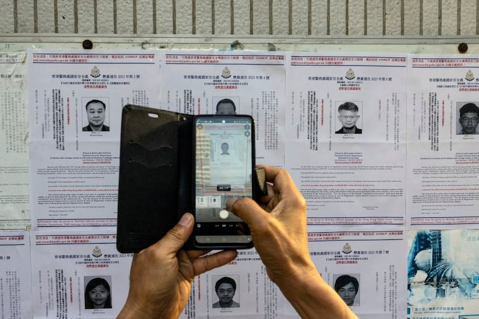
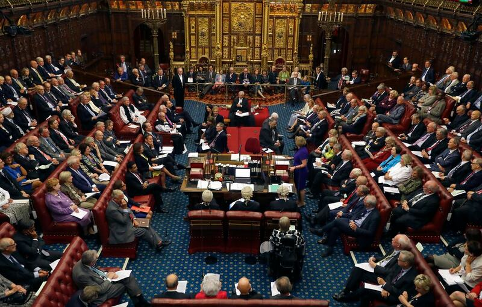

# Is the UK’s new security act comparable with Hong Kong’s security law?

## Verdict: Misleading

By AFCL

2023.09.14

## Following the United Kingdom's introduction of a new security act in July, the pro-Beijing Hong Kong news outlet   *Ta Kung Pao*  published articles claiming that British authorities "adopted a double standard" by enacting a law containing many powers "more stringent" and "more likely to be used to flout basic human rights" than the Hong Kong national security law.

## Asia Fact Check Lab found that some of the paper’s claims are missing important context. While specific claims about several broad and potentially abusive powers granted by the law are mostly accurate, the paper failed to address fundamental differences in the rule of law between the U.K. and Hong Kong under Chinese rule.

*Ta Kung Pao* [published](https://web.archive.org/web/20230821144540/http://www.takungpao.com/opinion/233114/2023/0717/872156.html) an editorial on July 17 titled "British national security law exposes the true face of anti-China politicians in the West" while [running](https://web.archive.org/web/20230821144637/http://www.takungpao.com/opinion/233119/2023/0815/882041.html) one more on Aug. 15 titled "I have something to say/The US and UK security laws are more stringent."

In both articles, *Ta Kung Pao* claimed British authorities "demonstrated hypocrisy and double standards" by introducing their own national security law after having severely criticized the [Hong Kong national security law](https://www.elegislation.gov.hk/fwddoc/hk/a406/eng_translation_(a406)_en.pdf?OS=Linux&OS_S=false&BR=Chrome&BR_S=true&BRV=115.0&BRV_S=true&JS_S=true&C_S=true&severity=warn?OS=Linux&OS_S=false&BR=Chrome&BR_S=true&BRV=115.0&BRV_S=true&JS_S=true&C_S=true&severity=warn) that came into effect in 2020 over its threat to the rule of law and international human rights and the city's Basic Law promised to protect.

The U.K. [passed](https://web.archive.org/web/20230821144739/https://www.gov.uk/government/news/national-security-bill-becomes-law--2) a new National Security Act, or the NSA, on July 11, which aims to increase British law enforcement and intelligence agencies power in order to combat hostile foreign states.

*Ta Kung Pao* also criticized the NSA for granting the British government numerous expansive and potentially oppressive powers. These include allowing the government to arrest foreign nationals, search and detain suspects without a warrant, conduct secret tribunals, and impose mandatory restrictions on the behavior and movement of specific individuals. The Hong Kong security law contains many similar provisions.

While the above powers do exist, a Home Office spokesperson told AFCL they “are exceptional” and only available to be used against people “suspected of being involved in hostile activity linked to foreign states.”

AFCL also found that the articles still failed to address fundamental differences in the rule of law between the U.K. and Hong Kong under Chinese rule.

Hong Kong authorities recently used an extraterritorial clause outlined in the region’s 2020 National Security Law to declare eight fugitives abroad, some of whom are foreign nationals. (Photo/AP)

## Differences in the rule of law

For one, the British legal system has significantly more constraints in place to curb potential government abuses of the NSA, including an independent judiciary and prosecuting attorney.

In contrast, China and Hong Kong currently have no legal institutions with sufficient power to stop Beijing’s interference in legal cases, particularly in cases related to national security.

Apart from that, British citizens can appeal to the [European Court on Human Rights](https://web.archive.org/web/20230821150507/https://www.echr.coe.int/documents/d/echr/questions_answers_eng) if they believe that their government has violated one of basic human rights ensured in the Council of Europe's [European Convention on Human Rights](https://web.archive.org/web/20230821150727/https://www.echr.coe.int/documents/d/echr/convention_ENG), including a fair trial and free expression. The court's binding decisions can compel the U.K. government to redress any part of the NSA that conflicts with these rights.

However, there is no similar international legal tribunal able to constrain Beijing from interpreting Hong Kong’s national security law according to its own political needs.

The [World Justice Project](https://worldjusticeproject.org/rule-of-law-index/) Rule of Law Index, which measures adherence to the rule of law from the citizen's point of view, shows the U.K. and China ranked 15 and 95 in 2022, respectively. Hong Kong saw a drop in ranking from 16 in 2020 to 22 in 2022 after introducing the national security law.

The U.K. parliament recently enacted a National Security Act that would grant the country greater powers to combat foreign interference. The legislation passed after being approved by both the House of Commons and House of Lords. (Photo/AP)

## Make contact ‘transparent’

The U.K. government has repeatedly emphasized that the NSA will not limit either freedom of speech or diversity of political opinion.

The government’s primary objective is to ensure that individuals representing foreign powers are transparently registered. Once registered, these individuals are free to express support for any foreign government or criticize the British government.

"There is nothing in the Act about expressing opinions sympathetic to foreign government, let alone to penalise that; its aim is to make contacts [with foreign governments] 'transparent'," said Lord Wallace of Saltaire, [a member of Parliament](https://web.archive.org/web/20220925232518/https://members.parliament.uk/member/1816/contact) who participated in the act's amending.

## *Edited by Taejun Kang and Malcolm Foster.*

*Asia Fact Check Lab (AFCL) is a branch of RFA established to counter disinformation in today’s complex media environment. Our journalists publish both daily and special reports that aim to sharpen and deepen our readers’ understanding of public issues.*

[Original Source](https://www.rfa.org/english/news/afcl/fact-check-uk-security-law-09142023101439.html)