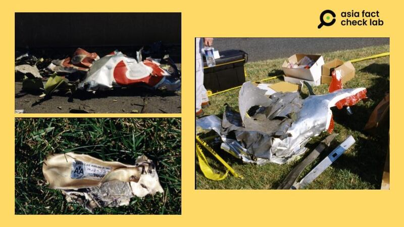
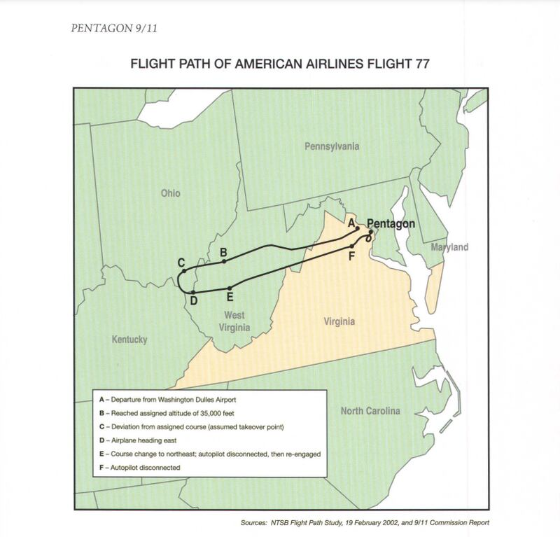

# Did Flight 77 never crash into the Pentagon during 9/11 attacks?

## Verdict: False

By Rita Cheng for Asia Fact Check Lab

2023.09.15

Washington DC

## Recently, on the eve of the 22nd anniversary of the Sept. 11, 2001, terrorist attacks in New York and Washington DC, an influential Chinese social media user claimed that American Airline Flight 77 never crashed into the Pentagon. Instead, he said, it was shot down by U.S. fighter jets.

## The claim is false. Airplane debris was found at the Pentagon, as confirmed by images and videos from the scene and an array of eyewitness accounts. The Pentagon also released security camera footage from the attack in 2006.

The claim was shared [here](https://weibo.com/1659893422/NiHSnc6Uf?refer_flag=1001030103_) on the popular Chinese social media platform Weibo on Sept. 10 by a user with more than 3 million followers.

“Today in history: Who is responsible for the 911 incident? / Media won’t tell the truth,” the claim reads in part.

The claim was shared alongside a two-minute, 39-second clip that shows an old lecture given by Ai Yuejin, a former professor of military thinking at China’s Nankai University.

Citing the bestselling book "9/11: The Big Lie" written by the far-left French journalist [Thierry Meyssan](https://valdaiclub.com/about/experts/363/), Ai claimed that no wreckage or witnesses at the scene of the Pentagon attack were found and that the U.S. government anticipated and allowed 9/11 to happen as a means to justify its later invasions of Afghanistan and Iraq.

The [9/11 attacks](https://www.911memorial.org/911-faqs) were a series of coordinated terrorist suicide plane hijackings by al-Qaeda operatives on Sept. 11, 2001, targeting landmarks in New York and Washington, leading to the deaths of nearly 3,000 people.

Most were killed when two passenger planes were flown into the World Trade Center’s Twin Towers on the southern tip of Manhattan. A third jet, American Airlines Flight 77, was hijacked and crashed into the Pentagon, killing all onboard and many inside the building. And a fourth jet that appeared to be bound for Washington crashed in Pennsylvania after passengers broke into the cockpit, where the hijackers had taken control of the plane.

Weibo user Xiaofan Haoshe retweeted a video which questioned the authenticity of the 9/11 attacks. (Screenshot/ Weibo)

However, the claims by Meyssan and other conspiracy theorists are false.

The [Federal Bureau of Investigation](https://vault.fbi.gov/9-11-attacks-investigation-and-related-materials/9-11-images) released several [photos](https://vault.fbi.gov/9-11-attacks-investigation-and-related-materials/9-11-images/9-11-pentagon-debris-1) of the Pentagon wreckage, while a Department of Defence [investigative report](https://history.defense.gov/Portals/70/Documents/pentagon/Pentagon9-11.pdf) released in 2007 published Flight 77's entire course, along with records showing that three F-16 military aircraft deployed to intercept the hijacked plane were unable to prevent it from crashing into the Pentagon.

Photos of plane wreckage at the Pentagon released by the FBI. (Photos/FBI Official Website)

Flight trajectory of the aircraft that crashed into the Pentagon. (Photo/U.S. Department of Defense Website)

The DOD also [released](https://www.youtube.com/watch?v=0SL2PzzOiF8) footage from car park monitors at the site which captured the actual collision of the plane into the Pentagon.

The claim about Flight 77 has been debunked by other international media outlets as seen [here](https://apnews.com/article/fact-check-911-pentagon-airplane-debris-598153051732), [here](https://www.usatoday.com/story/news/factcheck/2022/09/22/fact-check-baseless-claims-9-11-attack-pentagon-circulate/10390801002/) and [here](https://www.theguardian.com/world/2002/apr/01/september11.france).

## *Translated by Shen Ke. Edited by Taejun Kang and Malcolm Foster.*

*Asia Fact Check Lab (AFCL) is a branch of RFA established to counter disinformation in today’s complex media environment. Our journalists publish both daily and special reports that aim to sharpen and deepen our readers’ understanding of public issues.*

[Original Source](https://www.rfa.org/english/news/afcl/fact-check-911-09152023102155.html)