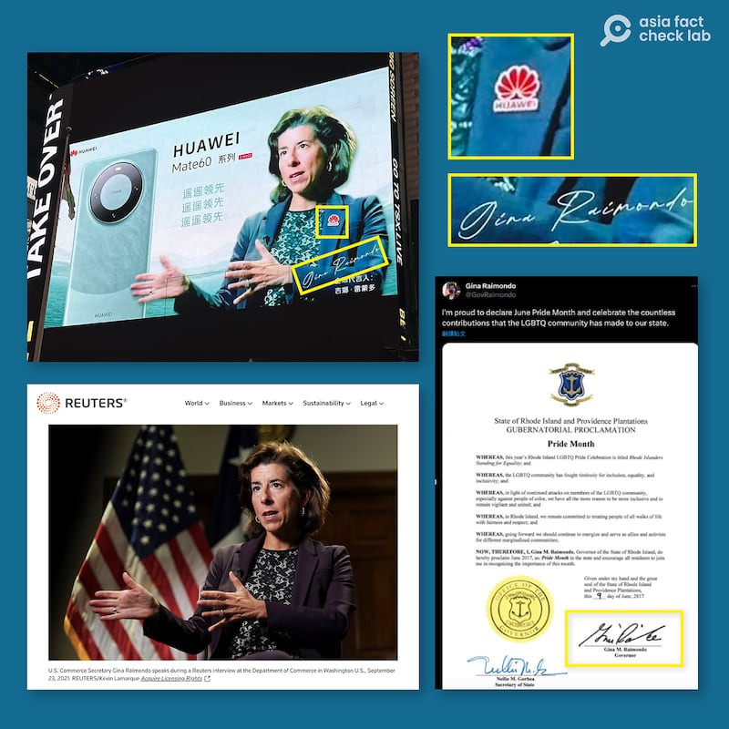
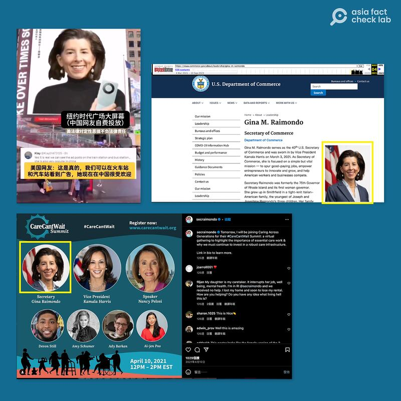
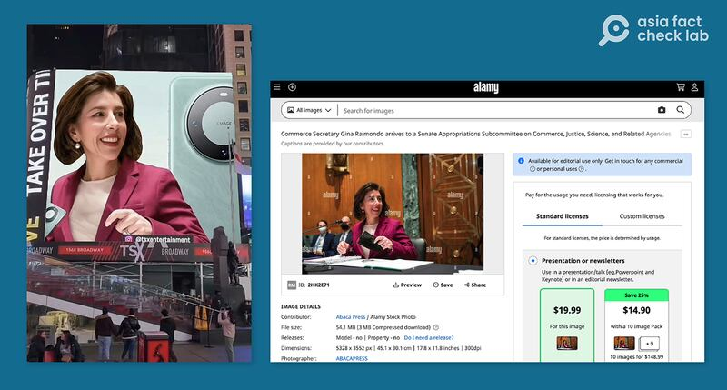
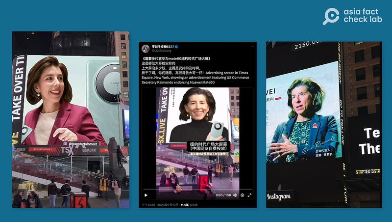
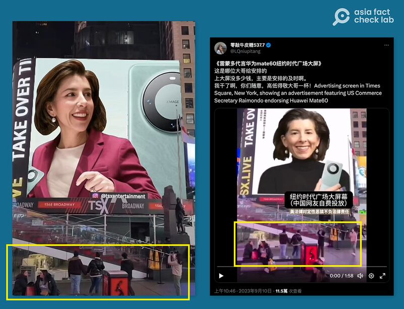
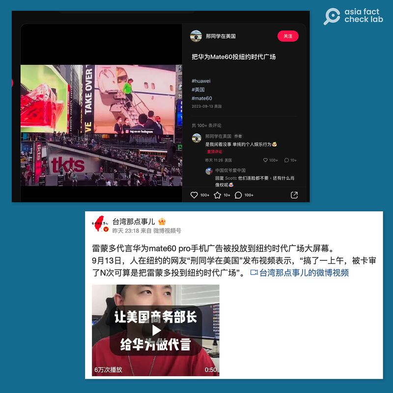

# Did Raimondo feature in Huawei ads shown in Time Square?

## Verdict: Partially False

By Dong Zhe for Asia Fact Check Lab

2023.09.18

Taipei, Taiwan

## Images of U.S. Secretary of Commerce Gina Raimondo were recently shared on Chinese-language social media posts that claimed to show her featured in advertisements for Huawei’s mobile phone, Mate 60. Posts also said these ads were shown on billboards in New York’s Times Square.

## Asia Fact Check Lab found that the images were digitally altered although it appears at least one of these doctored images was shown on a Time Square billboard. Keyword searches found no such ads featuring Raimondo.

The images were included in a one-minute, 57-second clip [shared](https://twitter.com/LQniupitang/status/1700702239306973574) on X, formerly known as Twitter, on Sept. 10.

“Advertising screen in Times Square, New York, showing an advertisement featuring US Commerce Secretary Raimondo endorsing Huawei Mate60,” the post reads in part, with a video containing what appears to be ads for the phone with Raimondo.

The same images alongside the same claim were also shared on other Chinese social media platforms such as Douyin and [Weibo](https://m.weibo.cn/detail/4945618989748921). They began to circulate after Raimondo's official visit to China in late August.

The photos are apparent mockery of Raimondo, who has recently attempted to cultivate a reputation for being tough on China, following the release of the Mate 60 Pro, a mobile phone that runs on a chip designed internally by Huawei in response to strict U.S. sanctions against Chinese telecommunications companies.

However, these images have been digitally doctored. Here is what AFCL found.

## Raimondo in a blue suit jacket

A reverse image search found the original photo taken by Reuters during an [interview](https://www.reuters.com/business/us-commerce-chief-aggressive-action-chips-shortage-needed-2021-09-23/) at the Department of Commerce headquarters in Washington D.C. in 2021.

Below is a screenshot comparison.

One of the ads combines an old Reuters photo of Raimondo with a forged signature. (Screenshot/ Reuters, X & Weibo)

While the secretary’s posture and earrings are identical to the original, it appears that the color of Raimondo’s initially dark purple blazer was altered during editing, and a Huawei logo was added to her left chest.

In addition, a forged signature was added in the lower right hand corner of the image. The handwriting differs significantly from a copy of Raimondo's original signature [on a document](https://twitter.com/govraimondo/status/873286467702968320) signed for Gay Pride Month in 2017.

## Raimondo in a black pullover jumper

The image is the secretary's profile photo from when she was sworn into office in 2021. The Department of Commerce's official website has updated her photo in the intervening two years, but an [archived version](http://web.archive.org/web/20210304023545/https://www.commerce.gov/about/leadership/gina-m-raimondo) of the website from March 2021 shows that the secretary's earrings and facial angle in the original image exactly match the doctored ad. The same photo can also be seen in an [April 2021 post](https://www.instagram.com/p/CNdWwtTnL9d/) on Raimondo's official Instagram account.

Below is a screenshot comparison.

A second ad uses a photo of Raimondo's original Secretary of State profile picture. (Screenshot / U.S. Department of Commerce official website, X and Weibo).

## Raimondo in a pink suit

A search through the online photo gallery [Alamy](https://www.alamy.com/commerce-secretary-gina-raimondo-arrives-to-a-senate-appropriations-subcommittee-on-commerce-justice-science-and-related-agencies-hearing-on-expanding-broadband-access-on-capitol-hill-in-washington-dc-usa-on-tuesday-february-1-2022-photo-by-sarah-silbigerpoolabacapresscom-image459203109.html) found that this image was taken from a photo of the secretary attending a panel hearing for the House Committee on Appropriations on Feb. 1, 2022. A mask Raimondo originally held in her left hand was removed during editing.

Below is a screenshot comparison.

The third ad was pulled from a panel hearing Raimondo attended in 2022. (Screenshot / Alamy & Weibo)

Keyword searches found no Mate 60 ads featuring Raimondo.

## Ads in Times Square

A closer look at two doctored photos featuring Raimondo in a pink and black outfit shows most pedestrians seen in the photos are dressed in thick leather coats, down jackets and wool hats.

The ads featuring Raimondo supposedly shown on Times Square billboards (Screenshots/Douyin, X and Weibo)

Given New York’s average September temperatures, it is unlikely that large numbers of individuals would be wearing such winter attire at that time. This indicates that these two doctored ads were edited to be included in irrelevant photos of Time Square, which are not current.

Two of the ads are likely to have been superimposed onto images of Times Square, as it is unlikely that people would be wearing winter clothing on a New York street in early September. (Screenshot/Weibo & X)

However, a keyword search on Weibo found a user who claimed that a netizen named “Student Xing in the U.S.” had paid for the doctored ad to be displayed and posted a mobile screen recording showing a payment of US$40 being made to TSX Entertainment, a company that allows people to upload their own content onto a billboard in Times Square for a fee.

AFCL did find a [video](https://www.xiaohongshu.com/explore/65012ba50000000014027b1b?app_platform=ios&app_version=7.92&share_from_user_hidden=true&type=video&xhsshare=CopyLink&appuid=5481dba1d6e4a97e1fef4bbf&apptime=1694648333) showing the ad of Raimondo in black being played in the square, followed by a news clip of the secretary disembarking off a plane to China and subtitles saying that "China's chips are way ahead."

A netizen claims to have paid to put up one of the ads on a Times Square billboard. (Screenshots/ Xiaohongshu & Weibo).

AFCL was unable to retrieve TSX’s historical broadcast footage of the square to verify the account of the netizen, and the company has not responded to inquiries as of this writing.

## *Translated by Shen Ke. Edited by Taejun Kang and Malcolm Foster.*

*Asia Fact Check Lab (AFCL) is a branch of RFA established to counter disinformation in today’s complex media environment. Our journalists publish both daily and special reports that aim to sharpen and deepen our readers’ understanding of public issues.*

[Original Source](https://www.rfa.org/english/news/afcl/fact-check-raimondo-09182023100621.html)