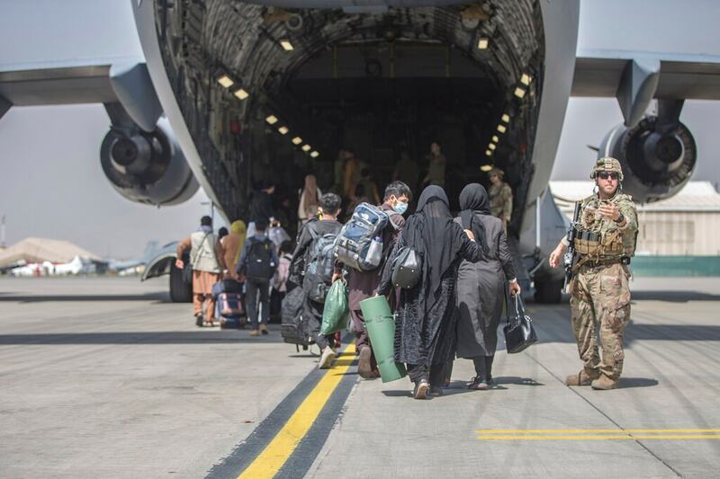
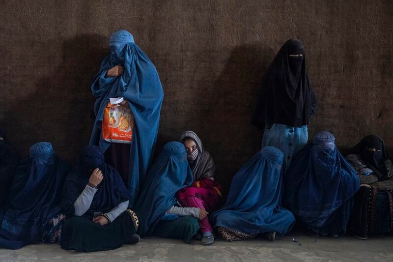
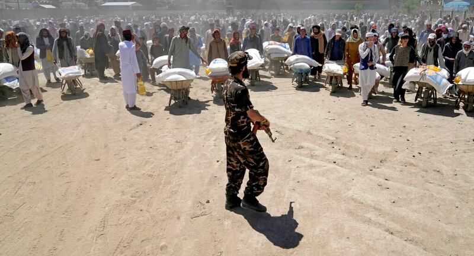

# Has the US cut off all aid to Afghanistan since 2021?

## Verdict: Misleading

By Shen Ke for Asia Fact Check Lab

2023.09.19

Washington DC

## A Chinese government official claimed that China has provided substantial aid to Afghanistan since 2021, while a “certain country” is exacerbating the nation’s ongoing humanitarian crisis by imposing sanctions and severing aid – a clear reference to the United States.

## But the claim is misleading. It is true that the U.S. has sanctioned Afghanistan and stopped all aid to its government, but it still continues to provide significant amounts of humanitarian aid to Afghans through international organizations.

Chinese Ministry of Foreign Affairs spokesperson Wang Wenbin [said](https://web.archive.org/web/20230822171810/https://www.fmprc.gov.cn/eng/xwfw_665399/s2510_665401/2511_665403/202308/t20230815_11127173.html) at a press conference on Aug. 15 that while China has provided "large amounts of material assistance" to Afghanistan in the two years since American troops withdrew, "a certain country" has exacerbated the nation's ongoing humanitarian crisis by sanctioning it, freezing its assets and cutting off aid to it.

Wang urged the “relevant country” to fulfill their aid commitments and unfreeze the Afghan government’s assets as soon as possible in order to alleviate the suffering of Afghans. Such statements were in line with previous demands made by Wang towards the United States.

The U.S. withdrawal from Afghanistan in 2021 marked the end of a two-decade-long military engagement that began soon after the 9/11 attacks. Initially focused at demobilizing al-Qaeda and overthrowing the Taliban, the American mission evolved over time to include nation-building initiatives and efforts to construct a stable Afghan government.

Despite significant investment in lives and money, a resurgent Taliban combined with complex geopolitical considerations forced the United States to reconsider its stay and finally decide on a complete military withdrawal.

But Wang’s claim is misleading. While it is true that the U.S. has sanctioned Afghanistan and stopped all aid to its government, it still continues to provide significant amounts of humanitarian aid to Afghans through international organizations. Below is what AFCL found.

## Has the U.S. cut off aid to Afghanistan’s government?

Yes. The U.S. has ceased all "reconstruction" aid since the Taliban seized control of the country in 2021, as the State Department [notes](https://web.archive.org/web/20230821235907/https://www.state.gov/u-s-relations-with-afghanistan/) in a briefing on Afghan relations. "Reconstruction" is an umbrella term for the assistance given to the allied Afghan administration during the time that American forces were stationed in the country.

In addition to including money spent on providing essential goods, promoting education, and constructing critical infrastructure, “reconstruction” also includes money spent on building Afghan national security forces, counternarcotics efforts, and the operational costs of U.S. agencies in the country.

These costs have collectively accounted for a majority of U.S. expenditures in Afghanistan, [according](https://www.sigar.mil/pdf/quarterlyreports/2023-07-30qr.pdf) to budgets provided by the Special Inspector General for Afghanistan Reconstruction, or SIGAR, the government department tasked with overseeing all funds related to Afghanistan.

## Has the U.S. cut off all aid to Afghans?

No. The U.S. still provides humanitarian aid such as critical foodstuffs to Afghanistan, but only through third party international organizations such as the United Nations.

“Our largest humanitarian partner, the UN World Food Program, procures food assistance locally, regionally, and internationally and distributes a package of food commodities which is designed to provide 2,100 kilocalories per person per day,” said a spokesperson for United States Agency for International Development, or USAID.

“Where markets are accessible, WFP also provides cash and vouchers for food assistance, thus helping to ensure sustainability of the assistance and increase targeted communities’ self-reliance in meeting their food and nutrition needs,” the spokesperson told AFCL.

“None of USAID’s assistance is provided to or through Taliban authorities. All USAID humanitarian and development assistance supports the work of UN agencies and experienced, carefully chosen international NGOs, other international partners, and local Afghan partners.”

Since withdrawing from Afghanistan in 2021, the U.S. continues to provide humanitarian aid to the country through international organizations. (Photo/AP)

However, the U.S. insistence that such aid be accompanied by guarantees of fundamental human rights such as gender equality has met with resistance from the Taliban.

“We work with our partners to mitigate and resolve instances of attempted aid interference by the Taliban, and press for full and unhindered participation of women in aid work,” the spokesperson said.

International aid operations in parts of Afghanistan have been severely hamstrung due to lack of appropriate personnel following [further restrictions](https://www.lemonde.fr/en/afghanistan/article/2023/04/05/taliban-bans-afghan-women-from-working-with-united-nations_6021768_218.html) by the Taliban on women's ability to work in non-governmental organizations and UN agencies. Such restrictions can potentially affect aid distribution in a given area.

The United States and other countries have bashed the Taliban for their record of human right abuses, particularly as regards their [treatment of women in the country,](https://apnews.com/article/afghan-taliban-women-girls-rights-restriction-6acafc04c4d6d36014d84476dbb3a861) and neither recognize nor cooperate with them on aid distribution to locals. The State Department emphatically [stressed](https://www.state.gov/the-united-states-and-partners-announce-establishment-of-fund-for-the-people-of-afghanistan/) this point when announcing a specific fund established by the U.S. to assist Afghans in September 2022.

“Women play a critical role in humanitarian operations in Afghanistan. Without female staff, aid organizations cannot reach the most at-risk populations, including many women and girls,” said the spokesperson.

“Our partners continue to provide aid in places where women are involved throughout the aid delivery cycle, and where women can continue to participate meaningfully. Where this cannot be done, we are prepared to reassess our funding through award modifications or in extreme cases suspension and/or termination.”

Geopolitical and human rights concerns - particularly regarding oppressive policies against women - have caused the Taliban government to remain unrecognized by any other national government as of August 2023. (Photo/AP)

## Has China provided more aid to Afghans than the U.S. since August 2021?

No. Beijing's total public contributions provided to Afghanistan in 2022 amounted approximately 300 million yuan, or about US$44.9 million, distributed in two batches: The first was a fulfillment of a pledge made after the Taliban gained control of the country, and the second was a humanitarian response following an earthquake that struck Afghanistan, according to a [report](https://www.scmp.com/news/china/diplomacy/article/3184316/china-delivers-us37-million-aid-afghanistan-fulfilling-promise?module=perpetual_scroll_0&pgtype=article&campaign=3184316) from the *South China Morning Post.*

China provided aid to Afghanistan to help with relief efforts following a local earthquake in 2022 that killed more than a thousand people. (Photo/AP)

In comparison, SIGAR's latest report [tallies](https://www.sigar.mil/pdf/quarterlyreports/2023-07-30qr.pdf) U.S. aid to Afghanistan in 2022 at over $1.5 billion, making it one of the largest recipients of U.S. aid that year.

These figures broadly match the figure of $1.3 billion [published](https://www.foreignassistance.gov/cd/afghanistan/2023/obligations/0) on Foreign Assistance.gov, a [congressional mandated](https://www.congress.gov/bill/114th-congress/house-bill/3766/text) website that tracks and transparently records total U.S. financial assistance to foreign countries. Due to ongoing department reporting of expenditures for the 2022 fiscal year, the specific aid figures for these years are slightly different from SIGAR.

Data from the site [shows](https://www.foreignassistance.gov/aid-trends) that Afghanistan was still one of the top recipients of U.S. aid in 2022.

“In the two years since the Taliban takeover of Afghanistan in August 2021, the U.S. Government has significantly increased humanitarian assistance funding and has provided over $1.9 billion to support the Afghan people amid the country’s ongoing humanitarian crisis, including more than $1.4 billion from USAID,” the USAID spokesperson said.

“The United States is the largest single donor of humanitarian assistance to Afghanistan, and we will continue our support for at-risk populations in the country.”

## *Edited by Taejun Kang and Malcolm Foster*

*Asia Fact Check Lab (AFCL) is a new branch of RFA established to counter disinformation in today’s complex media environment. Our journalists publish both daily and special reports that aim to sharpen and deepen our readers’ understanding of public issues.*

[Original Source](https://www.rfa.org/english/news/afcl/fact-check-us-afghan-aid-09192023122904.html)