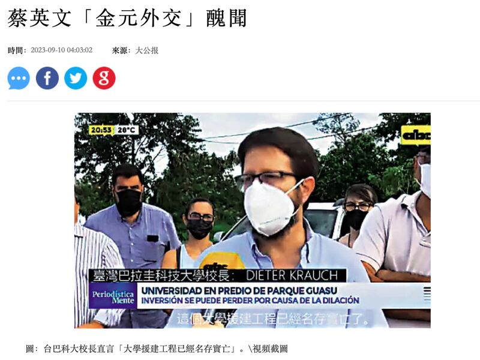
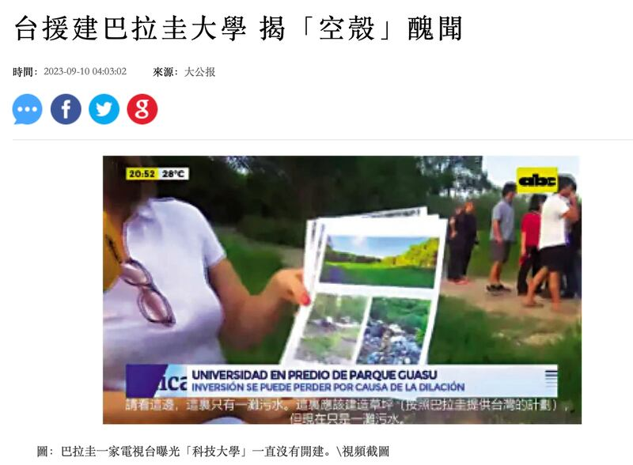

# Does a Taiwan-funded Paraguayan university exist in name only?

## Verdict: False

By Zhuang Jing for Asia Fact Check Lab

2023.09.20

Taipei, Taiwan

## A pro-Beijing Hong Kong news outlet recently claimed that a Paraguayan university jointly funded by Taiwan remains unopened and exists in name only, citing an alleged interview with the university president.

## The claim is false. The Universidad Politecnica Taiwán Paraguay, or UPTP, is currently in its fifth year of operation, with its inaugural class of students graduating in July 2023. The interviewee was not UPTP’s president and only said that the project was being postponed due to environmental issues.

The claim was shared in *Ta Kung Pao*'s Sept. 10 [report](https://web.archive.org/web/20230919060547/http://www.takungpao.com.hk/news/232110/2023/0910/890979.html).

“Tsai Ing-wen went to Paraguay in 2017 to launch a ‘diplomatic solidarity’ campaign, and the then Paraguayan president personally suggested that Taiwan should help build a university there,” the report reads in part.

“Establishing the university [UPTP] was one of the most popular projects. At that time, it was declared that the school would be ‘first in South America to become world-famous’.

“But just last year, a Paraguayan TV station found that the university has never been built and its location is still a wasteland… It has received a lot of funds from Taiwan in the past five years, but the campus has remained unopened and there is no sign of building a school.”

In a separate [report](https://web.archive.org/web/20230919061403/http://www.takungpao.com.hk/news/232110/2023/0910/890981.html) published on the same day, *Ta Kung Pao* cited a local report that allegedly interviewed the president of UPTP who claimed Taiwan's support for the university was "in name only."

Two reports by Ta Kung Pao about a Paraguayan “ghost university” funded by Taiwan were accompanied by screenshots of a purported Paraguayan TV interview in which the university’s president said that aid for construction exists in name only. (Screenshot/Ta Kung Pao)

The claim began to circulate online after Taiwanese Vice President Lai Ching-teh met with UPTP students during an official visit to Paraguay in mid-August 2023.

Similar claims were also shared in multiple pro-Beijing media outlets.

But they are false.

## University in operation

[UPTP](https://uptp.edu.py/) is currently in its fifth year of operation, with its inaugural class of students graduating in July 2023, according to Taiwan's Ministry of Foreign Affairs, or MOFA.

The university, established in 2018, [opened](https://www.roc-taiwan.org/py/post/11241.html) in 2019 after [admitting](https://web.archive.org/web/20220622214905/https://www.roc-taiwan.org/py/post/11219.html) 108 students.

MOFA noted that it is true that construction of the physical campus is still pending, Paraguay is responsible for funding construction of the campus, while Taiwan handles faculty placement and curriculum design.

As a temporary solution until construction of the physical campus is finished, classes for the first two years of courses are held at the Paraguayan Olympic Committee’s building, after which students complete the final two years of their bachelor degree at the National Taiwan University of Science and Technology, according to MOFA.

Chen Yao-chung, the program office director at UPTP, told AFCL that the Paraguayan government continues to promote the construction of the campus and that Paraguayan President-elect Santiago Peña told UPTP international students during a state visit to Taiwan in July 2023 that he planned to speed up construction of the school’s permanent campus.

## Not university president

The person interviewed by the Paraguayan media is not the president of UPTP.

He is in fact Dieter Krauch, who is described as the university's academic vice-rector on his [LinkedIn](https://www.linkedin.com/in/dieter-krauch-2aa0426a/?originalSubdomain=py) page. A 2021 [press release](https://www.taiwanembassy.org/py/post/13935.html) from the Taiwanese Embassy in Paraguay also refers to him as the Dean of the School of Engineering.

The UPTP official website as well as a [report](https://www.hoy.com.py/nacionales/universidad-taiwan-paraguay-en-dos-anos-estara-la-sede-en-terreno-de-copaco) by the Paraguayan media *Hoy* in 2022 state that the university's president is Carlino Velázquez.

## Quotes misrepresented

*Ta Kung Pao* cited a Spanish language interview [conducted](https://www.youtube.com/watch?v=UyIGibgrHFo) by ABC TV Paraguay on Apr. 11, 2022.

Alongside other interviewed faculty members and students, Krauch talked about how Paraguay may be at risk of defunding construction of the school due to environmental concerns and political interests that have already delayed the project for several years.

The Paraguayan newspaper *La Nacion* also [published](https://www.lanacion.com.py/politica/2022/04/11/dilatacion-en-la-construccion-de-la-sede-de-la-universidad-taiwan-hay-trabas-politicas-lamentan/) a separate interview with Krauch on April 11, 2022, in which he said that although Paraguay's government postponed construction because of unspecified environmental concerns, he believes the real motives are political.

Subsequent [reports](https://www.hoy.com.py/nacionales/universidad-taiwan-paraguay-en-dos-anos-estara-la-sede-en-terreno-de-copaco) in Paraguayan media indicate that UPTP later began looking for alternative construction sites.

UPTP, Krauch and the Paraguayan embassy in Taiwan have all not responded to inquiries about the story as of this writing.

## *Edited by Taejun Kang and Malcolm Foster.*

*Asia Fact Check Lab (AFCL) is a new branch of RFA established to counter disinformation in today’s complex media environment. Our journalists publish both daily and special reports that aim to sharpen and deepen our readers’ understanding of public issues.*

[Original Source](https://www.rfa.org/english/news/afcl/taiwan-paraguay-university-09202023151049.html)