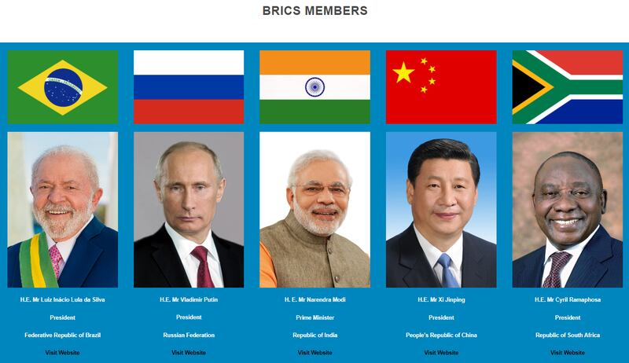

# Does BRICS have 84 official members?

## Verdict: False

By Taejun Kang for RFA

2023.09.21

Taipei, Taiwan

## Following the August BRICS summit in South Africa where the bloc leaders decided to welcome new members, a claim began to circulate in Korean-language posts that the alliance now has 84 official members.

## But the claim is false. The block decided to admit six new members, which would bring the total number of official members to 11, not 84.

The claim was shared [here](https://web.archive.org/web/20230913054152/https://cafe.daum.net/trumpandtheknight/nck5/6760) in a post on Daum Cafe, one of the most influential online communities in South Korea.

“The number of official BRICS members is in fact 84. They all agree and support Nesara Gesara. BRICS is dominating the world,” the Korean-language claim reads in part, referring to a conspiracy theory.

The claim was also shared on South Korea's largest blogging platform Naver Blog, two domestic online newspapers with anti-American and pro-Chinese views as well as Chinese-language social media posts, including [this one](https://www.youtube.com/watch?v=8caPznk3sRs) by a YouTube user with 250,000 followers.

Social media in South Korea have been circulating the message that BRICS have been expanded to 84 nations. (Screenshot of Daum Cafe)

The claim began to circulate after the BRICS bloc met for its annual leader's summit in Johannesburg, South Africa in August, where the alliance decided to [admit](https://web.archive.org/web/20230913065052/https://www.reuters.com/world/brics-poised-invite-new-members-join-bloc-sources-2023-08-24/) new members.

However, the claim is false.

## Official BRICS members

The alliance currently has a total of [five official members](http://web.archive.org/web/20230913064617/https://brics2023.gov.za/), namely Brazil, Russia, India, China, and South Africa – which spells "BRICS."

During the August summit, the leaders of the bloc decided to admit six new member countries: Argentina, Egypt, Ethiopia, Iran, Saudi Arabia, United Arab Emirates, which will officially join the group in January 2024.

Although the BRICS leaders left the door open to future enlargement as dozens more countries voiced interest in joining a grouping they hope can level the global playing field, their latest move would bring the total number of the bloc’s official members to 11, not 84.

## Nesara Gesara

Nesara Gesara is a [conspiracy theory](https://web.archive.org/web/20230913064413/https://www.usatoday.com/story/news/factcheck/2022/04/13/fact-check-no-congress-has-not-passed-nesara/9515254002/) suggesting a sweeping reset of the United States economy that would eliminate all debts.

This theory draws from the National Economic Security and Recovery Act or Nesara, a proposed set of economic changes from the 1990s. This proposed act advocated for ending compound interest on loans, replacing the income tax with a national sales tax, and reverting U.S. currency to the gold standard.

Although these measures were never formally presented to Congress, conspiracy theorists believe they were covertly approved and then hidden by George W. Bush after the 9/11 attacks.

The conspiracy is extensively consumed in South Korea by anti-American and pro-China Internet users who believe in a “new world order” led by China. Those users often claim that the expansion of BRICS can set the groundwork for such an order.

## *Edited by Malcolm Foster.*

*Asia Fact Check Lab (AFCL) is a branch of RFA established to counter disinformation in today’s complex media environment. Our journalists publish both daily and special reports that aim to sharpen and deepen our readers’ understanding of public issues.*

[Original Source](https://www.rfa.org/english/news/afcl/fact-check-brics-09212023163138.html)