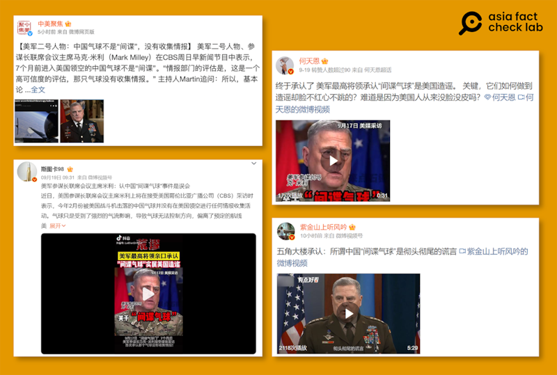

# Did a US official deny the Chinese balloon’s spying activities?

## Verdict: False

By Zhuang Jing for Asia Fact Check Lab

2023.09.26

Taipei, Taiwan

## A claim has been shared in Chinese-language social media posts that the U.S. Joint Chiefs of Staff Mark Milley denied the intelligence gathering capabilities of a Chinese balloon shot down over U.S. waters in February 2023. The posts cited a press interview of him to support the claim.

## But Milley’s comments have been misrepresented. He said during the interview that the aircraft “was a spy balloon,” but noted that U.S. officials believed it had neither gained nor transmitted any intelligence back to China.

"The U.S. Department of Defense admitted: So-called Chinese spy balloon incident is a sheer lie," reads a claim shared [here](https://weibo.com/tv/show/1034:4948197773082639?from=old_pc_videoshow) by a Weibo user with more than 5.5 million followers.

The claim was shared alongside a five-minute, 28-second clip that features Milley’s interview.

Similar claims have been shared by several influential Chinese social media users including a Weibo user called “Stuka 98” who claimed: “Milley admitted that the Chinese balloon incident was merely a misunderstanding.”

In late January and early February, a [huge balloon](https://web.archive.org/web/20230924073346/https://www.reuters.com/world/suspected-chinese-spy-balloon-flying-over-united-states-us-officials-2023-02-02/) carrying electronic equipment traveled across the United States from Alaska in the northwest to South Carolina in the east.

Its route over critical military bases raised alarms that Beijing might be gathering crucial intelligence. The balloon was intercepted and brought down near the South Carolina coast on Feb. 4. Subsequently, the U.S. military retrieved it from the Atlantic Ocean.

The incident aggravated Sino-U.S. relations, with Chinese officials denying U.S. claims that the high-altitude reconnaissance aircraft, informally termed a “spy balloon”, was used to gather intelligence and insisting that it was solely intended for civilian use.

Chinese netizens have attempted to control public narratives about the balloon by claiming that [shooting down the balloon violated international norms](https://www.rfa.org/cantonese/news/factcheck/balloon-02072023170404.html) and that the Pentagon itself had [admitted their assessment of the balloon's intelligence gathering capabilities were mistaken](https://www.rfa.org/mandarin/shishi-hecha/hc-07102023184903.html).

Screenshots of Chinese-language social media posts that shared a false claim. (Screenshots/Weibo)

But the claim about Milley’s remark is false. Below is what AFCL found.

## Milley’s interview

A combination of reverse image search and keyword searches found misleading social media posts cited Milley's [interview](https://web.archive.org/web/20230924193756/https://www.cbsnews.com/news/the-bizarre-secret-behind-chinas-spy-balloon/) with the CBS program *Sunday Morning* on Sept. 17, 2023.

During the interview, Milley was quoted as saying that U.S. intelligence agencies believe the balloon had not collected any intelligence.

“The intelligence community, their assessment – and it's a high-confidence assessment – [is] that there was no intelligence collection by that balloon,” he said.

Towards the end of the piece however, the interviewer also asked the chairman whether the aircraft could appropriately be termed a “spy balloon” and if so, whether it had actually gathered any intelligence while in flight.

Milley stated in reply, “I would say it was a spy balloon that we know with high degree of certainty got no intelligence, and didn’t transmit any intelligence back to China.”

Milley’s comments echoed what the Pentagon announced in June.

At that time, Pentagon spokesman Brigadier General Pat Ryder [said](https://web.archive.org/web/20230925073122/https://www.reuters.com/world/chinese-spy-balloon-did-not-collect-information-over-us-pentagon-2023-06-29/): "We assess that it [a Chinese spy balloon] did not collect while it was flying over the U.S."

## *Translated by Shen Ke. Edited by Taejun Kang and Malcolm Foster.*

*Asia Fact Check Lab (AFCL) is a branch of RFA established to counter disinformation in today’s complex media environment. Our journalists publish both daily and special reports that aim to sharpen and deepen our readers’ understanding of public issues.*

[Original Source](https://www.rfa.org/english/news/afcl/fact-check-balloon-09262023134937.html)