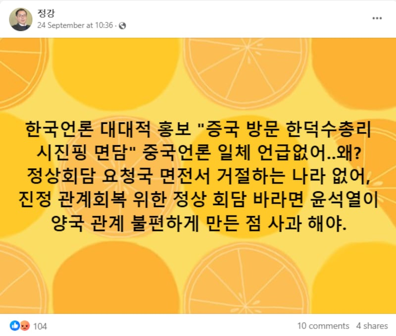
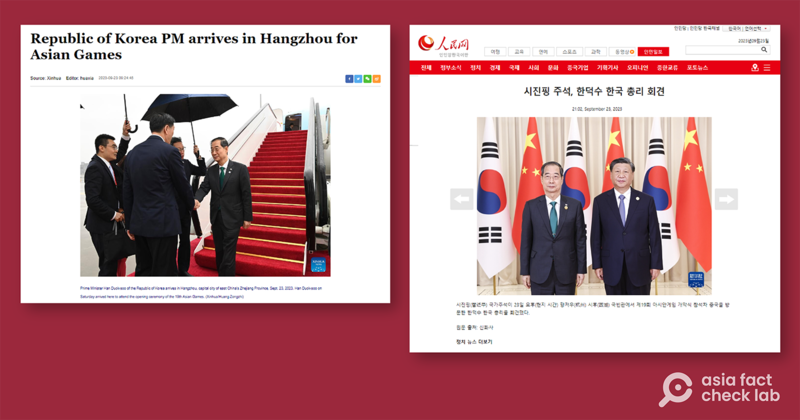

# Did Chinese media ignore South Korean PM’s visit to China?

## Verdict: False

By Taejun Kang for RFA

2023.10.03

Taipei, Taiwan

## After the South Korean prime minister visited China last month, a claim circulated in Korean-language posts that Chinese media outlets “did not cover the prime minister’s visit at all” in protest against Seoul’s recent efforts to strengthen ties with the United States and Japan.

## But the claim is false. Keyword searches found Han Duck-soo's visit was widely covered by Chinese media, including the   *People's Daily*   and Xinhua News Agency. His meeting with Chinese President Xi Jinping also garnered significant media attention in China.

The claim was shared [here](https://www.facebook.com/groups/223111259028042/posts/1033276501344843/) on Facebook in a group with more than 70,000 members who mostly maintain anti-U.S, pro-China view.

“South Korean media outlets have been heavily promoting the S Korean PM’s visit to China as if it's a big deal. But there is zero coverage by the Chinese media. Nothing. If S Korea wants a proper summit with China, Yoon [referring to the South Korean President] must apologize to China first for upsetting it [with latest moves to cement ties with the U.S. and Japan],” reads the post.

It was shared by a user who claims to be a head of South Korea-based NGO “Green Transport Policy Institute.” Further searches found the user has often spread Chia-related misinformation online.

Similar claims have been shared in other Korean-language Facebook posts that claimed both Xinhua News Agency and People’s Daily did not cover South Korean Prime Minister Han Duck-soo’s visit to China.

Screenshot of the misleading Facebook post, taken on Sept. 27, 2023

The claim began to circulate after Han [arrived](https://web.archive.org/web/20230927064335/https://www.opm.go.kr/opm/prime/oversea.do?mode=view&articleNo=154874&article.offset=0&articleLimit=10) in the eastern Chinese city of Hangzhou on Sept. 23 to attend the opening ceremony of the Asian Games and meet Chinese President Xi Jinping on the sidelines of the sporting event.

During his two-day visit, Han attended a luncheon hosted by Xi for the leaders of countries competing in the Asian Games and held talks with Xi ahead of the opening ceremony later in that day.

South Korea's Yonhap News Agency [reported](https://web.archive.org/web/20230927064202/https://www.yna.co.kr/view/AKR20230923043252001?input=1195m) that Xi, who has not visited South Korea since 2014, told Han that he will seriously consider visiting South Korea as part of efforts to support peace and security on the Korean Peninsula.

Han was the first high-level South Korean official to meet with Xi since President Yoon Suk Yeol met with him on the sidelines of a Group of 20 summit in Bali, Indonesia, in Nov. 2022.

But the claim is false.

Keyword searches of Han's Chinese name in simplified Chinese, used in mainland China, show Chinese media outlets have been heavily covering Han's visit to China and his meeting with Xi as seen on [CCTV](https://news.cctv.com/2023/09/23/VIDExK5JWNKp0emp8CfFkxEv230923.shtml) and [China News Agency](https://www.chinanews.com.cn/gn/2023/09-23/10083150.shtml), etc.

Both [People's Daily](https://web.archive.org/web/20230927064536/http://kr.people.com.cn/n3/2023/0923/c203278-20075951.html) and [Xinhua News Agency](https://web.archive.org/web/20230927064605/https://english.news.cn/20230923/e72cda8e660241e4bc6fee90151ee5e1/c.html) also covered the news in their Korean language service.

Screenshots of reports from People’s Daily and Xinhua News Agency, captured on Sept. 27, 2023

Yoon, a conservative, has [endeavored](https://www.rfa.org/english/news/korea/nkorea-calls-yoon-idiot-09242023234358.html) to align Seoul's foreign policy with that of the United States in order to counter global challenges such as North Korea's nuclear ambitions. Yoon has prioritized strengthening its military and economic cooperation with Washington and Tokyo to this end.

South Koreans are largely divided on Yoon’s policy, with conservatives applauding the approach because they believe it could effectively promote North Korea’s denuclearization. Liberals, including the main opposition Democratic Party, contend that such an approach exacerbates tensions on the Korean Peninsula, citing the possibility of jeopardizing relations with China.

Han’s visit to China has become a source of disinformation among pro-China online users who support the DP. In addition to the false claim that Chinese media outlets ignored Han, users claimed that Xi was intentionally rude to Han to “teach him a lesson” and that Chinese authorities “mistreated” South Korean delegates in a protest against Yoon.

## *Edited by Malcolm Foster.*

*Asia Fact Check Lab (AFCL) is a branch of RFA established to counter disinformation in today’s complex media environment. Our journalists publish both daily and special reports that aim to sharpen and deepen our readers’ understanding of public issues.*

[Original Source](https://www.rfa.org/english/news/afcl/fact-check-china-skorea-10032023125957.html)